## Introduction

Welcome to the tutorial titled **Installing Wordpress with Cyberpanel and Openlitespeed on Ubuntu 20.04 LTS**. [CyberPanel](https://cyberpanel.net/get-started-with-cyberpanel/) is the next generation web hosting Control Panel Develop by Usman Nasir. Lightweight , Superfast Openlitespeed as a web server with a help of LScache Wordpress Plugin your websites become superfast.

**Features**

* Secure (free SSL by [Let's Encrypt](https://letsencrypt.org/)).
* High Performance.
* Ready to go within 1 minute.
* Supports all major clouds.
* Easy to use Linux control panel for beginner.

**Prerequisites**

For installing Cyberpanel, you will need a server with root access. Cyberpanel needs very minimal system requirements for setup.

* Fresh server with Ubuntu 20.04.4 LTS.
* You must have root access or access to a user with sudo privileges.
* CPU: 2 vCores
* RAM: 2 GB
* Space: 20 GB

* [MobaXterm](https://mobaxterm.mobatek.net/) SSH Client with SFTP browser for Windows user or you can use your favorite one. MobaXterm is all in one SSH client with many more features.

* *Note* ... for new website using hetzner cloud plan CX11 (1 core 2 gb ram 20 gb ssd) is fine. Later you can rescale your server both downgrade and upgrade depend on websites traffic.

We are using the below terminology in this tutorial:

* Username: `root` (any root privileges user).
* Hostname: `cyberpanel.1337xda.me` (you can set as you like).
* Domain: `cyberpanel.1337xda.me` (you can set as you like).
* Cyberpanel Username: `admin.user` (you can set as you like).

## Step 1 - Configure DNS server of domain

* Login to domain provider dashboard (in this tutorial we use [namecheap.com](https://www.namecheap.com/))
* Change DNS to Hetzner DNS [follow this guide](https://docs.hetzner.com/dns-console/dns/general/dns-overview)
* You can see as below:

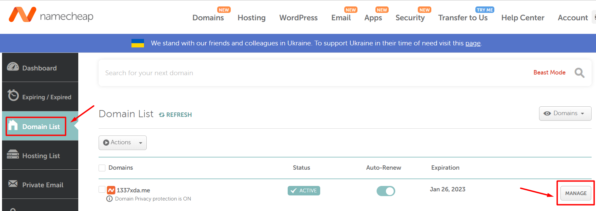


Changing DNS it can be anywhere from several minutes up to 48-72 hours or longer to effect DNS propagation.You can check with [DNS propagation tool](https://dnschecker.org/). After DNS is propagate successfully proceed to step 2.

## Step 2 - Create project and add server

* Login to [Hetzner Cloud](https://accounts.hetzner.com/login)
* Go to [Cloud Console](https://console.hetzner.cloud/projects)
* Create a project, type project name as you like.

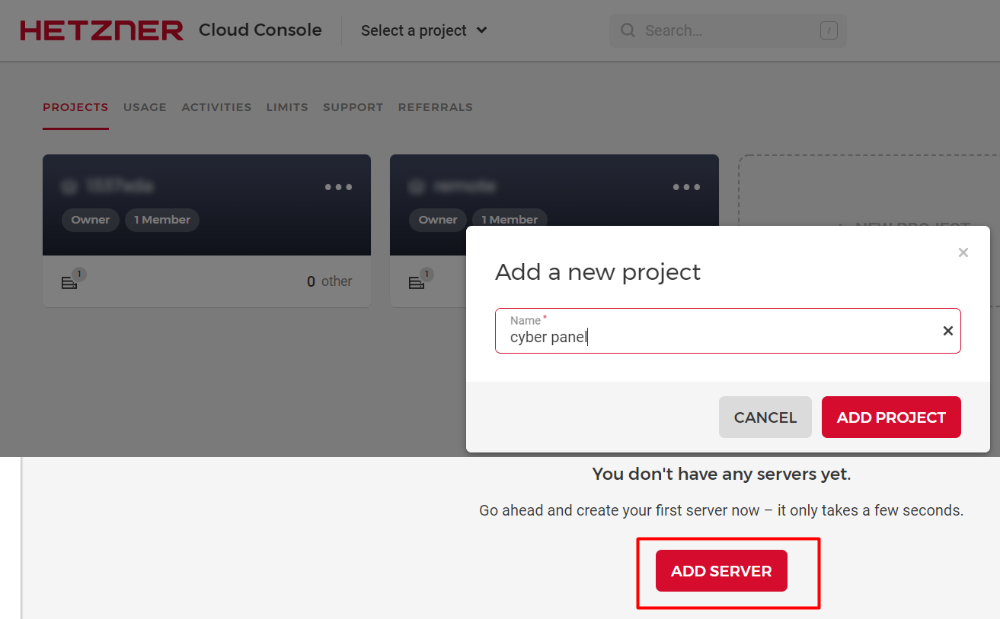

### Step 2.1 - Add server

* Choose location
* OS images or apps (in this tutorial we use OS only with Ubuntu 20.04)
* Type Standard or Dedicated (in this tutorial we use Standard CX11 plan)

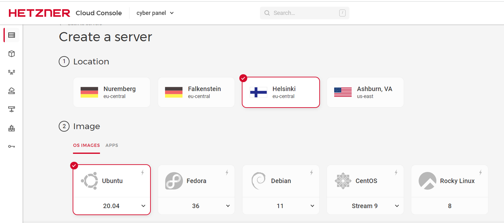

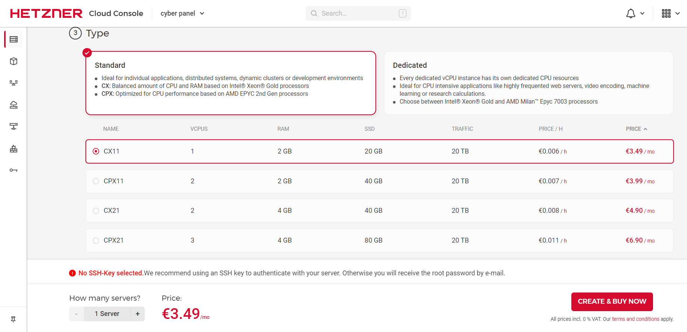

**After creating server you will see as below:**


## Step 3 - Create DNS Zone

when you are done creating virtual cloud server you are ready to add relative dns record to the hetzner DNS console.

* Now we are going to Hetzner DNS Console via [this link](https://dns.hetzner.com/) and login with hetzner account.
* Add New Zone.
* Type your main domain or subdomain as you like (in this tutorial i already setup proper dns record for my domain).
* Select add record , you can turn off auto scanning. if you are new here proceed with auto scanning and click continue.
* Now you will see the output zone record as below:

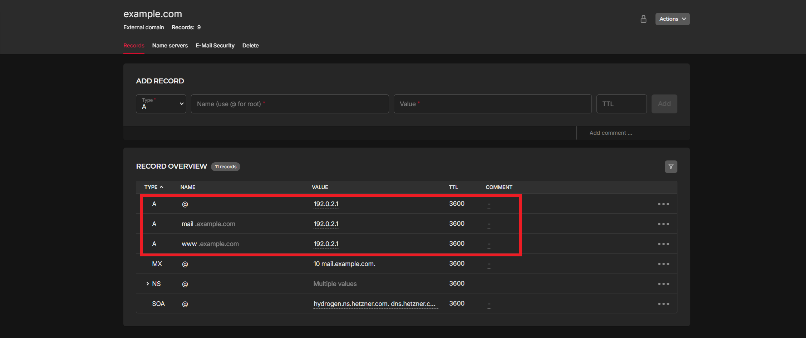

* Copy your server **IPv4 Address** from (step 2 - screenshot-6) and paste in to **A record** and set TTL. TTL stand for time to live in seconds. (eg. TTL 3600 = 1 hours)
* when you done click continue and finish.

## Step 4 - Connect server with SSH client

* As we mention above in Prerequisites, we will connect server using MobaXterm SSH Client.


* Click Session and choose SSH.
* Type server **IPv4 Address** in remote host.
* Default Port **22**
* Click **OK** and you will see login as: in terminal
* **Username and password** is in your email (send from hetzner)
* Type username and enter, copy password from your email and paste within Moba terminal with shortcut key **SHIFT + Insert** and enter.
* Now you will see message to change your password (first time login). change as you like.

* reboot server

```shell
sudo reboot
```

* reconnect server

## Step 5 - Configure server and install Cyberpanel

set hostname

```shell
hostnamectl set-hostname cyberpanel.1337xda.me
```

for check hostname

```shell
hostnamectl
```

You can see as below output:

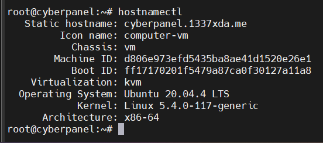

**Now, we will update our server using the below command.**

```shell
sudo apt update && sudo apt -y upgrade
```

**Install Wget and Curl**

```shell
sudo apt -y install curl wget
```

Server update & upgrade steps are completed, and now we will start CyberPanel installation.

**Install the latest version of CyberPanel**

To start the CyberPanel installation, run the following command:

```shell
sh <(curl https://cyberpanel.net/install.sh || wget -O - https://cyberpanel.net/install.sh)
```

During the installation, CyberPanel will ask you a series of prompts as shown below.

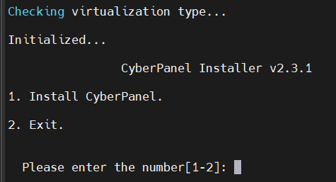

* Select 1 to start CyberPanel installation.

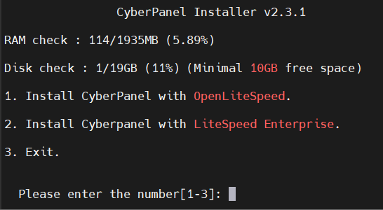

* we will Select 1 again to install CyberPanel with OpenLiteSpeed (free version)

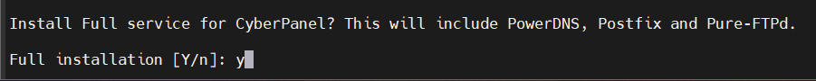

* Type **Y** for full installation.

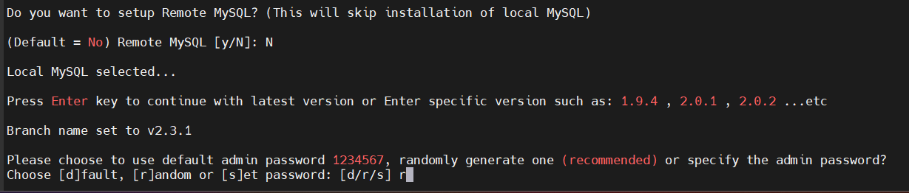

Do you want to setup Remote MySQL? (This will skip installation of local MySQL)

* Type **N** for skip

CyberPanel will request a password for admin account,

* We will select **r** for random password.

Now proceed with on screen instructions. The script will take care of the rest for you after you answer every question in the installation wizard. CyberPanel installation will take some time like 15-30 minutes because it requires a lot of packages to be compiled and installed. You can drink coffee or cup of beer and wait for finished.

When installation done you will see output below:

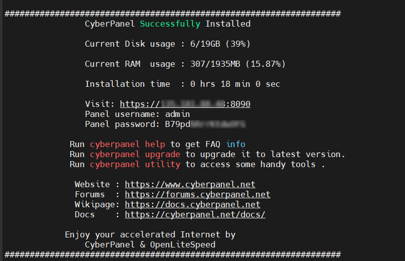

* Copy panel URL , username and password and save as text file. keep as safe somewhere in your hard drive.

Reboot server to take effect, use this command:

```shell
reboot
```

Now login panel via URL . you can use server ip or domain (in this tutorial i will login via [cyberpanel.1337xda.me](https://cyberpanel.1337xda.me:8090/) instant of server ip). you will see SSL error, just skip and proceed to website.


**As per the cyberpanel blacklist you can't use hostname to setup website. So we will fix it. This method is temporary change of hostname.**

* login to server
* set hostname

```shell
hostnamectl set-hostname cyberpanel
```

* for check hostname

```shell
hostnamectl
```

* restart litespeed server

```shell
systemctl restart lscpd
```

Now login to cyberpanel.

* On home screen select websites
* Select Package : Default
* Select Owner : admin
* Domain Name : (cyberpanel.1337xda.me) (replace with your domain)
* Email : your@email
* Select PHP : as you like
* Additional Features : SSL (check box)

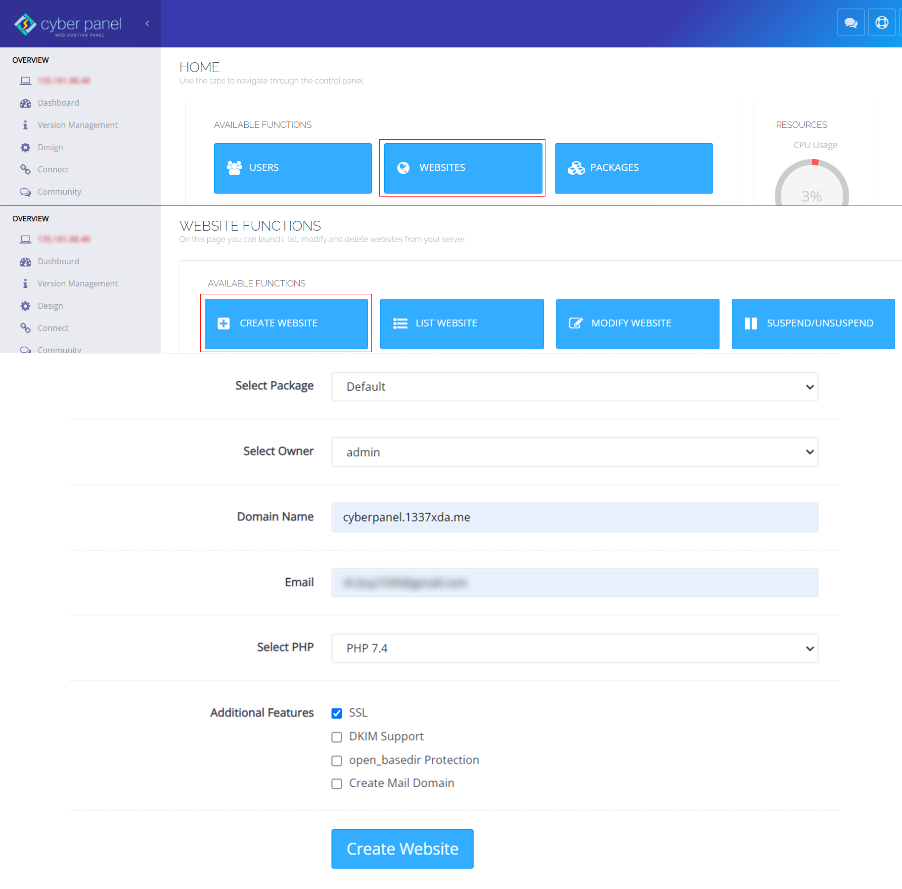

Output will be like below:


Now to issue SSL for hostname

* On left side menu > Under MAIN section > SSL > hostname ssl.
* Select website : your website.
* Issue SSL.


* now you can access cyberpanel at https://yourdomain.com:8090.

**When you done creating website we will change hostname back to the original hostname.**

* login to server
* set hostname

```shell
hostnamectl set-hostname cyberpanel.1337xda.me
```

* for check hostname

```shell
hostnamectl
```

* restart litespeed server

```shell
systemctl restart lscpd
```

## Step 6 - Configure rewrite rules and install Wordpress

* On left side menu > website > list website.
* Click manage of your select website.
* Under CONFIGURATIONS section > Rewrite Rules > Select Template > Force HTTP -> HTTPS.
* Save Rewrite Rules.


* Under APPLICATION INSTALLER section.
* Select WP + LScache.
* Fill your information.
* Install now.


* It will create automatic database .. so after install wordpress we will find the database information.
* Under FILES section > open File Manager.
* Go to public_html > select wp-config.php > edit.
* You will see your database information copy and save it somewhere.


## Step 7 - Configure PHP for upload_max_filesize & post_max_size

* Go to cyberpanel home.
* On left side menu > under SERVER section > PHP > edit PHP configs.
* Select php version ( our wordpress install with php 7.4) so select php 7.4.
* Edit as you like.
* Save change
* Restart PHP.


## Conclusion

Thank you for following my tutorial. While reading this, you should already be happy with your Cyberpanel and Wordpress installation on Ubuntu 20.04 LTS.

Now you can modified your wordpress site themes, plugins... etc. There are tons of great resources on the [Wordpress website](https://wordpress.org/).

The free version of cyberpanel includes a lot of features you might want to use just explore and learn it. Be happy with Linux Server.

### License: MIT

<!--

Contributor's Certificate of Origin

By making a contribution to this project, I certify that:

(a) The contribution was created in whole or in part by me and I have
    the right to submit it under the license indicated in the file; or

(b) The contribution is based upon previous work that, to the best of my
    knowledge, is covered under an appropriate license and I have the
    right under that license to submit that work with modifications,
    whether created in whole or in part by me, under the same license
    (unless I am permitted to submit under a different license), as
    indicated in the file; or

(c) The contribution was provided directly to me by some other person
    who certified (a), (b) or (c) and I have not modified it.

(d) I understand and agree that this project and the contribution are
    public and that a record of the contribution (including all personal
    information I submit with it, including my sign-off) is maintained
    indefinitely and may be redistributed consistent with this project
    or the license(s) involved.

Signed-off-by: Minnthu Aung < rk.boy1500@gmail.com >

-->
