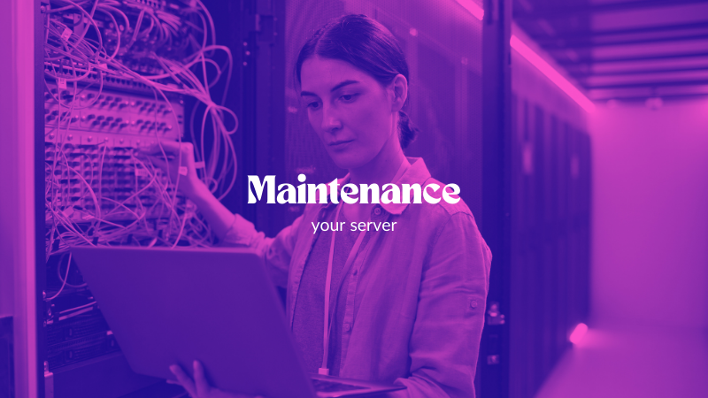
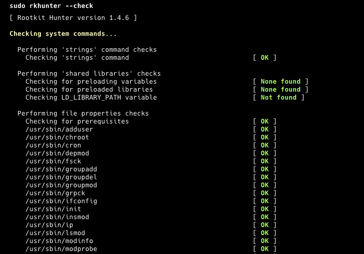
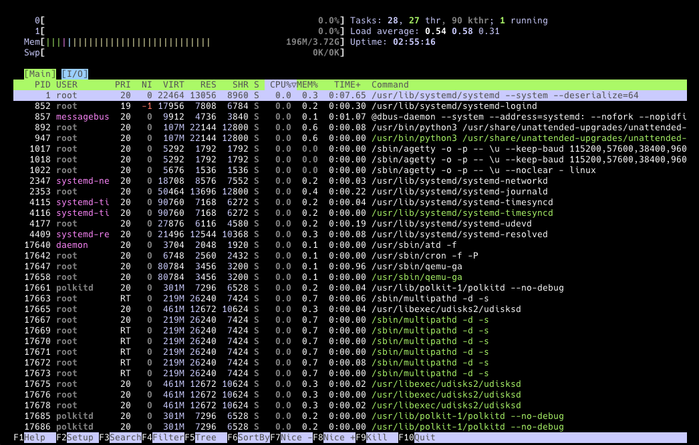
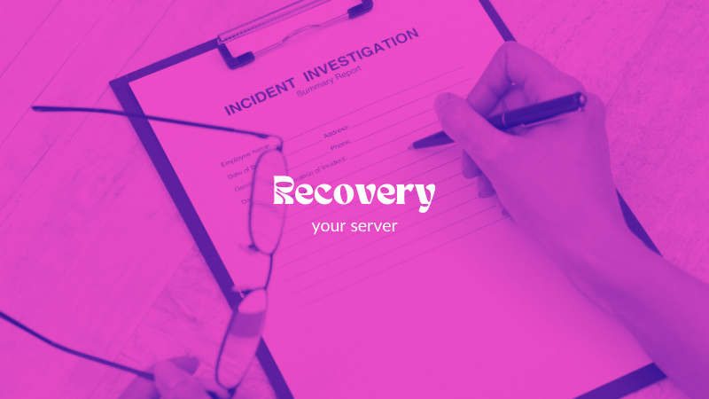

## Einführung
Ich erinnere mich an meine ersten Server. Ich habe fast nichts unternommen, um sie sicher zu halten, weil ich mir nicht bewusst war, dass jemand mit schlechten Absichten meinen Server erreichen könnte. Und du kannst dir vorstellen, wie es endete. Zum Glück hatte ich Backups und konnte sie leicht wiederherstellen. Aber es passierte wieder. Also habe ich diesmal etwas recherchiert, meine Hausaufgaben gemacht und meine Server sicherer gemacht. Ich weiß, dass es keinen unhackbaren Server gibt, aber ich werde dir zeigen, wie du deinen Server sicher halten und was zu tun ist, wenn er ausfällt.

Wir beginnen mit der Ersteinrichtung. Du lernst, was du tun solltest, wenn du einen neuen Server erstellst. Dann werden wir besprechen, wie man ihn durch regelmäßige Überprüfungen wartet. Schließlich lernst du, was zu tun ist, wenn dein Server ausfällt. Dieses Tutorial wird dich nicht zu einem professionellen Server-Manager machen, da dies viel Arbeit und eine ernsthafte Aufgabe erfordert. Aber zumindest wirst du in der Lage sein, deine Hobbyprojekte sicher zu halten.

**Voraussetzungen**

* 1 Server (z.B. bei [Hetzner](https://docs.hetzner.com/cloud/servers/getting-started/creating-a-server))

**Beispiel-Benennungen**

* Benutzername: `holu`

## Schritt 1 - Ersteinrichtung und Grundlegende Sicherheit


### System Aktualisieren
Du hast deinen neuen Server erstellt und dich über SSH eingeloggt. Das erste, was du tun solltest, ist, nach Updates zu suchen, da veraltete Software Sicherheitslücken aufweisen kann, die leicht ausnutzbar sind. Es ist einfacher, als du denkst; führe einfach diese beiden Befehle aus:
```bash
sudo apt update
sudo apt upgrade
```
Einfach, oder? Jetzt haben wir sichergestellt, dass wir die neuesten Versionen verwenden.

### SSH-Zugang sichern
Wenn jemand deinen Server ins Visier nimmt, wird er wahrscheinlich zuerst versuchen, über SSH darauf zuzugreifen. Dies geschieht oft mit Bots und verschiedenen Methoden. Daher ist es entscheidend, den SSH-Zugang abzusichern.

Stelle sicher, dass du der Anleitung zur [Ersteinrichtung des Servers mit Ubuntu](https://community.hetzner.com/tutorials/howto-initial-setup-ubuntu/de) folgst, um einen neuen Benutzer zu erstellen. Überspringe jedoch Schritt 6, da wir die Installation der Firewall abdecken werden.

Der zweite Schritt ist das Ändern des Standard-SSH-Ports. Durch einfaches Ändern können wir die meisten automatisierten Bot-Angriffe eliminieren, da die meisten von ihnen einfache Bots sind, die versuchen, über Port 22 auf SSH zuzugreifen. Führe nun diesen Befehl aus:
```bash
sudo nano /etc/ssh/sshd_config
```
Suche die Zeile "#Port 22" und ändere sie in etwas wie "Port 2222" (oder ändere 2222 in einen beliebigen anderen Wert).

Unser dritter Schritt ist es, die Passwortauthentifizierung zu deaktivieren und SSH-Schlüssel für eine sicherere Authentifizierungsmethode zu verwenden. Wenn du noch kein SSH-Schlüsselpaar hast, kannst du eines mit dem Befehl ssh-keygen erzeugen:
```bash
ssh-keygen -t rsa -b 4096 -C "your_email@example.com"
```
Dies erzeugt ein neues SSH-Schlüsselpaar (einen privaten und einen öffentlichen Schlüssel). Standardmäßig werden die Schlüssel im Verzeichnis ~/.ssh gespeichert. Du kannst Enter drücken, um den Standarddateipfad zu akzeptieren, oder einen anderen Pfad angeben. Optional kannst du auch eine Passphrase für zusätzliche Sicherheit festlegen.

Verwende den Befehl ssh-copy-id, um deinen öffentlichen Schlüssel auf den Server zu kopieren. Ersetze newuser durch deinen Benutzernamen und server_ip durch die IP-Adresse deines Servers:
```bash
ssh-copy-id newuser@server_ip
```

Alternativ, wenn ssh-copy-id nicht verfügbar ist, kannst du den öffentlichen Schlüssel manuell kopieren:
```bash
cat ~/.ssh/id_rsa.pub | ssh newuser@server_ip 'mkdir -p ~/.ssh && cat >> ~/.ssh/authorized_keys'
```

Stelle sicher, dass die richtigen Berechtigungen für das Verzeichnis .ssh und die Datei authorized_keys auf deinem Server festgelegt sind:
```bash
ssh newuser@server_ip
chmod 700 ~/.ssh
chmod 600 ~/.ssh/authorized_keys
```

Um die Passwortanmeldung zu deaktivieren, führe diesen Befehl aus:
```bash
sudo nano /etc/ssh/sshd_config
```
Suche "PasswordAuthentication" und setze es auf "no" und suche "PubkeyAuthentication" und setze es auf "yes".

### Eine Firewall konfigurieren
Wir werden "ufw" verwenden, um Firewall-Regeln zu verwalten. Es ist so konzipiert, dass es einfach zu bedienen ist und eine Befehlszeilenschnittstelle verwendet. Ufw ist wahrscheinlich bereits auf deinem System installiert, aber du kannst diesen Befehl ausführen, um sicherzustellen, dass es installiert ist:
```bash
sudo apt install ufw
```

Als nächstes werden wir allen eingehenden Netzwerkverkehr ablehnen, es sei denn, er wird durch andere Regeln ausdrücklich erlaubt. Dies ist grundlegend, um deinen Server zu sichern, indem du nur den Verkehr zulässt, den du ausdrücklich erlaubst. Du musst diesen Befehl ausführen:
```bash
sudo ufw default deny incoming
```

Dann werden wir allen ausgehenden Netzwerkverkehr erlauben. Dies ist typischerweise sicher und ermöglicht es deinem Server, ohne Einschränkung mit anderen Servern oder Diensten zu kommunizieren. Führe diesen Befehl aus:
```bash
sudo ufw default allow outgoing
```

Jetzt müssen wir unseren SSH-Port erlauben, um uns über SSH auf unserem Server anzumelden. Stelle einfach sicher, dass du 2222 durch deinen SSH-Port ersetzt, wenn du etwas anderes angegeben hast, und führe diesen Befehl aus:
```bash
sudo ufw allow 2222/tcp
```

Zuletzt müssen wir unsere Firewall-Regeln aktivieren:
```bash
sudo ufw enable
```

### Fail2Ban

Wir haben unseren SSH-Port geändert und unsere Firewall eingerichtet. Aber was passiert, wenn ein Bot unseren Port findet und trotzdem versucht, über SSH auf unseren Server zuzugreifen? Das wäre ein Brute-Force-Angriff, und wir können unseren Server mit Fail2Ban schützen. Diese Software wird IPs sperren, die böswillige Anzeichen oder Versuche zeigen. Du musst diese drei Befehle ausführen, um Fail2Ban zu installieren und zu aktivieren:

```bash
sudo apt install fail2ban
sudo systemctl enable fail2ban
sudo systemctl start fail2ban
```

Du kannst die Einstellungen für Fail2Ban auch anpassen, indem du die Konfigurationsdateien im Verzeichnis /etc/fail2ban/ bearbeitest. Für detailliertere Informationen und bewährte Methoden kannst du die [Fail2Ban-Dokumentation](https://github.com/fail2ban/fail2ban/wiki/Best-practice) einsehen.

Großartig! Du hast einen großen Schritt gemacht und hast bereits einen besser geschützten Server. Jetzt musst du nur noch von Zeit zu Zeit regelmäßige Wartungsarbeiten durchführen. Wir erklären dir im nächsten Abschnitt, was du tun musst.

## Schritt 2 - Regelmäßige Wartung



* **System Aktualisieren**
  
  Zuerst müssen wir prüfen, ob es Updates für unser System gibt. Führe diesen Befehl aus:
  
  ```bash
  sudo apt update
  sudo apt upgrade
  ```

<br>

* **Logs Überwachen**
  
  Du musst regelmäßig deine Systemprotokolle überprüfen, um ungewöhnliche Aktivitäten zu erkennen. Logwatch kann dir helfen, diesen Prozess zu automatisieren. Du kannst Logwatch mit diesem Befehl installieren:
  
  ```bash
  sudo apt install logwatch
  ```
  
  Du kannst detailliertere Informationen nachlesen, wie du tägliche Berichte einrichtest und wie die Berichte aussehen, in [dieser Anleitung](https://ubuntu.com/server/docs/how-to-install-and-configure-logwatch).

<br>

* **Festplattennutzung Überprüfen**
  
  Nur um sicherzustellen, dass du genügend Platz hast, um deinen Server am Laufen zu halten, überprüfe deinen verbleibenden Speicherplatz mit diesem Befehl:
  
  ```bash
  df -h
  ```

<br>

* **Daten Sichern**
  
  Du solltest immer mehrere Backups haben, um sicherzustellen, dass du dich von Katastrophen erholen kannst, falls dein Server vollständig gelöscht oder unzugänglich wird. Glücklicherweise hat Hetzner eine automatisierte Backup-Lösung für Cloud-Server, und du kannst sie in der [offiziellen Dokumentation](https://docs.hetzner.com/cloud/servers/getting-started/enabling-backups) einsehen. Wenn du deine eigenen Backups einrichten möchtest, kannst du Tools wie "rsync" oder "Duplicity" verwenden.

<br>

* **Benutzerkonten Überprüfen**
  
  Vergiss nicht, die Benutzerkonten auf dem Server regelmäßig zu überprüfen. Stelle sicher, dass nur autorisierte Benutzer Zugriff auf deinen Server haben. Lösche alle Konten, die nicht mehr benötigt werden. Du kannst Benutzerkonten überprüfen, indem du diesen Befehl ausführst:
  
  ```bash
  sudo nano /etc/passwd
  ```

<br>

* **Rootkits und Malware Überprüfen**
  
  Um schnelle Scans auf deinem Server durchzuführen, kannst du Tools wie "rkhunter" und "chkrootkit" verwenden. Diese Tools helfen dir, Rootkits, Hintertüren und mögliche lokale Exploits zu überprüfen, sodass du sicherstellen kannst, dass alles in Ordnung ist. Führe diese Befehle aus, um sicherzustellen, dass rkhunter installiert ist und überprüft wurde:
  
  ```bash
  sudo apt install rkhunter
  sudo rkhunter --check
  ```
  
  

<br>

* **Systemleistung Überwachen**
  
  Schließlich kannst du schnell die Systemleistung überprüfen, um sicherzustellen, dass es keine Ressourcenengpässe gibt, während deine Software läuft. Es gibt Tools wie "htop", "top" oder "atop". Du kannst jedoch einfach diesen Befehl ausführen:
  
  ```bash
  htop
  ```
  
  

## Schritt 3 - Weitere Sicherheitswerkzeuge


* **Einbruchserkennungssysteme Verwenden**
  
  Du kannst Tools wie "AIDE" (Advanced Intrusion Detection Environment) verwenden, um Änderungen an deinem System zu überwachen. Es erzeugt eine Datenbank für deine Dateien und Ordner und vergleicht dein System mit dieser Datenbank, um die Dateiintegrität sicherzustellen. Du kannst weitere Details im [Repo](https://github.com/aide/aide) nachlesen. Für die grundlegende Nutzung kannst du es mit diesem Befehl installieren:
  
  ```bash
  sudo apt install aide
  ```
  
  Starte und generiere die Datenbank mit diesen Befehlen:
  
  ```bash
  sudo aideinit
  sudo cp /var/lib/aide/aide.db.new /var/lib/aide/aide.db
  ```
  
  Und vergleiche dein System mit der Datenbank mit diesem Befehl:
  
  ```bash
  sudo aide --config /etc/aide/aide.conf --check
  ```

<br>

* **Zwei-Faktor-Authentifizierung (2FA) Aktivieren**
  
  Du kannst auch 2FA (Zwei-Faktor-Authentifizierung) einrichten, um dich über SSH auf deinem Server anzumelden. Dies fügt eine zusätzliche Schutzschicht hinzu und verringert das Risiko unbefugten Zugriffs. Du kannst es mit diesem Befehl installieren:
  
  ```bash
  sudo apt install libpam-google-authenticator
  ```
  
  Und führe diesen Befehl zur Einrichtung aus:
  
  ```bash
  google-authenticator
  ```

<br>

* **Webanwendungen Sichern**
  
  Wenn du Webanwendungen auf deinem Server ausführen, stelle sicher, dass du deren bewährte Methoden befolgst und sie regelmäßig aktualisierst. Wenn du beispielsweise WordPress verwendest, solltest du immer die neueste Version von WordPress sowie alle Plugins und Themes auf dem neuesten Stand halten. Außerdem musst du ein geeignetes WordPress-Sicherheitsplugin installieren. Dies wird das Risiko von unbefugtem Zugriff auf deinen Server und deine Anwendungen verringern.

## Schritt 4 - Notfallplan



Dieser Plan kann in großen Organisationen sehr detailliert sein. Aber wir werden es einfach und umsetzbar für kleine Hobby-Server halten. Aus diesem Grund habe ich einen 3-Schritte-Plan für dich vorbereitet.

* **Vorbereitung**
  
  Für diesen Teil musst du eine kleine Textdatei oder eine Notiz in deiner Notizen-App über deine Serverinformationen erstellen. Füge Informationen wie deine Serverarchitektur, die darauf laufende Software, die Speicherorte deiner Backups und Logs sowie deine Konfigurationen hinzu. Bewahre diese Notiz an einem sicheren Ort auf. Du kannst dieses Beispiel als Ausgangspunkt verwenden:

<br>

* **Serverinformationen**
  
  | Info             | Desc             |
  | ---------------- | ---------------- |
  | Server Name      | MyServer01       |
  | IP Address       | 192.168.1.100    |
  | Operating System | Ubuntu 20.04 LTS |
  | CPU              | 4 vCPUs          |
  | RAM              | 8 GB             |
  | Storage          | 100 GB SSD       |
  | SSH Port         | 2222             |
  
  - Software und Dienste: Nginx 1.18.0, PostgreSQL 13, Django 3.1
  - Backup: Duplicity, täglich, /mnt/backups und Fernspeicher auf AWS S3, 30 Tage Aufbewahrung
  - Nginx-Konfiguration: /etc/nginx/nginx.conf
  - PostgreSQL-Konfiguration: /etc/postgresql/13/main/postgresql.conf
  - Django-Konfiguration: /home/myuser/myapp/settings.py
  - UFW-Konfiguration: /etc/ufw/ufw.conf

<br>

* **Identifikation**
  
  In diesem Teil solltest du überprüfen, was das Problem mit deinem Server ist. Ist das Problem oder der Verstoß mit deiner Webanwendung, dem Server selbst oder einer der Datenbanken auf deinem Server verbunden? Wenn du dir nicht sicher bist, gehe immer davon aus, dass alles gefährdet ist. Beginne also, alles erneut zu überprüfen, beginnend mit dem Server.

<br>

* **Wiederherstellung**
  
  Stelle die betroffenen Systeme in diesem Teil wieder her. Wenn du nicht auf deinen Server zugreifen kannst, musst du aus einem Server-Backup wiederherstellen. Wenn eine der Webanwendungen beschädigt ist, musst du möglicherweise nur deren Backup wiederherstellen. Stelle sicher, dass alles wiederhergestellt, getestet, wie erwartet funktioniert und dass du einen Sicherheits-Scan durchgeführt hast.


## Ergebnis

Die Sicherung deines Servers erfordert eine Kombination aus bewährten Methoden und regelmäßiger Wartung. Wenn du die in diesem Beitrag beschriebenen Schritte befolgst, kannst du die Sicherheit deines Servers erheblich verbessern und deine wertvollen Daten schützen. Denke daran, dass Sicherheit ein kontinuierlicher Prozess ist. Vergiss also nicht, deine Server regelmäßig zu überprüfen.

##### License: MIT

<!--

Contributor's Certificate of Origin

By making a contribution to this project, I certify that:

(a) The contribution was created in whole or in part by me and I have
    the right to submit it under the license indicated in the file; or

(b) The contribution is based upon previous work that, to the best of my
    knowledge, is covered under an appropriate license and I have the
    right under that license to submit that work with modifications,
    whether created in whole or in part by me, under the same license
    (unless I am permitted to submit under a different license), as
    indicated in the file; or

(c) The contribution was provided directly to me by some other person
    who certified (a), (b) or (c) and I have not modified it.

(d) I understand and agree that this project and the contribution are
    public and that a record of the contribution (including all personal
    information I submit with it, including my sign-off) is maintained
    indefinitely and may be redistributed consistent with this project
    or the license(s) involved.

Signed-off-by: Oguzhan Selcuk Bulbul contact@osbulbul.com

-->