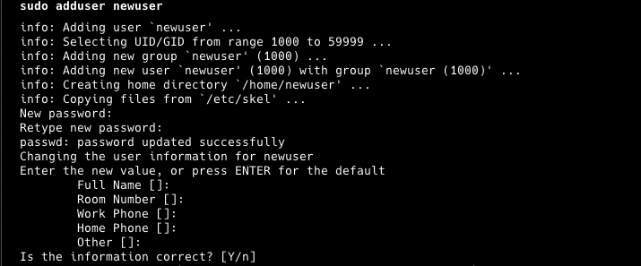
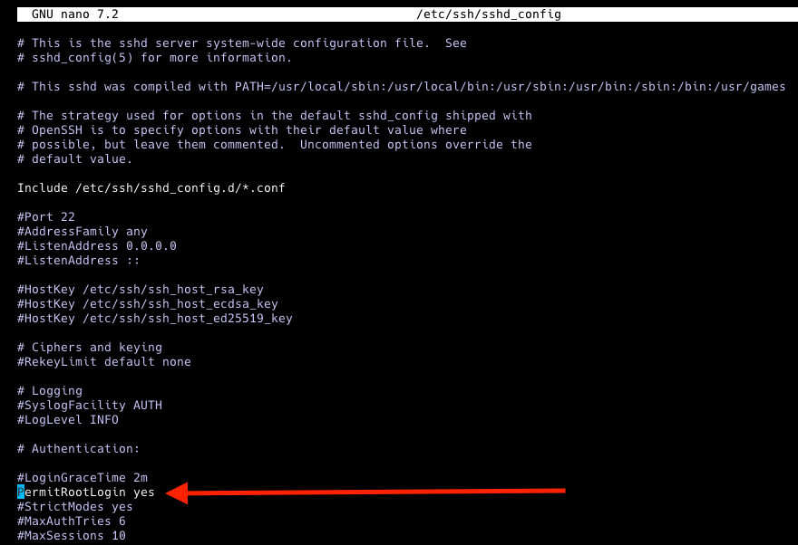

## Einführung
Ich erinnere mich an meine ersten Server. Ich habe fast nichts unternommen, um sie sicher zu halten, weil ich mir nicht bewusst war, dass jemand mit schlechten Absichten meinen Server erreichen könnte. Und Sie können sich vorstellen, wie es endete. Zum Glück hatte ich Backups und konnte sie leicht wiederherstellen. Aber es passierte wieder. Also habe ich diesmal etwas recherchiert, meine Hausaufgaben gemacht und meine Server sicherer gemacht. Ich weiß, dass es keinen unhackbaren Server gibt, aber ich werde Ihnen zeigen, wie Sie Ihren Server sicher halten und was zu tun ist, wenn er ausfällt.

Wir beginnen mit der Ersteinrichtung. Sie lernen, was Sie tun sollten, wenn Sie einen neuen Server erstellen. Dann werden wir besprechen, wie man ihn durch regelmäßige Überprüfungen wartet. Schließlich lernen Sie, was zu tun ist, wenn Ihr Server ausfällt. Dieses Tutorial wird Sie nicht zu einem professionellen Server-Manager machen, da dies viel Arbeit und eine ernsthafte Aufgabe erfordert. Aber zumindest werden Sie in der Lage sein, Ihre Hobbyprojekte sicher zu halten.

**Voraussetzungen**

* 1 Server (z.B. bei [Hetzner](https://docs.hetzner.com/cloud/servers/getting-started/creating-a-server))

**Beispiel-Benennungen**

* Benutzername: `holu`

## Schritt 1 - Ersteinrichtung und Grundlegende Sicherheit


### System Aktualisieren
Sie haben Ihren neuen Server erstellt und sich über SSH eingeloggt. Das erste, was Sie tun sollten, ist nach Updates zu suchen, da veraltete Software Sicherheitslücken aufweisen kann, die leicht ausnutzbar sind. Es ist einfacher, als Sie denken; führen Sie einfach diese beiden Befehle aus:
```bash
sudo apt update
sudo apt upgrade
```
Einfach, oder? Jetzt haben wir sichergestellt, dass wir die neuesten Versionen verwenden.

### SSH-Zugang sichern
Wenn jemand Ihren Server ins Visier nimmt, wird er wahrscheinlich zuerst versuchen, über SSH darauf zuzugreifen. Dies tun sie oft mit Bots und mehreren Methoden. Daher ist es entscheidend, den SSH-Zugang zu sichern. Unser erster Schritt ist es, den Root-Login zu deaktivieren. Aber wir müssen einen neuen Benutzer erstellen, bevor wir den Root-Login deaktivieren. Führen Sie diesen Befehl aus, um einen neuen Benutzer zu erstellen (vergessen Sie nicht, newuser zu ändern):
```bash
sudo adduser newuser
```


Sie werden aufgefordert, ein Passwort festzulegen und einige zusätzliche Informationen für den neuen Benutzer anzugeben. Um dem neuen Benutzer administrative Rechte zu gewähren, fügen Sie ihn zur sudo-Gruppe hinzu:
```bash
sudo usermod -aG sudo newuser
```
Wechseln Sie zum neuen Benutzer, um sicherzustellen, dass alles korrekt funktioniert, und testen Sie den sudo-Zugang, indem Sie einen Befehl ausführen, der administrative Rechte erfordert:
```bash
su - newuser
sudo apt update
```

Um den Root-Zugang zu deaktivieren, müssen Sie diesen Befehl ausführen:
```bash
sudo nano /etc/ssh/sshd_config
```
Suchen Sie die Zeile "PermitRootLogin" und ändern Sie sie zu "no".



Der zweite Schritt ist das Ändern des Standard-SSH-Ports. Durch einfaches Ändern können wir die meisten automatisierten Bot-Angriffe eliminieren, da die meisten von ihnen einfache Bots sind, die versuchen, über Port 22 auf SSH zuzugreifen. Führen Sie nun diesen Befehl aus:
```bash
sudo nano /etc/ssh/sshd_config
```
Suchen Sie die Zeile "#Port 22" und ändern Sie sie in etwas wie "Port 2222" (oder ändern Sie 2222 in einen beliebigen anderen Wert).

Unser dritter Schritt ist es, die Passwortauthentifizierung zu deaktivieren und SSH-Schlüssel für eine sicherere Authentifizierungsmethode zu verwenden. Wenn Sie noch kein SSH-Schlüsselpaar haben, können Sie eines mit dem Befehl ssh-keygen erzeugen:
```bash
ssh-keygen -t rsa -b 4096 -C "your_email@example.com"
```
Dies erzeugt ein neues SSH-Schlüsselpaar (einen privaten und einen öffentlichen Schlüssel). Standardmäßig werden die Schlüssel im Verzeichnis ~/.ssh gespeichert. Sie können Enter drücken, um den Standarddateipfad zu akzeptieren, oder einen anderen Pfad angeben. Optional können Sie auch eine Passphrase für zusätzliche Sicherheit festlegen.

Verwenden Sie den Befehl ssh-copy-id, um Ihren öffentlichen Schlüssel auf den Server zu kopieren. Ersetzen Sie newuser durch Ihren Benutzernamen und server_ip durch die IP-Adresse Ihres Servers:
```bash
ssh-copy-id newuser@server_ip
```

Alternativ, wenn ssh-copy-id nicht verfügbar ist, können Sie den öffentlichen Schlüssel manuell kopieren:
```bash
cat ~/.ssh/id_rsa.pub | ssh newuser@server_ip 'mkdir -p ~/.ssh && cat >> ~/.ssh/authorized_keys'
```

Stellen Sie sicher, dass die richtigen Berechtigungen für das Verzeichnis .ssh und die Datei authorized_keys auf Ihrem Server festgelegt sind:
```bash
ssh newuser@server_ip
chmod 700 ~/.ssh
chmod 600 ~/.ssh/authorized_keys
```

Um die Passwortanmeldung zu deaktivieren, führen Sie diesen Befehl aus:
```bash
sudo nano /etc/ssh/sshd_config
```
Suchen Sie "PasswordAuthentication" und setzen Sie es auf "no" und suchen Sie "PubkeyAuthentication" und setzen Sie es auf "yes".

### Eine Firewall konfigurieren
Wir werden "ufw" verwenden, um Firewall-Regeln zu verwalten. Es ist so konzipiert, dass es einfach zu bedienen ist und eine Befehlszeilenschnittstelle verwendet. Ufw ist wahrscheinlich bereits auf Ihrem System installiert, aber Sie können diesen Befehl ausführen, um sicherzustellen, dass es installiert ist:
```bash
sudo apt install ufw
```

Als nächstes werden wir allen eingehenden Netzwerkverkehr ablehnen, es sei denn, er wird durch andere Regeln ausdrücklich erlaubt. Dies ist grundlegend, um Ihren Server zu sichern, indem Sie nur den Verkehr zulassen, den Sie ausdrücklich erlauben. Sie müssen diesen Befehl ausführen:
```bash
sudo ufw default deny incoming
```

Dann werden wir allen ausgehenden Netzwerkverkehr erlauben. Dies ist typischerweise sicher und ermöglicht es Ihrem Server, ohne Einschränkung mit anderen Servern oder Diensten zu kommunizieren. Führen Sie diesen Befehl aus:
```bash
sudo ufw default allow outgoing
```

Jetzt müssen wir unseren SSH-Port erlauben, um uns über SSH auf unserem Server anzumelden. Stellen Sie einfach sicher, dass Sie 2222 durch Ihren SSH-Port ersetzen, wenn Sie etwas anderes angegeben haben, und führen Sie diesen Befehl aus:
```bash
sudo ufw allow 2222/tcp
```

Zuletzt müssen wir unsere Firewall-Regeln aktivieren:
```bash
sudo ufw enable
```

### Fail2Ban

Wir haben unseren SSH-Port geändert und unsere Firewall eingerichtet. Aber was passiert, wenn ein Bot unseren Port findet und trotzdem versucht, über SSH auf unseren Server zuzugreifen? Das wäre ein Brute-Force-Angriff, und wir können unseren Server mit Fail2Ban schützen. Diese Software wird IPs sperren, die böswillige Anzeichen oder Versuche zeigen. Sie müssen diese drei Befehle ausführen, um Fail2Ban zu installieren und zu aktivieren:

```bash
sudo apt install fail2ban
sudo systemctl enable fail2ban
sudo systemctl start fail2ban
```

Sie können die Einstellungen für Fail2Ban auch anpassen, indem Sie die Konfigurationsdateien im Verzeichnis /etc/fail2ban/ bearbeiten. Für detailliertere Informationen und bewährte Methoden können Sie die [Fail2Ban-Dokumentation](https://github.com/fail2ban/fail2ban/wiki/Best-practice) einsehen.

Großartig! Sie haben einen großen Schritt gemacht und haben bereits einen besser geschützten Server. Jetzt müssen Sie nur noch von Zeit zu Zeit regelmäßige Wartungsarbeiten durchführen. Wir erklären Ihnen im nächsten Abschnitt, was Sie tun müssen.

## Schritt 2 - Regelmäßige Wartung


* **System Aktualisieren**
  
  Zuerst müssen wir prüfen, ob es Updates für unser System gibt. Führen Sie diesen Befehl aus:
  
  ```bash
  sudo apt update
  sudo apt upgrade
  ```

<br>

* **Logs Überwachen**
  
  Sie müssen regelmäßig Ihre Systemprotokolle überprüfen, um ungewöhnliche Aktivitäten zu erkennen. Logwatch kann Ihnen helfen, diesen Prozess zu automatisieren. Sie können es installieren und tägliche Berichte mit diesen Befehlen einrichten:
  
  ```bash
  sudo apt install logwatch
  sudo logwatch --detail High --mailto your-email@example.com --service all --range today
  ```
  
  Sie können detailliertere Informationen und sehen, wie die Berichte aussehen, in [dieser Anleitung](https://ubuntu.com/server/docs/how-to-install-and-configure-logwatch) nachlesen.

<br>

* **Festplattennutzung Überprüfen**
  
  Nur um sicherzustellen, dass Sie genügend Platz haben, um Ihren Server am Laufen zu halten, überprüfen Sie Ihren verbleibenden Speicherplatz mit diesem Befehl:
  
  ```bash
  df -h
  ```

<br>

* **Daten Sichern**
  
  Sie sollten immer mehrere Backups haben, um sicherzustellen, dass Sie sich von Katastrophen erholen können, falls Ihr Server vollständig gelöscht oder unzugänglich wird. Glücklicherweise hat Hetzner eine automatisierte Backup-Lösung für Cloud-Server, und Sie können sie in der [offiziellen Dokumentation](https://docs.hetzner.com/cloud/servers/getting-started/enabling-backups) einsehen. Wenn Sie Ihre eigenen Backups einrichten möchten, können Sie Tools wie "rsync" oder "Duplicity" verwenden.

<br>

* **Benutzerkonten Überprüfen**
  
  Vergessen Sie nicht, die Benutzerkonten auf dem Server regelmäßig zu überprüfen. Stellen Sie sicher, dass nur autorisierte Benutzer Zugriff auf Ihren Server haben. Löschen Sie alle Konten, die nicht mehr benötigt werden. Sie können Benutzerkonten überprüfen, indem Sie diesen Befehl ausführen:
  
  ```bash
  sudo nano /etc/passwd
  ```

<br>

* **Rootkits und Malware Überprüfen**
  
  Um schnelle Scans auf Ihrem Server durchzuführen, können Sie Tools wie "rkhunter" und "chkrootkit" verwenden. Diese Tools helfen Ihnen, Rootkits, Hintertüren und mögliche lokale Exploits zu überprüfen, sodass Sie sicherstellen können, dass alles in Ordnung ist. Führen Sie diese Befehle aus, um sicherzustellen, dass rkhunter installiert ist und überprüft wurde:
  
  ```bash
  sudo apt install rkhunter
  sudo rkhunter --check
  ```
  
  

<br>

* **Systemleistung Überwachen**
  
  Schließlich können Sie schnell die Systemleistung überprüfen, um sicherzustellen, dass es keine Ressourcenengpässe gibt, während Ihre Software läuft. Es gibt Tools wie "htop", "top" oder "atop". Sie können jedoch einfach diesen Befehl ausführen:
  
  ```bash
  htop
  ```
  
  

## Schritt 3 - Weitere Sicherheitswerkzeuge


* **Einbruchserkennungssysteme Verwenden**
  
  Sie können Tools wie "AIDE" (Advanced Intrusion Detection Environment) verwenden, um Änderungen an Ihrem System zu überwachen. Es erzeugt eine Datenbank für Ihre Dateien und Ordner und vergleicht Ihr System mit dieser Datenbank, um die Dateiintegrität sicherzustellen. Sie können weitere Details im [Repo](https://github.com/aide/aide) nachlesen. Für die grundlegende Nutzung können Sie es mit diesem Befehl installieren:
  
  ```bash
  sudo apt install aide
  ```
  
  Starten und generieren Sie die Datenbank mit diesen Befehlen:
  
  ```bash
  sudo aideinit
  sudo cp /var/lib/aide/aide.db.new /var/lib/aide/aide.db
  ```
  
  Und vergleichen Sie Ihr System mit der Datenbank mit diesem Befehl:
  
  ```bash
  sudo aide --config /etc/aide/aide.conf --check
  ```

<br>

* **Zwei-Faktor-Authentifizierung (2FA) Aktivieren**
  
  Sie können auch 2FA (Zwei-Faktor-Authentifizierung) einrichten, um sich über SSH auf Ihrem Server anzumelden. Dies fügt eine zusätzliche Schutzschicht hinzu und verringert das Risiko unbefugten Zugriffs. Sie können es mit diesem Befehl installieren:
  
  ```bash
  sudo apt install libpam-google-authenticator
  ```
  
  Und führen Sie diesen Befehl zur Einrichtung aus:
  
  ```bash
  google-authenticator
  ```

<br>

* **Webanwendungen Sichern**
  
  Wenn Sie Webanwendungen auf Ihrem Server ausführen, stellen Sie sicher, dass Sie deren bewährte Methoden befolgen und sie regelmäßig aktualisieren. Wenn Sie beispielsweise WordPress verwenden, sollten Sie immer die neueste Version von WordPress sowie alle Plugins und Themes auf dem neuesten Stand halten. Außerdem müssen Sie ein geeignetes WordPress-Sicherheitsplugin installieren. Dies wird das Risiko von unbefugtem Zugriff auf Ihren Server und Ihre Anwendungen verringern.

## Schritt 4 - Notfallplan


Dieser Plan kann in großen Organisationen sehr detailliert sein. Aber wir werden es einfach und umsetzbar für kleine Hobby-Server halten. Aus diesem Grund habe ich einen 3-Schritte-Plan für Sie vorbereitet.

* **Vorbereitung**
  
  Für diesen Teil müssen Sie eine kleine Textdatei oder eine Notiz in Ihrer Notizen-App über Ihre Serverinformationen erstellen. Fügen Sie Informationen wie Ihre Serverarchitektur, die darauf laufende Software, die Speicherorte Ihrer Backups und Logs sowie Ihre Konfigurationen hinzu. Bewahren Sie diese Notiz an einem sicheren Ort auf. Sie können dieses Beispiel als Ausgangspunkt verwenden:

<br>

* **Serverinformationen**
  
  | Info             | Desc             |
  | ---------------- | ---------------- |
  | Server Name      | MyServer01       |
  | IP Address       | 192.168.1.100    |
  | Operating System | Ubuntu 20.04 LTS |
  | CPU              | 4 vCPUs          |
  | RAM              | 8 GB             |
  | Storage          | 100 GB SSD       |
  | SSH Port         | 2222             |
  
  - Software und Dienste: Nginx 1.18.0, PostgreSQL 13, Django 3.1
  - Backup: Duplicity, täglich, /mnt/backups und Fernspeicher auf AWS S3, 30 Tage Aufbewahrung
  - Nginx-Konfiguration: /etc/nginx/nginx.conf
  - PostgreSQL-Konfiguration: /etc/postgresql/13/main/postgresql.conf
  - Django-Konfiguration: /home/myuser/myapp/settings.py
  - UFW-Konfiguration: /etc/ufw/ufw.conf

<br>

* **Identifikation**
  
  In diesem Teil sollten Sie überprüfen, was das Problem mit Ihrem Server ist. Ist das Problem oder der Verstoß mit Ihrer Webanwendung, dem Server selbst oder einer der Datenbanken auf Ihrem Server verbunden? Wenn Sie sich nicht sicher sind, gehen Sie immer davon aus, dass alles gefährdet ist. Beginnen Sie also, alles erneut zu überprüfen, beginnend mit dem Server.

<br>

* **Wiederherstellung**
  
  Stellen Sie die betroffenen Systeme in diesem Teil wieder her. Wenn Sie nicht auf Ihren Server zugreifen können, müssen Sie aus einem Server-Backup wiederherstellen. Wenn eine der Webanwendungen beschädigt ist, müssen Sie möglicherweise nur deren Backup wiederherstellen. Stellen Sie sicher, dass alles wiederhergestellt, getestet, wie erwartet funktioniert und dass Sie einen Sicherheits-Scan durchgeführt haben.


## Ergebnis

Die Sicherung Ihres Servers erfordert eine Kombination aus bewährten Methoden und regelmäßiger Wartung. Wenn Sie die in diesem Beitrag beschriebenen Schritte befolgen, können Sie die Sicherheit Ihres Servers erheblich verbessern und Ihre wertvollen Daten schützen. Denken Sie daran, dass Sicherheit ein kontinuierlicher Prozess ist. Vergessen Sie also nicht, Ihre Server regelmäßig zu überprüfen.

##### License: MIT

<!--

Contributor's Certificate of Origin

By making a contribution to this project, I certify that:

(a) The contribution was created in whole or in part by me and I have
    the right to submit it under the license indicated in the file; or

(b) The contribution is based upon previous work that, to the best of my
    knowledge, is covered under an appropriate license and I have the
    right under that license to submit that work with modifications,
    whether created in whole or in part by me, under the same license
    (unless I am permitted to submit under a different license), as
    indicated in the file; or

(c) The contribution was provided directly to me by some other person
    who certified (a), (b) or (c) and I have not modified it.

(d) I understand and agree that this project and the contribution are
    public and that a record of the contribution (including all personal
    information I submit with it, including my sign-off) is maintained
    indefinitely and may be redistributed consistent with this project
    or the license(s) involved.

Signed-off-by: Oguzhan Selcuk Bulbul contact@osbulbul.com

-->