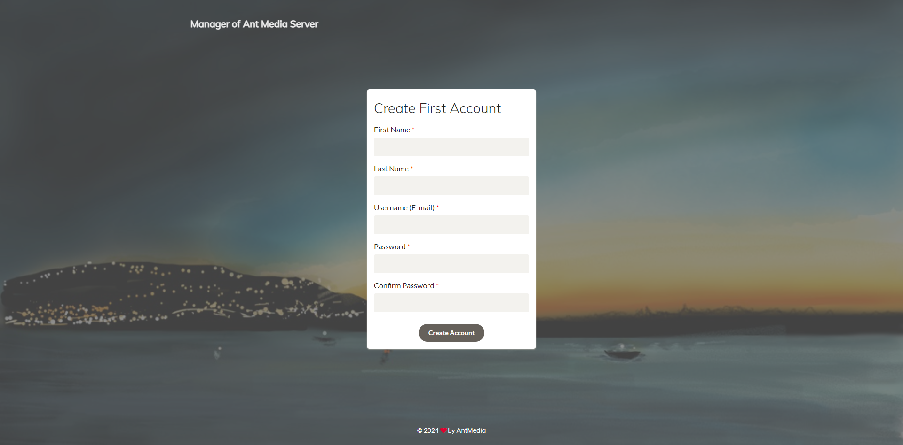
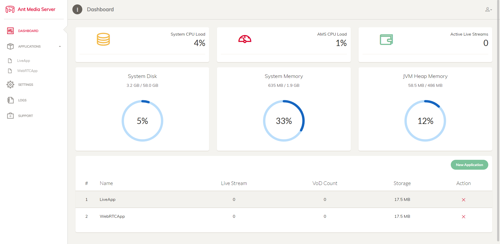

## How To Make a 24/7 Livestream!
In This Tutorial You Will Learn How To Make A 24/7 Livestream!

----------------------------------
## Required Resources

* **VPS Server**
  
  * A VPS Server (Hetzner's cheapest options will do the job!)

* **Basic Linux Knowledge**
  
  * It's easier to setup the stream if you have some linux knowledge!

* **Some time**
  
  * About 5 to 10 minutes of your time!
  
----------------------------------  
## Example terminology
* Username: `antmedia`
* Public IPv4 Address: `203.0.113.1`
----------------------------------
  
## Preparing The Server
* **Create a Separate User**
  ```.
  adduser antmedia
  ```
  
 * **Give The New User Account Super User Permissions**
  ```.
  sudo usermod -aG sudo antmedia
  ```
   
* **Switch To The New User Account**
  ```.
  su antmedia
  ```
* **Update Your System Packages**
  
  ```.
  sudo apt update
  ```
Now Let's Start With The Ant Media Server Installation!

----------------------------------

## Installing Ant Media Server

**First Way - Automatically Download And Install Ant Media Server**

* **Download The Ant Media Server Install Script And Give Required File Permissions**
 ```.
 wget -O install_ant-media-server.sh https://raw.githubusercontent.com/ant-media/Scripts/master/install_ant-media-server.sh && sudo chmod 755 install_ant-media-server.sh
 ```

* **Run The Install Script (First Command For Community Edition Second Command For Enterprise Edition**
 * ```.
  sudo ./install_ant-media-server.sh
  ```
  
 * ```.
  sudo ./install_ant-media-server.sh -l 'your-license-key'
  ```

**Second Way - Manually Download Ant Media Server Installation File** 
 * First Go To [Ant Media Server's Github Repository](https://github.com/ant-media/Ant-Media-Server).
 Go To Releases. Select The Newest Version. And Scroll Down To Assets. Then Right Click On a .zip File Like this`ant-media-server-community-2.9.0.zip` .zip Name Might Be Different.

 * Then Run This Command
 ```.
 wget -O install_ant-media-server.sh https://raw.githubusercontent.com/ant-media/Scripts/master/install_ant-media-server.sh && sudo chmod 755 install_ant-media-server.sh
 ```
 
 * Now Specify The Ant Media Server .zip Name Like This Before Running The Script!
 ```.
 sudo ./install_ant-media-server.sh -i ant-media-server-community-2.9.0.zip
 ```
----------------------------------

## Configuring The Server

If You Did Everything Correctly You Should Be Able To Access The Ant Media Server Interface By Typing In Your Public IP With Port 5080 Like This `http://203.0.113.1:5080` And Then You Should See The Ant Media Server First Time Setup Screen!


Enter You Account Info And Click The Sign Up Button! Once That's Done Login With Your Newly Created Account!

Once You Login You Should See Something Like This:


Click On Applications Then LiveApp And VoD and Click On The Upload VOD Button To Upload Files!

Once You Have Uploaded A File You Should See VoD Id: 1234567890 Under Your File Name Copy It.

Then Copy This URL: `http://<203.0.113.1>:5080/LiveApp/streams/<yourvodid>.mp4` Replace The Fields That Have <>!

Then Go Back to The Live Streams Tab Click On New Live Stream And Select Playlist. Fill Out The Playlist Name Field And Click On Create!

Now Click On The Pencil Logo And Click On Add Playlist Item. Paste Your URL That You Created There And Hit Save! Now We Need To Add Our Stream URL and Stream Key! Click On The Hamburger Menu and Choose Edit RTMP Endpoints.
You Should Now See A Window With a Field That Says RTMP Endpoint Name Paste Your Streaming Platform RTMP URL There and Add The Stream Key To The End Of The URL Like This rtmp://a.rtmp.youtube.com/live2/yourstreamkey and Then Click Close.

Now It's Time To Start The Stream!

## Starting The Stream

Click On The Hamburger Menu And Select Start Broadcast and Your Stream Should Start In A Couple Of Seconds!

## Finish!

Good Job! You Have Finished Setting Up Your 24/7 Livestream Now Go Watch it On The Platform You Streamed It To!

----------------------------------
