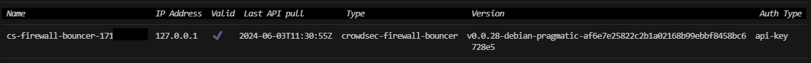
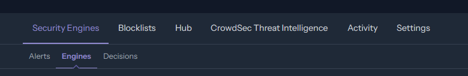
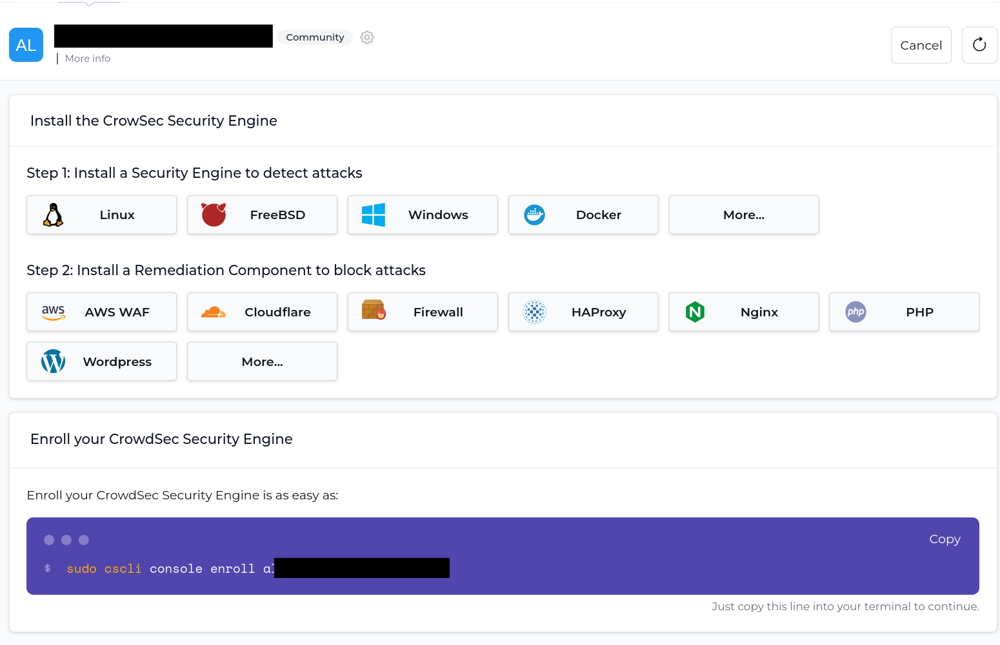
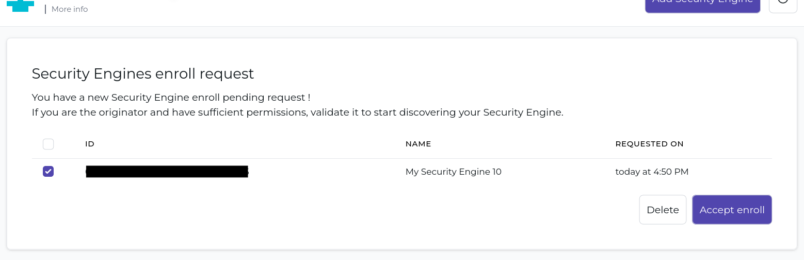
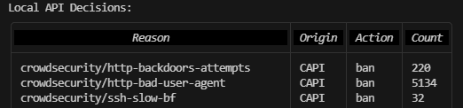

## Introduction

CrowdSec is an easy-to-setup but immensely powerful tool to protect your server and the services, such as SSH, running on it from a variety of outside attacks. In its function you can probably best compare it to Fail2ban, and while CrowdSec shares similarities with it both in features and how it works, CrowdSec offers a host of new powerful features.

The biggest advantage CrowdSec offers is its automatic aggregation of attacks across all users (You can optionally opt out). This allows your server to preemptively block an IP that has recently attacked multiple other servers connected to the CrowdSec central API. This is nicely summarized by the statement on their website:

> The CrowdSec Security Engine is a powerful, open-source software for detecting and blocking malicious IPs, safeguarding both infrastructure and application security. » [CrowdSec's Website](https://www.crowdsec.net/security-engine)

Don't worry about what a "Security Engine" is just yet, as all this will be explained below.

In the following I will guide you through how CrowdSec works, how to install it and how to set it up to protect your SSH service.

**Prerequisites**

* A server running Ubuntu 22.04 / 24.04
  > Other versions or even distros will most likely work too (with some adjustments), but commands shown below were only tested on Ubuntu 22.04 / 24.04.
* Services you would like to protect. This tutorial will use SSH as an example.
* Basic knowledge of the command line, and ideally though **not specifically required** knowledge about terms like: IP, Port, Firewall

## Step 1 - Understanding CrowdSec

As mentioned previously, if you are familiar with how Fail2ban work's, CrowdSec uses basically the same approach. It scans (at least most of the time) log files for certain patterns. If certain thresholds are met, it takes action such as blocking the offending IP address. An example for this is your SSH service, which will be used as an example throughout this tutorial. CrowdSec looks at the logs, sees failed login attempts and — as a reaction to multiple failed attempts — blocks the IP to protect your server from a brute force attack.

In Fail2ban all this is handled by one tool, meanwhile CrowdSec splits the process into two main parts:

* **The Security Engine**
  
  The Security Engine is responsible for actually monitoring logs and detecting suspicious behavior. This process in itself is split even further into "Scenarios", "Parsers" and more which will be explained further on in the tutorial. Whenever suspicious behavior is detected, the Security Engine makes a so-called decision. Furthermore, it tells the Central CrowdSec API about this decision, while also getting reports of other harmful IPs back. Together these lists of IPs, created from local decisions and those received from the central API can then be accessed by Remediation components (explained below), via the so-called "Local API".

  Important to note is that the Security Engine alone **will not** protect your server by taking action.

* **Remediation components**
  
  The Remediation components are basically installable components for CrowdSec, but compared to the Security Engine, these are responsible for taking actions. Simply said, they react to the decisions of the Security Engine by blocking an IP in your firewall, for example. Which is exactly what we will be doing later on in this tutorial.

You can always find more information in the [CrowdSec Documentation](https://doc.crowdsec.net/docs/intro)

## Step 2 - Installing CrowdSec

First we need to install CrowdSec and with it the Security Engine.

> Commands will be shown with "sudo" at the front if root permissions are needed. If you are using the root account, this is not required of course.

The official documentation of CrowdSec recommends using their own installation script which we will be doing with the following command:

```bash
curl -s https://install.crowdsec.net | sudo sh
```

Overall this script adds the repositories to your system that are needed to install CrowdSec. After they were added, you can install CrowdSec with the following command:

```bash
sudo apt update && sudo apt install crowdsec
```

And that's basically all you need to do to get the Security Engine running with a basic setup. During installation, CrowdSec automatically detects certain services such as SSH and already installs the needed scenarios and parsers, more on them later. You can check if everything works with the following command, ignore the output for now:

```bash
sudo cscli collections list
```

You should get something similar to this, although probably with a shorter list (depending on the services installed on your system), and hopefully without warning signs (in this example caused by manual modifications):


After installation, there will be two new commands available, `crowdsec` & `cscli` as used above. `crowdsec` doesn't get used much. Way more important is the `cscli` command, which stands for "CrowdSec CLI". With it, you can manage your Security Engine, install collections and take a look at metrics. I will highlight some commands later, but you can always find all the available ones in the [official documentation](https://doc.crowdsec.net/docs/cscli/).


### Step 2.1 - Installing your first Remediation component

Now that you got a running Security Engine, it's time for your first remediation component. The awesome thing about CrowdSec is that you can choose these components yourself. As such, there are very specific ones which, for example, can trigger a Captcha to be shown on a NGINX web server.

Most often, however, you probably just want to outright block a certain IP. For this, you need to block them in your firewall. Luckily, CrowdSec also has a component for exactly this purpose called `crowdsec-firewall-bouncer-iptables`.

> Note that CrowdSec previously called remediation components "Bouncers", which explains the name above. You will still often see the term "Bouncer". Just know that it refers to a remediation component.

To install it, simply run:

```bash
sudo apt install crowdsec-firewall-bouncer-iptables
```

Congrats! You have just finished securing your server with CrowdSec. Although there are a few more steps to get the best out of CrowdSec, and we have yet to check if it's actually fully working.


### Step 2.2 - Checking if CrowdSec is configured for SSH

If you followed the steps above, you should have a working CrowdSec instance, including the Security Engine and a remediation component which can block IPs directly at your firewall. But all this is pointless if the Security Engine doesn't have any idea what to do yet. Normally though, CrowdSec should detect SSH running on your server and already set it up for you. But we shouldn't blindly trust this has happened. After all, we are talking about your server's security here, so let's check if everything is set up.

> If any of the commands do not show the desired output, don't worry, the next step will show you how to fix this by configuring SSH monitoring.

---

First, run the following command to check if the installation of the Remediation Component (Bouncer) was successful:

```bash
sudo cscli bouncers list
```

You should see something like this:



We can see that the firewall bouncer is installed, running on your localhost IP address (127.0.0.1), and is marked as valid.

---

Now, let's check if you have the correct collections installed for CrowdSec to monitor your SSH service.

> If you are wondering what a collection is, this will be explained in one of the next steps. For now, let's check if you have the correct ones installed.

Run the following command to check your installed collections:

```bash
sudo cscli collections list
```

If you remember, we already ran this command at the start of "Step 2" where you can see an example output. To check if CrowdSec is monitoring, you should check if the `crowdsecurity/sshd` collection is shown in your list. Maybe you also see some other collections like `crowdsecurity/linux` which means CrowdSec is also already automatically monitoring other services on your server.

---

Lastly, we should check if CrowdSec knows where to find the log files it should monitor. To do this, you could look at the metrics which will be explained in a later step, but this could be unreliable if nothing has happened yet, in which case CrowdSec would not list it.

To take a look directly at the configuration for the so-called acquisition configuration, run the following command:

```bash
sudo nano /etc/crowdsec/acquis.yaml 
```

The file should contain a few lines. To check if everything is set up for SSH monitoring, only the following lines are important:

```yaml
#Generated acquisition file - wizard.sh (service: ssh) / files : /var/log/auth.log
filenames:
  - /var/log/auth.log
labels:
  type: syslog
---
```

---

If all the commands above showed the correct output, congratulations, you have confirmed CrowdSec is monitoring your SSH service! While everything should already be running, I recommend still going through the next steps. They will help you understand how to extend your CrowdSec installation, read its metrics as well as understand certain parts of its terminology.


### Step 2.3 - Linking to CrowdSec Console (Optional but strongly recommended)

Another great feature CrowdSec offers is the so called "CrowdSec Console", but you need a CrowdSec account to access it. This account is completely free. They do offer paid plans but those are aimed at Business customers and are definitely not needed for Hobbyists, Developers or even small companies.

1. To create your account, head over to https://app.crowdsec.net/signup
2. Enroll your Security Engine

   To do this, go to `Security Engines` » `Engines` as shown below if you are not already there:
   
   

   Next, you should see something like this:
   
   

   At the top, you can access the instructions again on how to install the Security Engine as well as various different Remediation Components. Most importantly though at the bottom you will find a command to enroll your Security Engine. Copy this command and run it on your server.

   Afterwards, you need to check the website again and should see something as shown below:

   

   Click "Accept enroll" and your Security Engine is now linked to your CrowdSec account, allowing you to access a whole load of new features, some of which I will highlight in the following sections.


## Step 3 - Installing and configuring the SSH collection (or any other)

### Step 3.1 - Installing the collection

> If you followed "Step 2.2" before and your output matched the described one, then you already have the SSH collection installed and fully setup. This makes this step obsolete for you, yet **I highly recommend reading through this**. Not only will this guide you if the above check did not show you the desired results, this will also teach you about how the installation process of a new collection works. You should be able to easily transfer this to any other collection you would like to install later. Further, this section contains important terminology, which you should definitely know about if you are using CrowdSec.

If "Step 2.2" revealed that CrowdSec is in fact not monitoring your SSH service, this step will help you fix this. Further, you will be able to apply this to other services and learn about important terminology as well as the inner workings of CrowdSec.

---

First, let's grab the needed collection, if you're missing it, with the following command:

```bash
sudo cscli collections install crowdsecurity/sshd
```

This will install the `crowdsecurity/sshd` collection on your system, but what even is a collection?

Simply said, collections are pre-selected groups of Parsers and Scenarios for certain programs/services/tools. To understand this, you need to know what parsers and scenarios are of course:

* Parsers
  
  Parsers are responsible for filtering through your log files, similar to the matching patterns in Fail2ban. But CrowdSec parsers can be even more advanced than this.
  
  For example, when monitoring your SSH service, not every log line will be important, which is why you need parsers. These will first filter out only those lines that show a failed login attempt. Sometimes these filtered lines are then passed to the next parser, such as a geolocation parser, which will use the IP address to determine the geographic origin of the failed login attempts.
  
  All these filtered log lines, together with their added data, then get passed on to the Security Engine.

* Scenarios
  
  These come directly after the parsers. After all, only filtering out interesting log lines is doing much of a purpose.
  
  In their simplest form, scenarios can be described as certain thresholds that would indicate a certain situation. Again as an example, if you are monitoring your SSH service, these previously filtered failed login attempts would be part of a scenario. It could be defined as simply as "If there are 10 failed logins in 60 seconds, it's a brute force attempt".
  
  The Security Engine takes the log lines from the parsers and sorts them into their according scenarios and checks if any of their conditions are met, triggering an alert which leads to a decision (such as blocking the IP).
  
  Similar to parsers, these scenarios can be a lot more complex and have different types such as "leaky bucket". But for more information on this, you should check the official documentation.

You can use these Collections to protect further services on your server, for example a web server like Caddy. A collection would contain the needed parsers to read the log files, as well as scenarios which would suggest malicious behavior. 

You can find these collections in the CrowdSec web-console under the hub section. While most come from CrowdSec themselves, they can also be community made, so check the contents before installing them. 


### 3.2 - Configuring the Acquisition

Now you might think, you have a collection with the correct parsers and scenarios and a remediation component, so you should be all set right? Well not quite, while CrowdSec is generally easily manageable via simple commands, there is one thing you still have to manually configure in the configs.

The Acquisition — fancy word, simple meaning. You got everything for CrowdSec to understand, interpret and act on your logs, but crucially for all of this to work, CrowdSec needs to know where to look for these log files we are constantly mentioning. This can be done in two places, the `acquis.yaml` file or in a separate file in the `acquis.d` directory.

Using the directory is the recommended way as it keeps all the configurations separate from each other, making it less confusing, and you can't break anything already working when making changes. So let's create a file for the SSHD collection. First, run the following command:

```bash
sudo nano /etc/crowdsec/acquis.d/sshd.yaml
```

This should open an editor and will automatically create the file on saving. But first we need to enter our configuration. Copy and paste the following into the file:

```yaml
filenames:
  - /var/log/auth.log
labels:
  type: syslog
---
```

With this, we are simply telling CrowdSec which file to look at and what category it belongs to. For SSH we find the logs in `/var/log/auth.log`, and the type is simply set to `syslog`. For most other collections this will be the name of the software (e.g. for a Caddy web server the log type would be "caddy"). You can usually find the instructions for how the acquisition needs to be defined on the page of the corresponding collection/parser in the CrowdSec Hub.

Save the file with `ctrl + x` and `y`. Now all that's left is to restart CrowdSec with the following command:

```bash
sudo systemctl restart crowdsec
```

If everything worked, your CrowdSec instance is now successfully monitoring your SSH service, all this should be relatively easy to adapt to any other new servers you want to monitor. To confirm everything works, you can go through "Step 2.2" again or just proceed to the next step, where you should also be able to tell if it worked.

## Step 4 - Looking at Metrics 

As mentioned previously, you mainly interact with your CrowdSec instance via the `cscli` command line tool. We already used a few of its commands in the previous steps, and while there are too many to explain them all here, there is one I would like to highlight. 

> If you would like to see all available commands, simply run `cscli -h` which will show you a list of all available commands. Most of them are self-explanatory  like the ones we used before `sudo cscli collections list`, similarly there is `sudo cscli scenarios list`. You can also find all the commands in the [official docs](https://doc.crowdsec.net/docs/cscli/).

The `metrics` command is probably one of the most interesting and fun commands, but also one of the hardest to understand, so here is some information to get you started. Run the following command and let's look at the output together:

```bash
sudo cscli metrics
```

With this command, you can take a peek at all the statistics of your Security Engine (and Remediation Components). For a full summary of what everything means, I can only recommend reading the docs, you can find the specific ones [here](https://doc.crowdsec.net/docs/observability/cscli).

But here is a short summary:

* **Acquisition Metrics:**
   
   These show you how many lines of logs CrowdSec has monitored, how many of those were actually relevant to look at, and how many of them were counting towards a certain scenario. Something you should be able to see is `file:/var/log/auth.log`. That's the file where SSH login attempts are being logged as we have configured above. Maybe you can even see that CrowdSec has already read or parsed some lines. If so, great! Your Security Engine is definitely monitoring for malicious SSH login attempts, don't worry if it's all 0, check back later, maybe there was actually nothing logged yet.

* **Local API Alerts:**
   
   If you can see anything here, then your CrowdSec setup has already reacted to a certain scenario being triggered and has caused the "alarm". An example would be `crowdsecurity/ssh-bf`, the number next to it would indicate how many people it has blocked from your server for attempting to brute force your SSH login.

* **Local API Decisions:**
   
   This is similar to the above, but while an Alert is only saying a certain scenario was detected, a decision is the Security Engine reaction to a scenario, basically when it decides "`<xxx.x.xxx.x>` needs to be blocked".
   
   But most importantly, this shows all the decisions, including those received from the central CrowdSec Central API, as shown in the example below. Here `CAPI` stands for Central API, this is where you will be able to see the true power of using CrowdSec compared to for example Fail2ban. Thousands of IPs will be already banned based on crowd information, protecting your server from ever being reached by them.
   
   

* **Local API Metrics:**
  
  More advanced topic, but here you can basically see which parts of your local API (aka your Security Engine), got requested and how often.

* **Local API Bouncers Metrics:**
  
  Similar to the above but for your individual remediation components.

* **Parser Metrics:**
  
  Overall, here you will see how many lines were read, and how many actually matched a certain pattern your CrowdSec instance/parsers are looking out for. You could possibly see that while failed logins were detected, some of them never triggered a scenario because they didn't reach any defined threshold.

* **Scenario Metrics:**
  
  Basically, these metrics will show you how many log lines, which were previously detected by parsers, were important for each of your installed scenarios. Further, how many of them simply expired because they never reached the threshold and how many actually caused an "Overflow", triggering the scenario and with it an Alert, leading to a decision.

* **Whitelist Metrics:**
  
  How many log lines were ignored because they matched your whitelists. The default whitelist, for example, includes all your local IPs. After all, it doesn't make sense for your server to be banning its own private IP addresses, right?

---

While we previously already checked if CrowdSec is monitoring and protecting your SSH service, here is how you could check it by looking at the metrics:

* Acquisition Metrics: `file:/var/log/auth.log` showing and possibly already counting. (Logs are being fetched)

  If this is showing, you should be good. But there are more metrics to look at that might just not be showing yet because they have simply not been triggered yet on your fresh installation.

* Local API Alerts: `crowdsecurity/ssh-bf` would show alerts for suspected SSH brute force attempts.
* Local API Decisions: Here you will either already see decisions by your local Security Engine for `crowdsecurity/ssh-bf` or, if marked with `CAPI`, decisions received from the CrowdSec network. Even these take some time to first get fetched on a fresh install. Check back later if they are missing. 
* Local API Bouncers Metrics: You should see your firewall remediation component (bouncer) here, actively checking for fresh IPs that need to be blocked.
* Parser Metrics: Similar to `Local API Alerts`.
* Scenario Metrics: Here you can see the certain scenarios counting for possible thresholds being exceeded. For SSH there are a few, for example: `crowdsecurity/ssh-bf` & `crowdsecurity/ssh-slow-bf`.

## Step 5 - Overview of possible next steps

Glad you have made it this far. If you followed the steps above, you should now have a working and running CrowdSec instance protecting your server from possible SSH login attempts, but this is only the start.

CrowdSec is a very modular tool, so here are some hints to get you started on your journey:

*  **More Collections**
   
   Using the steps shown above for how to install and configure the SSHD collection, you can also add any other collection you find in the CrowdSec Hub
   
   > **Very Important:** A collection alone won't protect your server/service. While it contains the needed Parsers and Scenarios, there are two important things. You need to have a remediation Component, which you should have if you followed this tutorial. But furthermore, you need to tell CrowdSec where to fetch the needed logs, which was described in the configuration of acquisition in "Step 3".

<br>

* **More Remediation Components**
  
  In the CrowdSec web-console under the Hub section you can also find more Remediation Components. While blocking an IP outright at your firewall is very secure and effective, this is not always desirable. If using a collection to protect a web server, for example, a customer could accidentally trigger a scenario. Now, banning this person's IP from your web services would be a complete over reaction.
  
  For this exact reason, CrowdSec offers a variety of Remediation Components which can integrate directly into software like NGINX or Caddy. Here they can, for example, only block the IP from using this specific service or actually trigge behavior such as showing a captcha to verify it's actually a customer and not a bot you are dealing with.
  
  Again, treat with caution as mentioned above. These can be community made, so be sure to read the specific documentation.

<br>

* **Blocklists**
  
  Blocklists are another feature of CrowdSec, found on the web-console under "Blocklists". Here you can subscribe to certain blocklists and add them to your individual servers. The CrowdSec service on your server will then also download these lists of IPs and, for example, block them in your firewall. The difference here is that these blocklists are not created from decisions of other CrowdSec users but are rather created by certain third-party's.
  
  So be sure you trust whoever manages the chosen Blocklist and that it doesn't accidentally block IPs that are not malicious or important for your services.

<br>

* **Statistics, Appsec and more**
  
  In the web-console, you will also find more like statistics on decision taken by your CrowdSec Security Engine and Appsec rules. But these are out of the scope of this tutorial. Feel free to explore them, and if necessary read the documentation belonging to them. CrowdSec also has native support for Prometheus.

## Conclusion

If you followed this tutorial, you should have a working CrowdSec setup on your Server. This includes the Security Engine monitoring your server for SSH login attempts, and a remediation component blocking offending IPs directly in your firewall from interacting with your server.

Further, you should be able to understand the basic terminology of CrowdSec and its many parts, as well as know about the many more possibilities CrowdSec offers.

##### License: MIT

<!--

Contributor's Certificate of Origin

By making a contribution to this project, I certify that:

(a) The contribution was created in whole or in part by me and I have
    the right to submit it under the license indicated in the file; or

(b) The contribution is based upon previous work that, to the best of my
    knowledge, is covered under an appropriate license and I have the
    right under that license to submit that work with modifications,
    whether created in whole or in part by me, under the same license
    (unless I am permitted to submit under a different license), as
    indicated in the file; or

(c) The contribution was provided directly to me by some other person
    who certified (a), (b) or (c) and I have not modified it.

(d) I understand and agree that this project and the contribution are
    public and that a record of the contribution (including all personal
    information I submit with it, including my sign-off) is maintained
    indefinitely and may be redistributed consistent with this project
    or the license(s) involved.

Signed-off-by: Louis S. hetzner-tutorial@taydex.com

-->
