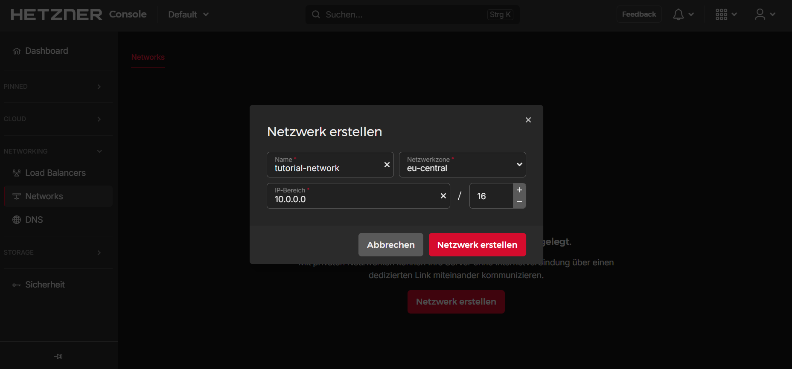
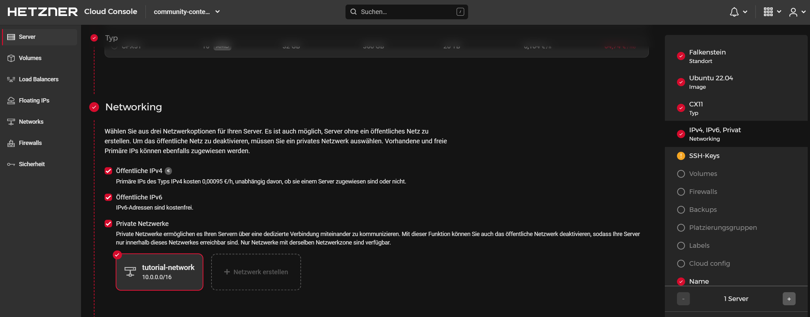
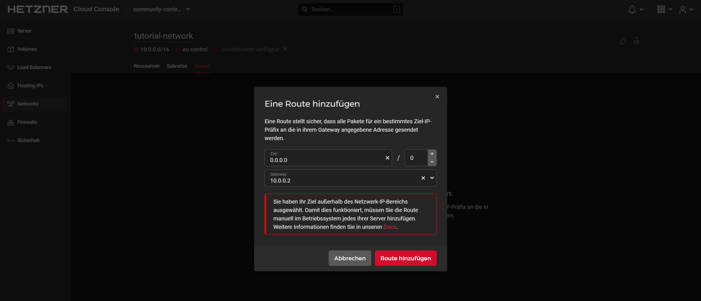

## Einleitung

Dieses Tutorial zeigt, wie man ein generisches NAT-Gateway für Cloud Server über private Cloud Networks einrichtet. Es wird erklärt, wie man ein Netzwerk und Cloud Server erstellt, wie man das Routing einrichtet und wie man eine dauerhafte Konfiguration erreicht.

Am Ende dieses Tutorials, können Sie von Ihrem Server **ohne** öffentlicher IP-Adresse (Client-Server) auf das öffentliche Netzwerk zugreifen. Der Traffic wird dafür über den Server **mit** öffentlicher IP-Adresse (NAT-Server) geroutet. Beide Server müssen demselben privaten Cloud Network hinzugefügt werden.

> Wenn Sie speziell an der Verwendung von pfSense interessiert sind, können Sie [dieses Tutorial](https://community.hetzner.com/tutorials/how-to-route-cloudserver-over-private-network-using-pfsense-and-hcnetworks#configure-route-for-private-networking) verwenden.

**Voraussetzungen**

* [Hetzner Cloud Account](https://console.hetzner.cloud/)

* Dieses Tutorial ist geschrieben für:
  * Ubuntu 18.04, 20.04, 22.04 und 24.04
  * Debian 10, 11 und 12
    > Installiere unter Debian 12 `systemd-resolved`, bevor du dem Tutorial folgst.
  * CentOS 7
  * CentOS Stream 8 und 9
  * Fedora 36 und 37
  * Rocky Linux 8 und 9

**Beispiel-Benennungen**

* Netzwerk: `10.0.0.0/16`
* Gateway: `10.0.0.1`
* NAT-Server: `10.0.0.2`

In allen Beispiel-Befehlen muss `10.0.0.0/16` mit dem eigenen Network, `10.0.0.1` mit der eigenen Network-Gateway-IP und `10.0.0.2` mit der IP-Adresse des eigenen NAT-Servers ersetzt werden.

## Schritt 1 - Einrichtung des Netzwerks und der Server

Öffnen Sie die Hetzner [Cloud Console](https://console.hetzner.cloud/) und wählen Sie Ihr Projekt aus.

Sie können Ihr Network entweder zuerst erstellen oder alternativ im Erstellungsprozess Ihres Server.

- **Netzwerk erstellen**
  
  Wählen Sie in Ihrem Projekt aus:
  
  `Networks` > `Netzwerk erstellen`
  
  

<br>

- **Server erstellen**
  
  Wählen Sie in Ihrem Projekt aus:
  
  `Server` > `Server hinzufügen`
  
  Es werden mindestens zwei Server benötigt.
  Der NAT-Server muss eine IPv4-Adresse besitzen, der andere Server nicht.
  
  Unter `Networking` müssen Sie das Netzwerk auswählen, das Sie eben erstellt haben.
  
  > Wenn Sie die Routen nicht manuell hinzufügen möchten, wie in den folgenden Schritten erklärt, kann stattdessen auch cloud-init verwendet werden (siehe "[Schritt 6 - Cloud-init](#schritt-6---cloud-init)").

  

## Schritt 2 - Dem Netzwerk eine Route hinzufügen

Damit unsere Einrichtung richtig funktioniert, müssen wir die folgende Route zum Netzwerk hinzufügen:

> **Ziel:** 0.0.0.0/0<br>
> **Gateway:** 10.0.0.2

Das Gateway sollte die IP des NAT-Servers sein, auf dem wir Masquerading konfigurieren.



## Schritt 3 - Konfiguration von NAT

**Um den NAT-Server zu konfigurieren,** werden wir die folgenden Befehle verwenden:

- IP-Weiterleitung ist standardmäßig deaktiviert und muss daher aktiviert werden.
  
  ```bash
  echo 1 > /proc/sys/net/ipv4/ip_forward
  ```

- Als nächsten Schritt noch diesen Befehl:
  
  ```bash
  iptables -t nat -A POSTROUTING -s '10.0.0.0/16' -o eth0 -j MASQUERADE
  ```
  
  Schauen wir uns den Befehl im Detail an:
  
  * `iptables` ➜ das Programm, das wir verwenden
  * `-t nat` ➜ die Tabelle 'nat' auswählen
  * `-A POSTROUTING` ➜ eine Regel zum Postrouting hinzufügen
  * `-s '10.0.0.0/16'` ➜ Zielpakete von der Quelle '10.0.0.0/16'
  * `-o eth0` ➜ Ausgabe an 'eth0'
  * `-j MASQUERADE` ➜ die Pakete mit der IP-Adresse des "Routers" maskieren

<br>

**Um den Client-Server zu konfigurieren,** müssen wir nur eine Standardroute hinzufügen.

- Zum Beispiel so:
  
  ```bash
  ip route add default via 10.0.0.1
  ```
  
  <blockquote>
  <details>
  <summary>Falls <kbd>RTNETLINK answers: File exists</kbd> erscheint, hier klicken</summary>
  
  Wenn eine Fehlermeldung wie `RTNETLINK answers: File exists` angezeigt wird, führen Sie folgenden Befehl aus, um zu prüfen ob bereits eine andere Default-Route existiert:
  
  ```bash
  ip route
  ```
  
  Beispiel-Output:
  
  ```shellsession
  default via 172.31.1.1 dev eth0
  10.0.0.0/16 via 10.0.0.1 dev enp7s0
  10.0.0.1 dev enp7s0 scope link
  172.31.1.1 dev eth0 scope link
  ```
  
  Die existierende Route kann mit diesem Befehl entfernt werden:
  
  ```bash
  ip route del default
  ```
  
  Nachdem sie entfernt wurde, kann die neue Route hinzugefügt werden:
  
  ```bash
  ip route add default via 10.0.0.1
  ```
  
  </details>
  </blockquote>

## Schritt 4 - Dauerhafte Konfiguration einrichten

Für die Konfiguration von Debian und Ubuntu wird in diesem Tutorial `vim` verwendet, was hiermit installiert werden kann: `apt install vim`

-------

**Die nächsten Schritte hängen vom Betriebssystem des Servers ab:**

<details>

<summary>Debian 10 / 11 / 12, and Ubuntu 18.04</summary>

- **Aktualisieren**
  
  Zunächst muss das System aktualisiert werden:
  
  ```bash
  apt update && apt upgrade -y
  ```
  
  Ubuntu 22.04 erfordert zusätzlich:
  
  ```bash
  apt install ifupdown
  ```

<br>

- **Auf dem NAT-Server**
  
  Um alles beständig zu machen, öffnen wir die folgende Datei:
  
  ```bash
  vim /etc/network/interfaces
  ```
  
  Um den Bearbeitungsmodus in `vim` aufzurufen, drücken Sie `i` und fügen Sie Folgendes an die Datei an:
  
  ```
  auto eth0
  iface eth0 inet dhcp
      post-up echo 1 > /proc/sys/net/ipv4/ip_forward
      post-up iptables -t nat -A POSTROUTING -s '10.0.0.0/16' -o eth0 -j MASQUERADE
  ```
  
  Um die Datei zu speichern, drücken Sie erst `esc`, um den Einfügemodus zu verlassen, geben Sie dann `:x` oder `:wq` ein und drücken Sie ENTER.

<br>

- **Auf dem Client-Server**
  
  Da die Route auch persistent sein soll, bearbeiten wir die folgende Datei:
  
  ```bash
  vim /etc/network/interfaces
  ```
  
  Fügen Sie nun hinzu:
  
  > Führen Sie `ifconfig` aus, um den Namen vom Interface zu prüfen und ersetzen Sie falls nötig `enp7s0` mit `ens10`. 
  
  ```
  auto enp7s0
  iface enp7s0 inet dhcp
      post-up ip route add default via 10.0.0.1
  ```

------

</details>

<details>

<summary>Ubuntu 22.04 / 24.04</summary>

- **Aktualisieren**
  
  Zunächst muss das System aktualisiert werden:
  
  ```bash
  apt update && apt upgrade -y
  ```

<br>

- **Auf dem NAT-Server**
  
  Um alles beständig zu machen, öffnen wir die Datei in `/etc/netplan`:
  
  ```bash
  vim /etc/netplan/50-cloud-init.yaml
  ```
  
  Prüfen Sie folgende Informationen. Wenn alles passt, drücken Sie `esc` gefolgt von `:q` und ENTER, um die Datei wieder zu schließen. Um den Bearbeitungsmodus in `vim` aufzurufen, drücken Sie `i`.
  
  ```yaml
  network:
      version: 2
      ethernets:
          eth0:
              dhcp4: true
  ```
  
  Um die Datei zu speichern, drücken Sie erst `esc`, um den Einfügemodus zu verlassen, geben Sie dann `:x` oder `:wq` ein und drücken Sie ENTER.

  Nun erstellen wir eine Datei in `/etc/networkd-dispatcher/routable.d`:
  
  ```bash
  vim /etc/networkd-dispatcher/routable.d/10-eth0-post-up
  ```
  
  Um den Bearbeitungsmodus in `vim` aufzurufen, drücken Sie `i` und fügen Sie Folgendes in der Datei ein:
  
  ```shell
  #!/bin/bash
  
  echo 1 > /proc/sys/net/ipv4/ip_forward
  iptables -t nat -A POSTROUTING -s '10.0.0.0/16' -o eth0 -j MASQUERADE
  ```
  
  Um die Datei zu speichern, drücken Sie erst `esc`, um den Einfügemodus zu verlassen, geben Sie dann `:x` oder `:wq` ein und drücken Sie ENTER.
  
  Geben Sie der Datei nun Ausführungsrechte:
  ```bash
  chmod +x /etc/networkd-dispatcher/routable.d/10-eth0-post-up
  ```

<br>

- **Auf dem Client-Server**
  
  Da die Route auch persistent sein soll, bearbeiten wir die folgende Datei:
  
  > Führen Sie `ifconfig` aus, um den Namen vom Interface zu prüfen und ersetzen Sie falls nötig `enp7s0` mit `ens10`. 
  
  ```bash
  vim /etc/systemd/network/10-enp7s0.network
  ```
  
  Fügen Sie nun hinzu:
  
  ```network
  [Match]
  Name=enp7s0
  
  [Network]
  DHCP=yes
  Gateway=10.0.0.1
  ```

------

</details>

<details>

<summary>Ubuntu 20.04</summary>

- **Aktualisieren**
  
  Zunächst muss das System aktualisiert werden:
  
  ```bash
  apt update && apt upgrade -y
  ```
  
  Ubuntu 20.04 verwendet standardmäßig `netplan` anstelle von `/etc/interfaces`. Um eine dauerhafte Konfiguration zu erreichen, wird der [networkd-dispatcher](https://gitlab.com/craftyguy/networkd-dispatcher) verwendet.
  
  Wie im [netplan FAQ](https://netplan.io/faq) zu lesen ist, besteht das `networkd-dispatcher`-Äquivalent zu `post-up` darin, ein Skript in `/etc/networkd-dispatcher/routable.d/` abzulegen. In diesem Tutorium nennen wir das Skript `50-masq`, aber der Name ist nicht wichtig.

<br>

- **Auf dem NAT-Server**
  
  Erstellen Sie die Datei:
  
  ```bash
  vim /etc/networkd-dispatcher/routable.d/50-masq
  ```
  
  Um den Bearbeitungsmodus in `vim` aufzurufen, drücken Sie `i` und fügen Sie Folgendes an die Datei an:
  
  ```shell
  #!/bin/sh
  
  /bin/echo 1 > /proc/sys/net/ipv4/ip_forward
  /sbin/iptables -t nat -A POSTROUTING -s '10.0.0.0/16' -o eth0 -j MASQUERADE
  ```
  
  Um die Datei zu speichern, drücken Sie erst `esc`, um den Einfügemodus zu verlassen, geben Sie dann `:x` oder `:wq` ein und drücken Sie ENTER.
  
  Der folgende Befehl ist erforderlich, um das Skript ausführbar zu machen, andernfalls wird es nicht funktionieren:
  
  ```bash
  chmod +x /etc/networkd-dispatcher/routable.d/50-masq
  ```

<br>

- **Auf dem Client-Server**
  
  Erstellen Sie die Datei:
  
  ```bash
  vim /etc/networkd-dispatcher/routable.d/50-masq
  ```
  
  Fügen Sie nun hinzu:
  
  ```shell
  #!/bin/sh
  
  /sbin/ip route add default via 10.0.0.1
  ```
  
  Zum Schluss machen Sie es ausführbar:
  
  ```bash
  chmod +x /etc/networkd-dispatcher/routable.d/50-masq
  ```

------

</details>

<details>

<summary>CentOS 7, CentOS Stream 8 / 9, Rocky Linux 8 / 9, Fedora 36 / 37</summary>

- **Aktualisieren**
  
  Zunächst muss das System aktualisiert werden:
  
  ```bash
  yum update -y && yum upgrade -y
  ```
  
  Wir verwenden die `dispatcher.d` des `NetworkManager`, um unsere Skripte automatisch beim Start auszuführen. Dies geschieht, indem wir das Skript in den Ordner `/etc/NetworkManager/dispatcher.d/` legen. Dabei bestimmt der Name die Ausführungsbedingung des Skripts. Weitere Informationen finden Sie [hier](https://man.archlinux.org/man/NetworkManager-dispatcher.8.en).
  
  In diesem Tutorial verwenden wir den Namen `ifup-local`, wobei `ifup` die Bedingung ist, unter der das Skript ausgeführt werden soll.

<br>

- **Auf dem NAT-Server**
  
  > Fedora 36 / 37 benötigen zusätzlich:
  > ```bash
  > yum install iptables -y
  > ```
  
  Erstellen Sie die Datei:
  
  ```bash
  vi /etc/NetworkManager/dispatcher.d/ifup-local
  ```
  
  Fügen Sie nun hinzu:
  
  ```shell
  #!/bin/sh
  
  /bin/echo 1 > /proc/sys/net/ipv4/ip_forward
  /sbin/iptables -t nat -A POSTROUTING -s '10.0.0.0/16' -o eth0 -j MASQUERADE
  ```
  
  Der folgende Befehl ist erforderlich, um das Skript ausführbar zu machen, andernfalls wird es nicht funktionieren:
  
  ```bash
  chmod +x /etc/NetworkManager/dispatcher.d/ifup-local
  ```

<br>

- **Auf dem Client-Server**
  
  > CentOS Stream 8 / 9, Rocky Linux 8 / 9 und Fedora 36 / 37 benötigen zusätzlich:
  > ```bash
  > yum remove hc-utils -y
  > ```
  > Dies gilt auch für andere Methoden zum Hinzufügen einer Route zum Betriebssystem.
  
  Erstellen Sie die Datei:
  
  ```bash
  vi /etc/NetworkManager/dispatcher.d/ifup-local
  ```
  
  Fügen Sie nun hinzu:
  
  ```shell
  #!/bin/sh
  
  /sbin/ip route add default via 10.0.0.1
  ```
  
  Zum Schluss machen Sie es ausführbar:
  
  ```bash
  chmod +x /etc/NetworkManager/dispatcher.d/ifup-local
  ```

------

</details>

## Schritt 5 - Hinzufügen der Nameserver

In der Datei `/etc/systemd/resolved.conf` können Sie auf dem Client-Server die Nameserver hinzufügen. In dem Abschnitt von `[Resolve]` sollte in einer Zeile `#DNS=` stehen. Hier müssen das `#`-Symbol entfernt und die DNS-Server hinzugefügt werden. Sie können auch die DNS-Server von Hetzner nutzen:

```conf
[Resolve]
DNS=185.12.64.2 185.12.64.1
```

Speichern Sie die Datei und starten Sie den Server neu.

## Schritt 6 - Cloud-init

Wenn Sie die Routen nicht manuell hinzufügen möchten, können Sie beim Erstellen der Server in der [Cloud Console](https://console.hetzner.cloud/) cloud-init verwenden. Die untenstehenden Skripte müssen auf der Erstellseite in die Textbox unter "Cloud config" hinzugefügt werden.

<details>

<summary>Debian 10 / 11 / 12, und Ubuntu 18.04</summary>

* **NAT-Server**
  > Ersetzen Sie `10.0.0.0/16` falls nötig.

  ```bash
  #cloud-config
  write_files:
    - path: /etc/network/interfaces
      content: |
        auto eth0
        iface eth0 inet dhcp
            post-up echo 1 > /proc/sys/net/ipv4/ip_forward
            post-up iptables -t nat -A POSTROUTING -s '10.0.0.0/16' -o eth0 -j MASQUERADE
      append: true
  
  runcmd:
    - reboot
  ```

* **Client-Server**
  > Ersetzen Sie `10.0.0.1` falls nötig.

  Führen Sie `ifconfig` aus, um den Namen vom Interface zu prüfen und ersetzen Sie falls nötig `enp7s0` mit `ens10`. 
  
  ```bash
  #cloud-config
  write_files:
    - path: /etc/network/interfaces
      content: |
        auto enp7s0
        iface enp7s0 inet dhcp
            post-up echo "Waiting..."
            post-up ip route add default via 10.0.0.1
      append: true
  
    - path: /etc/systemd/resolved.conf
      content: |
        [Resolve]
        DNS=185.12.64.2 185.12.64.1
        FallbackDNS=8.8.8.8
      append: true
  
  runcmd:
    - reboot
  ```

------

</details>


<details>

<summary>Ubuntu 22.04 / 24.04</summary>

* **NAT-Server**
  > Ersetzen Sie `10.0.0.0/16` falls nötig.

  ```bash
  #cloud-config
  write_files:
    - path: /etc/networkd-dispatcher/routable.d/10-eth0-post-up
      content: |
        #!/bin/bash
        
        echo 1 > /proc/sys/net/ipv4/ip_forward
        iptables -t nat -A POSTROUTING -s '10.0.0.0/16' -o eth0 -j MASQUERADE
      permissions: '0755'
  
  runcmd:
    - reboot
  ```

* **Client-Server**
  > Ersetzen Sie `10.0.0.1` falls nötig.

  Führen Sie `ifconfig` aus, um den Namen vom Interface zu prüfen und ersetzen Sie falls nötig `enp7s0` mit `ens10`. 
  
  ```bash
  #cloud-config
  write_files:
    - path: /etc/systemd/network/10-enp7s0.network
      content: |
        [Match]
        Name=enp7s0
  
        [Network]
        DHCP=yes
        Gateway=10.0.0.1
      append: true
  
    - path: /etc/systemd/resolved.conf
      content: |
        [Resolve]
        DNS=185.12.64.2 185.12.64.1
        FallbackDNS=8.8.8.8
      append: true
  
  runcmd:
    - reboot
  ```

------

</details>

<details>

<summary>Ubuntu 20.04</summary>

* **NAT-Server**
  > Ersetzen Sie `10.0.0.0/16` falls nötig.
  
  ```bash
  #cloud-config
  write_files:
    - path: /etc/networkd-dispatcher/routable.d/50-masq
      content: |
        #!/bin/sh
        
        /bin/echo 1 > /proc/sys/net/ipv4/ip_forward
        /sbin/iptables -t nat -A POSTROUTING -s '10.0.0.0/16' -o eth0 -j MASQUERADE
      permissions: '0755'
  
  runcmd:
    - reboot
  ```

* **Client-Server**
  > Ersetzen Sie `10.0.0.1` falls nötig.

  ```bash
  #cloud-config
  write_files:
    - path: /etc/networkd-dispatcher/routable.d/50-masq
      content: |
        #!/bin/sh
        
        /sbin/ip route add default via 10.0.0.1
      permissions: '0755'
  
    - path: /etc/systemd/resolved.conf
      content: |
        [Resolve]
        DNS=185.12.64.2 185.12.64.1
        FallbackDNS=8.8.8.8
      append: true
  
  runcmd:
    - reboot
  ```

------

</details>

<details>

<summary>CentOS 7, CentOS Stream 8 / 9, Rocky Linux 8 / 9, Fedora 36 / 37</summary>

* **NAT-Server**
  > Ersetzen Sie `10.0.0.0/16` falls nötig.

  ```bash
  #cloud-config
  write_files:
    - path: /etc/NetworkManager/dispatcher.d/ifup-local
      content: |
        #!/bin/sh
        
        /bin/echo 1 > /proc/sys/net/ipv4/ip_forward
        /sbin/iptables -t nat -A POSTROUTING -s '10.0.0.0/16' -o eth0 -j MASQUERADE
      permissions: '0755'
  
  runcmd:
    - reboot
  ```

* **Client-Server**
  > Ersetzen Sie `10.0.0.1` falls nötig.

  ```bash
  #cloud-config
  write_files:
    - path: /etc/NetworkManager/dispatcher.d/ifup-local
      content: |
        #!/bin/sh
        
        /sbin/ip route add default via 10.0.0.1
      permissions: '0755'
  
    - path: /etc/systemd/resolved.conf
      content: |
        [Resolve]
        DNS=185.12.64.2 185.12.64.1
        FallbackDNS=8.8.8.8
      append: true
  
  runcmd:
    - reboot
  ```

------

</details>

Nachdem die Server erstellt wurden, kann auf dem NAT-Server mit `iptables -t nat -L` und auf dem Client-Server mit `ip route show` geprüft werden, ob die Routen wie erwartet hinzugefügt wurden.

Fügen Sie nun noch die Route in Ihrem privaten Netzwerk hinzu, die in [Schritt 2](#schritt-2---dem-netzwerk-eine-route-hinzufügen) erwähnt wird. Anschließend sollte alles fertig eingerichtet sein.

## Ergebnis

Wenn Sie alle diese Schritte befolgt haben, haben Sie Ihr System erfolgreich so konfiguriert, dass es sich in Ihrem privaten Cloud Netzwerk wie ein NAT-Router verhält.
