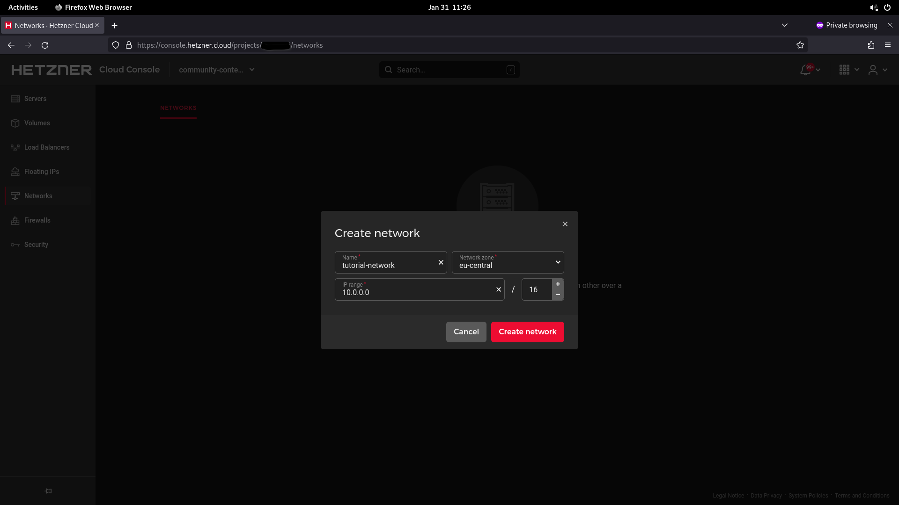
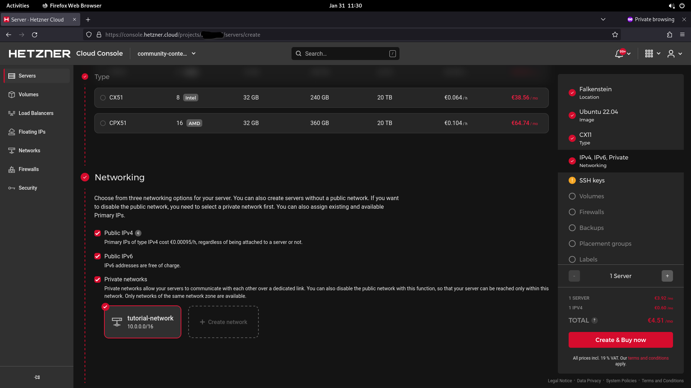
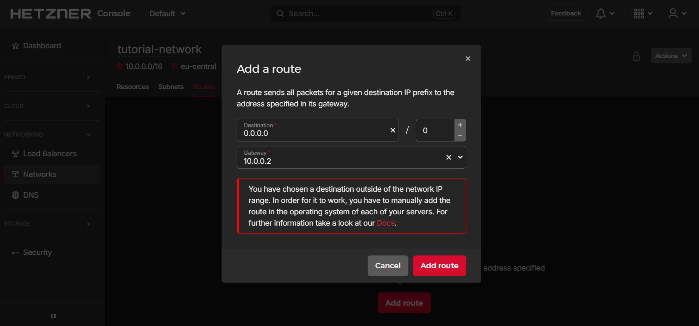

## Introduction

This tutorial shows how to setup a generic NAT gateway for Cloud Servers via private Cloud Networks. It explains how to create the Network and Cloud Servers, how to setup the routing, and how to achieve a persistent configuration.

By the end of this tutorial, you will be able to access the public network from your private-network-only server (client server) by routing traffic via a server with a public IP address (NAT server). Both servers have to be in the same private Cloud Network.

> If you are specifically interested in using pfSense, you can use [this tutorial](https://community.hetzner.com/tutorials/how-to-route-cloudserver-over-private-network-using-pfsense-and-hcnetworks#configure-route-for-private-networking).

**Prerequisites**

* [Hetzner Console account](https://console.hetzner.com/)

* This tutorial is written for:
  * Ubuntu 18.04, 20.04, 22.04, and 24.04
  * Debian 10, 11, 12 and 13
    > On Debian 12, please install `systemd-resolved` before you follow this tutorial.
  * CentOS 7
  * CentOS Stream 8, 9 and 10
  * Fedora 36, 37, 41 and 42
  * Rocky Linux 8, 9 and 10

**Example terminology**

* Network: `10.0.0.0/16`
* Gateway: `10.0.0.1`
* NAT server: `10.0.0.2`

Please replace `10.0.0.0/16` with your own network, `10.0.0.1` with your own network gateway IP, and `10.0.0.2` with the private IP of your own NAT server in all example commands.

## Step 1 - Creating the Network and servers

Open the [Hetzner Console](https://console.hetzner.com/) and select your project.

You can create your Network first or, alternatively, together with your servers at server creation.

- **Create a Network**
  
  In your project, select:
  
  `Networks` > `Create network`
  
  

<br>

- **Create the servers**
  
  In your project, select:
  
  `Servers` > `Add Server`
  
  You need at least two servers.
  The NAT server needs an IPv4 address, the other servers don't.
  
  Under `Networking`, you have to select the network you just created.
  
  > If you don't want to setup the routes manually as explained in the steps below, you can use cloud-init as explained in "[Step 6 - Cloud-init](#step-6---cloud-init)" instead.

  

## Step 2 - Adding the route to the Network

In order for our setup to work properly, we need to add the following route to the Network:

> **Destination:** 0.0.0.0/0<br>
> **Gateway:** 10.0.0.2

The gateway should be the IP address of the NAT server on which you configure masquerading.



## Step 3 - Configuring NAT

**To configure the NAT server**, we will use the following commands:

- Enable IP forwarding, since it is disabled by default
  
  ```bash
  echo 1 > /proc/sys/net/ipv4/ip_forward
  ```

- Add a rule to the 'nat' table
  
  ```bash
  iptables -t nat -A POSTROUTING -s '10.0.0.0/16' -o eth0 -j MASQUERADE
  ```
  
  Let's look at the second command in more detail:
  
  * `iptables` ➜ the program we are using
  * `-t nat` ➜ choose the table 'nat'
  * `-A POSTROUTING` ➜ add a rule to postrouting
  * `-s '10.0.0.0/16'` ➜ target packets from the source '10.0.0.0/16'
  * `-o eth0` ➜ output at 'eth0'
  * `-j MASQUERADE` ➜ masquerade the packages with the 'routers' IP

<br>

**To configure the client servers**, we only need to add a default route.

- For example, like this:
  
  ```bash
  ip route add default via 10.0.0.1
  ```
  
  <blockquote>
  <details>
  <summary>Click here, if you get <kbd>RTNETLINK answers: File exists</kbd></summary>
  
  If you get the error `RTNETLINK answers: File exists`, run this command to check if you already have a default route:
  
  ```bash
  ip route
  ```
  
  Example output:
  
  ```shellsession
  default via 172.31.1.1 dev eth0
  10.0.0.0/16 via 10.0.0.1 dev enp7s0
  10.0.0.1 dev enp7s0 scope link
  172.31.1.1 dev eth0 scope link
  ```
  
  You can remove the existing default route with this command: 
  
  ```bash
  ip route del default
  ```
  
  After it was removed, you can try adding the new route again:
  
  ```bash
  ip route add default via 10.0.0.1
  ```
  
  </details>
  </blockquote>

## Step 4 - Achieving a persistent configuration

The example commands below for Debian and Ubuntu use `vim`, which can be installed using: `apt install vim`

-------

**The next steps depend on the OS of your server:**

<details>

<summary>Debian 10 / 11 / 12 / 13, and Ubuntu 18.04</summary>

- **Update**
  
  First, the system needs to be updated:
  
  ```bash
  apt update && apt upgrade -y
  ```
  
  Ubuntu 22.04 additionally requires:
  
  ```bash
  apt install ifupdown
  ```

<br>

- **On the NAT server**
  
  To make everything persistent, we open the following file:
  
  ```bash
  vim /etc/network/interfaces
  ```
  
  To enter the insert mode in `vim`, press `i` and append the following to the file:
  
  ```
  auto eth0
  iface eth0 inet dhcp
      post-up echo 1 > /proc/sys/net/ipv4/ip_forward
      post-up iptables -t nat -A POSTROUTING -s '10.0.0.0/16' -o eth0 -j MASQUERADE
  ```
  
  To save the file, press `esc` to escape the insert mode, then type `:x` or `:wq` and hit ENTER.

<br>

- **On the client servers**
  
  Since we also want the route to be persistent, we edit the following file:
  
  ```bash
  vim /etc/network/interfaces
  ```
  
  And append:
  
  > Run `ifconfig` to check the interface name and replace `enp7s0` with `ens10` if needed. 
  
  ```
  auto enp7s0
  iface enp7s0 inet dhcp
      post-up ip route add default via 10.0.0.1
  dns-nameservers 8.8.8.8 1.1.1.1
  ```

------

</details>

<details>

<summary>Ubuntu 22.04 / 24.04</summary>

- **Update**
  
  First, the system needs to be updated:
  
  ```bash
  apt update && apt upgrade -y
  ```

<br>

- **On the NAT server**
  
  To make everything persistent, we open the file in `/etc/netplan`:
  
  ```bash
  vim /etc/netplan/50-cloud-init.yaml
  ```
  
  Check the following information. If everything looks fine, press `esc` followed by `:q` and ENTER to close the file. To enter the insert mode in `vim`, press `i`.
  
  ```yaml
  network:
      version: 2
      ethernets:
          eth0:
              dhcp4: true
  ```
  
  To save the file, press `esc` to escape the insert mode, then type `:x` or `:wq` and hit ENTER.

  Now create a new file in `/etc/networkd-dispatcher/routable.d`:
  
  ```bash
  vim /etc/networkd-dispatcher/routable.d/10-eth0-post-up
  ```
  
  To enter the insert mode in `vim`, press `i` and add the following to the file:
  
  ```shell
  #!/bin/bash
  
  echo 1 > /proc/sys/net/ipv4/ip_forward
  iptables -t nat -A POSTROUTING -s '10.0.0.0/16' -o eth0 -j MASQUERADE
  ```
  
  To save the file, press `esc` to escape the insert mode, then type `:x` or `:wq` and hit ENTER.
  
  Now add execute permissions:
  ```bash
  chmod +x /etc/networkd-dispatcher/routable.d/10-eth0-post-up
  ```

<br>

- **On the client servers**
  
  Since we also want the route to be persistent, we edit the following file:
  
  > Run `ifconfig` to check the interface name and replace `enp7s0` with `ens10` if needed. 
  
  ```bash
  vim /etc/systemd/network/10-enp7s0.network
  ```
  
  And add:
  
  ```network
  [Match]
  Name=enp7s0
  
  [Network]
  DHCP=yes
  Gateway=10.0.0.1
  ```

------

</details>

<details>

<summary>Ubuntu 20.04</summary>

- **Update**
  
  First, the system needs to be updated:
  
  ```bash
  apt update && apt upgrade -y
  ```
  
  Ubuntu 20.04 uses `netplan` instead of `/etc/interfaces` by default. To achieve persistent configuration, the [networkd-dispatcher](https://gitlab.com/craftyguy/networkd-dispatcher) is being used.
  
  As mentioned in the [netplan FAQ](https://netplan.io/faq), the `networkd-dispatcher` equivalent of `post-up` is placing a script in `/etc/networkd-dispatcher/routable.d/`. In this tutorial, we call the script `50-masq` but the name doesn't matter.

<br>

- **On the NAT server**
  
  Create the file:
  
  ```bash
  vim /etc/networkd-dispatcher/routable.d/50-masq
  ```
  
  To enter the insert mode in `vim`, press `i` and append the following to the file:
  
  ```shell
  #!/bin/sh
  
  /bin/echo 1 > /proc/sys/net/ipv4/ip_forward
  /sbin/iptables -t nat -A POSTROUTING -s '10.0.0.0/16' -o eth0 -j MASQUERADE
  ```
  
  To save the file, press `esc` to escape the insert mode, then type `:x` or `:wq` and hit ENTER.
  
  The following command is required to make the script executable, otherwise it will not work:
  
  ```bash
  chmod +x /etc/networkd-dispatcher/routable.d/50-masq
  ```

<br>

- **On the client servers**
  
  Create the file:
  
  ```bash
  vim /etc/networkd-dispatcher/routable.d/50-masq
  ```
  
  And append:
  
  ```shell
  #!/bin/sh
  
  /sbin/ip route add default via 10.0.0.1
  ```
  
  Finally, make it executable:
  
  ```bash
  chmod +x /etc/networkd-dispatcher/routable.d/50-masq
  ```

------

</details>

<details>

<summary>CentOS 7, CentOS Stream 8 / 9, Rocky Linux 8 / 9, Fedora 36 / 37</summary>

- **Update**
  
  First, the system needs to be updated:
  
  ```bash
  yum update -y && yum upgrade -y
  ```
  
  We use the `NetworkManager`'s `dispatcher.d` to run our scripts automated on start. This is done by placing the script into the folder `/etc/NetworkManager/dispatcher.d/`. Here, the name determines the execution condition of the script. More information can be found [here](https://man.archlinux.org/man/NetworkManager-dispatcher.8.en).
  
  In this tutorial we use the name `ifup-local` where `ifup` is the condition for the script to get executed.

<br>

- **On the NAT server**
  
  > Fedora 36 / 37 additionally require:
  > ```bash
  > yum install iptables -y
  > ```
  
  Create the file:
  
  ```bash
  vi /etc/NetworkManager/dispatcher.d/ifup-local
  ```
  
  And append:
  
  ```shell
  #!/bin/sh
  
  /bin/echo 1 > /proc/sys/net/ipv4/ip_forward
  /sbin/iptables -t nat -A POSTROUTING -s '10.0.0.0/16' -o eth0 -j MASQUERADE
  ```
  
  The following command is required to make the script executable, otherwise it will not work:
  
  ```bash
  chmod +x /etc/NetworkManager/dispatcher.d/ifup-local
  ```

<br>

- **On the client servers**
  
  > CentOS Stream 8 / 9, Rocky Linux 8 / 9, and Fedora 36 / 37 additionally require:
  > ```bash
  > yum remove hc-utils -y
  > ```
  > This also goes for other methods to add a route to the OS.
  
  Create the file:
  
  ```bash
  vi /etc/NetworkManager/dispatcher.d/ifup-local
  ```
  
  And append:
  
  ```shell
  #!/bin/sh
  
  /sbin/ip route add default via 10.0.0.1
  ```
  
  Finally, make it executable:
  
  ```bash
  chmod +x /etc/NetworkManager/dispatcher.d/ifup-local
  ```

------

</details>

## Step 5 - Adding nameservers

To add nameservers on the  client server, edit the file `/etc/systemd/resolved.conf`. In the section `[Resolve]`, there should be the line `#DNS=`. Un-comment this line by removing the `#` and add some DNS servers or use the DNS servers by Hetzner:

```conf
[Resolve]
DNS=185.12.64.2 185.12.64.1
```

Save the file and restart the server.

## Step 6 - Cloud-init

If you don't want to setup the routes manually, you can use cloud-init and add the scripts below in the cloud config text box when you create new servers in [Hetzner Console](https://console.hetzner.com/).

<details>

<summary>Debian 11 / 12 / 13</summary>

* **NAT server**
  > Replace `10.0.0.0/16` as needed.

  ```bash
  #cloud-config
  write_files:
    - path: /etc/network/interfaces
      content: |
        auto eth0
        iface eth0 inet dhcp
            post-up echo 1 > /proc/sys/net/ipv4/ip_forward
            post-up iptables -t nat -A POSTROUTING -s '10.0.0.0/16' -o eth0 -j MASQUERADE
      append: true
  
  runcmd:
    - reboot
  ```

* **Client server**
  > Replace `10.0.0.1` as needed.

  Run `ifconfig` to check the interface name and replace `enp7s0` with `ens10` if needed. 
  
  ```bash
  #cloud-config
  write_files:
    - path: /etc/network/interfaces
      content: |
        auto enp7s0
        iface enp7s0 inet dhcp
            post-up echo "Waiting..."
            post-up ip route add default via 10.0.0.1
        dns-nameservers 8.8.8.8 1.1.1.1
      append: true
  
    - path: /etc/systemd/resolved.conf
      content: |
        [Resolve]
        DNS=185.12.64.2 185.12.64.1
        FallbackDNS=8.8.8.8
      append: true
  
  runcmd:
    - reboot
  ```

------

</details>


<details>

<summary>Ubuntu 22.04 / 24.04</summary>

* **NAT server**
  > Replace `10.0.0.0/16` as needed.

  ```bash
  #cloud-config
  write_files:
    - path: /etc/networkd-dispatcher/routable.d/10-eth0-post-up
      content: |
        #!/bin/bash
        
        echo 1 > /proc/sys/net/ipv4/ip_forward
        iptables -t nat -A POSTROUTING -s '10.0.0.0/16' -o eth0 -j MASQUERADE
      permissions: '0755'
  
  runcmd:
    - reboot
  ```


* **Client server**
  > Replace `10.0.0.1` as needed.

  Run `ifconfig` to check the interface name and replace `enp7s0` with `ens10` if needed. 
  
  ```bash
  #cloud-config
  write_files:
    - path: /etc/systemd/network/10-enp7s0.network
      content: |
        # Custom network configuration added by cloud-init
        [Match]
        Name=enp7s0
  
        [Network]
        DHCP=yes
        Gateway=10.0.0.1
      append: true
  
    - path: /etc/systemd/resolved.conf
      content: |
        [Resolve]
        DNS=185.12.64.2 185.12.64.1
        FallbackDNS=8.8.8.8
      append: true
  
  runcmd:
    - reboot
  ```

------

</details>

<details>

<summary>CentOS Stream 9 / 10, Rocky Linux 8 / 9 / 10, Fedora 41 / 42</summary>

* **NAT server**
  > Replace `10.0.0.0/16` as needed.

  ```bash
  #cloud-config
  packages:
    - iptables
    - iptables-services
  
  write_files:
    - path: /etc/NetworkManager/dispatcher.d/ifup-local
      content: |
        #!/bin/sh
        
        /bin/echo 1 > /proc/sys/net/ipv4/ip_forward
        /sbin/iptables -t nat -A POSTROUTING -s '10.0.0.0/16' -o eth0 -j MASQUERADE
      permissions: '0755'
  
  runcmd:
    - reboot
  ```

* **Client server**
  > Replace `10.0.0.1` as needed.

  ```bash
  #cloud-config
  write_files:
    - path: /etc/NetworkManager/dispatcher.d/ifup-local
      content: |
        #!/bin/sh
        
        nm-online -q --timeout=30
        if ! ip route show default | grep -q "via 10.0.0.1"; then
            /sbin/ip route add default via 10.0.0.1
        fi
      permissions: '0755'
  
    - path: /etc/systemd/resolved.conf
      content: |
        [Resolve]
        DNS=185.12.64.2 185.12.64.1
        FallbackDNS=8.8.8.8
      append: true
  
  runcmd:
    - reboot
  ```

------

</details>

After the servers are created, you can use `iptables -t nat -L` on the NAT server and `ip route show` on the client server to check if the rules were added as expected.

Next, add the route mentioned in [step 2](#step-2---adding-the-route-to-the-network) to your private Network and you're done!

## Conclusion

If you followed all these steps, you have successfully configured your system to behave as a NAT router in your private Cloud Network. If you have an active firewall on your NAT server, make sure to allow the necessary connections for traffic forwarding.

For example, using `ufw` on the NAT server, you can allow traffic that enters through the private interface `enp7s0` and is forwarded via the public interface `eth0` with the following command:

```bash
sudo ufw route allow in on enp7s0 out on eth0
```

