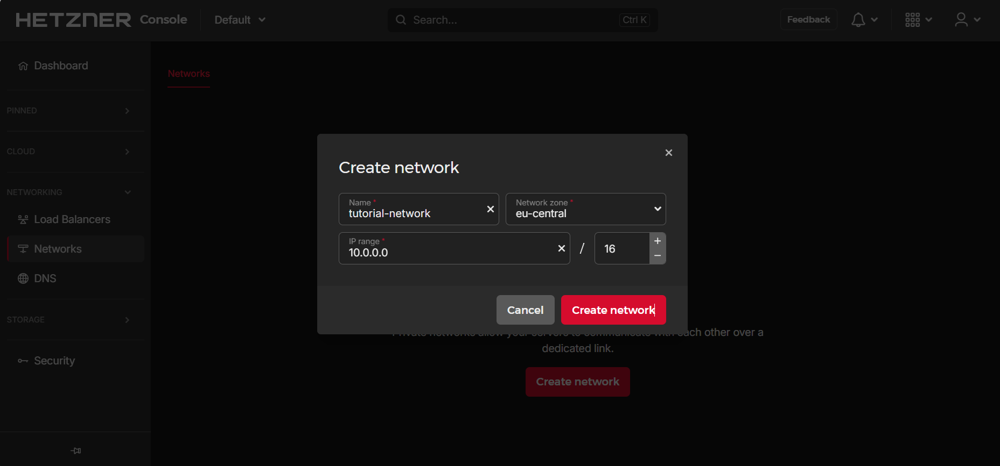
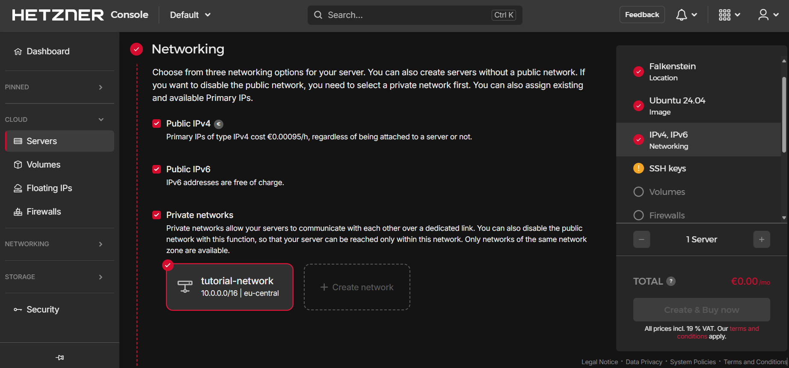

## Introduction

This tutorial shows how to setup a generic NAT gateway for Cloud Servers via private Cloud Networks. It explains how to create the Network and Cloud Servers, how to setup the routing, and how to achieve a persistent configuration.

By the end of this tutorial, you will be able to access the public network from your private-network-only server (client server) by routing traffic via a server with a public IP address (NAT server). Both servers have to be in the same private Cloud Network.

> If you are specifically interested in using pfSense, you can use [this tutorial](https://community.hetzner.com/tutorials/how-to-route-cloudserver-over-private-network-using-pfsense-and-hcnetworks#configure-route-for-private-networking).

**Prerequisites**

* [Hetzner Cloud account](https://console.hetzner.cloud/)

* This tutorial is written for:
  * Ubuntu 18.04, 20.04 and 22.04
  * Debian 10 and 11
  * CentOS 7
  * CentOS Stream 8 and 9
  * Fedora 36 and 37
  * Rocky Linux 8 and 9.

**Example terminology**

* Network: `10.0.0.0/16`
* Gateway: `10.0.0.1`
* NAT server: `10.0.0.2`

Please replace `10.0.0.0/16` with your own network, `10.0.0.1` with your own network gateway IP, and `10.0.0.2` with the private IP of your own NAT server in all example commands.

## Step 1 - Creating the Network and servers

Open the Hetzner [Cloud Console](https://console.hetzner.cloud/) and select your project.

You can create your Network first or, alternatively, together with your servers at server creation.

- **Create a Network**
  
  In your project, select:
  
  `Networks` > `Create network`
  
  

<br>

- **Create the servers**
  
  In your project, select:
  
  `Servers` > `Add Server`
  
  You need at least two servers.
  The NAT server needs an IPv4 address, the other servers don't.
  
  Under `Networking`, you have to select the network you just created.
  
  

## Step 2 - Adding the route to the Network

In order for our setup to work properly, we need to add the following route to the Network:

> **Destination:** 0.0.0.0/0<br>
> **Gateway:** 10.0.0.2

The gateway should be the IP address of the NAT server on which you configure masquerading.


## Step 3 - Configuring NAT

**To configure the NAT server**, we will use the following commands:

- Enable IP forwarding, since it is disabled by default
  
  ```bash
  echo 1 > /proc/sys/net/ipv4/ip_forward
  ```

- Add a rule to the 'nat' table
  
  ```bash
  iptables -t nat -A POSTROUTING -s '10.0.0.0/16' -o eth0 -j MASQUERADE
  ```
  
  Let's look at the second command in more detail:
  
  * `iptables` ➜ the program we are using
  * `-t nat` ➜ choose the table 'nat'
  * `-A POSTROUTING` ➜ add a rule to postrouting
  * `-s '10.0.0.0/16'` ➜ target packets from the source '10.0.0.0/16'
  * `-o eth0` ➜ output at 'eth0'
  * `-j MASQUERADE` ➜ masquerade the packages with the 'routers' IP

<br>

**To configure the client servers**, we only need to add a default route.

- For example, like this:
  
  ```bash
  ip route add default via 10.0.0.1
  ```

## Step 4 - Achieving a persistent configuration

The example commands below for Debian and Ubuntu use `vim`, which can be installed using: `apt install vim`

-------

**The next steps depend on the OS of your server:**

<details>

<summary>Debian 10 / 11, and Ubuntu 18.04 / 22.04</summary>

- **Update**
  
  First, the system needs to be updated:
  
  ```bash
  apt update && apt upgrade -y
  ```
  
  Ubuntu 22.04 additionally requires:
  
  ```bash
  apt install ifupdown
  ```

<br>

- **On the NAT server**
  
  To make everything persistent, we open the following file:
  
  ```bash
  vim /etc/network/interfaces
  ```
  
  To enter the insert mode in `vim`, press `i` and append the following to the file:
  
  ```
  auto eth0
  iface eth0 inet dhcp
      post-up echo 1 > /proc/sys/net/ipv4/ip_forward
      post-up iptables -t nat -A POSTROUTING -s '10.0.0.0/16' -o eth0 -j MASQUERADE
  ```
  
  To save the file, press `esc` to escape the insert mode, then type `:x` or `:wq` and hit ENTER.

<br>

- **On the client servers**
  
  Since we also want the route to be persistent, we edit the following file:
  
  ```bash
  vim /etc/network/interfaces
  ```
  
  And append:
  
  ```
  auto ens10
  iface ens10 inet dhcp
      post-up ip route add default via 10.0.0.1
  ```

------

</details>

<details>

<summary>Ubuntu 20.04</summary>

- **Update**
  
  First, the system needs to be updated:
  
  ```bash
  apt update && apt upgrade -y
  ```
  
  Ubuntu 20.04 uses `netplan` instead of `/etc/interfaces` by default. To achieve persistent configuration, the [networkd-dispatcher](https://gitlab.com/craftyguy/networkd-dispatcher) is being used.
  
  As mentioned in the [netplan FAQ](https://netplan.io/faq), the `networkd-dispatcher` equivalent of `post-up` is placing a script in `/etc/networkd-dispatcher/routable.d/`. In this tutorial, we call the script `50-masq` but the name doesn't matter.

<br>

- **On the NAT server**
  
  Create the file:
  
  ```bash
  vim /etc/networkd-dispatcher/routable.d/50-masq
  ```
  
  To enter the insert mode in `vim`, press `i` and append the following to the file:
  
  ```
  #!/bin/sh
  
  /bin/echo 1 > /proc/sys/net/ipv4/ip_forward
  /sbin/iptables -t nat -A POSTROUTING -s '10.0.0.0/16' -o eth0 -j MASQUERADE
  ```
  
  To save the file, press `esc` to escape the insert mode, then type `:x` or `:wq` and hit ENTER.
  
  The following command is required to make the script executable, otherwise it will not work:
  
  ```bash
  chmod +x /etc/networkd-dispatcher/routable.d/50-masq
  ```

<br>

- **On the client servers**
  
  Create the file:
  
  ```bash
  vim /etc/networkd-dispatcher/routable.d/50-masq
  ```
  
  And append:
  
  ```
  #!/bin/sh
  
  /sbin/ip route add default via 10.0.0.1
  ```
  
  Finally, make it executable:
  
  ```bash
  chmod +x /etc/networkd-dispatcher/routable.d/50-masq
  ```

------

</details>

<details>

<summary>CentOS 7, CentOS Stream 8 / 9, Rocky Linux 8 / 9, Fedora 36 / 37</summary>

- **Update**
  
  First, the system needs to be updated:
  
  ```bash
  yum update -y && yum upgrade -y
  ```
  
  We use the `NetworkManager`'s `dispatcher.d` to run our scripts automated on start. This is done by placing the script into the folder `/etc/NetworkManager/dispatcher.d/`. Here, the name determines the execution condition of the script. More information can be found [here](https://man.archlinux.org/man/NetworkManager-dispatcher.8.en).
  
  In this tutorial we use the name `ifup-local` where `ifup` is the condition for the script to get executed.

<br>

- **On the NAT server**
  
  > Fedora 36 / 37 additionally require:
  > ```bash
  > yum install iptables -y
  > ```
  
  Create the file:
  
  ```bash
  vi /etc/NetworkManager/dispatcher.d/ifup-local
  ```
  
  And append:
  
  ```
  #!/bin/sh
  
  /bin/echo 1 > /proc/sys/net/ipv4/ip_forward
  /sbin/iptables -t nat -A POSTROUTING -s '10.0.0.0/16' -o eth0 -j MASQUERADE
  ```
  
  The following command is required to make the script executable, otherwise it will not work:
  
  ```bash
  chmod +x /etc/NetworkManager/dispatcher.d/ifup-local
  ```

<br>

- **On the client servers**
  
  > CentOS Stream 8 / 9, Rocky Linux 8 / 9, and Fedora 36 / 37 additionally require:
  > ```bash
  > yum remove hc-utils -y
  > ```
  > This also goes for other methods to add a route to the OS.
  
  Create the file:
  
  ```bash
  vi /etc/NetworkManager/dispatcher.d/ifup-local
  ```
  
  And append:
  
  ```
  #!/bin/sh
  
  /sbin/ip route add default via 10.0.0.1
  ```
  
  Finally, make it executable:
  
  ```bash
  chmod +x /etc/NetworkManager/dispatcher.d/ifup-local
  ```

------

</details>

## Step 5 - Adding nameservers

To add nameservers on the  client server, edit the file `/etc/systemd/resolved.conf`. In the section `[Resolve]`, there should be the line `#DNS=`. Un-comment this line by removing the `#` and add some DNS servers or use the DNS servers by Hetzner:

```conf
DNS=185.12.64.2 185.12.64.1
```

Save the file and restart the server.

## Conclusion

If you followed all these steps, you have successfully configured your system to behave as a NAT router in your private Cloud Network.
