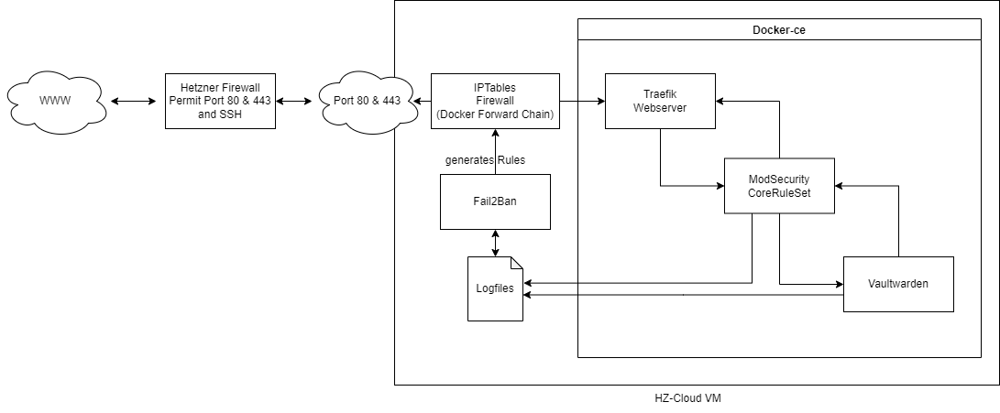

## Prerequisites
1. Hetzner Account
1. Control of a publicly resolvable domain
1. SMTP Server (can be any free webmail service if you dont have your own server)

## Introduction

Vaultwarden is an alternative implementation of the Bitwarden serverside which itself is not completely open-source and hides features behind a pay-wall.
The by dani-garcia maintained Vaultwarden project mimics the client interfaces to be almost fully compatible with the broad range of Bitwarden clients.

**DANGER ZONE - READ CAREFULLY**

> The vaultwarden serverside does (when properly configured) not store sensitive data in plaintext at any give point in time. The decryption of the users data happens only on the endpoint either
in an app, browser extension or inside the web application. Make sure you're comfortable with these security parameters before storing critical data and passwords.

> IF YOU LOOSE A USERS MASTER-KEY ALL HIS/HER DATA IS LOST - FOREVER. Enabling existing work arounds for this issue undermines many if not all security benefits of the applications design.

## What will be achieved

* Install and set up Docker.

* Configure Traefik, ModSecurity and Vaultwarden

* Profit

## Step 1 - Setup new Server

Do not host Vaultwarden and other applications on the same host if not absolutely required. 
The attack surface should be as small as possible and any added complexity from other applications will introduces unnecessary uncertainty.

1. Open Hetzner Cloud Console
1. Click "New Project +" and create a new project
1. Click "Add Server" and select a datacenter which is closest to your users
1. Select Debian 11 as OS
1. Depending on the ammount of users select at least a CPX21 instance
1. Tick the checkbox "User data" and insert the below code
1. Click "Add ssh key" and paste your ssh-key. On Windows 10 you can get it via powershell `cat $env:USERPROFILE\.ssh\id_rsa.pub`
1. Name the server appropriately and click "Create & Buy now"

```yml
#cloud-config
package_upgrade: true
apt:
  sources:
    docker.list:
      source: deb [arch=amd64] https://download.docker.com/linux/ubuntu $RELEASE stable
      keyid: 9DC858229FC7DD38854AE2D88D81803C0EBFCD88

packages:
  - apt-transport-https
  - ca-certificates
  - curl
  - gnupg-agent
  - software-properties-common
  - docker-ce
  - docker-ce-cli
  - containerd.io
  - fail2ban
  
groups:
  - docker
  
system_info:
  default_user:
    groups: [docker]

```
[Source](https://stackoverflow.com/a/62540068)

This `cloud-init` script will take care of the docker installation, so its a controlled process which is less prone to error.

## Step 2 - Set DNS Records
Setting the DNS records now gives the DNS system enough time to propagate the changes far enough so that the LetsEncrypt resolvers will resolve the hostname to your IP.
This is necessary to obtain a valid SSL certificate to encrypt client connections and proof authenticity of our host system.

Go to the admin panel of whichever company hosts your domain name and create a A record with the subdomain of your choosing and the IPv4 address of the newly created server.


## Step 3 - Setup the docker-compose.yml file

* Opinions on this matter may differ but you could place your docker-compose.yml file virtually anyhwere. We will use the /opt directory.

Create a folder called `vaultwarden` in `/opt`
```bash
mkdir /opt/vaultwarden && cd /opt/vaultwarden
```

Create necessary files
```bash
touch /opt/docker/waf-rules/REQUEST-900-EXCLUSION-RULES-BEFORE-CRS.conf
touch /opt/docker/waf-rules/RESPONSE-999-EXCLUSION-RULES-AFTER-CRS.conf
mkdir /opt/docker/le && chmod -R 600 /opt/docker/le
```

Add a `docker-compose.yml` file
```bash
nano docker-compose.yml
```

Paste the following code to the shell window
```yml
services:
  traefik:
    image: traefik:latest
    container_name: traefik
    command:
      - --providers.docker=true
      - --providers.docker.exposedByDefault=false
      - --entrypoints.web.address=:80
      - --entrypoints.websecure.address=:443
      - --certificatesresolvers.myresolver.acme.tlschallenge=true
      - --certificatesresolvers.myresolver.acme.email=you@domain.tld
      - --certificatesresolvers.myresolver.acme.storage=acme.json
      - --certificatesresolvers.myresolver.acme.storage=/letsencrypt/acme.json
    restart: unless-stopped
    ports:
      - 80:80
      - 443:443
    volumes:
      - /var/run/docker.sock:/var/run/docker.sock:ro
      - /opt/docker/le:/letsencrypt

  waf:
    image: owasp/modsecurity-crs:apache
    container_name: waf
    environment:
      PARANOIA: 1
      ANOMALY_INBOUND: 10
      ANOMALY_OUTBOUND: 5
      PROXY: 1
      REMOTEIP_INT_PROXY: "172.20.0.1/16"
      BACKEND: "http://vaultwarden:80"
      BACKEND_WS: "ws://vaultwarden:80/notifications/hub"
      ERRORLOG: "/var/log/waf/waf.log"
    volumes:
     - /opt/docker/waf:/var/log/waf
     - /opt/docker/waf-rules/REQUEST-900-EXCLUSION-RULES-BEFORE-CRS.conf:/etc/modsecurity.d/owasp-crs/rules/REQUEST-900-EXCLUSION-RULES-BEFORE-CRS.conf
     - /opt/docker/waf-rules/RESPONSE-999-EXCLUSION-RULES-AFTER-CRS.conf:/etc/modsecurity.d/owasp-crs/rules/RESPONSE-999-EXCLUSION-RULES-AFTER-CRS.conf
    labels:
      - traefik.enable=true
      - traefik.http.middlewares.redirect-https.redirectScheme.scheme=https
      - traefik.http.middlewares.redirect-https.redirectScheme.permanent=true
      - traefik.http.routers.vw-ui-https.rule=Host(`sub.domain.tld`)
      - traefik.http.routers.vw-ui-https.entrypoints=websecure
      - traefik.http.routers.vw-ui-https.tls=true
      - traefik.http.routers.vw-ui-https.service=vw-ui
      - traefik.http.routers.vw-ui-http.rule=Host(`sub.domain.tld`)
      - traefik.http.routers.vw-ui-http.entrypoints=web
      - traefik.http.routers.vw-ui-http.middlewares=redirect-https
      - traefik.http.routers.vw-ui-http.service=vw-ui
      - traefik.http.services.vw-ui.loadbalancer.server.port=80
      - traefik.http.routers.vw-websocket-https.rule=Host(`sub.domain.tld`) && Path(`/notifications/hub`)
      - traefik.http.routers.vw-websocket-https.entrypoints=websecure
      - traefik.http.routers.vw-websocket-https.tls=true
      - traefik.http.routers.vw-websocket-https.service=vw-websocket
      - traefik.http.routers.vw-websocket-http.rule=Host(`sub.domain.tld`) && Path(`/notifications/hub`)
      - traefik.http.routers.vw-websocket-http.entrypoints=web
      - traefik.http.routers.vw-websocket-http.middlewares=redirect-https
      - traefik.http.routers.vw-websocket-http.service=vw-websocket
      - traefik.http.services.vw-websocket.loadbalancer.server.port=3012

  vaultwarden:
    image: vaultwarden/server:latest
    container_name: vaultwarden
    restart: unless-stopped
    environment:
      WEBSOCKET_ENABLED: "true"
      SENDS_ALLOWED: "true"
      PASSWORD_ITERATIONS: 500000
      SIGNUPS_ALLOWED: "true"
      SIGNUPS_VERIFY: "true"
      ADMIN_TOKEN: "ADMINTOKEN-REPLACE"
      DOMAIN: "domain host name"
      SMTP_HOST: "smtp server"
      SMTP_FROM: "sender email e.g: you@domain.tld"
      SMTP_FROM_NAME: "sender name"
      SMTP_SECURITY: "starttls"
      SMTP_PORT: 587
      SMTP_USERNAME: "smtp username"
      SMTP_PASSWORD: "smtp password"
      SMTP_TIMEOUT: 15
      LOG_FILE: "/data/vaultwarden.log"
      LOG_LEVEL: "warn"
      EXTENDED_LOGGING: "true"
      TZ: "Europe/Berlin"
    volumes:
      - /opt/docker/vaultwarden:/data

networks:
  default:
    driver: bridge
    ipam:
      driver: default
      config:
      - subnet: 172.20.0.1/16
```

Edit the following placeholder texts:

1. `you@domain.tld` <- Put an e-mail you regulary read (SSL notifications will be send there)

1. `sub.domain.tld` <- This occurs four times so make sure to change all instances. Change to your domain name like vault.yourdomain.tld

1. `domain host name` <- Enter the hostname of your SMTP server (Google smtp settings [your mail provider]

1. `sender email e.g: you@domain.tld` <- Change to the email you wish to send notifications from

1. `sender name` <- Replace with Vaultwarden or something to instantly tell this e-mail is from the password server

1. `smtp username` <- In most cases your e-mail address except on AWS SES where you would need to create extra IAM users

1. `smtp-password` <- Your smtp password

1. `Europe/Berlin` <- If you dont live in the GTM+1 Timezone change this

Put nano editor in background with `CTRL` + `Z`

Generate Admin token and copy output
```bash
openssl rand -base64 48
```

Bring nano back to front: type `fg` and press `ENTER`

Replace `ADMINTOKEN-REPLACE` with the copied output of the previous command

Save file with `CTRL`+`X` and then press `Y` and `ENTER`

## Step 4 - Configure Fail2Ban
Create filter for the vaultwarden application
```bash
nano /etc/fail2ban/filter.d/vaultwarden.local
```

Include the following lines
```yml
[INCLUDES]
before = common.conf

[Definition]
failregex = ^.*Username or password is incorrect\. Try again\. IP: <ADDR>\. Username:.*$
ignoreregex =
```
[Source](https://github.com/dani-garcia/vaultwarden/wiki/Fail2Ban-Setup)


Create filter for the vaultwarden admin application
```bash
nano /etc/fail2ban/filter.d/vaultwarden-admin.local
```

Include the following lines
```yml
[INCLUDES]
before = common.conf

[Definition]
failregex = ^.*Invalid admin token\. IP: <ADDR>.*$
ignoreregex =
```
[Source](https://github.com/dani-garcia/vaultwarden/wiki/Fail2Ban-Setup)


Create filter for the ModSecurity application
```bash
nano /etc/fail2ban/filter.d/waf.local
```

Include the following lines
```yml
[INCLUDES]
before = common.conf

[Definition]
failregex = ^.*\[client <ADDR>\] ModSecurity: Access denied with code 403 .*$
ignoreregex =
```

Create jail for the vaultwarden application
```bash
nano /etc/fail2ban/jail.d/vaultwarden.local
```

Include the following lines
```yml
[vaultwarden]
enabled = true
port = 80,443,8081
filter = vaultwarden
banaction = %(banaction_allports)s
logpath = /path/to/vaultwarden.log
maxretry = 3
bantime = 14400
findtime = 14400
```
[Source](https://github.com/dani-garcia/vaultwarden/wiki/Fail2Ban-Setup)


Create jail for the vaultwarden admin application
```bash
nano /etc/fail2ban/jail.d/vaultwarden-admin.local
```

Include the following lines
```yml
[vaultwarden-admin]
enabled = true
port = 80,443
filter = vaultwarden-admin
banaction = %(banaction_allports)s
logpath = /path/to/vaultwarden.log
maxretry = 3
bantime = 14400
findtime = 14400
```
[Source](https://github.com/dani-garcia/vaultwarden/wiki/Fail2Ban-Setup)


Create jail for the ModSecurity application
```bash
nano /etc/fail2ban/jail.d/waf.local
```

Include the following lines
```yml
[waf]
enabled = true
port = 80,443
filter = waf
action = iptables-allports[name=waf, chain=FORWARD]
logpath = /opt/docker/waf/waf.log
maxretry = 1
bantime = 14400
findtime = 14400
```

Reload the ruleset with `sudo systemctl reload fail2ban`


## Step 5 - Starting Instance

To startup your instance run:
```bash
cd /opt/vaultwarden && docker compose up -d
```

Traefik needs some time to properly start up, discover all services and issue certificates. This can take up to 5 minutes so please be a little patient.
You can check the logs for errors with `docker compose logs`.

You can now connect to your Vaultwarden instance via any modern web-browser by accessing https://your.domain.tld and create an account for yourself.
To access the admin interface go to https://your.domain.tld/admin and enter the code generated with openssl earlier on. You can look it up with the command:
```bash
cd grep ADMIN_TOKEN /opt/vaultwarden/docker-compose.yml
```

There you can manipulate all important settings, however the configuration defined in the docker-compose.yml is a good starting point. You might want to disable public registration though.
Just go to `General Settings` and uncheck `Allow new singups` and press save on the bottom of the page.


### How to connect through Bitwarden applications

To connect your devices to your new Vaultwarden server, please follow [this guide from Bitwarden](https://bitwarden.com/help/change-client-environment/).

## Setp 6 - Optional: Tuning ModSecurity

ModSecurity is a web application firewall that can prevent common attacks on a web applications such as Vaultwarden. Depending on the protection requirements it might be necessary to increase
the aggressivity of ModSecurity. In order to do so increase `PARANOIA` or decrease `ANOMALY_INBOUND`. Be warned changes to the default values will require manual tuning of ModSecurity
which will take quite some time to get just right. There is a good guide [here](https://coreruleset.org/docs/concepts/false_positives_tuning/)

## Step 7 - Enable Hetzner Firewall
1. Open your project inside the Hetzner Cloud console

1. Go to `Firewall`

1. Click `Create Firewall`

1. Change the prefilled port 22 to 80 and keep protocol as TCP for the first rule

1. Change the protocol of the second rule also to TCP and change the port to 443

1. Click `Add Rule` -> `Inbound`

1. Go to `https://www.myip.com/` and copy your IP

1. Delete `Any IPv6` and `Any IPv4` from the third rule and paste your IP instead

1. Select Protocol TCP and Port 22

1. Select `Apply to` -> `Servers` -> `Select your sever` -> `Apply to 1 server`

1. Click `Create Firewall`


** Note **
Residential internet connections will moste likely change their public IPv4 address frequently or might even be behind CGNAT. This means you need to change the third
firewall rule any time you want to access your server to reflect your current IPv4 address.

## Graphic representation on how this all works



##### License: MIT

<!--
Contributor's Certificate of Origin
By making a contribution to this project, I certify that:
(a) The contribution was created in whole or in part by me and I have
    the right to submit it under the license indicated in the file; or
(b) The contribution is based upon previous work that, to the best of my
    knowledge, is covered under an appropriate license and I have the
    right under that license to submit that work with modifications,
    whether created in whole or in part by me, under the same license
    (unless I am permitted to submit under a different license), as
    indicated in the file; or
(c) The contribution was provided directly to me by some other person
    who certified (a), (b) or (c) and I have not modified it.
(d) I understand and agree that this project and the contribution are
    public and that a record of the contribution (including all personal
    information I submit with it, including my sign-off) is maintained
    indefinitely and may be redistributed consistent with this project
    or the license(s) involved.
Signed-off-by: Markus Hupfauer - markus@hupfauer.one
-->
