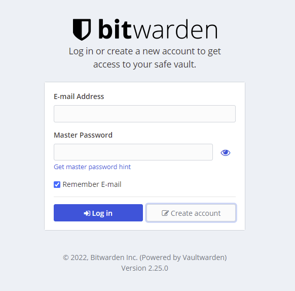
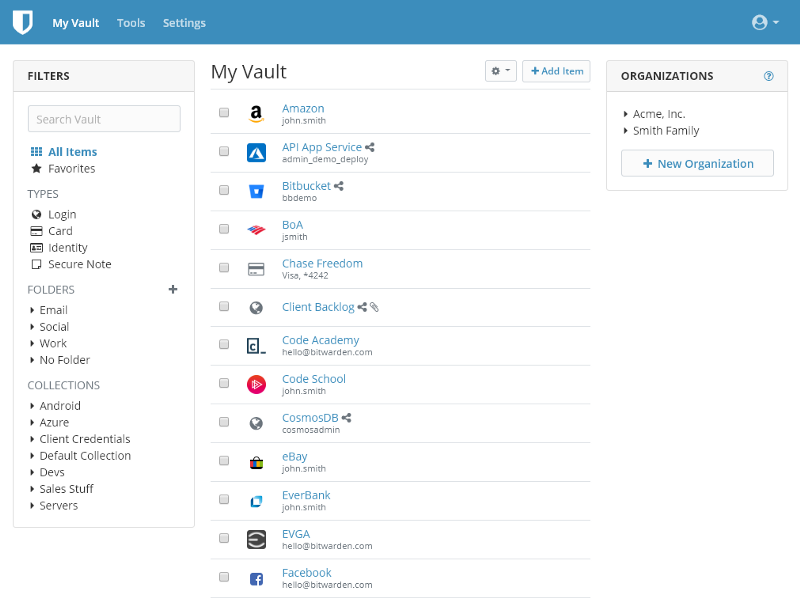
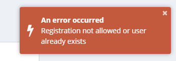

**Note:**
> When you self-host your password manager, you must be willing to take responsibility for the security and reliability of sensitive data on your server.
Make sure you're comfortable with the application's security features before storing critical data and passwords.
Also, you're responsible for having up-to-date backups of your server in case anything goes wrong.

## Introduction
In this tutorial, I'll guide you through on how to set up Vaultwarden for Bitwarden, which lets you enjoy all
the premium features Bitwarden has to offer, completely free.

On [Wikipedia](https://en.wikipedia.org/wiki/Bitwarden), Bitwarden is described as follows:  
Bitwarden is a free and open-source password management 
service that stores sensitive information such as website credentials in an encrypted vault. 
The Bitwarden platform offers a variety of client applications including a web interface, desktop applications,
browser extensions, mobile apps, and a command-line interface. Bitwarden offers users to self-host their vaults. <br>

*The last part is what we're interested in!*

## What we'll do

* Install and set up Docker.

* Install and configure [Vaultwarden](https://github.com/dani-garcia/vaultwarden) as a Docker image.

* Set up a reverse proxy.
   * In this case we'll be using Caddy, but you can use any other reverse proxy if you're familiar with one.


## Install Docker 

1. Uninstall any packages that may have been installed previously.
`
sudo apt-get remove docker docker-engine docker.io containerd runc
`

*Continue to the next step if apt-get reports that no packages were located.*

2. Install required packages.
   ` sudo apt-get install apt-transport-https ca-certificates curl gnupg-agent software-properties-common`

3. Add the key for the official Docker GPG repository.
   ` sudo curl -fsSL https://download.docker.com/linux/ubuntu/gpg | sudo apt-key add -`
   
4. Add the Docker upstream repository.
   `sudo add-apt-repository "deb [arch=amd64] https://download.docker.com/linux/ubuntu $(lsb_release -cs) stable"`
   
5. Make sure the apt package cache is up to date.
   ` sudo apt-get update`
   
6. Install the Docker packages that are required.
   ` sudo apt-get install docker-ce docker-ce-cli containerd.io`
   
7. Start the docker daemon and enable it.
   `sudo systemctl enable --now docker`
    

8. Verify that you are able to run docker commands. The following command should return zero running containers with no problems.
   `sudo docker ps`   


## Install Vaultwarden

This section walks you through downloading the Vaultwarden Docker image, configuring volume persistence, and managing the Docker container.

 1. Pull the Vaultwarden image.
`
 sudo docker pull vaultwarden/server:latest
`

2. Choose the file system path where you want the application data to be saved. The path /srv/vaultwarden is used in this guide. If necessary, create the directory and set strict permissions for the root user only.
   `sudo mkdir /srv/vaultwarden`
` sudo chmod go-rwx /srv/vaultwarden`
3. Create the Docker container for Vaultwarden.
   `sudo docker run -d --name vaultwarden -v /srv/vaultwarden:/data -e WEBSOCKET_ENABLED=true -p 127.0.0.1:8080:80 -p 127.0.0.1:3012:3012 --restart on-failure vaultwarden/server:latest`

This command uses the following flags to establish a persistent container to serve the Vaultwarden application:

* -d causes the container to be daemonized and run in the background. The —name vaultwarden option assigns a human-readable name to the container. To obviate the requirement for a temporary identifier to refer to the operating container.
* When the volume (-v) flag is set to the host path /srv/vaultwarden, data is persisted outside of the container once it is stopped. Vaultwarden's extra websocket server is enabled by the environment variable WEBSOCKET ENABLED. Each -p flag forwards the container's corresponding host ports (port 8080 for the main Vaultwarden web service and port 3012 for websocket traffic). Caddy supports both HTTP and HTTPS protocols.
* In the event of container failure or host restart, —restart=on-failure ensures that the container remains online.
Note that the container listens for traffic on the local loopback interface (127.0.0.1), not a publicly available IP address, as part of these processes. This is done to ensure that all traffic coming from outside the host is routed through the Caddy server, which uses encrypted TLS connections.

## Configure Caddy as a Reverse Proxy

* You can skip this part if you want to use another reverse proxy.


Caddy, which oversees reverse proxying websocket traffic, communicates with external clients. Caddy also uses Let's Encrypt to automatically supply and renew TLS certificates. The caddy images are available in a variety of flavors, each tailored to an unique use case.

`caddy:<version>`

This is the image that has become the de facto standard. This is the one to use if you're not sure what you're looking for. It's made to be used as both a trash can and a recycling container. To start the program, mount the source code and start the container. Also, this can be used as a foundation for creating other images.


 1. Pull the Caddy image.
`
 sudo docker pull caddy:2
`

2. Create the following Caddyfile. Replace example.com with the name of the domain you created in the Before You Begin portion of this guide, and double-check that it points to the Linode's IP address. This domain hosts the Vaultwarden web interface, which is protected by Caddy's automated TLS.
   
  `File: /etc/Caddyfile`
   ```
example.com {
  encode gzip

  # The negotiation endpoint is also proxied to Rocket
  reverse_proxy /notifications/hub/negotiate 0.0.0.0:8080

  # Notifications redirected to the websockets server
  reverse_proxy /notifications/hub 0.0.0.0:3012

  # Send all other traffic to the regular Vaultwarden endpoint
  reverse_proxy 0.0.0.0:8080
}
   ```
   
**Note:**    
> The site name you choose in this file must be the same as the desired URL for Vaultwarden. When you get to the web interface later in this guide, make sure you use the same hostname as you did in the configuration file (in this example, example.com).

3. Run a persistent caddy daemon in another Docker container.

   
4. Create a directory in /etc for Caddy to keep state information like Let's Encrypt certificates.
   `sudo mkdir /etc/caddy`
 `sudo chmod go-rwx /etc/caddy`
 
   ` sudo docker run -d -p 8080:80 -p 443:443 --name caddy -v /etc/Caddyfile:/etc/caddy/Caddyfile -v /etc/caddy:/root/.local/share/caddy -v caddy_data:/data \ --restart on-failure caddy:2`
5. Check the Caddy container's logs to see if a Let's Encrypt certificate for the chosen domain has been provisioned.
   `sudo docker logs caddy`

## First-time setup

1. Open a local web browser and go to the desired domain (in this tutorial, example.com). Check that the Bitwarden web vault login page is rendered in your browser and that it is served over TLS/SSL.



If you see the login page, congratulations! Vaultwarden is now up and running. To use the password manager, you must first create an account. To do so, go to the login page and click the "Create Account" button.

2. A new page with multiple fields appears.


Fill in the relevant information in each field, then choose a strong and secure master password.

**Note:**   
> While a user email is required at the time of registration, Vaultwarden cannot send email by default without additional settings. By default the [ports 25 / 465 are blocked on new Hetzner servers](https://docs.hetzner.com/cloud/servers/faq/#why-can-i-not-send-any-mails-from-my-server), but you can at any time request an unblocking, in order to enable [Vaultwarden to send email.](https://github.com/dani-garcia/vaultwarden/wiki/SMTP-configuration) When following the instructions, use SMTP information from an SMTP provider.

3. The system takes you to the login screen after you've registered. Use the credentials to log in. The web vault view is displayed.



#### Disable Anonymous User Sign Up

You can also choose to disable user registration as an extra security measure. To prevent abuse of the service, this is advised on servers that are publicly accessible.

1. Shut down the Vaultwarden container that is currently running and remove it.

 `sudo docker stop vaultwarden`
` sudo docker rm vaultwarden`

2. Create a new vaultwarden container and set the SIGNUPS ALLOWED environment variable to false.

 `sudo docker run -d --name vaultwarden -v /srv/vaultwarden:/data -e WEBSOCKET_ENABLED=true -e SIGNUPS_ALLOWED=false -p 127.0.0.1:8080:80 -p 127.0.0.1:3012:3012 --restart on-failure vaultwarden/server:latest`

3. If you try to create a new account after these changes, the account creation screen displays the following problem.



Additional user registrations are not permitted in this Vaultwarden deployment. If you don't want to update the Vaultwarden container environment variable flags, you can still invite users. The admin panel can be enabled by following the upstream guidelines. User invitations can be sent from the [administrator interface](https://github.com/dani-garcia/vaultwarden/wiki/Enabling-admin-page).


## Running with Docker Compose
**Note:**   
> It is recommended to follow this step, as it will make things easier to maintain and update in the future.

1. Stop and remove Vaultwarden and Caddy

 `sudo docker stop vaultwarden`
` sudo docker rm vaultwarden`

 `sudo docker stop caddy`
` sudo docker rm caddy`

Now we'll install Docker Compose.

2. Run this command to download the current stable release of Docker Compose:

`sudo curl -L "https://github.com/docker/compose/releases/download/1.29.2/docker-compose-$(uname -s)-$(uname -m)" -o /usr/local/bin/docker-compose
`

3. Apply executable permissions to the binary:

`sudo chmod +x /usr/local/bin/docker-compose`

4. Now create a directory of your choosing and CD into it, then create the following file as
docker-compose.yml , (and 
edit values, like DOMAIN, and EMAIL)
 > If you're not using Caddy, you can simply ignore the part with Caddy
 
 `File: /yourdirectory/docker-compose.yml`
   ```
version: '3'
services:
  vaultwarden:
    image: vaultwarden/server:latest
    environment:
      WEBSOCKET_ENABLED: "true"
      SIGNUPS_ALLOWED: "false"
    restart: unless-stopped
    ports:
      - 8080:80
    volumes:
      - /srv/vaultwarden:/data

  caddy:
    image: caddy:2
    restart: unless-stopped
    ports:
      - 443:443
    volumes:
      - /etc/Caddyfile:/etc/caddy/Caddyfile:ro
      - ./caddy-config:/config
      - ./caddy-data:/data
    environment:
      - LOG_FILE=/data/access.log
   ```

5. Now run the following command:

`sudo docker-compose up -d`

### How to connect through Bitwarden applications

To connect your devices to your new Vaultwarden server, please follow this guide from Bitwarden, https://bitwarden.com/help/change-client-environment/


## Conclusion

Thanks for reading my guide, I hope it helps.
I've been using Bitwarden self-hosted for months now, and I've loved every moment of it. Furthermore Hetzner provides very stable 
hosting for things as critical as a password manager which always must be online.


##### License: MIT

<!--
Contributor's Certificate of Origin
By making a contribution to this project, I certify that:
(a) The contribution was created in whole or in part by me and I have
    the right to submit it under the license indicated in the file; or
(b) The contribution is based upon previous work that, to the best of my
    knowledge, is covered under an appropriate license and I have the
    right under that license to submit that work with modifications,
    whether created in whole or in part by me, under the same license
    (unless I am permitted to submit under a different license), as
    indicated in the file; or
(c) The contribution was provided directly to me by some other person
    who certified (a), (b) or (c) and I have not modified it.
(d) I understand and agree that this project and the contribution are
    public and that a record of the contribution (including all personal
    information I submit with it, including my sign-off) is maintained
    indefinitely and may be redistributed consistent with this project
    or the license(s) involved.
Signed-off-by: Buster Mønster - mail@towyfilms.com
-->