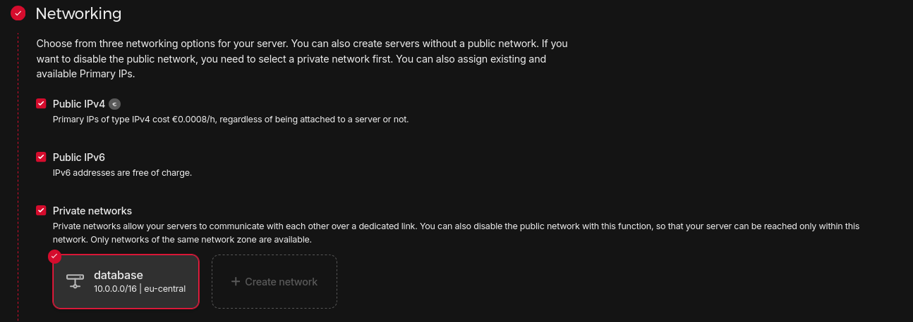

## Introduction

YugabyteDB is a highly available, distributed SQL database designed to withstand failures and ensure continuous operation. Its architecture is built upon principles of data replication and consensus, meaning that data is automatically duplicated across multiple nodes. This ensures that even if a node experiences an outage due to hardware failure, maintenance or software issues/updates, your database remains accessible with no data loss.

In this tutorial, we will setup a highly available cluster, explicitly setting our servers on different physical hosts within the same region, providing resilience against individual host's failures and ensuring our cluster remains continuously available.

**Replication Factor**

Simply put, the "Replication Factor" (RF) dictates how many copies of your data are maintained across your cluster. If you set your RF to 1, there's only one copy of your data. While this might seem efficient, it offers no fault tolerance — if that single node goes down or you need to do a maintenance, your data becomes unavailable. To achieve a higher availability, we need an RF of 3, at least. The general rule is that you need at least as many nodes in your cluster as your chosen RF. So, for an RF of 3, we would need a minimum of three nodes.

[As per docs](https://docs.yugabyte.com/preview/deploy/checklist/#replication), if RF is n, YugabyteDB can survive floor((n - 1) / 2) failures without compromising correctness or availability of data. For the purpose of this tutorial, we will be using a replication factor of 3. This is the minimum recommended RF for a production environment, as it can tolerate the loss of 1 node.

## Step 1 - Creating our servers

First, let's create our 3 cloud servers. In this tutorial, we will use Hetzner as an example. For a step-by-step guide, see [this guide](https://docs.hetzner.com/cloud/servers/getting-started/creating-a-server).

- For the location, select the same for all servers. I will be using Helsinki.
- As image, we will be using Debian.
- For our demo, we are fine with CAX11 (Arm64, 2 vCPUs, 4GB RAM). For a production workload, CAX41, CPX51, or CCX43 would be the minimum recommendations.
- We will keep public IPv4 and IPv6 enabled. We will also create a private network, for a more efficient connection between our servers.
  
- To provide resilience against individual host's failures, we will setup a [Placement Group](https://docs.hetzner.com/cloud/placement-groups/overview). It's limited to 10 servers, so it would not be appropriate for a larger cluster.
  

Once our servers are created, we can SSH into each of them. Setup a new user with sudo permissions as explained in [this tutorial](https://community.hetzner.com/tutorials/howto-initial-setup-ubuntu).

## Step 2 - Installing YugabyteDB

All of these commands should be run on each server. As a best-practice, we can update our server:

```bash
sudo apt update && sudo apt upgrade -y
```

Now, we need to [tune kernel settings](https://docs.yugabyte.com/preview/deploy/manual-deployment/system-config/#kernel-settings). We can do this running the following commands:

```bash
sudo bash -c 'sysctl vm.swappiness=0 >> /etc/sysctl.conf'
sudo sysctl kernel.core_pattern=/home/yugabyte/cores/core_%p_%t_%E
sudo sysctl -w vm.max_map_count=262144
sudo bash -c 'sysctl vm.max_map_count=262144 >> /etc/sysctl.conf'
sudo apt install sysfsutils -y
sudo nano /etc/sysfs.conf
```

Add the following line at the end of this file:

```bash
kernel/mm/transparent_hugepage/khugepaged/max_ptes_none = 0
```

Save the file and exit. **Reboot your server.**

Python 3 is installed by default on Debian 12, but if we try to run `python --version`, we get the following output:

```shellsession
holu@server-1:~# python --version
-bash: python: command not found
holu@server-1:~#
```

To make this work, we need to install `python-is-python3`:

```bash
sudo apt install python-is-python3 -y
```

YugabyteDB provides binaries for both x86 and Arm (aarch64) CPU architectures. As we are using CAX11, we can download and extract as follows:

```bash
wget https://software.yugabyte.com/releases/2024.2.3.2/yugabyte-2024.2.3.2-b6-el8-aarch64.tar.gz
tar xvfz yugabyte-2024.2.3.2-b6-el8-aarch64.tar.gz
```

The `wget` command above downloads a specific version of YugabyteDB (`2024.2.3.2`), which was the latest at the time of writing this article. For the absolute latest version or for x86 architecture binaries, please refer to the [official YugabyteDB documentation](https://docs.yugabyte.com/preview/deploy/manual-deployment/install-software/#download-yugabytedb).

Now let's run the post-install script:

```bash
cd yugabyte-2024.2.3.2/
./bin/post_install.sh
```

Let's also create a directory to store our data by creating `yugabyte-data` in `/<your_user>/yugabyte-data`:

```bash
mkdir -p $HOME/yugabyte-data/master
mkdir $HOME/yugabyte-data/tserver
```

## Step 3 - Starting YB-Masters

The following command will be run on each server within the `yugabyte-####.#.#.#` directory:

```bash
./bin/yb-master \
  --master_addresses 10.0.0.2:7100,10.0.0.3:7100,10.0.0.4:7100 \
  --rpc_bind_addresses 10.0.0.2:7100 \
  --fs_data_dirs "$HOME/yugabyte-data/master" \
  --placement_cloud hetzner \
  --placement_region hel \
  --placement_zone hel \
  >& $HOME/yb-master.out &
```

- `master_addresses`: provides the IP of our YB-Masters. We are passing the private IP of the network we created.
- `rpc_bind_addresses`: when running this command on each server, **you should replace `10.0.0.2` with the private IP of the current server**.
- `fs_data_dirs`: the directory we created previously to store our data.
- `placement_cloud`, `placement_region` and `placement_zone`: YugabyteDB supports multi-cloud, multi-region and multi-zone deployment. In our case, we can just pass `hetzner` for the cloud, and `hel` for `placement_region` and `placement_zone`. You can of course pass `fsn` if you're deploying in Falkenstein, or any other value for other regions.

To make sure our YB-Masters are fine, we can check the logs, which should be empty:

```bash
cat ../yb-master.out
```

## Step 4 - Starting YB-TServers

On each server, we will run the following command:

```bash
./bin/yb-tserver \
  --tserver_master_addrs 10.0.0.2:7100,10.0.0.3:7100,10.0.0.4:7100 \
  --rpc_bind_addresses 10.0.0.2:9100 \
  --enable_ysql \
  --pgsql_proxy_bind_address 10.0.0.2:5433 \
  --cql_proxy_bind_address 10.0.0.2:9042 \
  --fs_data_dirs "$HOME/yugabyte-data/tserver" \
  --placement_cloud hetzner \
  --placement_region hel \
  --placement_zone hel \
  >& $HOME/yb-tserver.out &
```

- `tserver_master_addrs`: provides the IP of our YB-Masters. We are passing the private IP of the network we created.
- `rpc_bind_addresses`: when running this command on each server, **you should replace `10.0.0.2` with the private IP of the current server**.
- `enable_ysql`: enables [YSQL API](https://docs.yugabyte.com/preview/api/ysql/).
- `pgsql_proxy_bind_address`: specifies the IP address and port for YSQL. **You should replace `10.0.0.2` with the private IP of the current server**.
- `cql_proxy_bind_address`: specifies the IP address and port for [YCQL](https://docs.yugabyte.com/preview/api/ycql/). **You should replace `10.0.0.2` with the private IP of the current server**.
- `fs_data_dirs`: the directory we created previously to store our data.
- `placement_cloud`, `placement_region` and `placement_zone`: Just like YB-TServers, we can just pass `hetzner` for the cloud, and `hel` for `placement_region` and `placement_zone`.

To make sure our YB-TServers are fine, we can check the logs:

```bash
cat ../yb-tserver.out
```

If you are using a firewall, make sure it allows ports 7000, 7100, 9100, 9042 and 5433 (e.g. `sudo ufw allow 7000`).

Now our cluster is up and running. We can access our dashboard by setting up an SSH Tunnel, as the dashboard is only accessible from inside the servers:

```bash
ssh -L 7000:<private_ip>:7000 root@<public_server_ip>
```

As YB-Masters is running on all 3 servers, the dashboard is available on any of them.

Now open your browser on `http://localhost:7000`:


## Step 5 - Additional considerations

* **Multi-region**
  
  While deploying servers on different hosts within the same Hetzner data center provides excellent availability against single node and host failures, even higher availability can be achieved through a multi-region deployment. For example, we could setup our cluster with nodes in Nuremberg, Falkenstein, and Helsinki. This would ensure that even if an entire data center became unavailable, our database would still be accessible.
  
  **However, it's crucial to understand a key trade-off with this setup: performance**. YugabyteDB utilizes synchronous replication for strong consistency, so we would have significantly slower writes operations due to network latency between data centers.

<br>

* **Data durability**
  
  Worth mentioning that Hetzner volumes are highly available and reliable. However, YugabyteDB is designed with its own distributed replication mechanism. Because YugabyteDB handles data replication at the application layer to achieve high availability and fault tolerance (as discussed with the replication factor), it does not require any form of RAID at the operating system or hardware level. In fact, YugabyteDB runs optimally on a [JBOD (Just a Bunch Of Disks)](https://en.wikipedia.org/wiki/Non-RAID_drive_architectures) setup. This means you can simply present individual disks to the YugabyteDB nodes, and the database will manage its own data distribution and redundancy across disks and nodes. This is particularly beneficial when using Hetzner's dedicated servers, where you have direct control over the physical disks.

## Conclusion

Now we have a YugabyteDB cluster on Hetzner that's tolerant to single node and host failures. From now on, you can configure [backups](https://docs.yugabyte.com/preview/manage/backup-restore/), [firewalls](https://docs.hetzner.com/cloud/firewalls/getting-started/creating-a-firewall/), automated server updates, and more on.

##### License: MIT

<!--

Contributor's Certificate of Origin

By making a contribution to this project, I certify that:

(a) The contribution was created in whole or in part by me and I have
    the right to submit it under the license indicated in the file; or

(b) The contribution is based upon previous work that, to the best of my
    knowledge, is covered under an appropriate license and I have the
    right under that license to submit that work with modifications,
    whether created in whole or in part by me, under the same license
    (unless I am permitted to submit under a different license), as
    indicated in the file; or

(c) The contribution was provided directly to me by some other person
    who certified (a), (b) or (c) and I have not modified it.

(d) I understand and agree that this project and the contribution are
    public and that a record of the contribution (including all personal
    information I submit with it, including my sign-off) is maintained
    indefinitely and may be redistributed consistent with this project
    or the license(s) involved.

Signed-off-by: André Ribeiro <andresribeiro@tutanota.com>

-->
