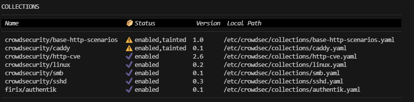
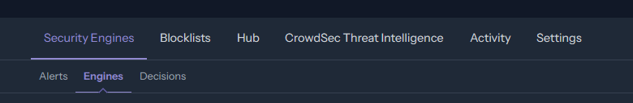
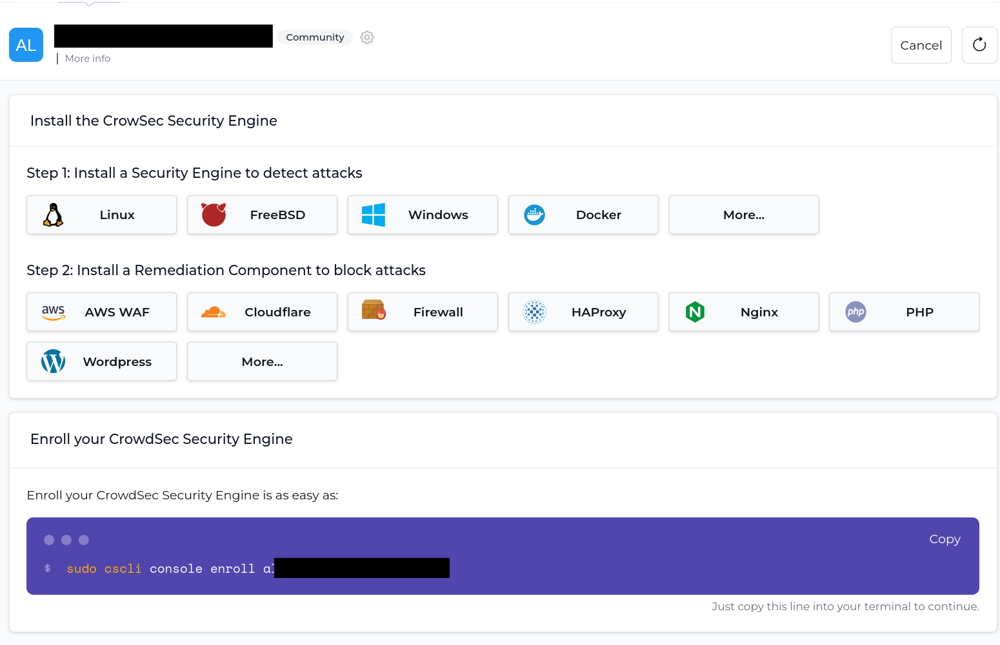
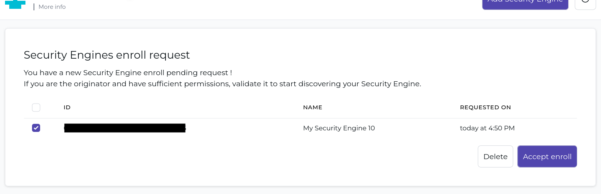
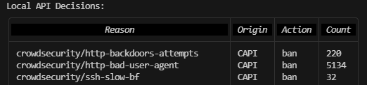

## Introduction

CrowdSec is an easy to set up but immensely powerful tool to protect your server and the services, such as ssh, running on it from a variety of outside attacks. In its function you can probably best compare it to Fail2ban, and while Crowdsec shares similarities with it both in features and how it works, CrowdSec offers a host of new powerful features.

The biggest advantage CrowdSec offers is its automatic aggregation of attacks across all users (You can optionally opt out). This allows your server to preemptively block an IP that has recently attacked multiple other servers connected to the CrowdsSec central API. This is nicely summarized by the statement on their website:
> The CrowdSec Security Engine is a powerful, open-source software for detecting and blocking malicious IPs, safeguarding both infrastructure and application security. [CrowdSec's Website](https://www.crowdsec.net/security-engine)

Don't worry about what a "Security Engine" is just yet, as all this will be explained below.

In the following I will guide you through how CrowdSec works, how to install it and how to set it up to protect your SSH service.

**Prerequisites**

* A server running Ubuntu 22
* Services you would like to protect, this tutorial will use SSH as an example.
* Basic knowledge of the Command line, and ideally though **not specifically required** knowledge about terms like: IP, Port, Firewall
> Other Versions or even Distros will most likely work too(with some adjustments), but commands shown were run on Ubuntu 22.

## Step 1 - Understanding Crowdsec

As mentioned previously, if you are familiar with how Fail2ban work's, CrowdSec uses basically the same approach. It scans (at least most of the time) log files for certain patterns, if certain thresholds are met it takes action such as blocking the offending IP address. An example for this is your SSH service, which we will be used as an example throughout this tutorial. Crowdsec looks at the logs, see's failed login attempts and as a reaction to multiple failed attempts blocks the IP to protect your server from a brute force attack.

In Fail2ban all this is handled by one tool, meanwhile Crowdsec splits the process into two main parts:
* The Security Engine

  The Security Engine is responsible for actually monitoring logs and detecting suspicious behavior, this process in itself is split even further into "Scenarios", "Parsers" and more which will be explained further on in the tutorial. Whenever suspicious behavior is detected the Security Engine makes a so-called decision, furthermore it tells the Central Crowdsec API about this decision, while also getting reports of other harmful IP's back. Together these lists of IP's, created from local decisions and those received from the central API can then be accessed by Remediation components (explained below), via the so-called "Local API".

  Important to note is that the security engine, alone, **will not** protect your server by taking action.
* Remediation components

  The Remediation components are basically installable components for CrowdSec, but compared to the Security Engine, these are responsible for taking actions. Simply said, they react to the decisions of the Security Engine by for example blocking an IP in your firewall. Which is exactly what we will be doing later on in this tutorial.

More info can always be found in the [CrowdSec Documentation](https://doc.crowdsec.net/docs/intro)

## Step 2 - Installing Crowdsec

First we need to install Crowdsec and with it the Security Engine.

> Commands will be shown with "sudo" at the front if root permission is needed. If you are using the root account this is of course not required.

The official documentation from CrowdSec recommends using their own installation script which we will be doing with the following command

```bash
   curl -s https://install.crowdsec.net | sudo sh
```
Overall this script adds the needed repositories to your system to install CrowdSec which can be done with the following command:
```bash
   sudo apt install crowdsec
```
And that's basically all you need to do to get the Security Engine running with a basic setup. During installation, CrowdSec automatically detects certain services such as SSH and already installs the needed scenarios and parsers, more on them later. You can check if everything works with the following command, ignore the output for now:
```bash
   sudo cscli collections list
```
You should get something similar to this, although probably with a shorter list (depending on the services installed on your system), and hopefully without warning sing(in this example caused by manual modifications):




After installation there will also be two new commands available, `crowdsec` & `cscli` as used above. The `crowdsec` doesn't get used much, way more important is the `cscli` command, which stands for "CrowdSec CLI". With it, you can manage your Security engine, install collections and take a look at metrics, I will highlight some commands later, but you can always find all the available ones in the [documentation](https://doc.crowdsec.net/docs/cscli/).


### Step 2.1 - Installing your first Remediation component

Now that you got a running Security Engine, it's time for your first remediation component. The awesome thing about Crowdsec is that you can choose these components yourself. As such, there are very specific ones, which for example can trigger a Captcha to be shown on a NGINX web server.

Most often however you probably just want to outright block a certain IP, for this you need to block them in your firewall. Luckily, CrowdSec also has a component for exactly this called `crowdsec-firewall-bouncer-iptables`
> Note that previosuly CrowdSec called remediation components "Bouncers", which explains the name above. You will still often see the term "Bouncer" just know that it refers to a remediation component.

To install it, simply run:
```bash
   sudo apt install crowdsec-firewall-bouncer-iptables
```
Congrats! You have just finished securing your with CrowdSec, although there are a few more steps to get the best out of CrowdSec, and we have yet to check if it's actually fully working.


### Step 2.2 - Linking to CrowdSec Console (Optional but **strongly** recommended)

Another great feature CrowdSec offers is the so called "CrowdSec Console", but you need a CrowdSec account to access it. This account is completely free, and while they offer paid plans, they are aimed at Business customers and are definitely not needed for Hobbyists, Developers or even small companies.

1. To create your account, head over to https://app.crowdsec.net/signup
2. Enroll your Security Engine

   To do this, go to the Security Engines > Engines Page as shown below if you are not already there:
   

   Afterward, you should see something like this:
   

   At the top, you can access the instructions again on how to install the Security Engine and, as well as various different Remediation Components. Most importantly though at the bottom you will find a command to enroll your Security Engine, copy this command and run it on your Server.

   Afterward, you need to check the website again and should see something as shown below:

   

   Click "Accept enroll" and your security Engine is now linked to your CrowdSec account, allowing you to access a whole load of new features, some of which I will highlight in the following sections.


## Step 3 - Looking at Metrics and seeing if everything works

We will deal with the Crowdsec web-console later, for now let's hop back into the terminal. First, let's go over some useful commands:

***
```bash
   sudo cscli metrics
```
This command is probably the most interesting one, with it, you can take a peek at all the statistics of your Security Engine (And Remediation Components). For a full summary of what everything means I can only recommend reading the docs, the specific ones you can find [here](https://doc.crowdsec.net/docs/observability/cscli)

But here is a short summary:

+ Acquisition Metrics:
   + These show you how many lines of logs CrowdSec has monitored, how many of those were actually relevant to look at, and how many of them were counting towards a limit. Something you should be able to see is `file:/var/log/auth.log`, that's the file where SSH login attempts are being logged. Maybe you are even seeing that Crowdsec has already read or parsed some lines. If so, great! Your security engine is definitely monitoring for malicious SSH login attempts, don't worry if it's all 0, check back later, maybe there was actually nothing logged yet.
+ Local API Alerts:
   + If you can see anything here, then your CrowdSec setup has already reacted to a certain scenario being triggered and has sounded the "alarm". An example would be `crowdsecurity/ssh-bf`, the number next to it would indicate how many people it has blocked from your server for attempting to brute force your SSH login.
+ Local API Decisions:
   + This is similar to the above, but while an Alert is only saying a certain scenario was detected, as decision is the Security Engine reaction to a scenario, basically when it decides "`<xxx.x.xxx.x>` needs to be blocked".  
     
     But most importantly, this shows all the decisions, including those received from the central CrowdSec API, as shown in the example below. Here `CAPI` stands for Central API, this is where you will be able to see the true power of using CrowdSec compared to for example Fail2ban. Thousands of IPs will be already banned based on Crowd information, protecting your server from ever being reached by them.

     
+ Local API Metrics:
  + More advanced topic, but here you can basically which parts of your local API (aka your Security Engine), got requested and how often
+ Local API Bouncers Metrics:
  + Similar to the above but for your individual remediation components.
+ Parser Metrics:
  + To understand this one, you first need to understand what a parser is. As shown at the top of this list, CrowdSec first deals with Acquisition. This basically means CrowdSec collects all the logs, these then get run through "Parsers", these are what actually detect certain Patterns/lines, such as a log line stating a failed login.

    But CrowdSec Parsers are actually more advanced as there are even some that can add info not present in the original logs, such as Geo Location, but this is way more advance.

    Overall, here you will see how many lines were read, and how many actually matched a certain Pattern your CrowdSec instance is looking out for.
+ Scenario Metrics:
  + A scenario is in its most basic definition a condition, it can be something as simple as "5 failed login attempts within 30 seconds".
    
    Basically these metrics will show you how many log lines, which were previously detected by parsers, were important for each of your installed scenario's. Further, how many of them simply expired because they never reached the threshold and how many actually caused an "Overflow", triggering the scenario and with it an Alert, leading to a decision.
+ Whitelist Metrics:
  + How many log lines were ignored because they matched your whitelists. The default whitelist for example includes all your local IPs, after all it doesn't make sense for your server to be banning its own private IP addresses, right?

---

Overall, to check if CrowdSec is protecting your SSH login, one could check the following:
+ Acquisition Metrics: `file:/var/log/auth.log` showing and possibly already counting. (Logs are being fetched)

  If this is showing you should be good, but there are more metrics to look at, these might just not be showing yet because they have simply not been triggered yet on your fresh installation.

+ Local API Alerts: `crowdsecurity/ssh-bf` would show alerts for suspected SSH brute force attempts.
+ Local API Decisions: Here you will either already see decisions by your local Security engine for `crowdsecurity/ssh-bf` or, if marked with `CAPI`, decisions received from the CrowdSec network. Even these take some time to first get fetched on a fresh install, check back later if they are missing. 
+ Local API Bouncers Metrics: You should see your firewall remediation component (bouncer) here, actively checking for fresh IPs that need to be blocked.
+ Parser Metrics: Similar to `Local API Alerts`.
+ Scenario Metrics: Here you can see the certain scenarios counting for possible thresholds being exceeded. For SSH there is a few for example: `crowdsecurity/ssh-bf` & `crowdsecurity/ssh-slow-bf`

## Step 4 - Overview of possible next steps

Glad you have made it this far, if you have followed the steps above you should now have a working and running CrowdSec instance protecting your server from possible SSH login attempts, but this is only the start.

CrowdSec is a very modular tool, so here are some hints to get you started on your Journey:
#### Collections
Collections are pre-selected groups of Parsers and Scenarios for certain programs/services/tools.
> If you remeber Parsers detect certain logs, and enrich them with data, and scenario's define certain threshold which cause an alert.

You can use these Collections to protect further services on your server, for example, a web server like Caddy. A collection would contain the needed parsers to read the log files, as well as scenarios which would suggest malicious behavior. If you run the following command, you might also notice CrowdSec already installed a few other collections besides the SSH one on your server. CrowdSec does this on the initial installation for certain services, so you might notice that CrowdSec has also already started protecting some of your other services.
```bash
   sudo cscli collections list
```

You can find these collections in the CrowdSec web-console under the hub section. While most come from CrowdSec themselves, they can also be community made, so check the contents before installing them. 

> **Very Important:** A collection alone wont protect your server/serivce, while it contains the needed Parsers and Scenarios there is two important things. You need to have a remediation Component, which you should have if you have followed this tutorial. But furthermore, you need to tell CrowdSec where to fetch the needed logs, this varies for every collection and you will usually find it on their page. There you should see instructions for what to add to your "Acquisition", which are the config files telling CrowdSec where to look for certain logs. But remember you need to do this manually, CrowdSec did it automatically for SSH but wont for new Collections.

#### More Remediation Components
Also to be found in the CrowdSec web-console under the Hub section, are more Remediation Components. While blocking an IP outright at your firewall is very secure and effective, this is not always desirable. If using a collection to protect a web server, for example, a customer could accidentally trigger a scenario. Now, banning this person's IP from your web services would be a complete over reaction.

For this exact reason, CrowdSec offers a variety of Remediation Components which can integrate directly into software like NGINX or Caddy. Here they can for example only block the IP from using this specific services or actually triggering behavior such as showing a captcha to verify it's actually a Customer and not a bot you are dealing with.

Again, treat with caution as mentioned above, and be sure to read the specific documentation.

#### Blocklists
Blocklists are another feature of CrowdSec, found on the web-console under "Blocklists". Here you can subscribe to certain blocklists, and add them to your individual servers. The CrowdSec service on your server will then also download these lists of IP's and for example block them in your firewall. The difference here is that these blocklists are not created from decisions of other CrowdSec users but are rather created by certain third-party's.

So be sure you trust whoever manages the chosen Blocklist and that it doesn't accidentally block IP's that are not malicious or important for your services.

#### Statistics, Appsec and more
In the web-console, you will also find more like statistics on decision taken by your CrowdSec Security Engine and Appsec rules. But these are out of the scope of this tutorial, feel free to explore them, and if necessary read the documentation belonging to them.

## Conclusion

If you have followed this tutorial, you should have a working CrowdSec setup on your Server. This includes the Security Engine monitoring your server for SSH login attempts, and a Remediation component blocking offending IP's directly in your firewall from interacting with your server.

Further, you should be able to understand the basic terminology of CrowdSec and its many parts, as well as know about the many more possibilities CrowdSec offers.

##### License: MIT
//TODO
<!--

Contributor's Certificate of Origin

By making a contribution to this project, I certify that:

(a) The contribution was created in whole or in part by me and I have
    the right to submit it under the license indicated in the file; or

(b) The contribution is based upon previous work that, to the best of my
    knowledge, is covered under an appropriate license and I have the
    right under that license to submit that work with modifications,
    whether created in whole or in part by me, under the same license
    (unless I am permitted to submit under a different license), as
    indicated in the file; or

(c) The contribution was provided directly to me by some other person
    who certified (a), (b) or (c) and I have not modified it.

(d) I understand and agree that this project and the contribution are
    public and that a record of the contribution (including all personal
    information I submit with it, including my sign-off) is maintained
    indefinitely and may be redistributed consistent with this project
    or the license(s) involved.

Signed-off-by: [submitter's name and email address here]

-->
