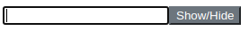

## Einführung

[Vue.js](https://vuejs.org/) ist ein clientseitiges Javascript-Webframework, vergleichbar mit React.js oder Angular.

Dieses Tutorial zeigt, wie in Vue.js 3.* wiederverwendbare "Components" anhand eines Passwortfelds mit einem Sichtbarkeit-Button erstellt werden.

**Voraussetzungen**

* Basis Wissen über Vue.js, Javascript, HTML und CSS.

## Schritt 1 - Projekt einrichten

Zu Beginn wird die Ordnerstruktur des Projekts mit dem Befehl `mkdir` erstellt:

```bash
mkdir -p vue-project/src
```

Im Anschluss wechseln wir mit dem Befehl `cd` in den root `src` Ordner:

```bash
cd vue-project/src
```

Hier erstellen wir mit dem Befehl `touch` eine neue Datei mit dem Namen `index.html`:

```bash
touch index.html
```

In dem Texteditor deiner Wahl, öffne die neue HTML Datei und füge folgenden Basic HTML Code hinzu:

```html
<!DOCTYPE html>
<html lang="en">
    <head>
        <meta charset="utf-8"/>
        <title>Toggle password visibility</title>
        <script src="https://unpkg.com/vue@next"></script> <!-- Load newest vue.js version -->
    </head>

    <body>
        <!-- Add content in Step 2 and 3 -->
    </body>
</html>
```

## Schritt 2 - Vue.js App erstellen

Wir erstellen mit dem Befehl `touch` die Datei `main.js` im Ordner `src`:

```bash
touch main.js
```

In dieser Datei wird eine Vue App (ohne Eigenschaften) erstellt:

```javascript
const app = Vue.createApp({})
```

Nun fügen wir folgenden `div`-Block als root Instanz in den Body Teil der `index.html` mit der ID `app` ein:

```html
<div id="app"></div>
```

Am Ende des Bodys in `index.html` laden wir die Vue App und verbinden diese mit dem vorher erstellten `div`-Block über die ID `app`:

```javascript
<script src="./main.js"></script>
<script>
    app.mount("#app");
</script>
```

## Schritt 3 - Vue.js Component

Components sind wiederverwendbare Instanzen mit einem eigenen Namen. Die Components können als Custom Element innerhalb einer root Instanz verwendet werden.

### Schritt 3.1 - Vorbereiten

Für eine klare Struktur erstellen wir einen Ordner für die Components und unsere erste Component Datei mit dem Namen `PasswordRevealer.js`:

```bash
mkdir components
touch components/PasswordRevealer.js
```

### Schritt 3.2 - Component erstellen

Diese Component `password-revealer` erstellt ein Passwortfeld mit einem Button zum Anzeigen des Passworts.

* Erstellt die Variable `passwordType` und setzt den Wert auf `"password"`.
* Wenn der `<button>` angeklickt wird, wird die Methode `switchVisibility` ausgeführt und der `type` des `<input>` wird zwischen `"text"` und `"password"` gewechselt.

```javascript
app.component('password-revealer', {
    data() {
        return {
            passwordType: 'password'
        };
    },
    methods: {
        switchVisibility() {
            this.passwordType = this.passwordType === 'password' ? 'text' : 'password'
        }
    },
    template:
        /*html*/
        `
        <input id="password" :type="passwordType">
        <button v-on:click="switchVisibility()">Show/Hide</button>
        `
})
```

### Schritt 3.3 - Component verwenden

Am Ende des Bodys wird die erstellte Datei aus Step 3.2 wie folgt in die `index.html` eingebunden:

```html
<body>
  <!-- other code block -->
  <script src="./main.js"></script>
  <script src="./components/PasswordRevealer.js"></script>
  <!-- other code block -->
</body>
```

Nun kann die Component über den Namen `password-revealer` innerhalb der root Instanz verwendet werden:

```html
<div id="app">
  <password-revealer></password-revealer>
</div>
```

## Schritt 4 - Styling (Optional)

Für das Styling des Buttons erstellen wir unser Stylesheet `my-style.css`:

```bash
mkdir -p assets/css
touch assets/css/my-style.css
```

In dieser Datei fügen wir die CSS Klasse `revealer` hinzu:

```css
.revealer {
    color: #fff;
    background-color: #6c757d;
    border-color: #6c757d;
}
```

Das Stylesheet wird in der `<head>` in der `index.html` Datei eingebunden:

```html
<head>
    <!-- other code -->
    <link rel="stylesheet" href="./assets/css/my-style.css">

</head>
```

Die CSS Klasse wird dem HTML Template Element `<button>` in der Component `PasswordRevealer.js` hinzugefügt:

```html
        <button class="revealer" v-on:click="switchVisibility()">Show/Hide</button>
```

Das Ergebnis sieht wie folgt aus:



## Fazit

Eine wiederverwendbare Vue.js Component ist erstellt worden. Diese Component macht das Passwortfeld sichtbar.

Weitere Informationen können in der [Vue.js Dokumentation](https://v3.vuejs.org/guide/introduction.html) nachgelesen werden.

##### License: MIT

<!--

Contributor's Certificate of Origin

By making a contribution to this project, I certify that:

(a) The contribution was created in whole or in part by me and I have
    the right to submit it under the license indicated in the file; or

(b) The contribution is based upon previous work that, to the best of my
    knowledge, is covered under an appropriate license and I have the
    right under that license to submit that work with modifications,
    whether created in whole or in part by me, under the same license
    (unless I am permitted to submit under a different license), as
    indicated in the file; or

(c) The contribution was provided directly to me by some other person
    who certified (a), (b) or (c) and I have not modified it.

(d) I understand and agree that this project and the contribution are
    public and that a record of the contribution (including all personal
    information I submit with it, including my sign-off) is maintained
    indefinitely and may be redistributed consistent with this project
    or the license(s) involved.

Signed-off-by: Thomas Boehringer <dev@tboehringer.de>

-->
