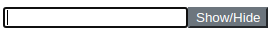

## Introduction

[Vue.js](https://vuejs.org/) is a client-side Javascript web framework, comparable to React.js or Angular.

This tutorial shows how to create reusable "components" in Vue.js, using a password field with a visibility button.

Disclaimer: This tutorial was written and tested for Vue.js 3.0.0

**Prerequisites**

* Basic knowledge about [Vue.js](https://vuejs.org/)
* You will also need a basic knowledge of JavaScript, HTML, and CSS

## Step 1 - Setting Up the Project

At the beginning, the directory structure of the project is created with the `mkdir` command:

```bash
mkdir -p vue-project/src
```

Change into the directory `src` with the `cd` command:

```bash
cd vue-project/src
```

Here, we create a new file named `index.html` with the `touch` command:

```bash
touch index.html
```

In the text editor of your choice, open this new HTML file and add the following basic HTML code:

```html
<!DOCTYPE html>
<html lang="en">
    <head>
        <meta charset="utf-8"/>
        <title>Toggle password visibility</title>
        <script src="https://unpkg.com/vue@next"></script> <!-- Load newest vue.js version -->
    </head>

    <body>
        <!-- Add content in Step 2 and 3 -->
    </body>
</html>
```

## Step 2 - Create Vue.js App

We create a file `main.js` in the directory `src` with the `touch` command:

```bash
touch main.js
```

Open the file and add the following data to create a Vue App without properties:

```javascript
const app = Vue.createApp({})
```

At the end of the body in `index.html` we load the Vue App and connect it to the previously created `div` block via the ID `app`:

```javascript
<script src="./main.js"></script>
<script>
    app.mount("#app");
</script>
```

## Step 3 - Create the Component

Components are reusable instances with their own name. The components can be used as custom elements within a root instance.

### Step 3.1 - Preparing

For a clear structure we create a directory for the components and our first component file with the name `PasswordRevealer.js`:

```bash
mkdir components
touch components/PasswordRevealer.js
```

### Step 3.2 - Create Component

This component `password-revealer` renders a password input field with a reveal button.

* Create the variable `passwordType` and set the value to `"password"`.
* When the `<button>` is clicked, the method `switchVisibility` is executed and toggles the `type` in `<input>` between `"text"` and `"password"`.

```javascript
app.component('password-revealer', {
    data() {
        return {
            passwordType: 'password'
        };
    },
    methods: {
        switchVisibility() {
            this.passwordType = this.passwordType === 'password' ? 'text' : 'password'
        }
    },
    template:
        /*html*/
        `
        <input id="password" :type="passwordType">
        <button v-on:click="switchVisibility()">Show/Hide</button>
        `
})
```

### Step 3.3 - Use Component

At the end of the body in the `index.html` the created file from step 3.2 is included as follows:

```html
<body>
  <!-- other code block -->
  <script src="./main.js"></script>
  <script src="./components/PasswordRevealer.js"></script>
  <!-- other code block -->
</body>
```

Now the component can be used within the root instance via the name `password-revealer`:

```html
<div id="app">
  <password-revealer></password-revealer>
</div>
```

## Step 4 - Styling (Optional)

For the styling of the button we create our stylesheet `my-style.css`:

```bash
mkdir -p assets/css
touch assets/css/my-style.css
```

In this file we add the CSS class `revealer`:

```css
.revealer {
    color: #fff;
    background-color: #6c757d;
    border-color: #6c757d;
}
```

The stylesheet is included in the `<head>` in the `index.html` file:

```html
<head>
    <!-- other code -->
    <link rel="stylesheet" href="./assets/css/my-style.css">

</head>
```

The CSS class is added to the HTML template element `<button>` in the component `PasswordRevealer.js`:

```html
        <button class="revealer" v-on:click="switchVisibility()">Show/Hide</button>
```

The result is as follows:



## Conclusion

A reusable Vue.js component has been created. This component makes the password field visible.

Further information can be found in the [Vue.js documentation](https://v3.vuejs.org/guide/introduction.html).

##### License: MIT

<!--

Contributor's Certificate of Origin

By making a contribution to this project, I certify that:

(a) The contribution was created in whole or in part by me and I have
    the right to submit it under the license indicated in the file; or

(b) The contribution is based upon previous work that, to the best of my
    knowledge, is covered under an appropriate license and I have the
    right under that license to submit that work with modifications,
    whether created in whole or in part by me, under the same license
    (unless I am permitted to submit under a different license), as
    indicated in the file; or

(c) The contribution was provided directly to me by some other person
    who certified (a), (b) or (c) and I have not modified it.

(d) I understand and agree that this project and the contribution are
    public and that a record of the contribution (including all personal
    information I submit with it, including my sign-off) is maintained
    indefinitely and may be redistributed consistent with this project
    or the license(s) involved.

Signed-off-by: Thomas Boehringer <dev@tboehringer.de>

-->
