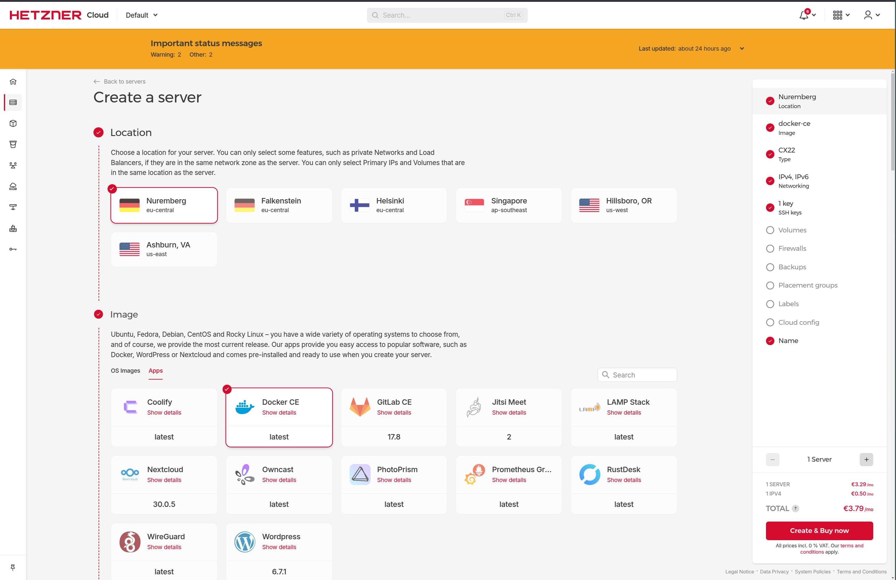
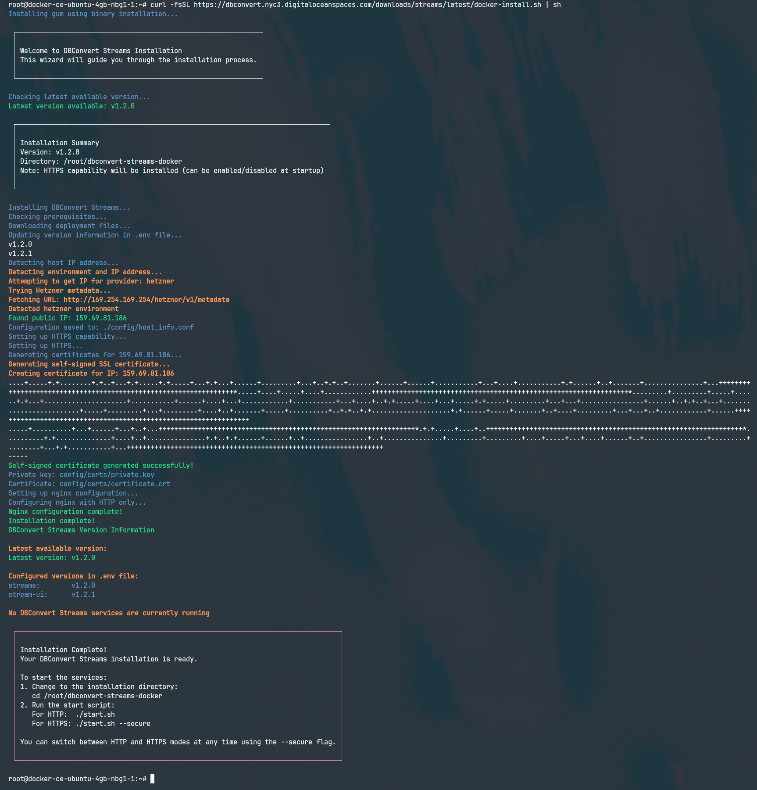
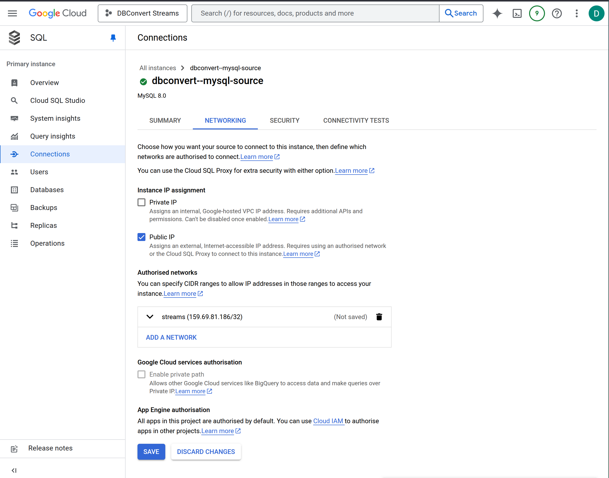
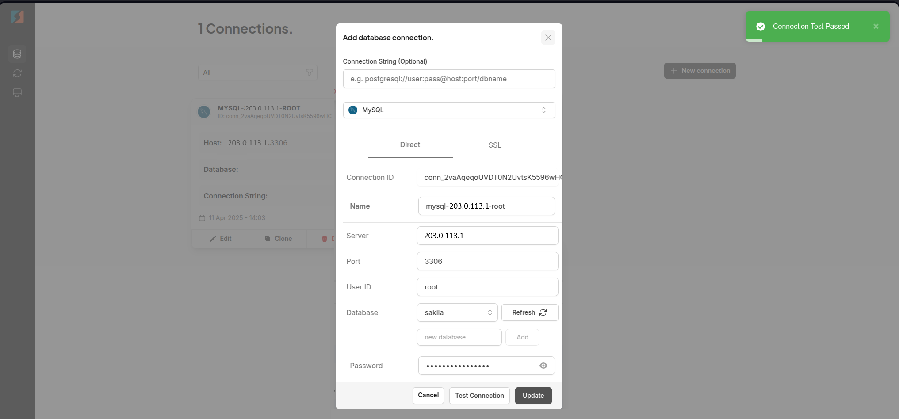
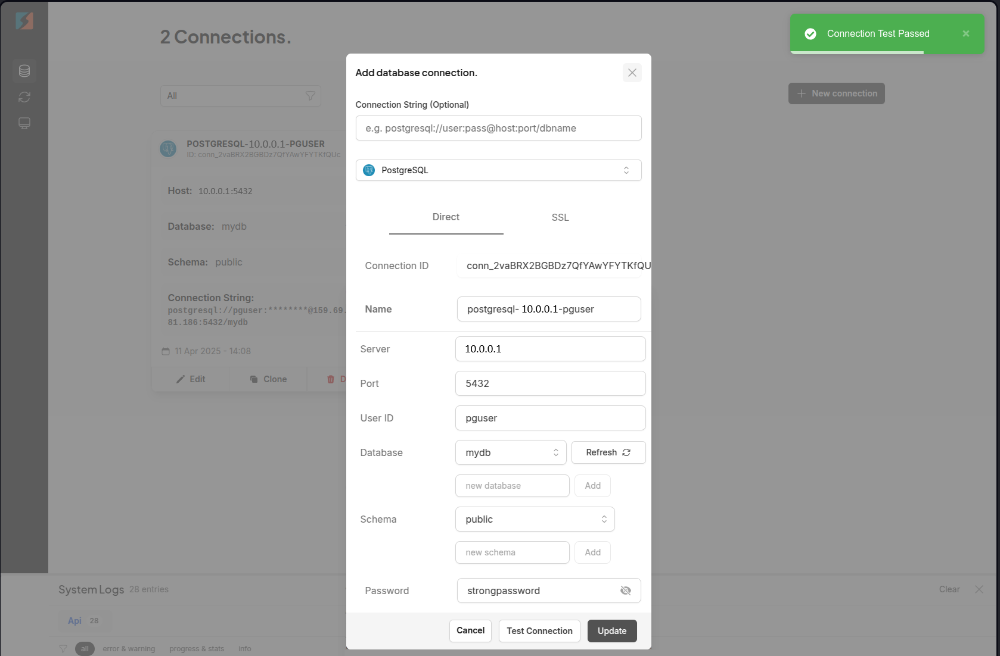
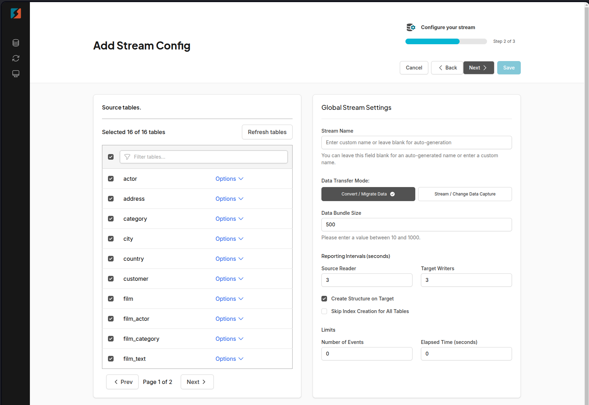
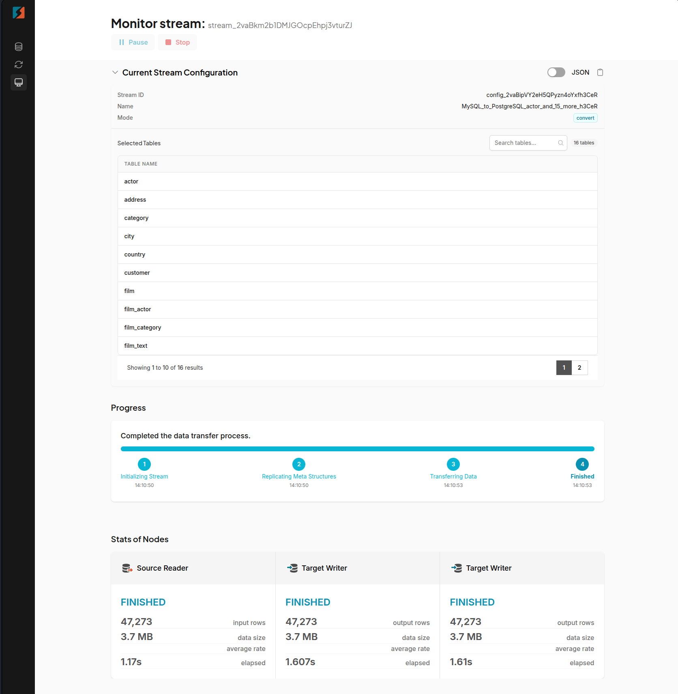

## Introduction

Hetzner Cloud has become the gold standard for price-performance value in the self-hosting community. With data centers in Germany, Finland, Singapore and the US, Hetzner offers enterprise-grade hardware at prices that are often 50-70% lower than equivalent offerings from AWS, Google Cloud, or Azure.

If you're currently hosting your database on another cloud provider and watching your monthly bills grow, migrating to Hetzner can dramatically reduce your costs while potentially improving performance. Many users report equivalent or better performance compared to much more expensive cloud options, especially for database workloads.

In this guide, I'll walk you through transferring your databases to Hetzner using DBConvert Streams—a powerful database migration platform designed to simplify moving data between different hosting environments and database types.

**Prerequisites**

Before you start, make sure you have:

* A Hetzner Cloud account
* Your source database credentials (e.g., AWS RDS, Google Cloud SQL, Azure DB)
* Basic familiarity with Linux commands
* [SSH key](https://community.hetzner.com/tutorials/howto-ssh-key) added to your Hetzner Cloud account

## Step 1 - Create a Hetzner Cloud Server

First, let's create a server on Hetzner with Docker pre-installed:



1. Log in to your Hetzner Cloud Console
2. Click "Create Server"
3. Choose your preferred location (e.g., Nuremberg, Helsinki, Ashburn)
4. Select the "Apps" tab
5. Choose "Docker CE" from the available applications
6. Select a server type based on your database needs:
   * For development/small production databases: CPX21 (2 vCPU, 4GB RAM)
   * For medium workloads: CPX31 (4 vCPU, 8GB RAM)
   * For larger production databases: CPX41 (8 vCPU, 16GB RAM)
7. Add your SSH key or create a new one
8. Click "Create & Buy Now"

Note: The "CPX" line is recommended for database workloads as they offer NVMe SSD storage with higher I/O performance compared to the standard "CX" instances.

## Step 2 - Set Up PostgreSQL on Hetzner

For simplicity in this tutorial, we'll deploy both DBConvert Streams and our target PostgreSQL database on the same server.

1. SSH into your new Hetzner server:

```bash
ssh root@<10.0.0.1>
```

2. Create directories for PostgreSQL data and configuration:

```bash
mkdir -p ~/pg-data ~/pg-conf
```

3. Run PostgreSQL in Docker:

```bash
docker run -d \
  --name postgres \
  -e POSTGRES_USER=pguser \
  -e POSTGRES_PASSWORD=strongpassword \
  -e POSTGRES_DB=mydb \
  -v ~/pg-data:/var/lib/postgresql/data \
  -p 5432:5432 \
  postgres:16
```

Make sure to replace `strongpassword` with a secure password and `mydb` with your desired database name.

4. Verify PostgreSQL is running:

```bash
docker ps
```

You should see your PostgreSQL container running on port 5432.

## Step 3 - Deploy DBConvert Streams

Now, let's install DBConvert Streams on the same server:

1. Download and install DBConvert Streams:

```bash
curl -fsSL https://dbconvert.nyc3.digitaloceanspaces.com/downloads/streams/latest/docker-install.sh | sh
```



2. Navigate to the installation directory and start the services:

```bash
cd dbconvert-streams-docker/
./start.sh
```

After the services start up, you'll see a message with your service URLs:

```
┌────────────────────────────────────────────────────────────────────┐
│                                                                    │
│ Service URLs                                                       │
│                                                                    │
│ • UI:  http://<10.0.0.1>                                           │
│ • API: http://<10.0.0.1>/api/                                      │
│                                                                    │
│ Setup complete! You can now access the services at the URLs above. │
│                                                                    │
└────────────────────────────────────────────────────────────────────┘
```

## Step 4 - Obtain and Enter Your API Key

1. Go to https://streams.dbconvert.com/account
2. Sign in using your preferred authentication method
3. Copy your API key from the account dashboard
4. Return to your DBConvert Streams instance
5. Paste the API key in the provided field

DBConvert Streams offers a free trial that includes:
* 5GB of data transfer
* 14 days of unlimited access to all features
* No credit card required to start

## Step 5 - Connect Your Source Database

### Step 5.1 - Configure Source Database Access

If you're using Google Cloud SQL MySQL:

1. In the Google Cloud Console, navigate to your Cloud SQL instance
2. Go to the "Connections" tab
3. Under "Networking," select "Add network"
4. Add your Hetzner server's IP address
5. Save your changes



### Step 5.2 - Create the Source Connection

1. Click "Create Connection" 
2. Select your database type (e.g., MySQL)
3. Enter your connection details:
   * Name: Optional. Give your connection a descriptive name
   * Server: Your source database IP/hostname
   * Port: Database port (e.g., 3306 for MySQL)
   * User ID: Your database username
   * Password: Your database password
   * Database: Source database name
4. Click "Update" to store the connection



## Step 6 - Connect Your Hetzner PostgreSQL Database

1. Click "Create Connection"
2. Select "PostgreSQL"
3. Enter the connection details:
   * Host: Your Hetzner server IP
   * Port: 5432
   * Username: pguser
   * Password: Your PostgreSQL password
   * Database: mydb
4. Test the connection
5. Save the configuration



## Step 7 - Configure Your Data Stream

1. Click "Create New Stream"
2. Select your source connection
3. Choose tables to migrate
4. Select transfer mode:
   * Convert/Migrate: For one-time migrations
   * CDC/Stream: For continuous replication
5. Configure options:
   * Data bundle size
   * Index creation options
   * Custom SQL queries (if needed)
6. Select your target Hetzner PostgreSQL connection



## Step 8 - Start and Monitor the Transfer

1. Click the "Start" button to begin
2. Monitor the transfer through the dashboard:
   * Track progress for each table
   * Monitor data transfer rates
   * View detailed logs
   * Pause or stop if needed



## Step 9 - Verify Your Data

1. Connect to your PostgreSQL database:

```bash
docker exec -it postgres psql -U pguser -d mydb
```

2. Run verification queries:

```sql
-- List all tables in the database
\dt

-- Get row counts for all tables
SELECT 
    schemaname as schema,
    relname as table_name,
    n_live_tup as row_count
FROM pg_stat_user_tables
ORDER BY n_live_tup DESC;

-- Check table sizes including indexes
SELECT
    table_schema,
    table_name,
    pg_size_pretty(pg_total_relation_size('"' || table_schema || '"."' || table_name || '"')) as total_size
FROM information_schema.tables
WHERE table_schema = 'public'
ORDER BY pg_total_relation_size('"' || table_schema || '"."' || table_name || '"') DESC;

```

Compare these results with your source database to ensure:
- All tables are present
- Row counts match
- Data sizes are reasonable
- Primary keys and indexes are properly transferred

If the numbers don't match or you notice any discrepancies, you may need to investigate specific tables in more detail.

## Step 10 - Set Up Database Backups

### Hetzner Snapshots

1. In Hetzner Cloud Console, select your server
2. Click "Snapshots"
3. Click "Create Snapshot"

Note: Snapshots cost €0.0119 per GB per month

## Conclusion

You've successfully migrated your database to Hetzner Cloud using DBConvert Streams. This setup provides you with:

* Significant cost savings compared to other cloud providers
* Full control over your database infrastructure
* Automated backups for data security
* High-performance NVMe storage
* Simple management through Docker containers

Remember to monitor your database performance and adjust server resources as needed. You can easily scale your Hetzner server up or down based on your workload requirements.

##### License: MIT

<!--

Contributor's Certificate of Origin

By making a contribution to this project, I certify that:

(a) The contribution was created in whole or in part by me and I have
    the right to submit it under the license indicated in the file; or

(b) The contribution is based upon previous work that, to the best of my
    knowledge, is covered under an appropriate license and I have the
    right under that license to submit that work with modifications,
    whether created in whole or in part by me, under the same license
    (unless I am permitted to submit under a different license), as
    indicated in the file; or

(c) The contribution was provided directly to me by some other person
    who certified (a), (b) or (c) and I have not modified it.

(d) I understand and agree that this project and the contribution are
    public and that a record of the contribution (including all personal
    information I submit with it, including my sign-off) is maintained
    indefinitely and may be redistributed consistent with this project
    or the license(s) involved.

Signed-off-by: Dmitry Narizhnykh <streams@dbconvert.com>

-->