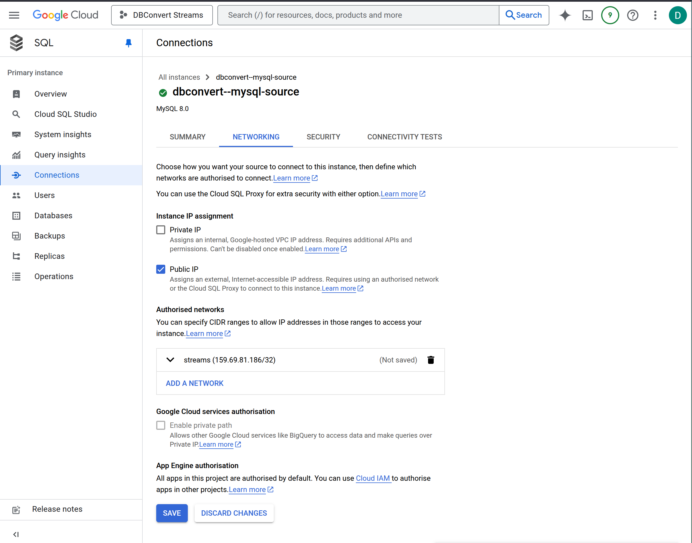
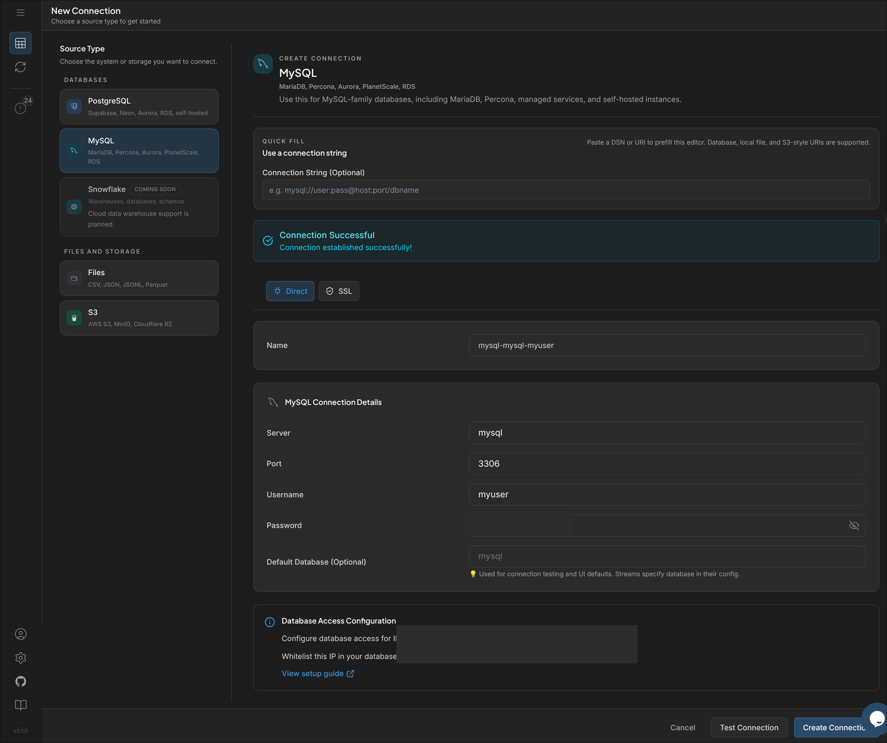
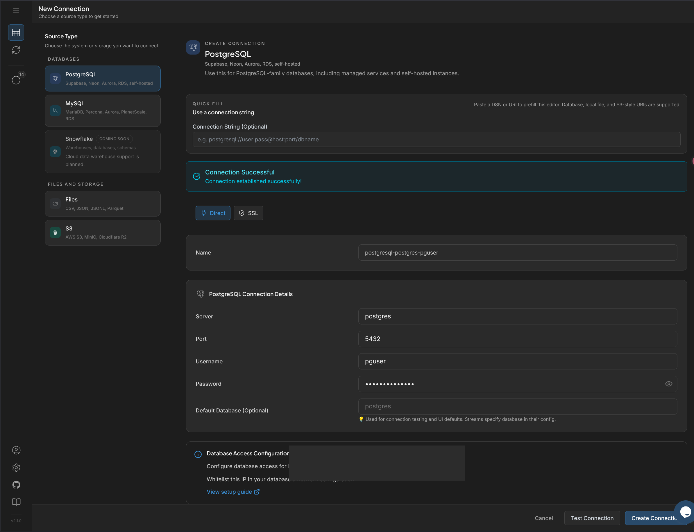
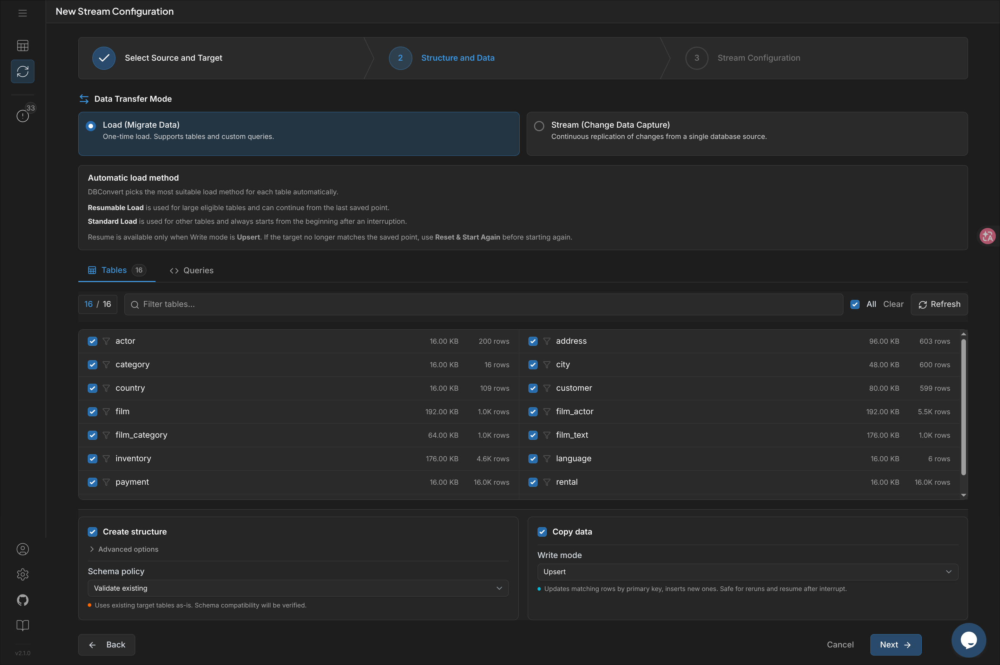
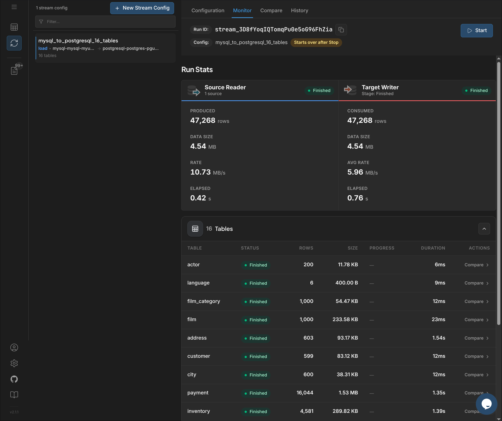
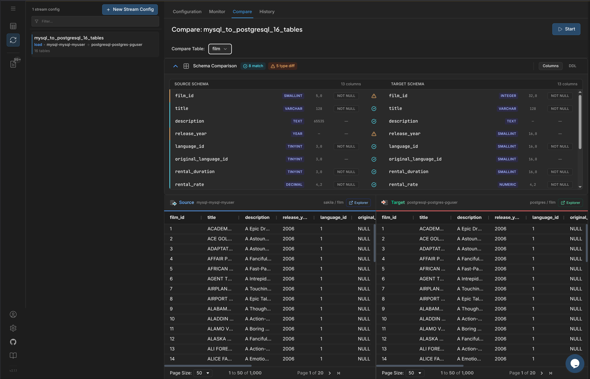
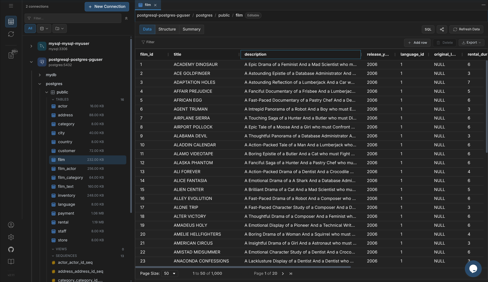

## Introduction

If you are currently hosting your database on another cloud provider and watching your monthly bills grow, migrating to Hetzner can dramatically reduce your costs while potentially improving performance. Many users report equivalent or better performance compared to much more expensive cloud options, especially for database workloads.

In this guide, I will walk you through transferring your databases to Hetzner using [DBConvert Streams](https://streams.dbconvert.com) - a database migration and replication platform designed to simplify moving data between different hosting environments and database types.

**Prerequisites**

Before you start, make sure you have:

* An [account with DBConvert](https://streams.dbconvert.com/)
* A Hetzner Console account
* Your source database credentials, such as AWS RDS, Google Cloud SQL, Azure DB, or a self-hosted database
* Basic familiarity with Linux commands
* An [SSH key](https://community.hetzner.com/tutorials/howto-ssh-key) added to your Hetzner Console account

**Example terminology**

* Server: `<10.0.0.1>`

## Step 1 - Create a Hetzner Cloud Server

First, create a Hetzner [cloud server with Docker pre-installed](https://console.hetzner.cloud/deploy/docker-ce).

> For a step-by-step guide, see [Creating a server](https://docs.hetzner.com/cloud/servers/getting-started/creating-a-server).

* For the image, choose the "Apps" tab and select "Docker CE"
* Select a server type based on your database needs:
  * For development and small production databases: CPX22 (2 vCPU, 4 GB RAM)
  * For medium workloads: CPX32 (4 vCPU, 8 GB RAM)
  * For larger production databases: CPX42 (8 vCPU, 16 GB RAM)
* Add your SSH key or create a new one

**Note:** The CPX line is recommended for database workloads because it offers NVMe SSD storage with higher I/O performance compared to standard CX instances.

## Step 2 - Deploy DBConvert Streams

SSH into your new Hetzner server:

> Replace `<10.0.0.1>` with the IP address of your cloud server.

```bash
ssh root@<10.0.0.1>
```

Now install DBConvert Streams:

1. Download and run the installer:
   
   ```bash
   curl -fsSL https://dbconvert.nyc3.digitaloceanspaces.com/downloads/streams/latest/docker-install.sh | sh
   ```
   
   <details>
   <summary>Click here to view example output</summary>

   ```shellsession
   root@example-server:~# curl -fsSL https://dbconvert.nyc3.digitaloceanspaces.com/downloads/streams/latest/docker-install.sh | sh
   Installing gum using binary installation...
   
    ┌──────────────────────────────────────────────────────────────┐
    │                                                              │
    │ Welcome to DBConvert Streams Installation                    │
    │ This wizard will guide you through the installation process. │
    │                                                              │
    └──────────────────────────────────────────────────────────────┘
   
   Checking latest available version...
   Latest version available: v2.1.0
   
    ┌──────────────────────────────────────────┐
    │                                          │
    │ Installing DBConvert Streams             │
    │ Version: v2.1.0                          │
    │ Directory: /opt/dbconvert-streams-docker │
    │                                          │
    └──────────────────────────────────────────┘
   
   Starting installation...
   Installing DBConvert Streams...
   Checking prerequisites...
   Downloading deployment files...
   Updating version information in .env file...
   
   [...]
   
   Self-signed certificate generated successfully!
   Private key: config/certs/private.key
   Certificate: config/certs/certificate.crt
   Setting up nginx configuration...
   Configuring nginx with HTTP only...
   Nginx configuration complete!
   Installation complete!
   DBConvert Streams Version Information
   
   Latest available version:
   Latest version: v2.1.0
   
   Configured versions in .env file:
   streams:        v2.1.0
   stream-ui:      v2.1.0
   
   No DBConvert Streams services are currently running
   
    ┌──────────────────────────────────────────────────────────────────────────────────┐
    │                                                                                  │
    │ Installation Complete!                                                           │
    │ Your DBConvert Streams installation is ready.                                    │
    │                                                                                  │
    │ To start the services:                                                           │
    │ 1. Change to the installation directory:                                         │
    │    cd /opt/dbconvert-streams-docker                                              │
    │ 2. Run the start script:                                                         │
    │    For HTTP:  ./start.sh                                                         │
    │    For HTTPS: ./start.sh --secure                                                │
    │                                                                                  │
    │ You can switch between HTTP and HTTPS modes at any time using the --secure flag. │
    │                                                                                  │
    └──────────────────────────────────────────────────────────────────────────────────┘
   ```

   </details>

2. Navigate to the installation directory and start the services:
   
   ```bash
   cd /opt/dbconvert-streams-docker/
   ./start.sh
   ```
   
   The start script creates the `stream-net` Docker network used by DBConvert Streams services. In the next step, PostgreSQL will join the same network so Streams can reach it by container name without exposing PostgreSQL to the public internet.
   
   After the services start up, you will see a message with your service URLs:
   
   ```text
   ┌────────────────────────────────────────────────────────────────────┐
   │                                                                    │
   │ Service URLs                                                       │
   │                                                                    │
   │ • UI:  http://<10.0.0.1>                                           │
   │ • API: http://<10.0.0.1>/api/                                      │
   │                                                                    │
   │ Setup complete! You can now access the services at the URLs above. │
   │                                                                    │
   └────────────────────────────────────────────────────────────────────┘
   ```

## Step 3 - Set Up PostgreSQL on Hetzner

For simplicity in this tutorial, DBConvert Streams and the target PostgreSQL database run on the same Hetzner server.

1. Create a directory for PostgreSQL data:
   
   ```bash
   mkdir -p ~/pg-data
   ```

2. Run PostgreSQL in Docker:
   
   ```bash
   docker run -d \
     --name postgres \
     --restart unless-stopped \
     --network stream-net \
     -e POSTGRES_USER=pguser \
     -e POSTGRES_PASSWORD=strongpassword \
     -e POSTGRES_DB=mydb \
     -v ~/pg-data:/var/lib/postgresql/data \
     postgres:17
   ```
   
   Replace `strongpassword` with a secure password and `mydb` with your desired database name.
   
   > **Security note:** This command does not publish port 5432 to the host. DBConvert Streams reaches PostgreSQL through the internal `stream-net` Docker network using the container hostname `postgres`, so the database stays off the public internet.

3. Verify PostgreSQL is running:
   
   ```bash
   docker ps
   ```

You should see your `postgres` container in the list. It should have no public `5432` port mapping, which is expected.

## Step 4 - Obtain and Enter Your API Key

1. Go to [streams.dbconvert.com/account](https://streams.dbconvert.com/account)
2. Sign in using your preferred authentication method
3. Copy your API key from the account dashboard
4. Return to your DBConvert Streams instance:
   
   ```http
   http://<10.0.0.1>
   ```

5. Paste the API key in the provided field

DBConvert Streams offers a free tier so you can evaluate the platform before committing to a paid plan. For current limits, included features, and plan details, see the [pricing page](https://streams.dbconvert.com/pricing).

## Step 5 - Connect Your Source Database

### Step 5.1 - Configure Source Database Access

Make sure DBConvert Streams can access your source database.

This step depends on your source provider. For example, with Google Cloud SQL MySQL:

1. In the Google Cloud Console, navigate to your Cloud SQL instance
2. Go to the "Connections" tab
3. Under "Networking", select "Add network"
4. Add your Hetzner server's IP address
5. Save your changes



### Step 5.2 - Create the Source Connection

1. Return to your DBConvert Streams instance:
   
   ```http
   http://<10.0.0.1>
   ```

2. Click the quick action "Create Connection" in the dashboard
3. Select your database type, such as "MySQL"
4. Enter your connection details:
   * Name: optional descriptive name
   * Server: your source database IP address or hostname
   * Port: database port, such as 3306 for MySQL
   * Username: your database username
   * Password: your database password
   * Default Database: source database name
5. Click "Test Connection"
6. Click "Create Connection" to store the connection



## Step 6 - Connect Your Hetzner PostgreSQL Database

1. Return to the dashboard
2. Click the quick action "Create Connection" in the dashboard
3. Select "PostgreSQL"
4. Enter the connection details:
   * Server: `postgres`
   * Port: `5432`
   * Username: `pguser`
   * Password: your PostgreSQL password
   * Default Database: `mydb`
5. Click "Test Connection"
6. Click "Create Connection" to save the configuration

> **Why `postgres` and not the server IP?** Both Streams and PostgreSQL run on the same Docker network, `stream-net`, so Streams resolves the hostname `postgres` through Docker's internal DNS. The public IP will not work because port 5432 was not published to the host.



## Step 7 - Configure Your Data Stream

1. Return to the dashboard
2. Click "Create New Stream"
3. Select your source connection and target PostgreSQL connection, then click "Next" in the top right
4. Choose the tables to migrate
5. Select the transfer mode:
   * **Load (Migrate Data)** - one-time migration of existing data
   * **Stream (Change Data Capture)** - continuous replication of database changes
6. Configure the transfer options shown in the right panel, such as schema policy, write mode, index handling, and custom queries
7. When you are happy with your settings, click "Next" in the top right
8. Review the stream configuration and click "Save" in the top right



## Step 8 - Start and Monitor the Transfer

1. Click the "Start" button to begin
2. Monitor the transfer through the dashboard:
   * Track progress for each table
   * Monitor data transfer rates
   * View detailed logs
   * Pause or stop if needed



## Step 9 - Verify Your Data

DBConvert Streams ships with two built-in tools that replace most manual SQL verification.

### Compare view

After the stream finishes, open the "Compare" tab on your stream config. You get:

* **Schema comparison** - column-by-column differences between source and target, including data types, nullability, and lengths
* **Side-by-side data preview** - first rows of each table on both sides, so you can spot-check that values landed correctly
* **Per-table row counts** - quick source and target totals for each migrated table



If everything matches, you are done. If you see schema warnings, such as MySQL `TINYINT` to PostgreSQL `SMALLINT`, they are usually expected type promotions. Review them once and they should remain stable for future runs.

### Data Explorer

For deeper inspection, click the "Explorer" link next to either connection. The Data Explorer lets you:

* Browse tables and rows visually
* Run ad-hoc SQL against either side
* Inspect indexes, foreign keys, and constraints



Between Compare and Explorer, you should rarely need to drop into a `psql` shell. If you do, it is still available:

```bash
docker exec -it postgres psql -U pguser -d mydb
```

## Step 10 - Set Up Database Backups

### Hetzner Snapshots

1. In Hetzner Console, select your server
2. Click "Snapshots"
3. Click "Create Snapshot"

See Snapshot prices at [hetzner.com/cloud](https://www.hetzner.com/cloud/regular-performance#174518).

### Logical backups

Hetzner Snapshots are crash-consistent: they capture disk state at a point in time, but a running PostgreSQL instance may have uncommitted writes in shared buffers. For production recovery, complement Snapshots with `pg_dump` or [pgBackRest](https://pgbackrest.org/):

```bash
docker exec postgres pg_dump -U pguser -F c mydb > mydb-$(date +%F).dump
```

Schedule logical backups with cron and ship them to S3-compatible storage or a Hetzner Storage Box.

## Conclusion

You have successfully migrated your database to Hetzner Console using DBConvert Streams. This setup provides:

* Significant cost savings compared to other cloud providers
* Full control over your database infrastructure
* A private PostgreSQL target that is not exposed to the public internet
* High-performance NVMe storage
* Simple management through Docker containers

Remember to monitor database performance and adjust server resources as needed. You can scale your Hetzner server up or down based on your workload requirements.

##### License: MIT

<!--

Contributor's Certificate of Origin

By making a contribution to this project, I certify that:

(a) The contribution was created in whole or in part by me and I have
    the right to submit it under the license indicated in the file; or

(b) The contribution is based upon previous work that, to the best of my
    knowledge, is covered under an appropriate license and I have the
    right under that license to submit that work with modifications,
    whether created in whole or in part by me, under the same license
    (unless I am permitted to submit under a different license), as
    indicated in the file; or

(c) The contribution was provided directly to me by some other person
    who certified (a), (b) or (c) and I have not modified it.

(d) I understand and agree that this project and the contribution are
    public and that a record of the contribution (including all personal
    information I submit with it, including my sign-off) is maintained
    indefinitely and may be redistributed consistent with this project
    or the license(s) involved.

Signed-off-by: Dmitry Narizhnykh <streams@dbconvert.com>

-->
