## Introduction

If you like to automate things in your domain registration process, an API comes in very handy.
Luckily, Hetzner provides a DNS service, which allows you to use their nameservers (NS) as primary NS or as secondary NS.

In this tutorial, I'll show you how to set up and use a REST Client (like Insomnia or Postman) to connect to the Hetzner DNS API.

> **Note:**
> I use Insomnia on Linux, but it should look pretty similar if you are on MAC or Windows.

**When I mention "API docs" in this tutorial, I am referring to this one:** https://docs.hetzner.cloud/reference/cloud#dns

**Prerequisites**

You need:

* An up and running [Insomnia](https://insomnia.rest/) application at your desktop<br>
(see their official "[Install Insomnia](https://docs.insomnia.rest/insomnia/install)" guide).
* Access to your [Hetzner account](https://accounts.hetzner.com/) (to create an API token)
* Internet connection

## Step 1 - Create an API token

Login to your Hetzner account at: https://accounts.hetzner.com/login

On the upper right, click on the app switcher icon and select `Console`. Or open the Hetzner Console directly at: https://console.hetzner.com/

Generate an API token as explained in the official docs:

* [Generating an API token](https://docs.hetzner.com/cloud/api/getting-started/generating-api-token)

## Step 2 - Setup Insomnia

Open your Insomnia application and create a new `Request collection`:

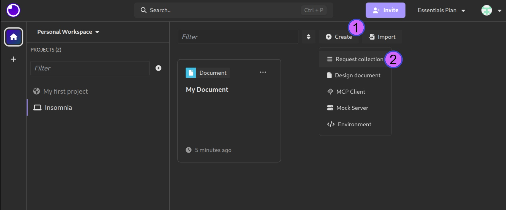

Now we add a new Environment in Insomnia:

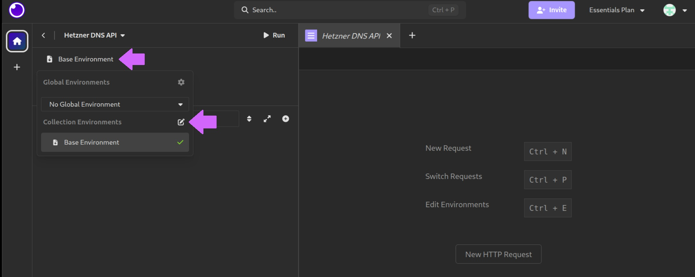

You can use the `Base Environment` (click on it), set a name, e.g. `hetzner_api`, set it to JSON, and "Click to Edit":

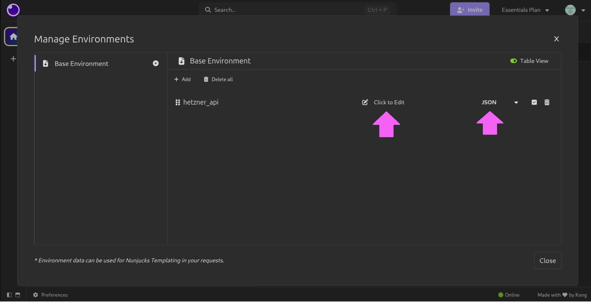

Enter 2 variables we will use later on:

```json
{
    "url": "https://api.hetzner.com/v1/",
    "token": "<your_token>"
}
```

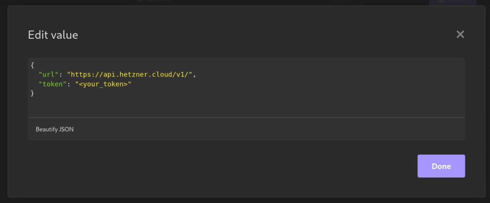

## Step 3 - Create API requests

Based on the [API documentation](https://docs.hetzner.cloud/reference/cloud#dns), you can now go on and create requests.

### Step 3.1 - Find requirements for the API request

API documentation: https://docs.hetzner.cloud/reference/cloud#zones-list-zones

Based on the following image, we can analyze how our request is built:

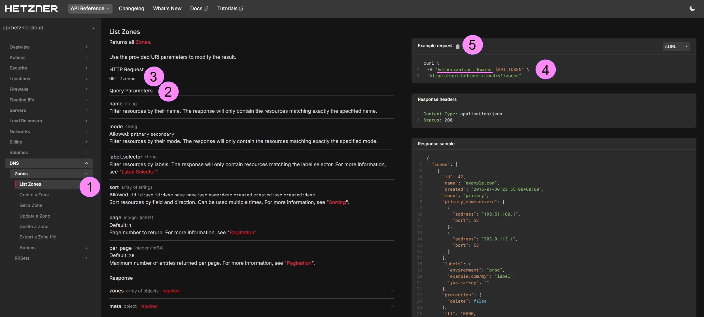

1. We choose the kind of request in the sidebar navigation
2. Here, we see which query parameters are possible, and what values are required
3. The URL to send the request to
4. The API token is required for any request. But depending on the kind of request, other parameters might also be needed!
5. The `Example request` section shows how a request should look like

### Step 3.2 - Create the request in Insomnia

Create a new request:

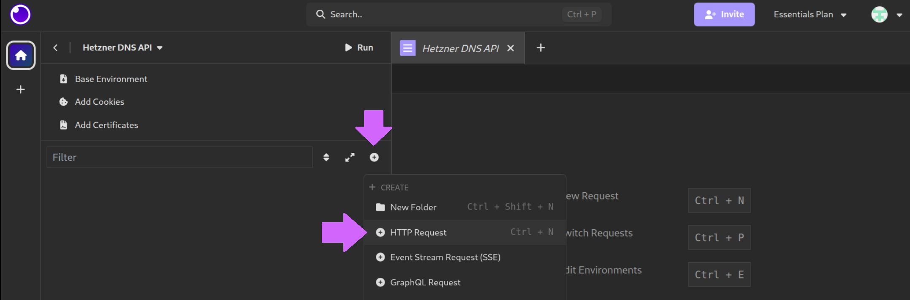

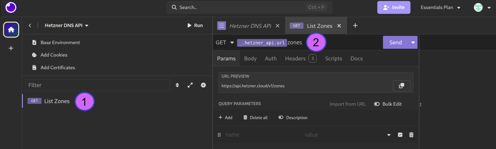

1. Double-click on the placeholder "New Request" and give it a name (e.g. `List Zones`)
2. In the address bar of Insomnia, make sure you select `GET`. Then start to type `_.` and wait 3 seconds... Insomnia now opens a pulldown with all variables you have set before in the environment. Here we choose `_.hetzner_api.url` and complete the path with the information we got from the API docs before.

As you might remember, there was a `required` field for this request... the "Authorization: Bearer".
It needs to be sent in the Header of the request.

1. Click on the tab "Auth" below the address bar and select "Bearer Token"
2. For the token, you go again with `_.` and wait three seconds... Then, choose the variable: `_.hetzner_api.token`.
3. Send request and look for the response.

Should look similar to the following image:


### Step 3.3 - Additional parameters

We've seen before in the API documentation, that requests can have multiple parameters.
So here is how we add those parameters to our request:

1. Go to the tab "Params"
2. In the section "QUERY PARAMETERS", enter the name of the key and the value (I used key: `mode` with value `primary`)

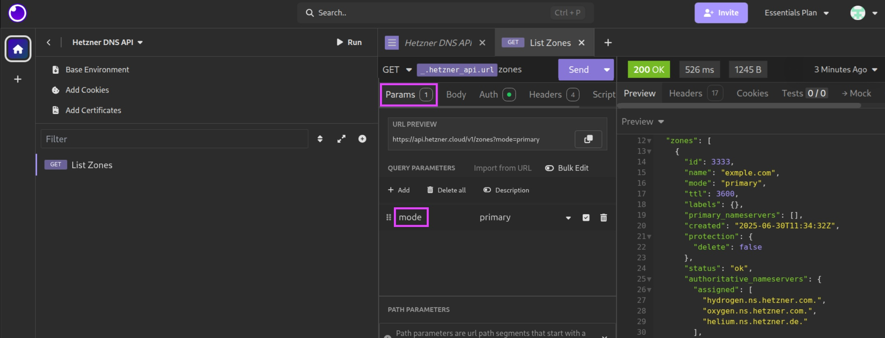

## Step 4 - Create all requests you need

The above steps work in same way for all other available API requests that Hetzner provides for its DNS.
You can easily create as many requests as needed in Insomnia.

> **HINT**:
> Generally, if you request data from the API, the action to use is `GET`. But if you send data to the API it is `POST`.
> Make sure, you choose equal action in your `insomnia-request-address bar`.
> 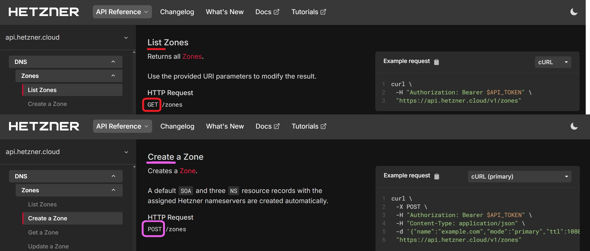

### Step 4.1 - Import the Cloud API

If an API has an API specification (declaration) - like OpenApi, WSDL, etc. - it's possible to import all declared API requests at once with Insomnia.

Hetzner provides an **unofficial** OpenApi declaration for their "Cloud API".
You'll find it at:
* https://docs.hetzner.cloud/cloud.spec.json
* https://docs.hetzner.cloud/hetzner.spec.json

Here is how you can import it to Insomnia:

1. At the bottom left `Preferences` > `Data` (tab) > `Import to the "<project_name>" Project`
   
   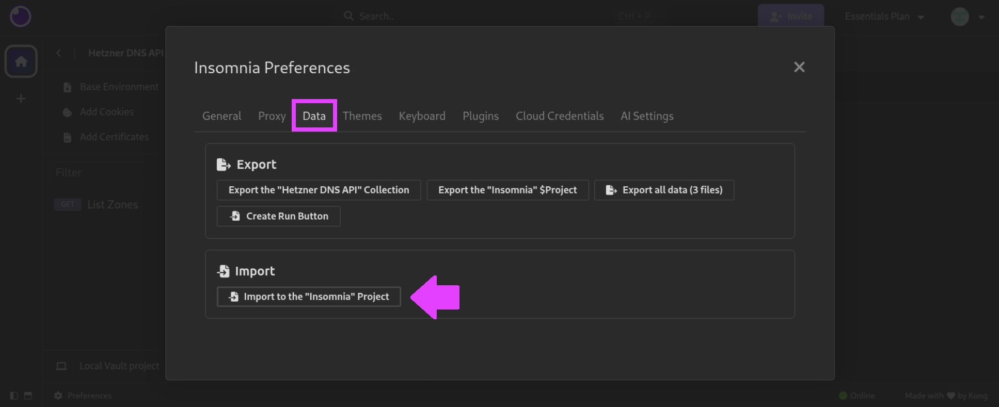
   
2. Select "Url", enter: https://docs.hetzner.cloud/cloud.spec.json and submit it.
   
   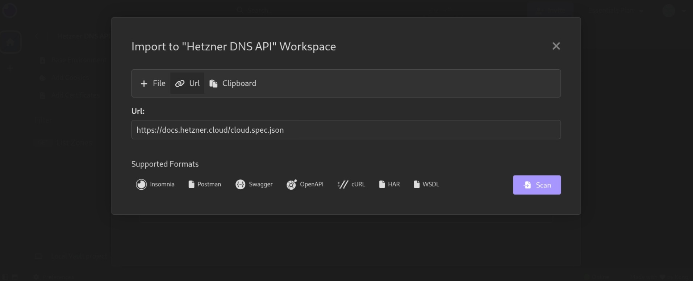
   
3. You get a notice that lists everything that will be imported:

   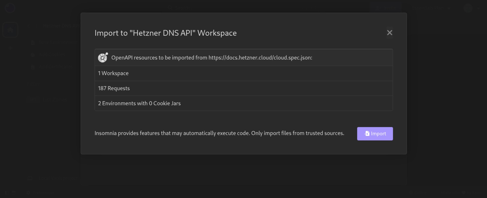

## Conclusion

You activated your API access at your Hetzner account and learned how to read the API documentation of Hetzner to create your own API requests in a REST Client like Insomnia.

##### License: MIT

<!--

Contributor's Certificate of Origin

By making a contribution to this project, I certify that:

(a) The contribution was created in whole or in part by me and I have
    the right to submit it under the license indicated in the file; or

(b) The contribution is based upon previous work that, to the best of my
    knowledge, is covered under an appropriate license and I have the
    right under that license to submit that work with modifications,
    whether created in whole or in part by me, under the same license
    (unless I am permitted to submit under a different license), as
    indicated in the file; or

(c) The contribution was provided directly to me by some other person
    who certified (a), (b) or (c) and I have not modified it.

(d) I understand and agree that this project and the contribution are
    public and that a record of the contribution (including all personal
    information I submit with it, including my sign-off) is maintained
    indefinitely and may be redistributed consistent with this project
    or the license(s) involved.

Signed-off-by: Samuel Suther <info@suther.de>

-->
