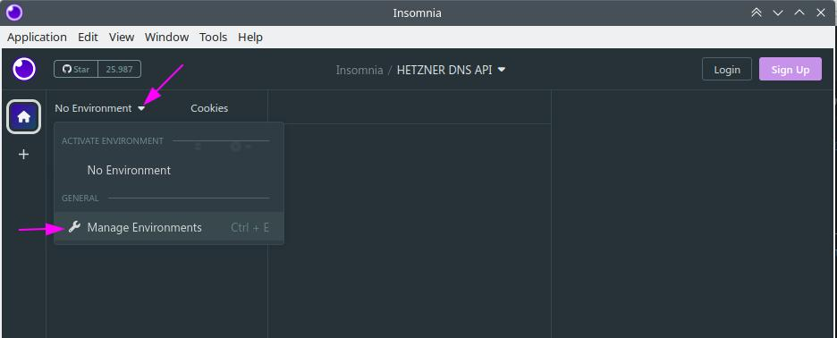

ONLINE-EDITOR: https://community.hetzner.com/markdown-test-suite/#formatting

## Introduction

If you like to automate things in your Domain-Registration-Process a API comes very handy. 
Lucky us, Hetzner provide a DNS-Service, which make you able to use their Nameservers as Primary NS or as Secondary NS.

In this Tutorial I'll show you, how to set up and use a REST-Client (like Insomnia or Postman) to connect to 
Hetzner DNS-API.

> **Note:**   
> I do use Insomnia on Linux, but it should look pretty similar if you are on MAC or Windows

**If I do notice the API-Docs in this tutorial, I do use this one: https://dns.hetzner.com/api-docs**

**Prerequisites**

You need:
* an up and running [Insomnia]() Application at your Desktop.
* access to your Hetzner Account (to create API-Token)
* Internet Connection

# STEP 1 - Create API-Token
Login to your Hetzner-Account at: https://accounts.hetzner.com/login
On the upper right, click on the menu entry `API-Token`: 

Choose a distinctive name for the token and create it:  

After you've pressed the button, you'll see a Popup-Window, that contains your access-token. 
Make sure to save it to a save place, it won't be shown again.  

# STEP 2 - Setup Insomnia

Open your Insomnia Application and create a new `Request Collection`:  

Now we add a new Environment in Insomnia:  

You can use the `Base Environment` (click on it), and enter 2 Variables we will use later on:  

# STEP 3 - Create API-Requests
Based on the [API-Documentation](https://dns.hetzner.com/api-docs) you can now go on and create requests.  

## STEP 3.1 - find requirements for the API request

API-Documentation: https://dns.hetzner.com/api-docs#operation/GetZones

Based on the following Image we analyse how does our request has to build:  

1. We choose the kind of request in the sidebar navigation
2. here we see which query parameters are possible and what values are required
3. API-Token is required for any request. But depending on the kind of request, there might also other parameter needed!
4. the url to send the request to
5. the `Request samples` shows how a request should look like 

## STEP 3.2 - create the request in Insomnia

Create a new request:

1.Double-Click on the placeholder "New Request" and give it a name (e.g. `Get all Zones`)
2. in the Address-Bar of insomnia make sure you select `GET`. Then start to type `_.` and wait 3 seconds... insomnia opens now a pulldown with all variables you have set before in the environment. Here we choose "_.url" and complete the path with the information we got from the API-Docs before

As you might remember, there was an `required` field for this request... the "Auth-API-Token".  
It's needed to be sent in the Header of the request. 

1. Click on the Tab "Auth" below the address bar and select API Key
2. enter the Key
3. for value, you go again with `_.` and wait three seconds... then choose the variable: `_.token`
4. make sure `ADD TO` is set to `Header` (which is default)
5. send request and look for the response. 

Should look similar to the following image:  

## STEP 3.3 - additional Parameters
We've seen before in the API-Documentation, that request can have multiple parameters.  
So here is how we add those parameters to our request: 

1. go to Tab "Query"
2. enter the name of the key and the value (I'd used key: `search_name` with value `config`)
> Regarding the API-Documentation `search_name` show me up to 100 zones that contain the search word

## STEP 4 - create all requests you need  
The above steps work in same way for all other available API-Request that Hetzner provide for it's DNS. 
You easily can create as many request as needed in Insomnia  

> **HINT**:  
> Generally, if you request data from the API, the action to use is `GET`, but if you send data to the API it is `POST`.
> Make sure, you choose equal action in your `insomnia-request-address bar`.
> 

## Conclusion

You activate your api-access at your Hetzner-Account and learned how to read the API-Documentation of Hetzner to
create your own API-Requests in a REST-Client like Insomnia.

##### License: MIT

<!--

Contributor's Certificate of Origin

By making a contribution to this project, I certify that:

(a) The contribution was created in whole or in part by me and I have
    the right to submit it under the license indicated in the file; or

(b) The contribution is based upon previous work that, to the best of my
    knowledge, is covered under an appropriate license and I have the
    right under that license to submit that work with modifications,
    whether created in whole or in part by me, under the same license
    (unless I am permitted to submit under a different license), as
    indicated in the file; or

(c) The contribution was provided directly to me by some other person
    who certified (a), (b) or (c) and I have not modified it.

(d) I understand and agree that this project and the contribution are
    public and that a record of the contribution (including all personal
    information I submit with it, including my sign-off) is maintained
    indefinitely and may be redistributed consistent with this project
    or the license(s) involved.

Signed-off-by: Samuel Suther <info@suther.de>

-->
