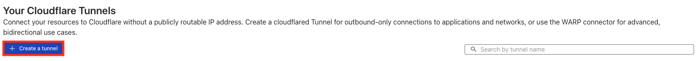
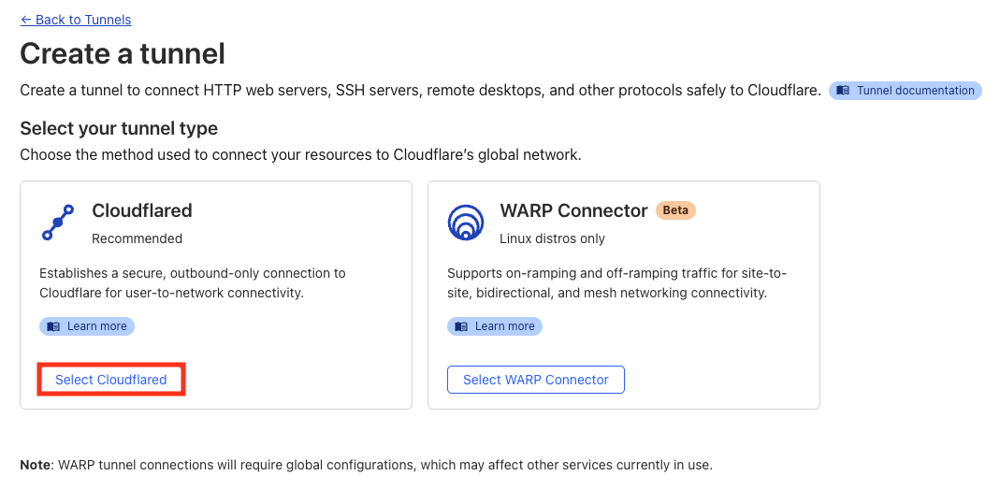
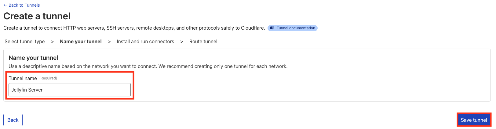
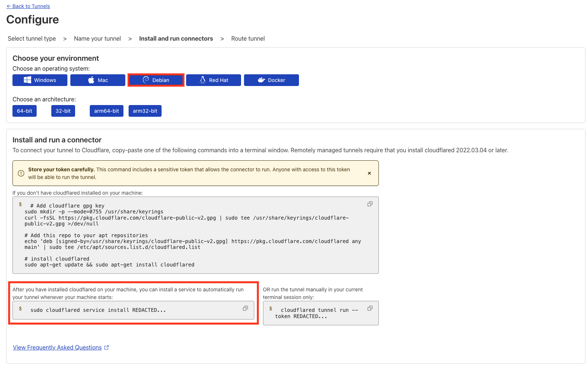
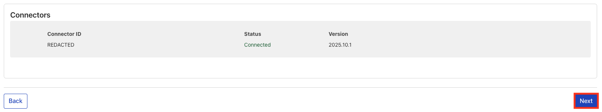
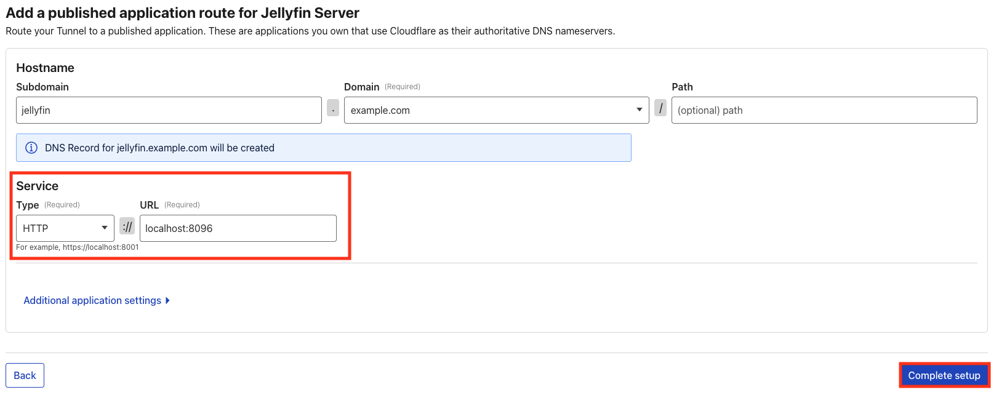
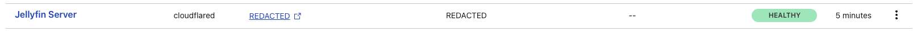

## Introduction

By default, Jellyfin runs locally on your network, under port `8096`, which normally means you would need to expose that port publicly or set up a reverse proxy to reach your server from outside your local network. This can be inconvenient, and in some cases risky, since it increases your exposure to unwanted traffic from the internet. Who wants that?

Cloudflare Tunnel solves these problems, by how it lets you expose your local services to the internet, and accessible worldwide, **without opening any ports** on your server or network! The tunnel securely connects your server to Cloudflare’s network, and traffic is routed over to your domain linked to Cloudflare.

In this tutorial, we’ll create a Cloudflare Tunnel using `cloudflared` and route a domain (e.g, `jellyfin.example.com`) directly to your Jellyfin server.

**Prerequisites**

- A Cloudflare account with a domain linked to it.
- An user that has superuser/`sudo` privileges.
- A Debian-based operating system.

## Step 1 - Installing cloudflared

To start off with, it's always good practice to go ahead and update your package index files:

```bash
sudo apt update
```

Next, install `gnupg`, if you don't already have it installed. (you can check by running `gpg --version` in your console):

```bash
sudo apt install gnupg -y
```

Next, add Cloudflare's GPG key:

```bash
sudo mkdir -p --mode=0755 /usr/share/keyrings
curl -fsSL https://pkg.cloudflare.com/cloudflare-public-v2.gpg | sudo tee /usr/share/keyrings/cloudflare-public-v2.gpg >/dev/null
```

Now, add Cloudflare's repository to our package sources:

```bash
echo 'deb [signed-by=/usr/share/keyrings/cloudflare-public-v2.gpg] https://pkg.cloudflare.com/cloudflared any main' | sudo tee /etc/apt/sources.list.d/cloudflared.list
```

Then, we'll update our package index files once more, and finally install `cloudflared`:

```bash
sudo apt update && sudo apt install cloudflared -y
```

Ta-da! Optionally, to verify all went well, run `cloudflared --version` in your console, and you should get something like this:

```bash
holu@<your_host>:~# cloudflared --version
cloudflared version 2025.10.1 (built 2025-10-30-18:35 UTC)
```

## Step 2 - Creating a tunnel

Next, head to the [Cloudflare Zero Trust dashboard](https://one.dash.cloudflare.com), and sign in.

From the sidebar, select Networks -> Tunnels.


Next, press "Create tunnel".



You should be asked about what type of tunnel you'd like to create, and in our case, we'll be picking `cloudflared`.



Next, set a nice name for your shiny new tunnel. (in this case, I've gone for `Jellyfin Server`!)



You should now be prompted to install `cloudflared` and setup your tunnel. Luckily for us, we've already installed `cloudflared`, so all we need to do is setup the service to automatically start our tunnel when our system boots.

Click on the `sudo cloudflared service install <your-token>...` textbox, and the command should be copied onto your clipboard, ready for you to paste into your terminal!



If all went well, you should see something along the lines of this:

```bash
holu@<your_host>:~$ sudo cloudflared service install REDACTED
2025-11-06T15:00:00Z INF Using Systemd
2025-11-06T15:00:00Z INF Linux service for cloudflared installed successfully
```

..as well as also seeing your connector on your screen under the `Connectors` portion of the configuration screen that we were just looking at!



Once everything looks all good, hit Next!

You should now be prompted to enter the hostname that your Jellyfin tunnel will run on, where mine is `jellyfin.example.com`.
Under the Service portion, enter your Jellyfin server's host & port.

(this screenshot assumes that your Jellyfin server is running on the same machine as `cloudflared`, and runs on Jellyfin's default port, that being `8096`!)

> **Important:**
> Do not edit the `Path` value in your desired hostname, as this can interfere with Jellyfin if you don't set it up correctly.
>
> You've been warned!



Once that's done & dusted, hit "Complete setup", and pat yourself on the back for your work. You should be thrown back to the Tunnels tab once again, and you should see your tunnel with a status of `HEALTHY`!



## Conclusion

And that’s it, congratulations! 🎉

Your Jellyfin server is now accessible securely through Cloudflare’s network, without exposing any open ports to the public internet. This setup is safer, easier to maintain, and works great in both homelabs and professional deployments, such as Hetzner's services. `;)`

**Next steps:**

* [Cloudflare](https://cloudflare.com)
* [Cloudflare Dashboard](https://dash.cloudflare.com)
* [Cloudflare Zero Trust](https://one.dash.cloudflare.com)
* [Jellyfin](https://jellyfin.org)
* [Jellyfin Server](https://github.com/jellyfin/jellyfin)

##### License: MIT

<!--

Contributor's Certificate of Origin

By making a contribution to this project, I certify that:

(a) The contribution was created in whole or in part by me and I have
    the right to submit it under the license indicated in the file; or

(b) The contribution is based upon previous work that, to the best of my
    knowledge, is covered under an appropriate license and I have the
    right under that license to submit that work with modifications,
    whether created in whole or in part by me, under the same license
    (unless I am permitted to submit under a different license), as
    indicated in the file; or

(c) The contribution was provided directly to me by some other person
    who certified (a), (b) or (c) and I have not modified it.

(d) I understand and agree that this project and the contribution are
    public and that a record of the contribution (including all personal
    information I submit with it, including my sign-off) is maintained
    indefinitely and may be redistributed consistent with this project
    or the license(s) involved.

Signed-off-by: Zayaan AR - zayaanar@atomlabs.ie

-->