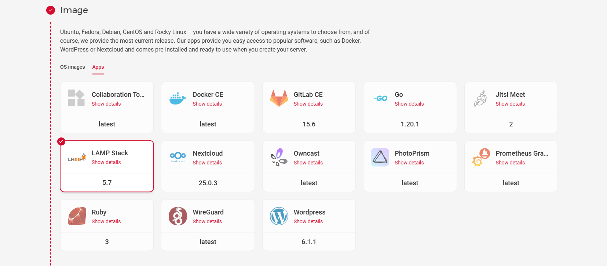
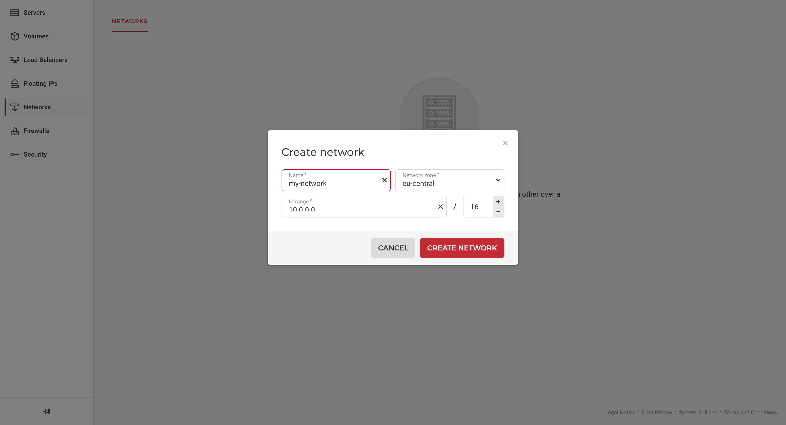

## Introduction

This tutorial explains how to use Hetzner Cloud Networks to access a MySQL database which is managed on one Cloud Server (MySQL server) from a second Cloud Server (MySQL client).

**Prerequisites**

* 1 Hetzner Cloud server with MySQL already installed

You can either install MySQL manually, or you can simply select the "LAMP Stack" app at server creation.



## Step 1 - Create a private Network

Create your private Network under your Hetzner Cloud project in the region you want to use.



Remember that the default IP range is set to `10.0.0.0/16`.

## Step 2 - Attach the server to the Network

You can now attach the MySQL server to the new Network. You can do this by either using the [Cloud Console](https://console.hetzner.cloud/) or the `hcloud` tool.

```shell
hcloud server attach-to-network <your-server-name> --network <your-network-name> --ip <pvt-ip>
```

The final part with `--ip <pvt-ip>` is optional. If you don't specify a specific private IP, the Hetzner Cloud system will automatically assign a free private IP for you.

## Step 3 - Modify the MySQL configuration

To access MySQL from another device, you'll have to make a change in the `/etc/mysql/mysql.conf.d/mysqld.cnf` file.

- **Edit the `mysqld.cnf` file**

  Use the following command to open the MySQL configuration file:

  ```shell
  nano /etc/mysql/mysql.conf.d/mysqld.cnf
  ```

  Change the `bind-address` parameter from `127.0.0.1` to `0.0.0.0`.

If you installed MySQL via the "LAMP Stack" app, you need to open a MySQL port (`3306` by default) using the `ufw` tool. 

If you installed MySQL manually, you need to install the firewall with this command: `apt-get install ufw`

- **Edit the firewall**
  
  Add a rule to the firewall to open port `3306`

  ```shell
  ufw allow from 10.1.0.0/16 to any port 3306
  ```
  Replace `10.1.0.0/16` with the IP range of the Network that you created in step 1.

  If you use SSH to connect to your server, you should also allow SSH connections before you enable the firewall.
  ```
  ufw allow OpenSSH
  ufw enable
  ```

## Step 4 - Create a new MySQL user

Enter the MySQL CLI as root user:

```shell
mysql -u root -p
```

> If you used the "LAMP Stack" app, then your root password was generated by Hetzner and is stored in the `/root/.hcloud_password` file.

Create a new MySQL user which could be used by non-local instances.

```mysql
CREATE USER '<user>'@'%' IDENTIFIED BY '<password>';
GRANT ALL PRIVILEGES ON *.* TO '<user>'@'%' WITH GRANT OPTION;
FLUSH PRIVILEGES;
```

Also, don't forget to restart MySQL after manipulating the `mysqld.cnf` file. Use `CTRL`+`D` to exit the MySQL CLI and execute the following command:

```shell
service mysql restart
```

## Step 5 - Check MySQL access in the private Network

Create a new server from scratch and attach it to the same private Network.

Install MySQL client. You can have MariaDB client for example.

```shell
apt update
apt install mariadb-client -y
```

You now need the private IP of the first server. In the [Cloud Console](https://console.hetzner.cloud/), you can select your project and go to the server list. From there, you can copy the private IP of this server.

Use this command to connect to the MySQL host:

```shell
mysql -h <mysql-host-private-ip> -u <user-created-above> -p
```

Then just paste your password created for the user and voilà - you are in.

## Conclusion
Here you saw just an example of how to make a database accessible in the private Network under Hetzner Cloud.

Please consider the following instructions as an example and not as best practices for the MySQL production setup. 

##### License: MIT

<!--

Contributor's Certificate of Origin

By making a contribution to this project, I certify that:

(a) The contribution was created in whole or in part by me and I have
    the right to submit it under the license indicated in the file; or

(b) The contribution is based upon previous work that, to the best of my
    knowledge, is covered under an appropriate license and I have the
    right under that license to submit that work with modifications,
    whether created in whole or in part by me, under the same license
    (unless I am permitted to submit under a different license), as
    indicated in the file; or

(c) The contribution was provided directly to me by some other person
    who certified (a), (b) or (c) and I have not modified it.

(d) I understand and agree that this project and the contribution are
    public and that a record of the contribution (including all personal
    information I submit with it, including my sign-off) is maintained
    indefinitely and may be redistributed consistent with this project
    or the license(s) involved.

Signed-off-by: Pavlo Onysko (pavlo.onysko@gmail.com)

-->
