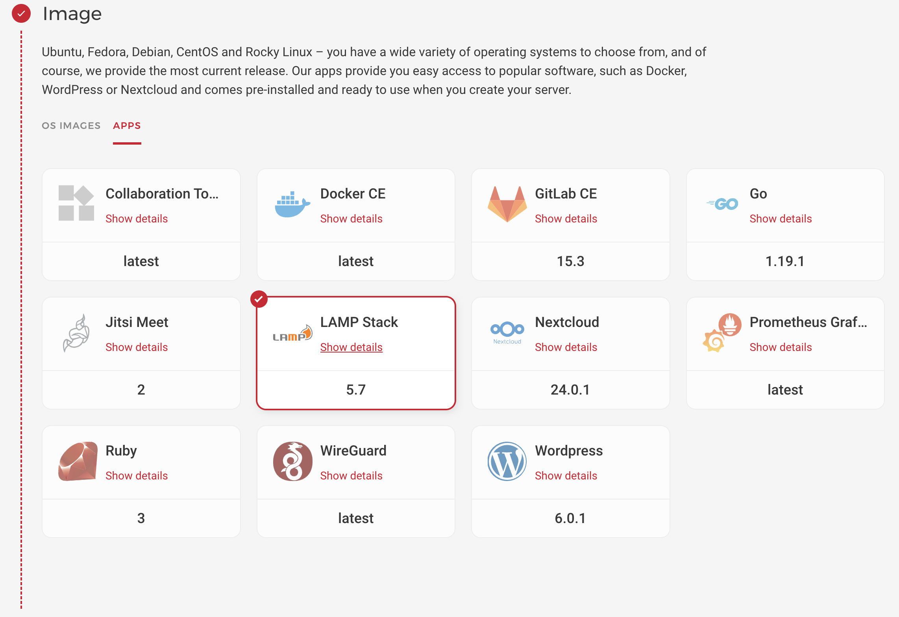

## Introduction

This tutorial will give you an example of how you can create and access a MySQL database on the remote instance inside your Hetzner Cloud infrastructure.

**Prerequisites**

You should have MySQL installed on your Hetzner Cloud instance.

You can use LAMP app if you don't want to install MySQL server manually on the machine.



### Step 1 - Create a private network

Create your private network under your Hetzner Cloud project in the region you want to use.


Remember that the default IP range is set to `10.0.0.0/16`.

### Step 2 - Attach the server to the network

If you already have MySQL server running in your cloud then you have to attach it to the created network.
It could be done using Hetzner Cloud UI console or using `hcloud` tool.

```shell
hcloud server attach-to-network --network <your-network-name> --ip <your-server-ip>
```

### Step 3 - Modify MySQL configuration

To have MySQL accessible from the outside - you'll have to make a change in the `/etc/mysql/mysql.conf.d/mysqld.cnf` file.

For MySQL server installed using LAMP app, you also need to open MySQL port (`3306` by default) using `ufw` tool. If you have MySQL server installed manually - you need to install the firewall using `apt-get install ufw` command.

To open MySQL from outside replace `bind-address` parameter from `127.0.0.1` to `0.0.0.0`.

Use the following command to open MySQL configuration file:

```shell
nano /etc/mysql/mysql.conf.d/mysqld.cnf
```

Then you have to add a rule to the firewall and enable it.

```shell
ufw allow from 10.0.0.0/16 to any port 3306
ufw enable
```

Remember to put the same IP range that you added during private network creation. 

The last step is to create a new MySQL user.

Enter MySQL cli using as root:
```shell
mysql -u root -p
```
If you are under LAMP app then your root password is generated by Hetzner and stored in the `/root/.hcloud_password` file.

Create a new MySQL user which could be used by non-local instances.

```mysql
CREATE USER '<user>'@'%' IDENTIFIED BY '<password>';
GRANT ALL PRIVILEGES ON *.* TO '<user>'@'%' WITH GRANT OPTION;
FLUSH PRIVILEGES;
```

Also, don't forget to restart MySQL after manipulating with `mysqld.cnf` file.

```shell
service mysql reload
```

### Step 4 - Check MySQL access in the private network

Create a new server from scratch and attach it to the same private network.

Install MySQL client. You can have MariaDB client for example.

```shell
apt install mariadb-client -y
```

Check your MySQL instance private host on the server list tab in the Hetzner Cloud UI.

Use the command to connect to the MySQL host:

```shell
mysql -h <mysql-host-private-ip> -u <user-created-above> -p
```

Then just paste your password created for the user and voilà - you are in.

## Conclusion
Here you saw just an example of how to make a database accessible in the private network under Hetzner Cloud.

Please consider the following instructions as an example and not as best practices for the MySQL production setup. 

##### License: MIT

<!--

Contributor's Certificate of Origin

By making a contribution to this project, I certify that:

(a) The contribution was created in whole or in part by me and I have
    the right to submit it under the license indicated in the file; or

(b) The contribution is based upon previous work that, to the best of my
    knowledge, is covered under an appropriate license and I have the
    right under that license to submit that work with modifications,
    whether created in whole or in part by me, under the same license
    (unless I am permitted to submit under a different license), as
    indicated in the file; or

(c) The contribution was provided directly to me by some other person
    who certified (a), (b) or (c) and I have not modified it.

(d) I understand and agree that this project and the contribution are
    public and that a record of the contribution (including all personal
    information I submit with it, including my sign-off) is maintained
    indefinitely and may be redistributed consistent with this project
    or the license(s) involved.

Signed-off-by: Pavlo Onysko (pavlo.onysko@gmail.com)

-->
