## Introduction

In this how-to you will learn how to use the Hetzner Cloud S3 Storage as a backend for terraform. This allowed me to centralize Terraform backends and gave my an ability to easily reuse remote states into different projects. To aid newcomers, I will be using WebUI to show all steps, but I'll also provide Hetzner CLI commands at the ent of the tutorial.

 **Prerequisites**

* Basic knowledge about the Hetzner Cloud
* [Terraform](https://www.terraform.io/) or [OpenTofu](https://opentofu.org/docs/v1.11/intro/install/) installed. I will be using OpenTofu, but everything should be the same for Terraform.


## Step 1 - S3 Setup

First lets create an S3 bucket and geneate credentials. I will proceed with creating a new project and S3 bucket inside this new project.

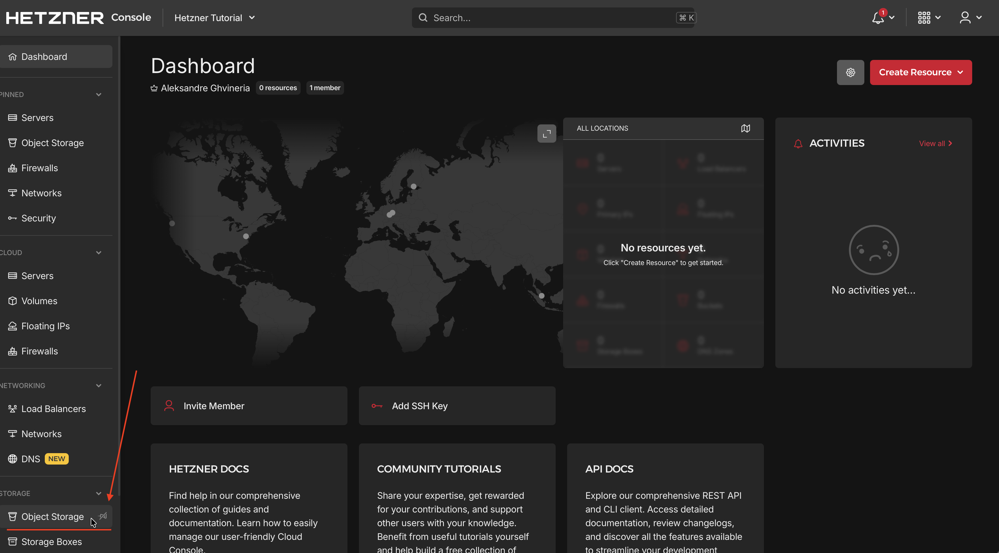
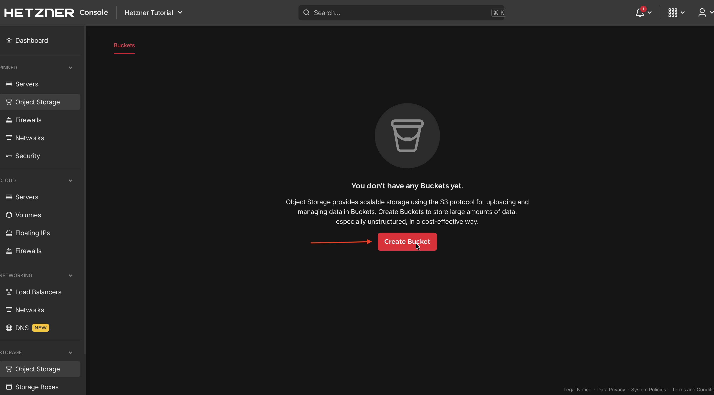
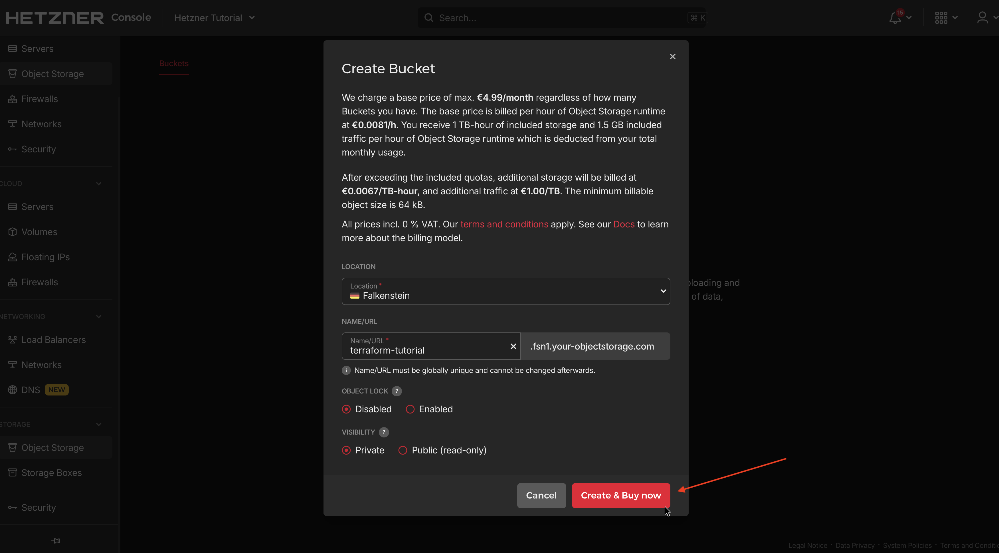
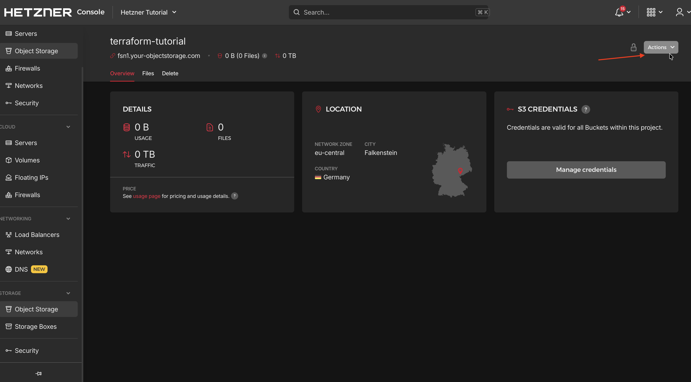
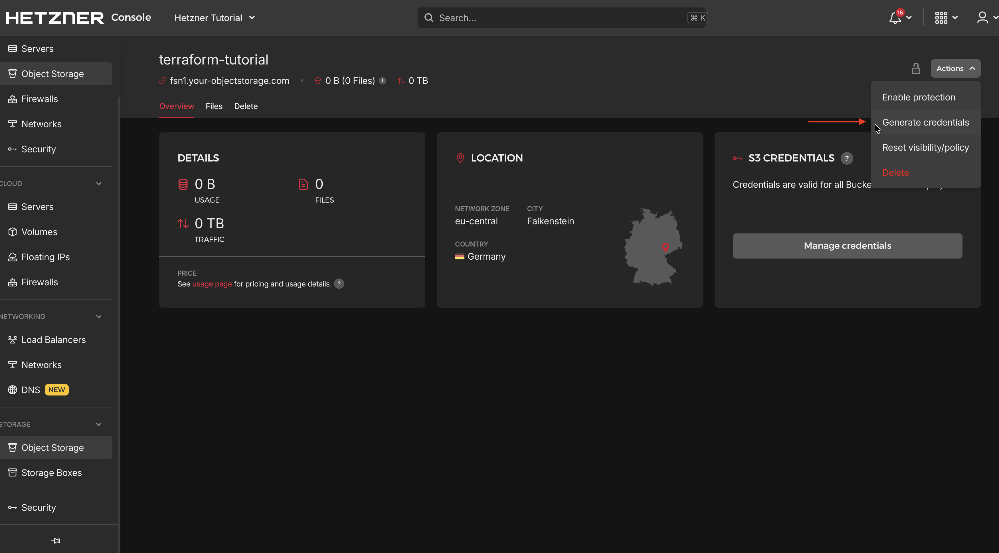
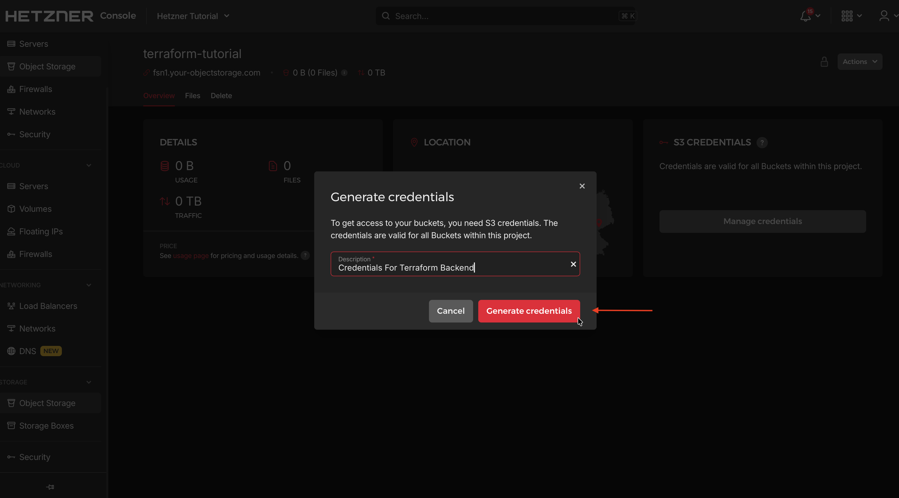


Save Access Key and Secret Key somewhere.
## Step 2 - Terraform setup

Let's create an empty directory and main.tf file inside this folder

```bash
mkdir terraform-tutorial
cd terraform-backend-tutorial
touch main.tf
```

Open main.tf with preffered text editor and copy the content. Replace placeholders with your actuals values. (Don't worry abuout me 'leaking' my credentials, they have been rotated as I'm writing this tutorial :) )

```hcl
terraform {
  backend "s3" {
   
    bucket = "terraform-tutorial"
    key    = "terraform-tutorial/terraform.tfstate"
    endpoint = "https://fsn1.your-objectstorage.com"
    
    skip_credentials_validation = true
    skip_metadata_api_check     = true
    skip_region_validation      = true
    use_path_style            = true
  }
  required_providers {
    hcloud = {
      source  = "hetznercloud/hcloud"
      version = "1.53.1"
    }
  }
}
```
Export these variables in your terminal seession, use Access Key and Secret Key that you saved before. Leave AWS_DEFAULT_REGION as is, since it has to be any of real AWS regions(fill with regions here):
```bash
export AWS_ACCESS_KEY_ID="YOUR_HETZNER_ACCESS_KEY"
export AWS_SECRET_ACCESS_KEY="YOUR_HETZNER_SECRET_KEY"
export AWS_DEFAULT_REGION="eu-central"
```

After this perform terraform init
```bash
terraform init
```
or if you are using OpenTofu like me:
```bash
tofu init
```
If yousee this output in your console, Congrats! it means setup was a success.
```bash
❯ tofu init               

Initializing the backend...

Successfully configured the backend "s3"! OpenTofu will automatically
use this backend unless the backend configuration changes.

Initializing provider plugins...
- Finding hetznercloud/hcloud versions matching "1.53.1"...
- Installing hetznercloud/hcloud v1.53.1...
- Installed hetznercloud/hcloud v1.53.1 (signed, key ID 5219EACB3A77198B)

Providers are signed by their developers.
If you'd like to know more about provider signing, you can read about it here:
https://opentofu.org/docs/cli/plugins/signing/

OpenTofu has created a lock file .terraform.lock.hcl to record the provider
selections it made above. Include this file in your version control repository
so that OpenTofu can guarantee to make the same selections by default when
you run "tofu init" in the future.

OpenTofu has been successfully initialized!

You may now begin working with OpenTofu. Try running "tofu plan" to see
any changes that are required for your infrastructure. All OpenTofu commands
should now work.

If you ever set or change modules or backend configuration for OpenTofu,
rerun this command to reinitialize your working directory. If you forget, other
commands will detect it and remind you to do so if necessary.
```


## Step 3 - Create a VM on HCloud
Let's head over to Hcloud console and generate an API token to use with terraform, we will use this token to create an example VM.

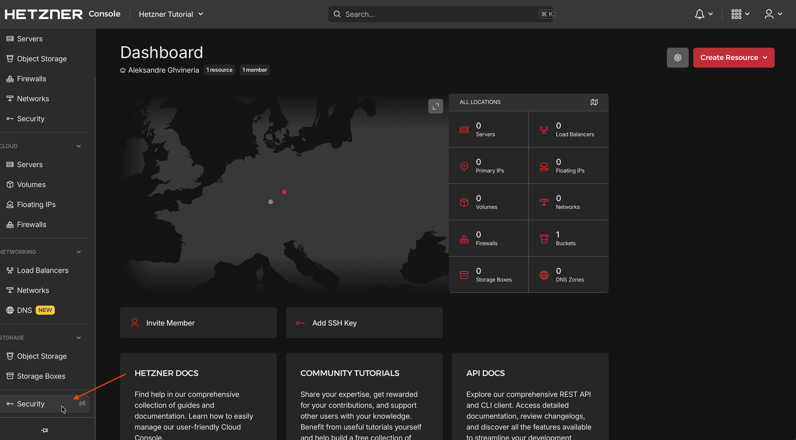
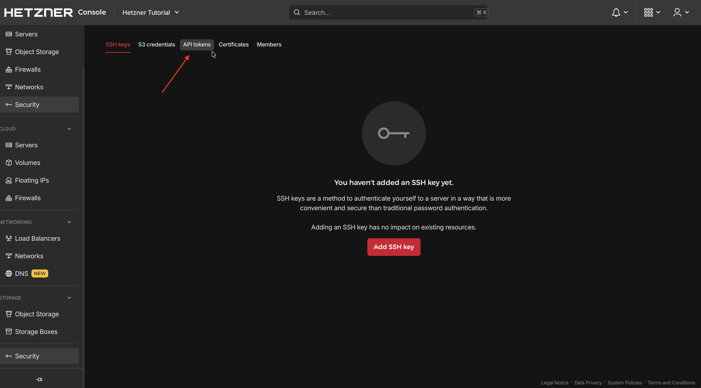
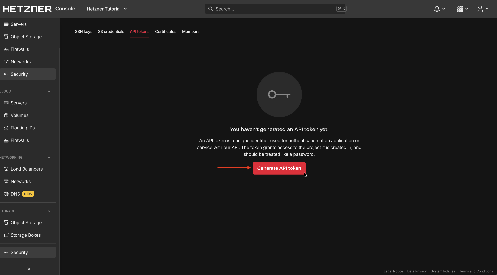
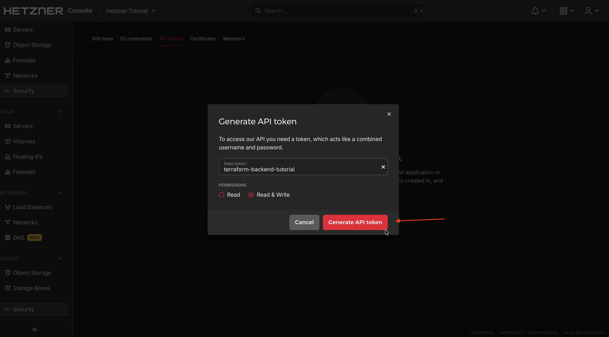
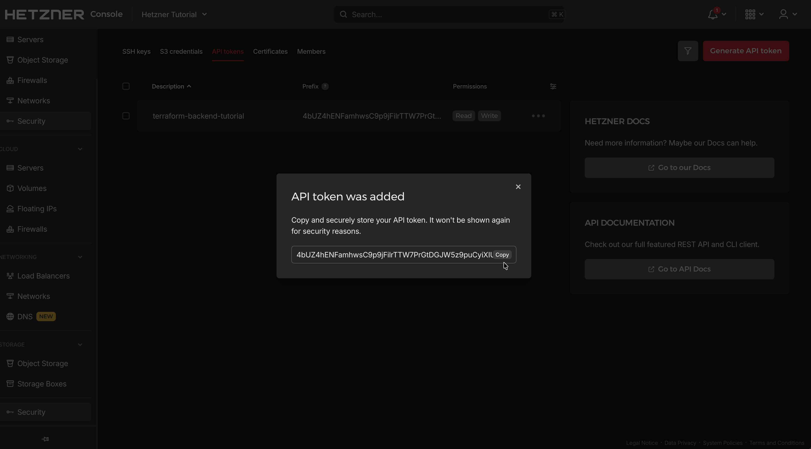


Save API token somewhere, since we will need it soon.

VM Specs:
* Name: tutorial-vm
* Image: ubuntu-24.04
* Server Type: cx23
* Location: nbg1 (Nuremberg)

Add this block to main.tf

```hcl
# Hetzner Cloud related configs
variable "hcloud_token" {
  sensitive = true
}
provider "hcloud" {
  token = var.hcloud_token
}

# Provision a single VM on Hetzner Cloud
resource "hcloud_server" "vm" {
  name        = "tutorial-vm"
  image       = "ubuntu-24.04"
  server_type = "cx23"
  location    = "nbg1"

  public_net {
    ipv4_enabled = true
    ipv6_enabled = false
  }

  labels = {
    managed_by = "terraform"
  }
}
```
Export token as a varibale that will be picked up by Terraform/OpenTofu
```bash
export TF_VAR_hcloud_token="your-hcloud-api-token"
```
now we can plan and apply main.tf

```bash
tofu plan
```
```bash
> tofu apply

OpenTofu used the selected providers to generate the following execution plan. Resource actions are indicated with the following symbols:
  + create

OpenTofu will perform the following actions:

  # hcloud_server.vm will be created
  + resource "hcloud_server" "vm" {
      + allow_deprecated_images    = false
      + backup_window              = (known after apply)
      + backups                    = false
      + datacenter                 = (known after apply)
      + delete_protection          = false
      + firewall_ids               = (known after apply)
      + id                         = (known after apply)
      + ignore_remote_firewall_ids = false
      + image                      = "ubuntu-24.04"
      + ipv4_address               = (known after apply)
      + ipv6_address               = (known after apply)
      + ipv6_network               = (known after apply)
      + keep_disk                  = false
      + labels                     = {
          + "managed_by" = "terraform"
        }
      + location                   = "nbg1"
      + name                       = "tutorial-vm"
      + primary_disk_size          = (known after apply)
      + rebuild_protection         = false
      + server_type                = "cx23"
      + shutdown_before_deletion   = false
      + status                     = (known after apply)

      + public_net {
          + ipv4         = (known after apply)
          + ipv4_enabled = true
          + ipv6         = (known after apply)
          + ipv6_enabled = false
        }
    }

Plan: 1 to add, 0 to change, 0 to destroy.

Do you want to perform these actions?
  OpenTofu will perform the actions described above.
  Only 'yes' will be accepted to approve.

  Enter a value: yes

hcloud_server.vm: Creating...
hcloud_server.vm: Still creating... [10s elapsed]
hcloud_server.vm: Creation complete after 18s [id=115987186]

Apply complete! Resources: 1 added, 0 changed, 0 destroyed.
```
Congrats, you have create a VM!

Now we also need to define outputs, a resource that can be accessed remotely.

Append this to main.tf
```hcl
output "vm_id" {
  description = "ID of the provisioned VM"
  value       = hcloud_server.vm.id
}

output "vm_ipv4" {
  description = "Public IPv4 address of the VM"
  value       = hcloud_server.vm.ipv4_address
}

output "vm_name" {
  description = "Name of the VM"
  value       = hcloud_server.vm.name
}
```
Execute:
```bash
❯ tofu apply               
hcloud_server.vm: Refreshing state... [id=115987908]

Changes to Outputs:
  + vm_id   = "115987908"
  + vm_ipv4 = "91.99.173.29"
  + vm_name = "tutorial-vm"

You can apply this plan to save these new output values to the OpenTofu state, without changing any real infrastructure.

Do you want to perform these actions?
  OpenTofu will perform the actions described above.
  Only 'yes' will be accepted to approve.

  Enter a value: yes


Apply complete! Resources: 0 added, 0 changed, 0 destroyed.

Outputs:

vm_id = "115987908"
vm_ipv4 = "91.99.173.29"
vm_name = "tutorial-vm"
```

## Step 4 - Access VM state from different Project

Now let's create a new terraform project and access VM state.

```bash
cd ../
mkdir terraform-read-state
cd terraform-read-state
touch main.tf
```

Contents of main.tf
```hcl
terraform {
  backend "s3" {
   
    bucket = "terraform-tutorial"
    key    = "tterraform-read-state/terraform.tfstate"
    endpoint = "https://fsn1.your-objectstorage.com"
    
    skip_credentials_validation = true
    skip_metadata_api_check     = true
    skip_region_validation      = true
    use_path_style            = true
  }
}

data "terraform_remote_state" "tutorial_vm" {
  backend = "s3"
  config = {
    bucket = "terraform-tutorial"
    key                        = "terraform-tutorial/terraform.tfstate"
    endpoint                   = "https://fsn1.your-objectstorage.com"
    skip_credentials_validation = true
    skip_metadata_api_check     = true
    skip_region_validation      = true
    use_path_style              = true
  }
}


output "vm_id" {
  description = "ID of the provisioned VM"
  value       = data.terraform_remote_state.vm_state.outputs.vm_id
}

output "vm_ipv4" {
  description = "Public IPv4 address of the VM"
  value       = data.terraform_remote_state.vm_state.outputs.vm_ipv4
}

output "vm_name" {
  description = "Name of the VM"
  value       = data.terraform_remote_state.vm_state.outputs.vm_name
}
```

Now lets run
```bash
❯ tofu init    

Initializing the backend...

Successfully configured the backend "s3"! OpenTofu will automatically
use this backend unless the backend configuration changes.

Initializing provider plugins...
- terraform.io/builtin/terraform is built in to OpenTofu

OpenTofu has been successfully initialized!

You may now begin working with OpenTofu. Try running "tofu plan" to see
any changes that are required for your infrastructure. All OpenTofu commands
should now work.

If you ever set or change modules or backend configuration for OpenTofu,
rerun this command to reinitialize your working directory. If you forget, other
commands will detect it and remind you to do so if necessary.
```
```bash
❯ tofu apply
data.terraform_remote_state.vm_state: Reading...
data.terraform_remote_state.vm_state: Read complete after 1s

Changes to Outputs:
  + vm_id   = "115987908"
  + vm_ipv4 = "91.99.173.29"
  + vm_name = "tutorial-vm"

You can apply this plan to save these new output values to the OpenTofu state, without changing any real infrastructure.

Do you want to perform these actions?
  OpenTofu will perform the actions described above.
  Only 'yes' will be accepted to approve.

  Enter a value: yes


Apply complete! Resources: 0 added, 0 changed, 0 destroyed.

Outputs:

vm_id = "115987908"
vm_ipv4 = "91.99.173.29"
vm_name = "tutorial-vm"

```


If I explained everything correctly and you did everything as I said, you should see vm data as an output.
If not try to trace back the steps, I'm 99.999% sure you missed something.

If you see correct output, then hooray! 
Also, if you take a closer look, you can see that hcloud provider is not used in the new main.tf, but we still got the data.


## Conclusion
You've successfully set up Hetzner Cloud S3 as a Terraform backend and learned how to share state between projects. This approach helps you manage infrastructure more efficiently and keeps your Terraform states centralized. You can now use this setup for your own projects and teams.

For more information, check out the [Hetzner Cloud documentation](https://docs.hetzner.cloud/) and [Terraform S3 backend docs](https://www.terraform.io/language/settings/backends/s3).

##### License: MIT

<!--

Contributor's Certificate of Origin

By making a contribution to this project, I certify that:

(a) The contribution was created in whole or in part by me and I have
    the right to submit it under the license indicated in the file; or

(b) The contribution is based upon previous work that, to the best of my
    knowledge, is covered under an appropriate license and I have the
    right under that license to submit that work with modifications,
    whether created in whole or in part by me, under the same license
    (unless I am permitted to submit under a different license), as
    indicated in the file; or

(c) The contribution was provided directly to me by some other person
    who certified (a), (b) or (c) and I have not modified it.

(d) I understand and agree that this project and the contribution are
    public and that a record of the contribution (including all personal
    information I submit with it, including my sign-off) is maintained
    indefinitely and may be redistributed consistent with this project
    or the license(s) involved.

Signed-off-by: Aleksandre Ghvineria <ghvinerias@gmail.com>

-->