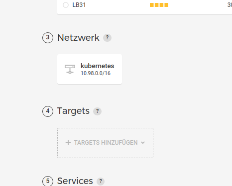
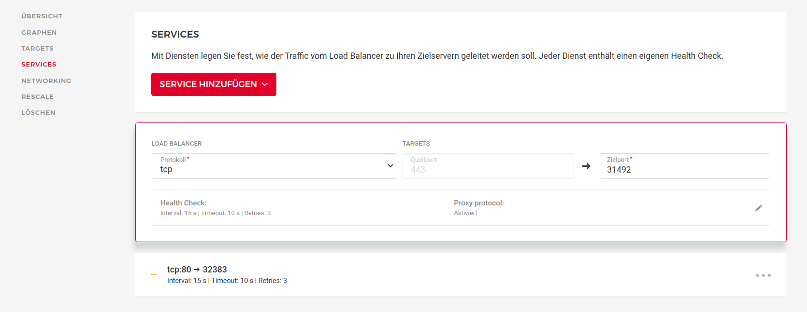
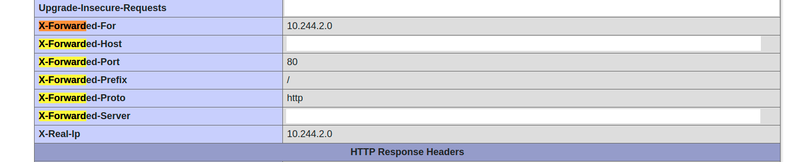

## Introduction

We installed a Kubernetes Cluster on [Hetzner Cloud](https://www.hetzner.com/cloud) and used its [Cloud Load Balancer](https://www.hetzner.com/cloud/load-balancer) to serve traffic. After some experimentation, we wanted to protect our deployed services with some authentication. Adding [basic auth](https://en.wikipedia.org/wiki/Basic_access_authentication) was no problem. But as soon as we tried to bypass some source addresses, it wasn't working.

Therefore, in this tutorial, I´ll demonstrate how we managed to configure this. Our use-case is as follows: we want to restrict access to deployed services with a password prompt ([basic auth](https://en.wikipedia.org/wiki/Basic_access_authentication)). However, some source addresses (eg. our office) should bypass this check for convenience reasons.

### Prerequisites

* A working Kubernetes Cluster on [Hetzner Cloud](https://www.hetzner.com/cloud). You may refer to this [tutorial](/tutorials/install-kubernetes-cluster)for installation.
* Some familiarity with Kubernetes.

*This tutorial was tested on Ubuntu 20.04 Hetzner Cloud servers and Kubernetes version v1.21.0*

## Step 1 - Configure Ingress

We used the [official config](https://raw.githubusercontent.com/kubernetes/ingress-nginx/controller-v0.45.0/deploy/static/provider/cloud/deploy.yaml) to deploy our ingress service.

First download the official config file:

    wget https://raw.githubusercontent.com/kubernetes/ingress-nginx/controller-v0.45.0/deploy/static/provider/cloud/deploy.yaml

Add `use-forwarded-headers`, `compute-full-forwarded-for` and `use-proxy-protocol` to the data definition, like this:

    # Source: ingress-nginx/templates/controller-configmap.yaml
    apiVersion: v1
    kind: ConfigMap
    metadata:
      labels:
        helm.sh/chart: ingress-nginx-3.27.0
        app.kubernetes.io/name: ingress-nginx
        app.kubernetes.io/instance: ingress-nginx
        app.kubernetes.io/version: 0.45.0
        app.kubernetes.io/managed-by: Helm
        app.kubernetes.io/component: controller
      name: ingress-nginx-controller
      namespace: ingress-nginx
    data:
      use-forwarded-headers: "true"
      compute-full-forwarded-for: "true"
      use-proxy-protocol: "true"

### Step 1.1 - Create and connect the Load Balancer

Create a Load Balancer in your Hetzner cloud console. It is important to select the correct internal network. We did not need to define any services at this step, this was done automatically after deploying the ingress service.

The name of the load balancer must match the annotation `load-balancer.hetzner.cloud/name` like this:

    ---
    # Source: ingress-nginx/templates/controller-service.yaml
    apiVersion: v1
    kind: Service
    metadata:
      annotations:
        load-balancer.hetzner.cloud/name: "kubelb"

Another description on how to enable the Load Balancer for Kubernetes can be found [here](https://jmrobles.medium.com/how-to-setup-hetzner-load-balancer-on-a-kubernetes-cluster-2ce79ca4a27b).

After you made the described modifications to the `deploy.yaml`, apply the config with:

    kubectl -f deploy.yaml

Full configuration example can be found [here](https://github.com/Wamoco/kubernetes/blob/master/services/ingress/deploy.yaml).

## Step 2 - Enable Proxy Protocol in Load Balancer

Switch over to your Hetzner cloud console and configure the Load Balancer. Open the tab services. It may take some minutes before services become present in the cloud console. Enable `Proxy Protocol` for the used services.

Please note: at this point all your services may become unreachable, unless you configured ingress correctly. If this happens, don't worry. This setting can be easily deactivated again.

## Step 3 - Add authentication to the service

Create a `service.yaml` for your service. You may use this [example service definition](https://github.com/Wamoco/kubernetes/blob/master/services/phpinfo/deploy.yaml) as a starting point.

Now it's time to add the authentication part. Here are the annotations we used to protect our service. It configures a basic auth which can be bypassed by some whitelisted addresses.

Add following annotations to your service, especially the `whitelist-source-range` needs to be changed to your needs.

    ...
    apiVersion: extensions/v1beta1
    kind: Ingress
    metadata:
      name: example
      annotations:
        kubernetes.io/ingress.class: nginx
        nginx.ingress.kubernetes.io/whitelist-source-range: 4.8.15.16/32,23.42.0.0/32
        nginx.ingress.kubernetes.io/satisfy: "any"
        nginx.ingress.kubernetes.io/auth-type: basic
        nginx.ingress.kubernetes.io/auth-secret: basic-auth
        nginx.ingress.kubernetes.io/auth-realm: "Authentication Required - Registry"
    ...

But wait? How to define accounts for basic auth? Well this is done with the secret called `basic-auth` in this example. It was created with `htpasswd`:

    $ htpasswd -c ./auth user

The file can then be imported into kubernetes as a secret like this. Please note the name `basic-auth` it must match `auth-secret` in the service definition.

    kubectl create secret generic basic-auth --from-file=auth

Finally, deploy the service with:

    kubectl -f service.yaml

## Problem discussion

Source IP filtering relies on the fact that the correct client IP is present in HTTP Header `X-Forwared-For` and `X-Real-IP`. At first, this was not the case for our set up. We validated this using a phpinfo service. Please note the private network IP. No surprise that our IP whitelist was not working, it could not determine the real IP of the visitor.

You may validate this for yourself using this [deployment example](https://github.com/Wamoco/kubernetes/tree/master/services/phpinfo).

## Conclusion

You are now able to enable authentication for services in your Kubernetes Cluster. This can be a password prompt which can optionally be bypassed by some source addresses.

##### License: MIT

<!--

Contributor's Certificate of Origin

By making a contribution to this project, I certify that:

(a) The contribution was created in whole or in part by me and I have
    the right to submit it under the license indicated in the file; or

(b) The contribution is based upon previous work that, to the best of my
    knowledge, is covered under an appropriate license and I have the
    right under that license to submit that work with modifications,
    whether created in whole or in part by me, under the same license
    (unless I am permitted to submit under a different license), as
    indicated in the file; or

(c) The contribution was provided directly to me by some other person
    who certified (a), (b) or (c) and I have not modified it.

(d) I understand and agree that this project and the contribution are
    public and that a record of the contribution (including all personal
    information I submit with it, including my sign-off) is maintained
    indefinitely and may be redistributed consistent with this project
    or the license(s) involved.

Signed-off-by: Bernhard <bl@wamoco.de>

-->
