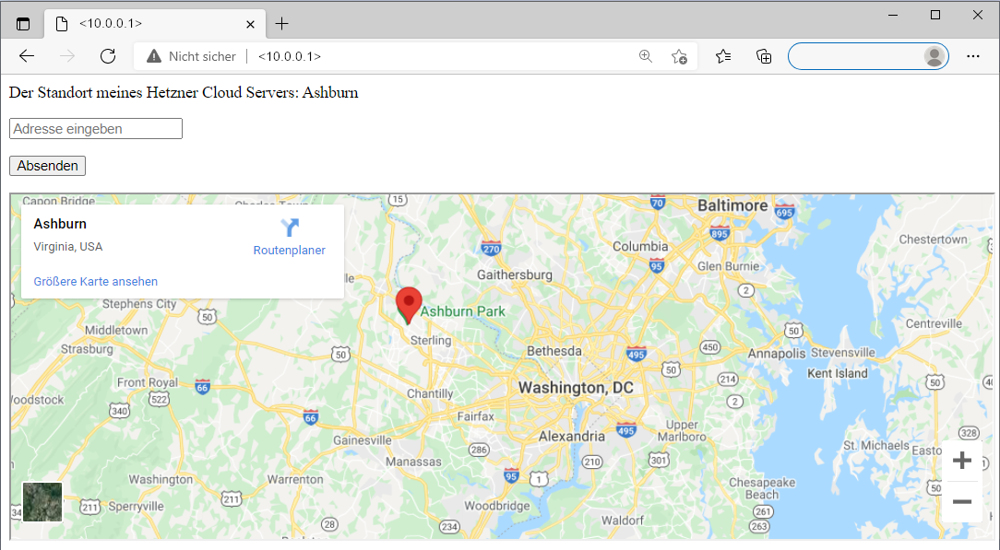

## Einführung

In diesem Tutorial wird erklärt, wie Sie sich auf einer Webseite den Standort Ihres Servers in Google Maps anzeigen lassen können. Dazu wird gezeigt, wie man über den Metadaten-Service eines Hetzner Cloud Servers den Server-Standort herausfindet und wie man Google Maps auf der eigenen Seite einbauen kann. Die Webseite wird mit dem Webserver Apache mit PHP erstellt.



**Voraussetzungen**

* Grundlegende Kenntnisse über Hetzner Cloud
* Hetzner Cloud Server
  * LAMP Stack muss bereits installiert sein
    - Vorinstalliert durch die [Hetzner Cloud App LAMP Stack](https://docs.hetzner.com/de/cloud/apps/list/lamp-stack) oder
    - Manuell installiert (siehe das Tutorial [LAMP installieren](https://community.hetzner.com/tutorials/install-lamp-on-ubuntu-debian) (EN))
  * Muss eine öffentliche IP-Adresse besitzen
* Kommandozeilen-Tool

**Beispiel-Benennungen**

* Benutzername: holu
* IPv4: <10.0.0.1>

Beachten Sie bitte, dass in allen Beispiel-Befehlen `holu` mit dem eigenen Benutzernamen ersetzt werden muss und `<10.0.0.1>` mit der eigenen IP-Adresse.

## Schritt 1 - Mit Cloud Server verbinden

LAMP muss bereits installiert sein. Verbinden Sie sich also entweder mit einem Cloud Server mit der Hetzner App LAMP Stack oder nutzen Sie das Tutorial [Installing LAMP Stack on Ubuntu/Debian](https://community.hetzner.com/tutorials/install-lamp-on-ubuntu-debian) (EN), um die Programme selbst zu installieren.

Um die Webseite zu Ihrer IP-Adresse einzurichten, verbinden Sie sich mit Ihrem Server:

```
ssh holu@<10.0.0.1>
```

## Schritt 2 - Ordner öffnen

Sobald Sie mit Ihrem Server verbunden sind, können Sie die `index.php`-Datei bearbeiten. Diese Datei ist sozusagen der Kern jeder Webseite oder Anwendung. Was in dieser Datei steht, wird am Ende auf der Webseite angezeigt. Öffnen Sie den Ordner, in dem die Datei gespeichert ist.

- Cloud Server mit Hetzner App LAMP Stack

    Bei der Hetzner Cloud App wird standartmäßig folgender Pfad genutzt:

    ```
    cd /var/www/<10.0.0.1>
    ```

    Beachten Sie bitte, dass `<10.0.0.1>` mit der eigenen IP-Adresse ersetzt werden muss. 

    Sobald Sie im richtigen Ordner sind, können Sie sich mit `ls` alle Inhalte listen lassen, die darin enthalten sind. Eine Datei sollte `index.php` heißen. Bearbeiten Sie diese, um den Inhalt Ihrer Webseite zu verändern:

    ```
    sudo nano index.php
    ```

    Standardmäßig steht in dieser Datei bereits `Hello World`. Dieser Text sollte auch auf der Webseite sichtbar sein. Der Text kann jetzt gelöscht und im nächsten Schritt durch einen neuen Inhalt ersetzt werden.

- Server auf dem LAMP manuell installiert wurde

    Bei Apache wird standartmäßig folgender Pfad genutzt:

    ```
    cd /var/www/html
    ```

    Sobald Sie im richtigen Ordner sind, können Sie sich mit `ls` alle Inhalte listen lassen, die darin enthalten sind. Wenn Sie das oben verlinkte Tutorial verwendet haben, befinden sich in diesem Ordner vermutlich die Dateien `index.html` und `info.php`. Wenn Sie in Ihrem Browser die IP-Adresse Ihres Servers eingeben, wird automatisch der Inhalt der Datei `index.hmtl` angezeigt. Um eine andere Seite anzeigen zu lassen, muss die entsprechende Datei in der URL genannt werden (http://<10.0.0.1>/info.php/). In diesem Tutorial arbeiten wir mit `index.php`. Sollten Sie die Datei `index.html` bisher noch nicht verwenden, können Sie diese nun löschen und mit `index.php` ersetzen. Dadurch wird `index.php` automatisch zur neuen Startseite.
  
    ```
    rm index.html
    ```

    ```
    touch index.php
    ```

    Wenn Sie die Datei `index.html` nicht löschen möchten, können Sie trotzdem mit `index.php` arbeiten. Denken Sie aber daran, dass Sie in diesem Fall in der URL den Dateinamen ergänzen müssen (http://<10.0.0.1>/index.php/), um die Webseite zu öffnen.

    Öffnen Sie nun Ihre PHP-Datei:

    ```
    sudo nano index.php
    ```

## Schritt 3 - Den Standort des eigenen Servers ermitteln

Der Standort des Cloud Servers lässt sich über den Metadaten-Service des Servers herausfinden. Als Output erhält man den Standort `fsn1`, `nbg1`, `hel1` oder `ash`. Anhand dieser Information kann man sehen in welcher Stadt sich der Server befindet.

| Standort               | Stadt                 |
| ---------------------- | --------------------- |
| `fsn1`                 | Falkenstein           |
| `nbg1`                 | Nürnberg              |
| `hel1`                 | Helsinki              |
| `ash`                  | Ashburn               |

Da es sich hierbei um Hetzner-Angaben handelt, kann diese Methode nur bei Hetzner Cloud Servern angewendet werden.

Wenn Sie einen Hetzner Cloud Server besitzen, fügen Sie Folgendes in Ihrer PHP-Datei ein:

```php
<?php
$ch = curl_init();
curl_setopt($ch, CURLOPT_URL, "http://169.254.169.254/hetzner/v1/metadata/availability-zone");
curl_setopt($ch, CURLOPT_CONNECTTIMEOUT, 2);
curl_setopt($ch, CURLOPT_TIMEOUT, 4);
curl_setopt($ch, CURLOPT_RETURNTRANSFER, true);
$datacenter = curl_exec($ch);
curl_close($ch);

$city = "";
if ($datacenter == "fsn1-dc14") {
    $city = "Falkenstein";
} elseif ($datacenter == "nbg1-dc3") {
    $city = "Nürnberg";
} elseif ($datacenter == "hel1-dc2") {
    $city = "Helsinki";
} elseif ($datacenter == "ash-dc1") {
    $city = "Ashburn";
} elseif ($datacenter === false) {
    die("Kein Hetzner Cloud Server" . PHP_EOL);
}

echo "Der Standort meines Hetzner Cloud Servers: $city" . PHP_EOL;
?>
```

- Die Variable `$datacenter` gibt den Standort (`fsn1`, `nbg1`, `hel1` oder `ash`) des Servers an. Dieser wird zuvor über Curl vom Metadaten-Service des Servers abgefragt.

- Die Variable `$city` gibt die genaue Stadt (Falkenstein, Nürnberg, Helsinki oder Ashburn) des Servers an. Dafür wird mit `if` definiert, welcher Standort (`fsn1`, `nbg1`, `hel1`, `ash`) welcher Stadt (Falkenstein, Nürnberg, Helsinki, Ashburn) entspricht.

Sobald Sie fertig sind, können Sie die Datei mit `CTRL` + `X` schließen, mit `Y` speichern und mit `ENTER` bestätigen.

## Schritt 4 - Das Abrufen der Metadaten testen

Damit Curl funktioniert, sollten Sie sicherstellen, dass auf Ihrem Server PHP-Curl installiert ist.

- Zum Installieren können Sie folgende Schritte durchführen:

  ```
  sudo apt update
  ```

  ```
  sudo apt install php-curl
  ```

  ```
  sudo service apache2 restart
  ```

  Denken Sie daran Apache nach dem Installieren von PHP-Curl neuzustarten. Ansonsten kann es passieren, dass die PHP-Datei trotz der Installation nicht ausgeführt werden kann.

Anschließend können Sie das Abrufen der Metadaten testen. Öffnen Sie dazu entweder Ihre Webseite (http://<10.0.0.1>/) oder nutzen Sie in Ihrer Kommandozeile folgenden Befehl:

```
php -f index.php
```

Achten Sie darauf, dass Sie im richtigen Ordner sind, bevor Sie den Befehl ausführen.

__Output:__

```
Der Standort meines Cloud Servers: Ashburn
```

Im Output sollte nun der Standort Ihres Servers stehen. In diesem Beispiel ist das Ashburn. Als nächsten Schritt kann nun die Karte hinzugefügt werden.

## Schritt 5 - Karte und Eingabefeld ergänzen

Jetzt da der Standort des Servers bekannt ist, können darunter ein Eingabefeld und eine Weltkarte ergänzt werden. Über das Eingabefeld werden Sie sich jeden beliebigen Standort auf der Karte anzeigen lassen können.

- Öffnen Sie erneut Ihre PHP-Datei:

    ```
    nano /var/www/<10.0.0.1>/index.php
    ```

    Beachten Sie bitte, dass `<10.0.0.1>` mit der eigenen IP-Adresse, bzw. dem eigenen Speicherpfad ersetzt werden muss.

- Ergänzen Sie Folgendes für das __Eingabefeld__:

    ```php
    <form method="POST">
        <p>
            <input type="text" name="address" placeholder="Adresse eingeben">
        </p>

        <input type="submit" name="submit_address">
    </form>
    ```

    Mit `placeholder` wird angegeben welcher Text innerhalb des Suchfeldes angezeigt werden soll, bis eine Suche eingegeben wird.

- Ergänzen Sie Folgendes für __Google Maps__:

    ```php
    <?php
        if (isset($_POST["submit_address"]))
        {
            $address = $_POST["address"];
            $address = str_replace(" ", "+", $address);
            ?>
            <iframe width="100%" height="500" src="https://maps.google.com/maps?q=<?php echo $address; ?>&output=embed"></i>
            <?php
        }
        else
        {
            ?>
            <iframe width="100%" height="500" src="https://maps.google.com/maps?q=<?php echo $city; ?>&output=embed"></i>
            <?php
        }
    ?>
    ```

    - Die else-Anweisung gibt an, dass auf Google Maps der Standort angezeigt werden soll, der zuvor als `$city` definiert wurde. In Schritt 3 wurde `$city` als die Stadt definiert, in der sich der Cloud Server befindet. Diese Karte wird auf der Webseite als Startbild erscheinen.

    - Die if-Anweisung gibt an, dass auf Google Maps der Standort angezeigt werden soll, der zuvor als `$address` definiert wurde. In diesem Fall ist das der Standort, der über das Eingabefeld gesucht wird.

Sobald Sie fertig sind, können Sie die Datei mit `CTRL` + `X` schließen, mit `Y` speichern und mit `ENTER` bestätigen.

Anschließend können Sie die Webseite öffnen (http://<10.0.0.1>/), um zu testen ob alles richtig angezeigt wird.

## Ergebnis

Im vorangegangenen Tutorial haben Sie gelernt, wie Sie PHP-Curl installieren, die `index.php`-Datei öffnen und bearbeiten, und eine Webseite erstellen, auf welcher der Standort des Cloud Servers und eine Karte angezeigt werden.
