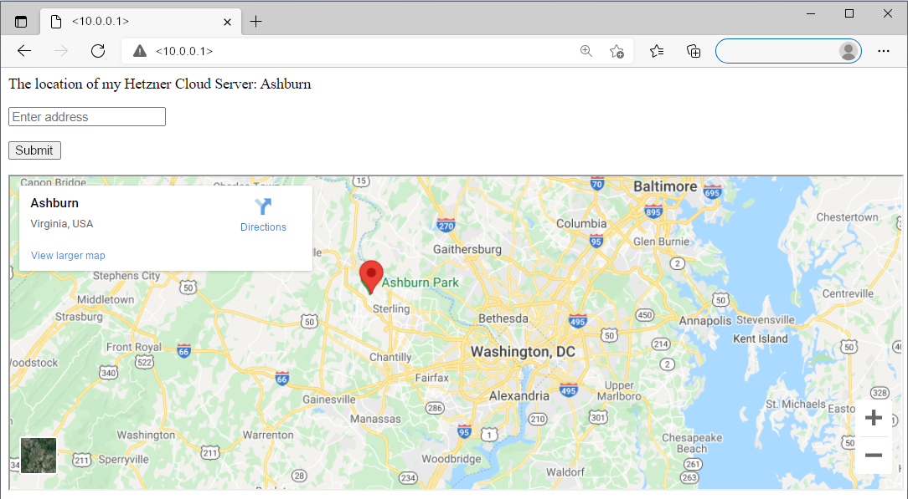

## Introduction

In this tutorial you will learn how to add Google Maps to your website and how to pin your location in it. For this, you will also learn how to get the location of a Hetzner cloud server from its metadata service. The website will be created with the web server Apache with PHP.



**Prerequisites**

* Basic knowledge about the Hetzner Cloud
* Hetzner Cloud Server
  * LAMP Stack needs to be installed
    - Preinstalled via the [Hetzner Cloud App LAMP Stack](https://docs.hetzner.com/de/cloud/apps/list/lamp-stack) or
    - Installed manually (see the tutorial about [installing LAMP](https://community.hetzner.com/tutorials/install-lamp-on-ubuntu-debian))
  * Public IP address is required
* CLI tool

**Example terminology**

* Username: holu
* IPv4: <10.0.0.1>

Please replace `holu` with your own username and `<10.0.0.1>` with your own IP address in all example commands.

## Step 1 - Connecting to the Cloud Server

LAMP has to be installed on the server. You can either connect to a cloud server with the Hetzner App LAMP Stack or use the tutorial [Installing LAMP Stack on Ubuntu/Debian](https://community.hetzner.com/tutorials/install-lamp-on-ubuntu-debian) to install LAMP manually.

To create the website, connect to your server:

```
ssh holu@<10.0.0.1>
```

## Step 2 - Opening the file

Once you are connected to your server, you can edit the `index.php` file. This file is essentially the heart of any website or application. Anything written in this file will be displayed on the website. Open the directory of this file:

- Cloud Server with Hetzner App LAMP Stack

    Hetzner Cloud App uses the following path by default:

    ```
    cd /var/www/<10.0.0.1>
    ```

    Please replace `<10.0.0.1>` with your own IP address.

    Once you opened the directory, you can use `ls` to list all files within the directory. One file should be `index.php`. Edit this file to change the content on your website:

    ```
    sudo nano index.php
    ```

    By default, this file will contain the text `Hello World`. This text should already be displayed on your website. You can now delete this text and replace it with new content in the next step.

- Server with LAMP manually installed on it

    Apache uses the following path by default:

    ```
    cd /var/www/html
    ```

    Once you opened the directory, you can use `ls` to list all files within the directory. If you used the tutorial linked above, there will be the files `index.html` and `info.php`. If you enter your IP address in a browser, it will display the contents of `index.html`. To display the contents of another file, you will have to add the filename to the URL (http://<10.0.0.1>/info.php/). In this tutorial, we are working with `index.php`. If you are not using `index.html`, you can delete it now and replace it with `index.php`. This will set `index.php` as the new starting page.

    ```
    rm index.html
    ```

    ```
    touch index.php
    ```

    If you do not want to delete `index.html`, you can still use `index.php`. However, you will need to add the file name to the URL (http://<10.0.0.1>/index.php/).

    Open your PHP file:

    ```
    sudo nano index.php
    ```

## Step 3 - Getting the location of the server

You can get the location of your cloud server via its metadata service. The output will be `fsn1`, `nbg1`, `hel1` or `ash`.
You can use this information to determine the city your server is in.

| Location               | City                   |
| ---------------------- | ---------------------- |
| `fsn1`                 | Falkenstein            |
| `nbg1`                 | Nuremberg              |
| `hel1`                 | Helsinki               |
| `ash`                  | Ashburn                |

These are Hetzner specific terms. This means that it is not possible to use this method with servers other than Hetzner Cloud Servers.

If you have a Hetzner Cloud Server, save this in your PHP file:

```php
<?php
$ch = curl_init();
curl_setopt($ch, CURLOPT_URL, "http://169.254.169.254/hetzner/v1/metadata/availability-zone");
curl_setopt($ch, CURLOPT_CONNECTTIMEOUT, 2);
curl_setopt($ch, CURLOPT_TIMEOUT, 4);
curl_setopt($ch, CURLOPT_RETURNTRANSFER, true);
$datacenter = curl_exec($ch);
curl_close($ch);
$city = "";
if ($datacenter == "fsn1-dc14") {
    $city = "Falkenstein";
} elseif ($datacenter == "nbg1-dc3") {
    $city = "Nuremberg";
} elseif ($datacenter == "hel1-dc2") {
    $city = "Helsinki";
} elseif ($datacenter == "ash-dc1") {
    $city = "Ashburn";
} elseif ($datacenter === false) {
    die("Not a Hetzner Cloud Server" . PHP_EOL);
}

echo "The location of my Hetzner Cloud Server: $city" . PHP_EOL;
?>
```

- The variable `$datacenter` is defined as the location (`fsn1`, `nbg1`, `hel1` or `ash`) of the server. Curl is used to get this information from the metadata service of the server.

- The variable `$city` is defined as the city (Falkenstein, Nuremberg, Helsinki or Ashburn) of the server. The if-statement is used to determine which location (`fsn1`, `nbg1`, `hel1`, `ash`) corresponds to which city (Falkenstein, Nürnberg, Helsinki, Ashburn).

Once you are done, you can use `CTRL`+`X` to save the file, `Y` to confirm and `ENTER` to close the file.

## Step 4 - Testing php-curl

In order for curl to work, php-curl needs to be installed on the server.

- Installing php-curl on the server

  ```
  sudo apt update
  ```

  ```
  sudo apt install php-curl
  ```

  ```
  sudo service apache2 restart
  ```

  Remember to restart Apache after installing php-curl. If you do not restart it, there might be an error with running the PHP file.

Next, you can test if the curl command is working. You can do this by either accessing your website (http://<10.0.0.1>/) or by using the following command in your CLI:

```
php -f index.php
```

Make sure you are in the right directory before you run the command.

__Output:__

```
The location of my Hetzner Cloud Server: Ashburn
```

Your location should now be displayed in the output. In this example, the server is located in Ashburn. Next, you can add the map.

## Step 5 - Adding the map and the input field

Now that we know the location of the server, we can add the input field and the map below. You can use the input field to search any location in the map.

- Open the PHP file:

    ```
    nano /var/www/<10.0.0.1>/index.php
    ```

    Please replace `<10.0.0.1>` with your own IP address or, if necessary, the correct path.

- Add the following for the __input field__:

    ```php
    <form method="POST">
        <p>
            <input type="text" name="address" placeholder="Enter address">
        </p>

        <input type="submit" name="submit_address">
    </form>
    ```

    `Placeholder` indicates the text that will be displayed in the input field until you enter a search.

- Add the following for __Google Maps__:

    ```php
    <?php
        if (isset($_POST["submit_address"]))
        {
            $address = $_POST["address"];
            $address = str_replace(" ", "+", $address);
            ?>
            <iframe width="100%" height="500" src="https://maps.google.com/maps?q=<?php echo $address; ?>&output=embed"></i>
            <?php
        }
        else
        {
            ?>
            <iframe width="100%" height="500" src="https://maps.google.com/maps?q=<?php echo $city; ?>&output=embed"></i>
            <?php
        }
    ?>
    ```

    - The else statement indicates that the location defined as `$city` will be shown in Google Maps. In step 3, we defined `$city` as the city the cloud server is in. This will be the default map on your website.

    - The if statement indicates that the location defined as `$address` will be shown in Google Maps. In this case, this is the location entered in the input field.

Once you are done, you can use `CTRL`+`X` to save the file, `Y` to confirm and `ENTER` to close the file.

Next, you can access your website (http://<10.0.0.1>/) to see if everything is running properly.

## Conclusion

In the previous steps you learned how to install php-curl, open and edit the `index.php` file and create a website with the location of your cloud server and a map.