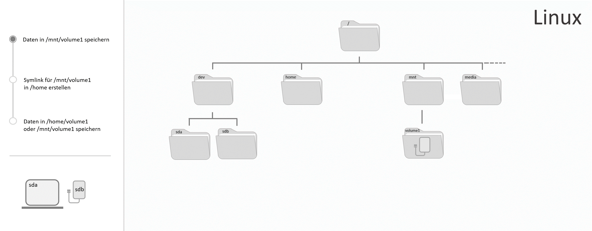

## Einführung

In diesem Tutorial wird erklärt, wie Sie unter Linux Daten auf einem Blockspeicher-Datenträger speichern und die Zugriffsrechte bearbeiten können. Zusätzlich wird noch erklärt wie Sie einen lokalen Verweis zum Einhängepunkt des Datenträgers erstellen können. Um auf einem Datenträger Daten speichern zu können, muss dieser bereits formatiert und eingehängt sein. Dafür können Sie entweder das Tutorial [Blockspeicher-Datenträger formatieren und einhängen](/tutorials/howto-linux-mount/de) verwenden oder Sie nutzen die Option bei Hetzner Cloud ein Cloud Volume __automatisch einzuhängen__, wenn dieses einem Server angehängt wird.

__Datenträger__

Mit einem Datenträger ist es möglich den bestehenden Speicher eines Servers um einen zweiten separaten Speicher zu erweitern. Sobald ein Datenträger formatiert und eingehängt wurde, besitzt dieser zwei wesentliche Dateien - eine Gerätedatei unter `/dev` und einen Einhängepunkt.

Bei Linux wird alles als Datei behandelt, auch Geräte. Die Gerätedatei unter `/dev` dient daher lediglich als Schnittstelle zwischen dem Benutzer und dem tatsächlichen Gerät und ist keine Datei im herkömmlichen Sinn. An dieser Stelle können also keine Daten auf dem Datenträger gelesen oder abgelegt werden.

Der Einhängepunkt ist ein meist leerer Ordner im bestehenden Dateiverzeichnis des Servers, dem das Dateisystem des Datenträgers zugewiesen wird. Wechseldatenträger, die automatisch vom System eingehängt werden, wie beispielsweise ein USB-Stick, werden im Allgemeinen unter `/media` eingehängt. Datenträger, die manuell vom Benutzer eingehängt werden, wie beispielsweise ein Hetzner Cloud Volume, werden im Allgemeinen unter `/mnt` eingehängt. In jedem Fall ist der Einhängepunkt am Ende der Ordner, über den Sie auf Ihren Datenträger zugreifen können, um Daten zu lesen und abzulegen.

Wenn Sie das Dateisystem Ihres Datenträgers wie empfohlen unter `/mnt` einhängen, aber trotzdem über einen lokalen Pfad darauf zugreifen können wollen, haben Sie noch die Möglichkeit einen symbolischen Link (Symlink) zu erstellen, der mit dem Einhängepunkt verbunden ist. Dazu wird ein Verweis unter einem eigenen Pfad erstellt, der den Inhalt des Einhängepunktes vom Datenträger anzeigt.

Beim Speichern von Daten auf Ihrem Datenträger haben Sie somit drei Möglichkeiten:

1. Daten in einem Einhängepunkt unter einem beliebigen Ordner speichern.
2. Daten in einem Einhängepunkt unter `/media` oder `/mnt` speichern.
3. Daten in einem Einhängepunkt unter `/media` oder `/mnt` speichern, auf den durch `Symlink` über einen beliebigen zweiten Pfad zugegriffen werden kann.

Wenn ein Symlink erstellt wurde, können die Daten auf dem Datenträger über mehrere Pfade gelesen und abgelegt werden:



Der Dateiname des Ordners, der einen Link zum Datenträger besitzt, kann beliebig geändert werden. Der Dateiname des Einhängepunkts vom Datenträger sollte nicht geändert werden, da der Symlink sonst ins Leere führt.

**Voraussetzungen**

* Grundlegende Kenntnisse über Server
* Einen Datenträger, der bereits auf den Server eingehängt wurde
* Zugriff auf den root-Benutzer oder einen Benutzer mit sudo-Rechten
* Kommandozeilen-Tool
* Dieses Tutorial wurde anhand von Ubuntu 18.04/20.04 erstellt, es sollte aber auch mit anderen Linux-Systemen funktionieren.

**Beispiel-Benennungen**

* Benutzername: holu
* Einhängepunkt: /mnt/device-mountpoint
* Name des Datenträgers: sdb
* Gruppenname: meinegruppe

Beachten Sie, dass in allen Beispiel-Befehlen `holu` mit dem eigenen Benutzernamen ersetzt werden muss, `/mnt/device-mountpoint` mit dem eigenen Einhängepunkt, `sdb` mit dem Namen des eigenen Datenträgers und `meinegruppe` mit einem eigenen Gruppennamen.

## Schritt 1 - Daten auf dem Datenträger speichern

Sobald der Datenträger in das bestehende Dateiverzeichnis eingehängt wurde, wie beispielsweise in diesem [Tutorial](/tutorials/howto-linux-mount/de) erklärt, kann der zusätzliche Speicher zum Ablegen und Öffnen von Daten genutzt werden. Dazu benötigen Sie den root-Benutzer oder einen Benutzer mit sudo-Rechten. Diese Rechte können Sie optional wie in [Schritt 3](#schritt-3---zugriffsrechte-fur-bestimmte-benutzer-vergeben) beschrieben bearbeiten.

Sollten Sie sich nicht sicher sein auf welchen Ordner Ihr Datenträger eingehängt wurde, können Sie sich mit `lsblk` alle Datenträger mit den dazugehörigen Einhängepunkten listen lassen und den Pfad daraus entnehmen.

```
# lsblk
```

Output:

```
NAME   MAJ:MIN RM  SIZE RO TYPE MOUNTPOINT
sda      8:0    0   55G  0 disk
└─sda1   8:1    0   55G  0 part /
sdb      8:16   0   10G  0 disk /mnt/device-mountpoint
sr0     11:0    1 1024M  0 rom
```

- `NAME`: Bei Linux beginnt der Name für Blockspeicher-Datenträger mit einem `sd`, einer Abkürzung für `SCSI disk`, was wiederrum für _Small Computer System Interface disk_ steht. Mit dem dritten Buchstaben werden die Datenträger alphabetisch in der Reihenfolge benannt, in welcher Sie erkannt wurden. Dieser Name ist nicht fest und kann sich ändern, zum Beispiel wenn der Datenträger entfernt und wieder neu hinzugefügt wird. Wenn Ihr Datenträger der letzte Datenträger ist, den Sie mit Ihrem Server verbunden haben, ist es sehr wahrscheinlich, dass dieser an letzter Stelle steht.

- `SIZE`: An dieser Stelle wird der Gesamtspeicherplatz des Datenträgers angegeben. Wenn Sie die Gesamtgröße Ihres Datenträgers kennen, können Sie sich auch an dieser Angabe orientieren.

- `TYPE`: Eine Disk ist ein Datenträger und kann in mehrere Einheiten geteilt werden, sogenannte Partitionen. Diese Partitionen haben denselben Namen wie der Datenträger, auf dem Sie sich befinden und werden um eine Zahl ergänzt. Ein neuerstelltes Hetzner Cloud Volume das automatisch eingehängt wurde ist beispielsweise eine Disk und besitzt noch keine Partitionen.

- `MOUNTPOINT`: Der Mountpoint gibt an, auf welchen Ordner der Datenträger im Dateiverzeichnis eingehängt wurde. Über diesen Ordner können Sie auf Ihren Datenträger zugreifen und Daten darauf speichern. Ihr Datenträger wurde vermutlich unter `/mnt` eingehängt.

Nutzen Sie diese Informationen, um den Namen Ihres Datenträgers der Tabelle zu entnehmen.

Nutzen Sie anschließend `cd` und den Einhängepunkt, um den Ordner zu öffnen:

```
cd /mnt/device-mountpoint
```

Alle Daten, die unter diesem Ordner gespeichert werden, sollten sich auf dem Datenträger befinden. Um das zu überprüfen, können Sie sich anzeigen lassen, wieviel Speicher auf dem Datenträger verwendet wird vor und nachdem Sie eine neue Datei in diesem Ordner erstellen.

Nutzen Sie `df` und geben Sie Ihren Datenträger an, entweder über den Namen oder über den Einhängepunkt:

```
df /dev/sdb
```

Oder:

```
df /mnt/device-mountpoint
```

Output:

```
Filesystem     1K-blocks  Used Available Use% Mounted on
/dev/sdb        10255636 36888   9678076   1% /mnt/device-mountpoint
```

Merken Sie sich die Zahlen unter _Used_ und _Available_. Sobald eine neue Datei erstellt wurde, sollte sich die Zahl bei _Used_ erhöhen und die Zahl bei _Available_ verringen. Wenn sich diese Zahlen bei einem anderen Datenträger verändern, kann es beispielsweise sein, dass beide Dateisysteme denselben Einhängepunkt besitzen, was stets vermieden werden sollte. Erstellen Sie die Test-Datei:

```
sudo nano /mnt/device-mountpoint/test.txt
```

Geben Sie mindestens ein Wort in die neue Text-Datei ein. Sobald Sie fertig sind, können Sie die Datei mit `CTRL`+`X` schließen, mit `Y` speichern und mit `ENTER` bestätigen.

Wenn Sie sich anschließend mit `ls` den Inhalt des Ordners listen lassen, sollte die neuerstellte Datei `test.txt` erscheinen. Auch der freie Speicher sollte sich nun geändert haben:

```
df /mnt/device-mountpoint
```

Output:

```
Filesystem     1K-blocks  Used Available Use% Mounted on
/dev/sdb        10255636 36892   9678072   1% /mnt/vollume-mountpoint
```

## Schritt 2 - Einhängepunkt mit einem lokalen Ordner verlinken

Wenn Sie die Dateisysteme aller Datenträger wie empfohlen auf einen neuen Ordner unter `/media` und `/mnt` einhängen, hat das zwei Vorteile. Sie haben in diesen beiden Ordnern immer einen Überblick über alle Dateisysteme, die in das bestehende Dateiverzeichnis eingehängt wurden und beim Öffnen und Speichern von Daten ist Ihnen immer bewusst, dass sich diese auf einem externen Datenträger befinden.

Wenn Sie ein Dateisystem unter einem beliebigen Pfad auf das bestehende Dateiverzeichnis einhängen, kann es passieren, dass Sie irgendwann den Überblick über Ihre Dateisysteme verlieren und bei einzelnen Ordnern eventuell nicht mehr zuordnen können auf welchem Datenträger die Daten gespeichert werden. Wenn Sie trotzdem gerne beispielsweise von Ihrem Homeverzeichnis auf den zusätzlichen Speicher zugreifen können wollen, haben Sie noch die Möglichkeit `symlink` zu nutzen.

__Symlink__ steht für _symbolischer Link_ und kann genutzt werden, um einen Verweis auf einen anderen Ordner zu erstellen. Wenn ein solcher Link besteht, kann über zwei Ordner (Einhängepunkt und Verweis-Datei) auf den Inhalt des originalen Ordners zugegriffen werden und über beide Ordner können die Daten des originalen Ordners geöffnet und bearbeitet werden. Der tatsächliche Speicherort dieser Daten ist und bleibt der originale Ordner.

> __Beispiel:__
>
> Einhängepunkt eines Datenträgers:
>
> ```
> /mnt/device-1
> ```
>
> Neuer Ordner (Verweis-Datei) im Homeverzeichnis:
>
> ```
> /home/music/pop
> ```
>
> Inhalt des `music`-Ordners:
>
> ```
> drwxr-xr-x 3 root root 4096 Nov 11 08:59 .
> drwx--x--x 6 root root 4096 Nov 11 08:59 ..
> drwx--x--x 3 root root 4096 Nov 11 08:59 rock
> lrwxrwxrwx 1 root root   36 Nov 11 09:15 pop -> /mnt/device-1
> ```
>
> Neben dem Namen des Ordners wird auch der tatsächliche Pfad des Datenträgers angegeben. Dadurch besteht ein geringeres Risiko Daten unbewusst auf einem anderen Dateisystem zu speichern.

Beim Erstellen eines Symlinks wird automatisch eine Verweis-Datei (neuer Ordner) erstellt. Der neue Ordner kann anschließend umbenannt werden, da das keine Auswirkungen auf den symbolischen Link hat. Der verlinkte Ordner (Einhängepunkt) kann hingegen nicht umbenannt werden, da sich dadurch der Pfad ändern würde, auf den der neue Ordner (Verweis) zugreifen muss. In diesem Beispiel soll der Inhalt des Ordners, auf den der Datenträger eingehängt wurde, nun auch unter `/home` angezeigt werden.

Erstellen Sie den symbolischen Link und damit eine Verweis-Datei:

```
ln -s /mnt/device-mountpoint /home/meinlink
```

> Ersetzen Sie `meinlink` mit einem eigenen Dateinamen. Beachten Sie, dass beide Pfade mit den eigenen Pfaden ersetzt werden müssen.

Mit `-s` wird bestimmt, dass ein symbolischer Link und kein harter Link erstellt werden soll. Nach `-s` folgt der Einhängepunkt des Datenträgers bzw. des Ordners, zu dem ein Link hergestellt werden soll. Zuletzt kommt der Pfad unter welchem der Verweis bzw. der neue Ordner erstellt werden soll.

Überprüfen Sie nun, ob der Link hergestellt wurde und ob die neue Verweis-Datei angezeigt wird. Lassen Sie sich dazu den gesamten Inhalt des Ordners listen.

```
ls -al /home
```

Output:

```
drwxr-xr-x 6 root root 4096 Nov 23 09:26 .
drwxr-xr-x 3 root root 4096 Nov 23 08:23 ..
lrwxrwxrwx 1 root root   36 Nov 11 09:15 meinlink -> /mnt/device-mountpoint
```

Es kann nun über beide Ordner (Einhängepunkt und Verweis-Datei) auf den Inhalt des originalen Ordners (Einhängepunkt) zugegriffen werden und über beide Ordner können die Daten des originalen Ordners geöffnet und bearbeitet werden. Beachten Sie, dass der Name des originalen Ordners jetzt nicht mehr geändert werden sollte, da der Link des Verweises unter `/home` sonst ins Leere führen und nicht mehr funktionieren würde. Der Verweis unter `/home` kann hingegen jederzeit unbenannt werden:

```
mv /home/meinlink neuer-name
```

Sobald Sie den Verweis nicht mehr benötigen, können Sie diesen wieder löschen. Der originale Ordner unter `/mnt` bleibt wie zuvor bestehen.

```
rm /home/meinlink
```

> Beachten Sie, dass `home/meinlink` mit dem eigenen Pfad ersetzt werden muss.

## Schritt 3 - Zugriffsrechte für bestimmte Benutzer vergeben

Nach dem Einhängen des Datenträgers können zunächst nur der root-Benutzer und alle Benutzer mit sudo-Rechten die Daten darauf bearbeiten. Das liegt an den Rechten, die automatisch vergeben werden. Überprüfen Sie die Rechte Ihres Datenträgers, indem Sie sich die Rechte für alle Dokumente innerhalb des Ordners anzeigen lassen, in welchem sich der Einhängepunkt Ihres Datenträgers befindet.

```
ls -al /mnt
```

Output:

```
drwxr-x--x 3 root root 4096 Nov 23 13:24 device-mountpoint
```

Der Output gliedert sich folgendermaßen:

```
<Rechte> <hard-link-count> <Besitzer> <Gruppe> <Bytes> <bearbeitet> <Name>
```

In Bezug auf Rechte sind vor allem die Spalten 1, 3 und 4 interessant. Spalte 3 gibt den Besitzer des Ordners an, in diesem Fall root. Spalte 4 gibt die Gruppe des Ordners an, in diesem Fall ebenfalls root. Aus Spalte 1 kann man ablesen, welche Rechte diese besitzen.

Bei der ersten Spalte hilft es den Text gedanklich in vier Teile zu teilen: `d rwx r-x --x`. Mit dem `d` am Anfang wird angegeben, dass es sich um die Rechte eines Ordners (Directory) handelt. Bei einer einfachen Datei würde hier statt dem _d_ ein _-_ stehen. Danach kommen `rwx`, `r-x` und `--x`. Diese Angaben sind die Rechte aller Benutzer auf dem Server. Als erstes werden die Rechte des _Besitzers_ (user) angegeben, anschließend die der _Gruppe_ (group) und zuletzt die Rechte aller _anderen Benutzer_ (other users). `r` steht für _read_, also lesen, und ist das Recht Dateien innerhalb des Ordners zu listen, `w` steht für _write_, also schreiben, und ist das Recht Dateien innerhalb des Ordners zu erstellen, umzubenennen und zu löschen, `x` steht für _execute_, also ausführen, und ist das Recht auf den Ordner und darin liegende Daten zuzugreifen. Wer eines der Rechte nicht besitzt, bei dem steht an dieser Stelle ein _-_.

Im obenstehenden Beispiel hat der Besitzer `root` Lese-, Schreib- und Ausführrechte (`rwx`), jedes Mitglied der Gruppe `root` hat Lese- und Ausführrechte (`r-x`) und alle anderen Benutzer auf dem Server haben nur Ausführrechte (`--x`).

Mit `chmod` ist es möglich die Rechte zu bearbeiten.

Mit `chown` ist es möglich den Besitzer und die Gruppe zu bearbeiten.

Folgende Optionen werden in den nächsten Schritten erklärt:

[Option 1 - Einem Benutzer Zugriffsrechte geben](#option-1---einem-benutzer-zugriffsrechte-geben) <br>
[Option 2 - Einer Gruppe Zugriffsrechte geben](#option-2---einer-gruppe-zugriffsrechte-geben) <br>
[Option 3 - Allen Benutzern Zugriffsrechte geben](#option-3---allen-benutzern-zugriffsrechte-geben)

Mit den folgenden Befehlen werden nur die Rechte des Ordners selbst bearbeitet und nicht die Rechte von bereits darin liegenden Dateien oder Ordnern.

#### Option 1 - Einem Benutzer Zugriffsrechte geben

Die einfachste Methode, um einem neuen Benutzer Lese- und Schreibrechte zu geben ist, den Besitzer zu bearbeiten. Wenn Sie sich selbst als Besitzer des Ordners festlegen und allen anderen Benutzern die Lese- und Schreibrechte entziehen, sind Sie der einzige Benutzer, der diesen Ordner bearbeiten kann. Führen Sie diese Befehle aus, um einen neuen Benutzer als Besitzer festzulegen und diesem Lese- und Schreibrechte zu vergeben, falls er diese nicht eh schon besitzt:

```
sudo chown holu /mnt/device-mountpoint/
```

```
sudo chmod u+rwx,go-rwx /mnt/device-mountpoint/
```

> Beachten Sie, dass `holu` mit dem eigenen Benutzernamen ersetzt werden muss und `/mnt/device-mountpoint` mit dem eigenen Pfad. 

Mit `u` wird angegeben, dass die Rechte vom Besitzer (user) angepasst werden sollen.

Mit `+rwx` wird angegeben, dass Lese- (read), Schreib- (write) und Ausführ- (execute) Rechte hinzugefügt werden sollen. Die Rechte können wieder entzogen werden, indem man im selben Befehl das Plus durch ein Minus ersetzt.

Mit `go` wird angegeben, dass die Rechte von der Gruppe (group) und den anderen Benutzern (other users) angepasst werden sollen.

Mit `-rwx` wird angegeben, dass die Lese- (read), Schreib- (write) und Ausführ- (execute) Rechte entzogen werden sollen. Die Rechte können wieder hinzugefügt werden, indem man im selben Befehl das Minus durch ein Plus ersetzt.

Nachdem der Befehl ausgeführt wurde, können Sie mit `ls -al` überprüfen, ob die Rechte geändert wurden. Der Besitzer sollte nun Ihr Benutzer sein und dessen Rechte sollten Lese- und Schreibrechte beinhalten (`drwx------`).

#### Option 2 - Einer Gruppe Zugriffsrechte geben

Um mehreren Benutzern gleichzeitig Zugriff auf einen Ordner zu gewähren, können Sie entweder allen Benutzern die entsprechenden Rechte geben oder nur einer bestimmen Gruppe. Lese- und Schreibrechte sollten nur dann an alle Benutzer vergeben werden, wenn Sie diesen auch vertrauen. Ansonsten ist es sicherer die benötigten Rechte nur einer Gruppe zu geben. Eine Gruppe ermöglicht es die Benutzer mit Zugriffsrechten auf diejenigen einzugrenzen, die den Zugriff tatsächlich benötigen.

Erstellen Sie zunächst eine neue Gruppe:

```
sudo groupadd meinegruppe
```

> Beachten Sie, dass `meinegruppe` mit einem eigenen Gruppennamen ersetzt werden muss. 

Fügen sie nun Ihren Benutzer hinzu, der Lese- und Schreibrechte besitzen soll:

```
sudo usermod -a -G meinegruppe holu
```

> Denken Sie immer daran das `-a` (append) mitanzugeben. Damit wird verhindert, dass der Benutzer aus allen anderen Gruppen entfernt wird, die nicht nach der `-G`-Option angegeben sind.

Um mehrere Benutzer gleichzeitig hinzuzufügen:

```
sudo gpasswd -M holu1,holu2,holu3 meinegruppe
```

Testen Sie nun, ob Ihr Benutzer der neuen Gruppe hinzugefügt wurde:

```
groups holu
```

> Beachten Sie, dass `holu` mit dem eigenen Benutzernamen ersetzt werden muss.

Output:

```
holu : holu meinegruppe
```

> Falls die Gruppe noch nicht angezeigt wird, müssen Sie sich eventuell erst neu mit dem Server verbinden. Anschließend sollte es sich aktualisiert haben.

Führen Sie diese Befehle aus, um für den Ordner eine neue Gruppe festzulegen und an diese Lese- und Schreibrechte zu vergeben:

```
sudo chown :meinegruppe /mnt/device-mountpoint/
```

```
sudo chmod g+rwx /mnt/device-mountpoint/
```

> Beachten Sie, dass `mnt/device-mountpoint` mit dem eigenen Pfad ersetzt werden muss. 

Mit `g` wird angegeben, dass die Rechte der Gruppe (group) angepasst werden sollen.

Mit `+rwx` wird angegeben, dass Lese- (read), Schreib- (write) und Ausführ- (execute) Rechte hinzugefügt werden sollen. Die Rechte können wieder entzogen werden, indem man im selben Befehl das Plus durch ein Minus ersetzt.

Nachdem der Befehl ausgeführt wurde, können Sie mit `ls -al` überprüfen, ob die Rechte geändert wurden. Die Gruppe sollte nun Ihre Gruppe sein und die Rechte sollten Lese- und Schreibrechte beinhalten (`d---rwx---`).

Wenn bei den anderen Benutzern `---` steht, haben diese keine Lese-, Schreib- und Ausführrechte. Sollten die anderen Benutzer die Rechte hingegen besitzen, dann können Sie diese mit folgendem Befehl entziehen:

```
sudo chmod o-rwx /mnt/device-mountpoint/
```

Mit `o` wird angegeben, dass die Rechte von anderen Benutzern (other users) angepasst werden sollen.

Mit `-rwx` wird angegeben, dass die Lese- (read), Schreib- (write) und Ausführ- (execute) Rechte entzogen werden sollen. Die Rechte können wieder hinzugefügt werden, indem man im selben Befehl das Minus durch ein Plus ersetzt.

#### Option 3 - Allen Benutzern Zugriffsrechte geben

Sobald der Befehl ausgeführt wurde, haben alle Benutzer Zugriff auf Ihren Ordner und jeder kann beliebig Änderungen vornehmen oder Dokumente einsehen. Nehmen Sie diese Option daher nur, wenn wirklich alle Benutzer den Zugriff darauf benötigen.

```
sudo chmod ugo+rwx /mnt/device-mountpoint/
```

> Beachten Sie, dass `mnt/device-mountpoint` mit dem eigenen Pfad ersetzt werden muss. 

Mit `ugo` wird angegeben, dass die Rechte vom Besitzer (user), der Gruppe (group) und von anderen Benutzern (other users) angepasst werden sollen.

Mit `+rwx` wird angegeben, dass Lese- (read), Schreib- (write) und Ausführ- (execute) Rechte hinzugefügt werden sollen. Die Rechte können wieder entzogen werden, indem man im selben Befehl das Plus durch ein Minus ersetzt.

Nachdem der Befehl ausgeführt wurde, können Sie mit `ls -al` überprüfen, ob die Rechte geändert wurden. Besitzer, Gruppe und andere Benutzer sollten nun alle Lese-, Schreib- und Ausführrechte haben (`drwxrwxrwx`).

## Ergebnis

Im vorangegangenen Tutorial haben Sie gelernt, wie Sie auf Ihren Datenträger zugreifen und darauf Daten speichern können, einen Symlink erstellen und die Zugriffsrechte bearbeiten.

##### License: MIT

<!--

Contributor's Certificate of Origin

By making a contribution to this project, I certify that:

(a) The contribution was created in whole or in part by me and I have
    the right to submit it under the license indicated in the file; or

(b) The contribution is based upon previous work that, to the best of my
    knowledge, is covered under an appropriate license and I have the
    right under that license to submit that work with modifications,
    whether created in whole or in part by me, under the same license
    (unless I am permitted to submit under a different license), as
    indicated in the file; or

(c) The contribution was provided directly to me by some other person
    who certified (a), (b) or (c) and I have not modified it.

(d) I understand and agree that this project and the contribution are
    public and that a record of the contribution (including all personal
    information I submit with it, including my sign-off) is maintained
    indefinitely and may be redistributed consistent with this project
    or the license(s) involved.

Signed-off-by: Svenja Michal

-->
