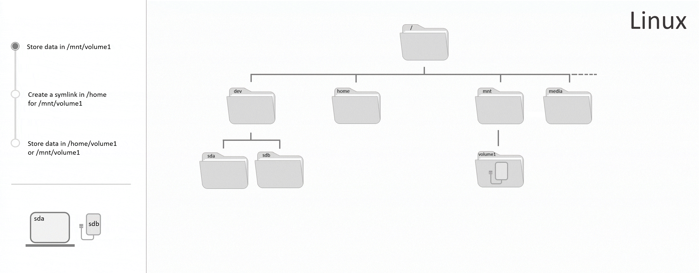

## Introduction

In this tutorial you will learn how to store data on a block storage device and how to change file permissions in Linux. It will also be explained how to create a local link to the mount point of the storage device. To store data on a storage device, it has to be formatted and mounted. You can use this tutorial on [formatting and mounting a block storage device](https://community.hetzner.com/tutorials/howto-linux-mount) or you can use the option on Hetzner Cloud to have the cloud volume be __formatted and mounted automatically__ when it is attached to a server.

__Storage device__

Storage devices are basically extra storage that can be used as an addition to the storage of a server. Storage devices that have been formatted and mounted have two important files, a device file in `/dev` and a mount point.

In Linux, everything is seen as a file, even devices. The device file in `/dev` is not an ordinary file but an interface to the device. This directory cannot be used to save data on the storage device.

The file system of the storage device has to be allocated an empty directory in the existing directory tree of the server. This directory is the mount point. In general, it is recommended to use the `/media` directory as a mount point for removable devices that are __automatically mounted by the system__, such as a flash drive, and the `/mnt` directory as a mount point for storage devices that are __manually mounted by the user__, such as a Hetzner Cloud Volume. The mount point is the directory that you can use to store and delete data on your storage device.

If you would like to access your storage device from a local directory and still use the recommended directory `/mnt` as the mount point, you can also create a symbolic link (symlink). This way, you will get a link file that displays the contents of the storage device and its mount point.

This means that you have three options to store data on a storage device:

1. Store data in a random directory as the mount point.
2. Store data in `/media` or `/mnt` as the mount point.
3. Store data in `/media` or `/mnt` as the mount point and under a random second path via a `symlink`.

If you create a symlink, you can use several directories to store and delete data on your storage device:



It is possible to change the name of the directory that links to the storage device. It is not possible to change the name of the directory that has been linked. Otherwise, the symlink would not work anymore.

**Prerequisites**

* Basic knowledge about servers
* A storage device that has already been mounted on the server
* Access to the root user or a user with sudo permissions
* CLI tool
* This tutorial uses Ubuntu 18.04/20.04, however this should also work on other Linux systems.

**Example terminology**

* Username: holu
* Mount point: /mnt/device-mountpoint
* Device name: sdb
* Group name: mygroup

Please replace `holu` with your own username, `/mnt/device-mountpoint` with an own mount point, `sdb` with the name of your device and `mygroup` with an own group name in all example commands.

## Step 1 - Storing data on the storage device

Once the storage device has been mounted on a directory in the existing directory tree of the server ([Tutorial on mounting a storage device](https://community.hetzner.com/tutorials/howto-linux-mount)), you can use it to store and delete data. This will require the permissions of the root user or a user with sudo permissions. You can change these permissions as described in [step 3](#step-3---changing-permissions-for-specific-users).

To get the mount point of your storage device, you can use `lsblk`. This will list all storage devices and their mount points.

```
# lsblk
```

Output:

```
NAME   MAJ:MIN RM  SIZE RO TYPE MOUNTPOINT
sda      8:0    0   55G  0 disk
└─sda1   8:1    0   55G  0 part /
sdb      8:16   0   10G  0 disk /mnt/device-mountpoint
sr0     11:0    1 1024M  0 rom
```

- `NAME`: In Linux, all block storage devices begin with `sd`, which is short for `SCSI disk`. And this is short for Small Computer System Interface disk. The third letter is used to name all devices following the alphabet. The name can change, for example if you remove and readd the device. If your storage device is the last device you attached to your server, it is very likely that it will also be last in this table.

- `SIZE`: This is the total storage of a device. If you know the storage capacity of your storage device, you can use this information to identify it.

- `TYPE`: One disk is one device. Each device can be divided into several units, called partitions. Partitions have the same name as the device they are on, plus an additional digit. A new Hetzner Cloud Volume that was mounted automatically, for example, is a disk and does not have any partitions.

- `MOUNTPOINT`: This is the directory on which the device has been mounted. In this directory, you can access your device and store data on it. Your storage device is likely mounted on a directory in `/mnt`.

Use this information to identify your storage device and get its name.

Next, use `cd` and the mount point to open the directory:

```
cd /mnt/device-mountpoint
```

Any data stored in this directory should be saved on the storage device. You can check the available space on your storage device before and after creating a test file, to verify that the storage of the device is in fact used.

Use `df` followed by the name or mount point of your storage device:

```
df /dev/sdb
```

Or:

```
df /mnt/device-mountpoint
```

Output:

```
Filesystem     1K-blocks  Used Available Use% Mounted on
/dev/sdb        10255636 36888   9678076   1% /mnt/device-mountpoint
```

Note the numbers under _Used_ and _Available_. _Used_ should increase and _Available_ should decrease once new data is created and stored on the device. The numbers could change on another device, for example, if two file systems have the same mount point, which should always be avoided. Create a test file:

```
sudo nano /mnt/device-mountpoint/test.txt
```

Enter at least one word. Once you are done, you can use `CTRL`+`X` to save the file, `Y` to confirm and `ENTER` to close the file. 

Now, if you use `ls` to list everything in the mount point directory, it should also include the new file `test.txt`. Also, the available storage on your device should now be less:

```
df /mnt/device-mountpoint
```

Output:

```
Filesystem     1K-blocks  Used Available Use% Mounted on
/dev/sdb        10255636 36892   9678072   1% /mnt/vollume-mountpoint
```

## Step 2 - Linking the mount point to a local directory

Mounting the file systems of all storage devices as recommended on directories in `/media` and `/mnt` has two advantages. You always have an overview of the total file systems that have been mounted and, when you save or delete data in one of those directories, you always know that you are working on an external storage device.

If you choose to mount a file system on a random directory, it can be confusing as to how many mounted file systems there actually are at some point. It is also not clear which data is stored on an external device and which locally on the server. If you still want to access your storage from a local directory, you can also use `symlink`.

__Symlink__ is short for _symbolic link_ and can be used to sort of connect two directories. This link makes it possible to access all data of the linked directory (directory file) from a second directory (symbolic link file). Both directories can be used to open the data of the linked directory and make changes to it. All data continues to be stored in the linked directory.

> __Example:__
>
> Mount point of the storage device:
> 
>```
> /mnt/device-1
> ```
>
> New directory in home (symbolic link file):
>
> ```
> /home/music/pop
> ```
>
> Contents of the `music` directory:
>
> ```
> drwxr-xr-x 3 root root 4096 Nov 11 08:59 .
> drwx--x--x 6 root root 4096 Nov 11 08:59 ..
> drwx--x--x 3 root root 4096 Nov 11 08:59 rock
> lrwxrwxrwx 1 root root   36 Nov 11 09:15 pop -> /mnt/device-1
> ```
>
> Next to the name of the `pop` directory (symbolic link file), you can also see the original directory. This reduces the risk of storing data on an external device without being aware of it.

A symlink automatically creates a new directory in the selected location. After the link has been created, you can change the name of the new directory (symbolic link file) without interfering with the symbolic link. However, it is not possible to change the name of the linked directory. The symlink would still direct the symbolic link file to the old name. The following example creates a symlink to access the storage device from a second directory (symbolic link file) in `/home`.

Create the symbolic link and the new link file:

```
ln -s /mnt/device-mountpoint /home/mylink
```

> Please replace `mylink` with an own file name and both paths with your own paths.

The `-s` makes it a symbolic link as opposed to a hard link. Next to `-s` is the directory you want to link, in this case the mount point of your device. Last, is the location in which you want the linked directory to be created.

You can list the contents of your location to see if a new linked directory has successfully been added.

```
ls -al /home
```

Output:

```
drwxr-xr-x 6 root root 4096 Nov 23 09:26 .
drwxr-xr-x 3 root root 4096 Nov 23 08:23 ..
lrwxrwxrwx 1 root root   36 Nov 11 09:15 mylink -> /mnt/device-mountpoint
```

You can now use both directories to access the contents of the original directory and read and edit data on the storage device. Note that the name of the original directory should not be changed as this would break the link. But you can always change the name of the new directory in `/home`:

```
mv /home/mylink new-name
```

If you no longer need the link, you can simply delete it. This will not affect the original directory in `/mnt`.

```
rm /home/mylink
```

> Please replace `home/mylink` with your own directory. Remember to use the new name if you changed it previously.

## Step 3 - Changing permissions for specific users

After the storage device has been mounted, its data can only be changed by the root user and users with sudo permissions by default. To see the permissions of your storage device, list all data in the location of your mount point.

```
ls -al /mnt
```

Output:

```
drwxr-x--x 3 root root 4096 Nov 23 13:24 device-mountpoint
```

This means the following:

```
<permissions> <hard-link-count> <owner> <group> <bytes> <modification> <name>
```

Regarding permissions, important fields are the first, third and the fourth one. The third field shows the owner, in this case root. The fourth field shows the group the directory belongs to, in this case root again. The first field shows their permissions.

To understand the first field, it helps to split it into four parts: `d rwx r-x --x`. The `d` at the beginning specifies the file type and stands for directory. A regular file would begin with _-_ instead of the _d_. The _d_ is followed by `rwx`, `r-x` and `--x`. These are the permissions of every user on the server. The first three characters are the permissions of the _owner_, the second three characters are the permissions of the _group_ and the final three characters are the permissions of _other users_. The `r` stands for _read_ and is the right to list all files within the directory, `w` stands for _write_ and is the right to create, rename and delete files within the directory, `x` stands for execute and is the right to access all data within the directory. The permissions are in the order _rwx_. If someone does not have one of those permissions, `-` is used as a placeholder.

In the example above, the owner `root` has read, write and execute permissions (`rwx`), everyone in the group `root` has read and execute permissions (`r-x`) and any other user on the server has execute permission (`--x`).

You can use `chmod` to change permissions.

You can use `chown` to change the owner and the group.

Following, these options will be explained:

[Option 1 - Changing permissions for one user](#option-1---changing-permissions-for-one-user)
[Option 2 - Changing permissions for a group](#option-2---changing-permissions-for-a-group)
[Option 3 - Changing permissions for all users](#option-3---changing-permissions-for-all-users)

The commands below only change permissions of the directory itself and not of any files and directories within.

#### Option 1 - Changing permissions for one user

The easiest way to change the permissions of a single user is changing the owner. If you set yourself as the owner and remove the permissions from everyone else, you will be the only user who can make changes in this directory. Use the following commands to set another user as the new owner and to change read and write permissions, in case the owner does not have them already:

```
sudo chown holu /mnt/device-mountpoint/
```

```
sudo chmod u+rwx,go-rwx /mnt/device-mountpoint/
```

> Please replace `holu` with your own username and `/mnt/device-mountpoint` with your own mount point.

`u` specifies that the permissions of the owner (u - user) should be changed.

`+rwx` specifies that read, write and execute permissions should be added. Later, you can use the same command and replace the plus with a minus to remove these permissions.

`go` specifies that the permissions of the group (g - group) and of other users (o - other users) should be changed.

`-rwx` specifies that read, write and execute permissions should be removed. Later, you can use the same command and replace the minus with a plus to readd these permissions.

You can use `ls -al` to see if the permissions have been changed. Your user should now be the new owner and the permissions should include read, write and execute permissions (`drwx------`).

#### Option 2 - Changing permissions for a group

There are two ways to give several users access to the directory. You can give access to all users on the server, or you can create a new group for all relevant users and give access to this group only. Read and write permissions should only be given to users you can trust. A group allows you exclude certain users and to control who can access the directory and who can't.

First, create a new group:

```
sudo groupadd mygroup
```

> Please replace `mygroup` with an own group name.

Next, add your user to this new group:

```
sudo usermod -a -G mygroup holu
```

> Remember to add the `-a` (append). This is required to prevent that your user gets removed from any other groups that are not mentioned after the `-G` option.

Adding several users at the same time:

```
sudo gpasswd -M holu1,holu2,holu3 mygroup
```

Use this command to list all groups your user has been added to:

```
groups holu
```

> Please replace `holu` with your own username.

Output:

```
holu : holu mygroup
```

> In case your group is not showing yet, you might have to end the connection and reconnect for it to update.

Use this command to change the group of your directory and to enable read, write and execute permissions for the group:

```
sudo chown :mygroup /mnt/device-mountpoint/
```

```
sudo chmod g+rwx /mnt/device-mountpoint/
```

> Please replace `/mnt/device-mountpoint` with your own mount point.

`g` specifies that the permissions of the group (g - group) should be changed.

`+rwx` specifies that read, write and execute permissions should be added. Later, you can use the same command and replace the plus with a minus to remove these permissions.

You can use `ls -al` to see if the permissions have been changed. The permissions of the group should now include read and write permissions (`d---rwx---`).

If the permissions of the other users are `---`, it means that they do not have read, write or execute permissions. If the other users do have read, write or execute permissions, you can use this command to remove those from them:

```
sudo chmod o-rwx /mnt/device-mountpoint/
```

`o` specifies that the permissions of other users (o - other users) should be changed.

`-rwx` specifies that read, write and execute permissions should be removed. Later, you can use the same command and replace the minus with a plus to readd these permissions.

#### Option 3 - Changing permissions for all users

Giving all users read, write and execute permissions means that everyone can make changes to all documents in this directory. Do only use this option if all users actually need this access.

```
sudo chmod ugo+rwx /mnt/device-mountpoint/
```

> Please replace `/mnt/device-mountpoint` with your own mount point.

`ugo` specifies that the permissions of the owner (u - user), the group (g - group) and of other users (o - other users) should be changed.

`+rwx` specifies that read, write and execute permissions should be added. Later, you can use the same command and replace the plus with a minus to remove these permissions.

You can use `ls -al` to see if the permissions have been changed. The permissions of the owner, the group and of other users should now include read, write and execute permissions (`drwxrwxrwx`). 

## Conclusion

In the previous steps you learned how to store data on your storage device, create a symlink and how to change the permissions.

##### License: MIT

<!--

Contributor's Certificate of Origin

By making a contribution to this project, I certify that:

(a) The contribution was created in whole or in part by me and I have
    the right to submit it under the license indicated in the file; or

(b) The contribution is based upon previous work that, to the best of my
    knowledge, is covered under an appropriate license and I have the
    right under that license to submit that work with modifications,
    whether created in whole or in part by me, under the same license
    (unless I am permitted to submit under a different license), as
    indicated in the file; or

(c) The contribution was provided directly to me by some other person
    who certified (a), (b) or (c) and I have not modified it.

(d) I understand and agree that this project and the contribution are
    public and that a record of the contribution (including all personal
    information I submit with it, including my sign-off) is maintained
    indefinitely and may be redistributed consistent with this project
    or the license(s) involved.

Signed-off-by: Svenja Michal

-->
