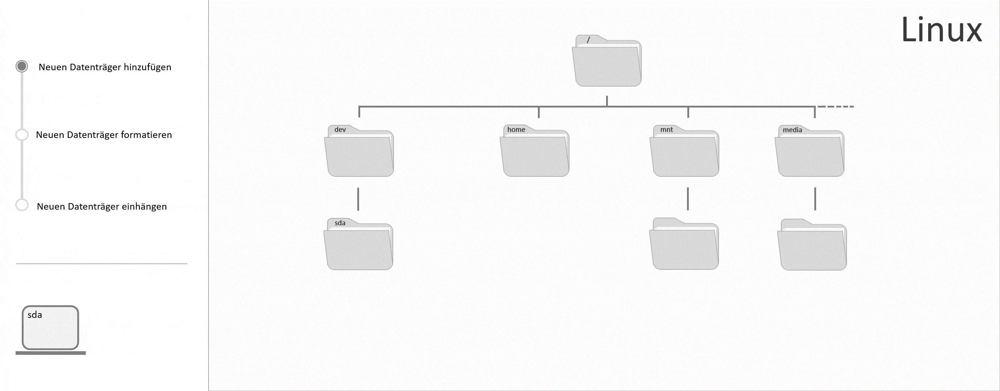

## Einführung

In diesem Tutorial wird erklärt, wie Sie unter Linux einen Blockspeicher-Datenträger formatieren, einhängen und in der `fstab`-Datei hinterlegen können. Das Formatieren beinhaltet das Hinzufügen einer neuen Partition und eines Dateisystems.

__Datenträger__

Datenträger bieten einen Extra-Speicherplatz, der zusätzlich zum Speicher des Servers genutzt werden kann. Ein Beispiel dazu wäre ein Hetzner Cloud Volume. Der Datenträger wird auf einen leeren Ordner in das bestehende Dateiverzeichnis des Servers eingehängt. Alle Daten, die in diesem Ordner, dem sogenannten Einhängepunkt, abgelegt werden, werden auf dem Datenträger gespeichert. Sie erhalten damit also Zugriff auf einen zweiten separaten Speicher, auf den Sie über das bestehende Dateiverzeichnis des Servers zugreifen können.

Bevor ein Datenträger in das Dateiverzeichnis eingehängt werden kann, muss dieser formatiert werden. Dabei wird dem Datenträger ein Dateisystem hinzugefügt, welches zum Lesen und Ablegen von Daten benötigt wird. Genau genommen ist es am Ende auch dieses Dateisystem, welches schließlich in das Dateiverzeichnis des Servers eingehängt wird.

Im Wesentlichen geschehen 3 Schritte, bevor ein neuer Datenträger genutzt werden kann:

1. Sobald ein neuer Datenträger erkannt wird, erhält dieser einen Namen (nach Alphabet) und eine Gerätedatei unter `/dev`.
2. Jeder Datenträger benötigt ein eigenes Dateisystem. Ohne ein Dateisystem können auf einem Datenträger keine Daten gespeichert oder gelöscht werden.
3. Das Dateisystem des Datenträgers muss auf einen bestehenden Ordner im Dateiverzeichnis des Servers eingehängt werden. Alle Daten, die unter diesem Ordner gespeichert werden, befinden sich dann auf dem Datenträger. Empfohlen werden `/mnt` für das manuelle Einhängen eines Datenträgers durch einen Benutzer und `/media` für das automatische Einhängen von Wechseldatenträgern durch das System.



Hetzner Cloud bietet eine Lösung dafür an, diese Schritte zu überspringen und auf den Datenträger direkt zuzugreifen. Dafür benötigen Sie einen Cloud Server mit einem von Hetzner unterstützten Betriebssystem und ein Cloud Volume. Das Cloud Volume kommt mit der Option es beim Anhängen an einen Server automatisch formatieren und einhängen zu lassen.

**Voraussetzungen**

* Grundlegende Kenntnisse über Server
* Zugriff auf den root-Benutzer oder einen Benutzer mit sudo-Rechten
* Kommandozeilen-Tool
* Dieses Tutorial wurde anhand von Ubuntu 22.04/24.04 erstellt, es sollte aber auch mit anderen Linux-Systemen funktionieren.

> Warnung: Mit den untenstehenden Befehlen aus Schritt 1, 2 und 3 können bestehende Daten auf dem Datenträger beschädigt werden.

**Beispiel-Benennungen**

* Einhängepunkt: `/mnt/device-mountpoint`
* Name des Datenträgers: sdb
* Name der Partition: sdb1
* Label: meinlabel

Beachten Sie, dass in allen Beispiel-Befehlen `/mnt/device-mountpoint` mit dem eigenen Einhängepunkt ersetzt werden muss, `sdb`/`sdb1` mit dem Namen des eigenen Datenträgers / der eigenen Partition und `meinlabel` mit einem eigenen Label.

## Schritt 1 - Name des Datenträgers herausfinden

Damit Sie auf den Speicher des Datenträgers zugreifen können, müssen Sie diesen zunächst in das bestehende Dateiverzeichnis des Servers einhängen. Um den Datenträger entsprechend zu bearbeiten, benötigen Sie dessen Namen und Zugriff auf den root-Benutzer oder einen Benutzer mit sudo-Rechten. Verbinden Sie sich mit Ihrem Server und nutzen Sie den `lsblk`-Befehl, um sich alle Datenträger listen zu lassen.

> Beachten Sie, dass der Name eines Datenträgers nicht fest ist und sich ändern kann, zum Beispiel wenn der Datenträger entfernt und wieder neu hinzugefügt wird. Wenn Sie künftig weitere Änderungen vornehmen, sollten Sie vorher also überprüfen, ob der Name sich verändert hat. Ansonsten kann es passieren, dass Sie am falschen Datenträger Änderungen vornehmen.

```shellsession
lsblk
```

Output:

```shellsession
NAME   MAJ:MIN RM  SIZE RO TYPE MOUNTPOINT
sda      8:0    0   55G  0 disk
└─sda1   8:1    0   55G  0 part /
sdb      8:16   0   10G  0 disk
sr0     11:0    1 1024M  0 rom
```

- `NAME`: Bei Linux beginnt der Name für Blockspeicher-Datenträger mit einem `sd`, einer Abkürzung für `SCSI disk`, was wiederrum für _Small Computer System Interface disk_ steht. Mit dem dritten Buchstaben werden die Datenträger alphabetisch in der Reihenfolge benannt, in welcher Sie erkannt wurden. Dieser Name ist nicht fest und kann sich verändern, zum Beispiel wenn der Datenträger entfernt und wieder neu hinzugefügt wird. Wenn Ihr Datenträger der letzte Datenträger ist, den Sie mit Ihrem Server verbunden haben, ist es sehr wahrscheinlich, dass dieser an letzter Stelle steht. 

- `SIZE`: An dieser Stelle wird der Gesamtspeicherplatz des Datenträgers angegeben. Wenn Sie die Gesamtgröße Ihres Datenträgers kennen, können Sie sich auch an dieser Angabe orientieren.

- `TYPE`: Eine Disk ist ein Datenträger und kann in mehrere Einheiten geteilt werden, sogenannte Partitionen. Diese Partitionen haben denselben Namen wie der Datenträger, auf dem Sie sich befinden und werden um eine Zahl ergänzt. Ein neu erstelltes Hetzner Cloud Volume ist beispielsweise eine Disk und besitzt noch keine Partitionen.

- `MOUNTPOINT`: Der Mountpoint gibt an, auf welchen Ordner der Datenträger im Dateiverzeichnis eingehängt wurde. Über diesen Ordner können Sie später auf Ihren Datenträger zugreifen und Daten darauf speichern. Wenn der gesuchte Datenträger noch nicht formatiert und eingehängt wurde, besitzt dieser auch noch keinen `MOUNTPOINT`.

Nutzen Sie diese Informationen, um den Namen Ihres Datenträgers der Tabelle zu entnehmen.

In den folgenden Befehlen wird `sdb` als Beispiel-Name für den Datenträger angegeben. Nutzen Sie an diesen Stellen bitte den Namen Ihres eigenen Datenträgers, den Sie eben aus Ihrer Tabelle entnommen haben.

Nun da Sie den Namen Ihres Datenträgers kennen, können Sie diesen formatieren.

## Schritt 2 - Partition erstellen

Damit der Datenträger in ein Dateiverzeichnis eingehängt werden kann, benötigt dieser theoretisch nur ein Dateisystem. Manche Betriebssysteme erwarten aber auf einem Datenträger eine Partitionstabelle vorzufinden, selbst wenn darin nur eine Partition gelistet ist. Zudem ist es mit einer bestehenden Partitionstabelle leichter zu einem späteren Zeitpunkt noch weitere Partitionen zu erstellen. Da der Datenträger auch ohne Partitionen genutzt werden kann, ist dieser Schritt optional und kann übersprungen werden.

Ein Datenträger für sich wird als Disk bezeichnet. Diesem kann ein Dateisystem hinzugefügt werden und es können Daten darauf abgelegt werden. Von Partitionen spricht man, wenn eine Disk in mehrere Einheiten geteilt wird. Jede Einheit besitzt dann ein eigenes Dateisystem, wird auf einen eigenen Ordner im Dateiverzeichnis eingehängt und kann beim Ablegen von Daten für einen eigenen Zweck verwendet werden. Eine Partition ist im Grunde ein Teilbereich auf einer Disk, der wie ein separater Datenträger behandelt wird.

Wie genau sich eine Disk in Partitionen aufteilt wird in einem bestimmten Format in der sogenannten Partitionstabelle dokumentiert. Zwei weit verbreitete Partitionstabellen-Formate sind __MBR__ (Master Boot Record) und __GPT__ (GUID Partition Table). MBR gibt es schon seit über 30 Jahren und entsprechend gibt es bei diesem Format einige Einschränkungen. Dafür wird es von älteren Betriebssystemen unterstützt. GPT wurde erst später verfügbar und bringt im direkten Vergleich mit MBR einige Vorteile mit sich.

Eine Partition kann erst dann erstellt werden, wenn das Format der Partitionstabelle festgelegt wurde. Nutzen Sie den `fdisk`-Befehl, um zu überprüfen ob und welches Tabellenformat auf dem Datenträger genutzt wird:

```bash
sudo fdisk -l /dev/sdb
```

> Beachten Sie, dass in diesem Befehl nicht -1 steht, sondern -L als Kleinbuchstabe, was für --list steht.

Output:

```
Disk /dev/sdb: 10 GiB, 10737418240 bytes, 20971520 sectors
Disk model: Volume
Units: sectors of 1 * 512 = 512 bytes
Sector size (logical/physical): 512 bytes / 512 bytes
I/O size (minimum/optimal): 512 bytes / 512 bytes
Disklabel type: gpt
```

Wenn die Zeile `Disklabel type` vorhanden ist, können Sie dieser entnehmen welches Format verwendet wird und direkt Partitionen erstellen. Wenn diese Zeile bei Ihnen fehlt, bedeutet das, dass auf diesem Datenträger noch kein Tabellenformat festgelegt wurde.

Um eine neue Partition zu erstellen, wird hier `parted` verwendet. Auf den meisten Servern sollte dieser Befehl direkt genutzt werden können.

- Falls Sie `parted` noch nicht haben, können Sie es vorher installieren:

  Ubuntu und Debian:
  
  ```bash
  sudo apt-get update
  ```

  ```bash
  sudo apt-get install parted
  ```

  CentOS und Fedora:
  
  ```bash
  sudo yum install parted
  ```

Nutzen Sie folgenden Befehl, um das Format der Partitionstabelle auf GPT festzulegen:

```bash
sudo parted /dev/sdb mklabel gpt
```

> Beachten Sie, dass sdb in `/dev/sdb` mit dem Namen des eigenen Datenträgers ersetzt werden muss. Sollten Sie MBR bevorzugen, können Sie das `gpt` mit `msdos` ersetzen.

Sobald das Format für die Partitionstabelle steht, kann die erste Partition erstellt werden. Nutzen Sie folgenden Befehl für eine Partition, die den gesamten Datenträger einnimmt:

```bash
sudo parted -a opt /dev/sdb mkpart primary ext4 0% 100%
```

> Beachten Sie, dass sdb in `/dev/sdb` mit dem Namen des eigenen Datenträgers ersetzt werden muss.

Nun können Sie überprüfen, ob die Partition erfolgreich erstellt wurde:

```shellsession
lsblk
```

Output:

```shellsession
NAME   MAJ:MIN RM  SIZE RO TYPE MOUNTPOINT
sda      8:0    0   55G  0 disk
└─sda1   8:1    0   55G  0 part /
sdb      8:16   0   10G  0 disk
└─sdb1   8:17   0   10G  0 part
sr0     11:0    1 1024M  0 rom
```

In diesem Beispiel wurde auf dem Datenträger `sdb` die Partition `sdb1` erstellt.

## Schritt 3 - Dateisystem hinzufügen

Nun kann das Dateisystem hinzugefügt werden, welches für die Organisation der geordneten Ablage von Daten verantwortlich ist. Ohne ein Dateisystem können Daten nicht gespeichert, bearbeitet oder gelöscht werden. Bekannte Dateisysteme sind beispielsweise ext4 und xfs.

Beim Erstellen eines Dateisystems können Sie die Option `-L` ergänzen, um der Partition ein Label zu geben. Das ist vor allem dann hilfreich, wenn man mehrere Datenträger oder Partitionen besitzt und diese auseinanderhalten können will.

```bash
sudo mkfs.ext4 -L meinlabel /dev/sdb1
```

> Beachten Sie, dass Sie anstelle von `meinlabel` ein eigenes Label festlegen können und sdb1 in `/dev/sdb1` mit dem Namen des eigenen Datenträgers oder der eigenen Partition ersetzt werden muss. Wenn Sie wie in Schritt 2 beschrieben eine Partition erstellt haben, sollte der Pfad diesmal mit einer Zahl enden, da nicht die Disk formatiert werden soll, sondern die neu erstellte Partition.

Um zu überprüfen, ob die Befehle richtig ausgeführt wurden, können Sie sich nun die Datenträger / Partitionen mit Angabe von Dateisystem und Label anzeigen lassen:

```bash
sudo lsblk -o NAME,FSTYPE,LABEL
```

Genauere Informationen zum Dateisystem selbst, wie die Dateisystem-UUID, können Sie sich mit `dume2fs` listen lassen:

```bash
sudo dumpe2fs -h /dev/sdb1
```

> Beachten Sie, dass sdb1 in `/dev/sdb1` mit dem Namen des eigenen Datenträgers oder der eigenen Partition ersetzt werden muss.

## Schritt 4 - Datenträger einhängen

Einhängen bedeutet das Dateisystem des Datenträgers oder der Partition einem bestimmten Ordner in dem bestehenden Dateiverzeichnis des Servers zuzuweisen. Alle Daten, die unter diesem Ordner erstellt und abgelegt werden, werden dann auf dem Datenträger gespeichert. In Schritt 3 wurde dem Datenträger für genau diesen Zweck ein Dateisystem hinzugefügt. Bevor Sie das Dateisystem einhängen, sollten Sie folgende Ordner / Dateien kennen:

- `/media`
- `/mnt`
- `/dev`
- `/etc/fstab`

Auf den `media`-Ordner werden Wechseldatenträger (z. B. USB-Stick) eingehängt. Im Allgemeinen kann dieser Ordner als ein Einhängepunkt für Datenträger gesehen werden, die __vom System automatisch eingehängt__ werden.

Auf den `mnt`-Ordner werden Datenträger eingehängt (z. B. Hetzner Cloud Volume). Im Allgemeinen kann dieser Ordner als ein Einhängepunkt für die Datenträger gesehen werden, die __vom Benutzer manuell eingehängt__ werden.

Der `dev`-Ordner enthält Gerätedateien. Bei Linux wird alles als Datei behandelt, auch Geräte. Die Gerätedatei selbst dient lediglich als Schnittstelle zwischen dem Benutzer und dem tatsächlichen Gerät und ist keine Datei im herkömmlichen Sinn. An dieser Stelle können auf dem Datenträger also keine Daten gespeichert oder abgerufen werden.

In der `fstab`-Datei werden Datenträger gelistet, die eingehängt werden müssen. Mitangegeben werden dabei auch alle dazugehörigen Informationen, die das System für das Einhängen des Datenträgers benötigt, wie das Dateisystem, den Einhängepunkt, das Dateiformat und die Einhängeoptionen. Bei einem Reboot greift das System auf die in der Datei enthaltene Tabelle zu und nutzt die Informationen, um alle Dateisysteme automatisch und fehlerfrei einzuhängen. Solange ein Datenträger nicht in dieser Datei steht, muss er nach jedem Reboot manuell neu eingehängt werden. Neue Datenträger werden nicht automatisch in der Tabelle hinzugefügt, können aber manuell ergänzt werden.

### Schritt 4.1 - Neuen Ordner erstellen

Wie oben bereits erwähnt, werden innerhalb des `/media`-Ordners Wechseldatenträger automatisch vom System und im `/mnt`-Ordner Datenträger manuell vom Benutzer eingehängt. Hierbei handelt es sich aber lediglich um einen Leitfaden. Wo genau Sie Ihren Datenträger tatsächlich einhängen wollen, bleibt am Ende Ihnen überlassen. Sie sollten aber darauf achten, dass in dem Ordner, auf den Sie Ihren Datenträger einhängen, noch keine anderen Daten vorhanden sind. Würde der Ordner bereits andere Daten enthalten, wäre es nicht möglich auf diese zuzugreifen, bis der Datenträger wieder ausgehängt wird. Wenn zuvor ein anderer Datenträger auf denselben Einhängepunkt eingehängt wurde, ist es ebenfalls nicht möglich auf diesen zuzugreifen, bis der zweite Datenträger wieder ausgehängt wird. Erstellen Sie also am besten einen neuen Ordner innerhalb von `/mnt`. In diesem und in allen folgenden Beispielen wird der Datenträger auf einen neuen Ordner genannt `device-mountpoint` unter `/mnt` eingehängt.

Öffnen Sie den Pfad, unter welchem Sie Ihren Datenträger einhängen möchten:

```bash
cd /mnt
```

> Beachten Sie, dass `/mnt` mit dem eigenen Pfad ersetzt werden muss.

Erstellen Sie einen neuen Ordner als Einhängepunkt für den Datenträger:

```bash
sudo mkdir device-mountpoint
```

> Beachten Sie, dass `device-mountpoint` mit einem eigenen Ordnernamen ersetzt werden muss. Überlegen Sie sich am besten einen Titel, über den Sie diesen Ordner auch zu einem späterem Zeitpunkt noch Ihrem Datenträger zuweisen können. Insbesondere, falls Sie auf Ihrem Server mehrere Datenträger haben.

### Schritt 4.2 - Datenträger einhängen

Für die laufende Sitzung muss der Datenträger manuell eingehängt werden. Wenn Sie möchten, dass der Datenträger künftig nach einem Reboot automatisch eingehängt wird, müssen Sie diesen und den dazugehörigen Einhängepunkt zusätzlich in der `fstab`-Datei ergänzen. Dieser Schritt ist aber optional und wird nachfolgend erklärt.

Nutzen Sie folgenden Befehl, um das Dateisystem des Datenträgers / der Partition auf den eben erstellten Ordner einzuhängen:

```bash
sudo mount -o defaults /dev/sdb1 /mnt/device-mountpoint
```

> Beachten Sie, dass `/mnt/device-mountpoint` mit dem eigenen Einhängepunkt ersetzt werden muss.

Sobald Sie den Befehl ausgeführt haben, können Sie überprüfen, ob der Datenträger erfolgreich in das bestehende Dateiverzeichnis des Servers eingehängt wurde. Mit `findmnt` ist es möglich sich alle eingehängten Dateisysteme listen zu lassen oder nach einem bestimmten Dateisystem zu suchen. Nutzen Sie folgenden Befehl, um sich das Dateisystem des eben erstellten Ordners anzeigen zu lassen:

```bash
findmnt /mnt/device-mountpoint
```

> Beachten Sie, dass `/mnt/device-mountpoint` mit dem eigenen Einhängepunkt ersetzt werden muss.

Wenn alles erfolgreich war, sollte als `SOURCE` der Name Ihres Datenträgers oder Partition angegeben werden:

```
TARGET                 SOURCE    FSTYPE OPTIONS
/mnt/device-mountpoint /dev/sdb1 ext4   rw,relatime
```

Alternativ können Sie sich auch wie in __Schritt 1__ mit `lsblk` alle Datenträger und Partitionen anzeigen lassen. Diesmal sollte für Ihren Datenträger bzw. Ihre Partition ebenfalls ein Pfad unter `MOUTPOINT` angezeigt werden.

```
NAME   MAJ:MIN RM  SIZE RO TYPE MOUNTPOINT
sda      8:0    0   55G  0 disk
└─sda1   8:1    0   55G  0 part /
sdb      8:16   0   10G  0 disk
└─sdb1   8:17   0   10G  0 part /mnt/device-mountpoint
sr0     11:0    1 1024M  0 rom
```

Das Dateisystem Ihres Datenträgers / Ihrer Partition ist nun in das bestehende Datenverzeichnis des Servers eingehängt und der zusätzliche Speicher kann ab sofort über den eben erstellten Ordner zum Ablegen und Öffnen von Daten genutzt werden.

Wenn ein Dateisystem manuell eingehängt wird, müssen im Befehl alle Einhängeinformationen mit angegeben werden. Diese Einhängeinformationen können aber auch in der `fstab`-Datei hinterlegt werden. Dateisysteme, die in der `fstab`-Datei gelistet sind und die Einhängeoption `noauto` besitzen, werden bei einem Reboot übersprungen und nicht automatisch eingehängt. Wenn ein solcher Eintrag hinterlegt wurde, muss zum manuellen Einhängen nur noch der entsprechende Einhängepunkt angegeben werden. Alle weiteren Informationen kann das System dann von der `fstab`-Datei abrufen.

- Befehl zum manuellen Einhängen eines Datenträgers __ohne__ `fstab`-Eintrag:

  ```bash
  sudo mount -o defaults /dev/<name> /mnt/<mountpoint>
  ```

- Befehl zum manuellen Einhängen eines Datenträgers __mit__ `fstab`-Eintrag:

  ```bash
  sudo mount /mnt/<mountpoint>
  ```
  
### Schritt 4.3 - `fstab`-Eintrag erstellen

Wie bereits erwähnt beinhaltet die `fstab`-Datei Dateisysteme, mit den dazugehörigen Einhängeinformationen. Jede Partition besitzt ein eigenes Dateisystem. Wenn Ihr Datenträger keine Partitionen besitzt, hat dieser auch nur ein Dateisystem. Bei einem Reboot werden alle Dateisysteme, die in `/etc/fstab` gelistet sind, automatisch eingehängt. Dateisysteme mit der Einhängeoption `noauto` bilden dabei eine Ausnahme. Diese werden übersprungen und nicht eingehängt. Das kann beispielsweise sinnvoll sein, wenn man ein Dateisystem gerne manuell einhängen würde, aber nicht jedes Mal die Einhängeinformationen neu angeben will. Diese Informationen können dann direkt aus der `fstab`-Datei abgerufen werden. Der Datenträger wird nicht automatisch in der Datei hinzugefügt. Daher wird in diesem Schritt gezeigt, wie dieser manuell ergänzt werden kann. Dabei hilft es vorher den Aufbau der `fstab`-Datei zu kennen.

Die Datenträger / Partitionen werden in folgendem Format in die Datei eingetragen:

```
<Dateisystem> <Einhängepunkt> <Typ> <Optionen> <Dump> <Pass>
```

An erster Stelle wird angegeben, welches `Dateisystem` eingehängt werden soll. Ein Datenträger ohne Partitionen besitzt nur ein Dateisystem. Bei einem Datenträger mit Partitionen besitzt jede Partition ein eigenes Dateisystem.

Der `Einhängepunkt` ist der Ordner der in __Schritt 2__ erstellt wurde und auf den der Datenträger oder die Partition eingehängt werden soll.

`Typ` gibt das Dateisystem an, welches auf dem Datenträger oder der Partition verwendet wird. Bekannte Dateisysteme sind beispielsweise ext4 und xfs.

Die `Optionen` geben an, nach welchen Kriterien das Dateisystem in das bestehende Dateiverzeichnis eingehängt werden soll. In diesem Tutorial werden folgende Optionen verwendet:

- `default`: Das Dateisystem wird mit den Optionen `rw`, `suid`, `dev`, `exec`, `auto`, `nouser` und `async` eingehängt. Diese Einstellungen beinhalten, dass der Datenträger oder die Partition nicht nur gelesen, sondern auch beschrieben werden kann und dass das Dateisystem nur über root ein- und ausgehängt werden kann.
- `nofail`: Dateisysteme, die  automatisch eingehängt werden sollen und beim Reboot zu einer Fehlermeldung führen, werden einmalig übersprungen.
- `noauto`: Diese Dateisysteme werden bei jedem Reboot übersprungen und nie automatisch eingehängt.

`Dump` dient zur Sicherung im Falle eines Systemausfalls. Wenn es auf 0 steht, werden keine Backups des Datenträgers / der Partition erstellt, wenn es auf 1 steht werden Backups des Datenträgers / der Partition erstellt. Viele Benutzer haben `dump` nicht installiert und sollten an dieser Stelle 0 angeben.

`Pass` bestimmt welche Dateisysteme von `fsck` auf Konsistenz überprüft werden sollen. Was auf 0 steht wird nicht überprüft, was auf 2 steht wird überprüft, was auf 1 steht wird überprüft und hat die höchste Priorität. Beim root-Dateisystem sollte an dieser Stelle 1 stehen, bei allen anderen Dateisystemen, die überprüft werden sollen, kann an dieser Stelle 2 stehen.

In den vorangegangenen Schritten wurde zum Einhängen des Dateisystems die entsprechende Gerätedatei angegeben. Für ein einmaliges Einhängen ist das zwar ausreichend, der Name kann sich aber verändern. In der `fstab`-Datei, sollte man für das Dateisystem daher eine unveränderliche Identifikation hinterlegen, damit auch mit einem anderen Namen noch das richtige Dateisystem eingehängt wird. Dafür können Sie die UUID nutzen, eine einzigartige und unveränderliche ID, die jedes Dateisystem besitzt.

Zusätzlich besitzt auch jeder Datenträger und jede Partition eine ID. Diese können Sie alternativ zur UUID nutzen.

ID und UUID befinden sich unter `/dev/disk/by-id` bzw. `/dev/disk/by-uuid` und dienen als direkter Link zur entsprechenden Gerätedatei. Der Pfad `/dev/disk/by-id/<id>` bzw. `/dev/disk/by-uuid/<UUID>` wird als Identifikation in der `fstab`-Datei verwendet.

- Möglichkeit 1:<br>
  Mit `lsblk` können Sie sich alle Dateisysteme mit Angabe von Name, Einhängepunkt und UUID listen lassen. Wenn Sie wie in __Schritt 1__ erklärt den Namen Ihres Datenträgers bzw. Ihrer Partition herausgefunden haben, können Sie dem Output entnehmen, welche UUID zu diesem gehört.

  ```bash
  sudo lsblk -o NAME,LABEL,UUID,MOUNTPOINT
  ```

- Möglichkeit 2:<br>
  Mit `blkid` werden für alle verfügbaren Partitionen sowohl der Eintrag in `/dev` als auch die UUID und, falls vorhanden, das Label angezeigt.

  ```bash
  sudo blkid
  ```

  Output:

  ```
  /dev/sdb1: LABEL="datapartition" UUID="a12b3cde-a12b-3cde-a12b-3cdea12b3cde" TYPE="ext4" PARTLABEL="primary" PARTUUID="df20f337-9640-43cc-9b6c-bda0c8538863"
  ```

- Möglichkeit 3:<br>
  Die ID gehört zu einem einzelnen Datenträger bzw. einer einzelnen Partition. Wie auch die UUID, befindet sich die ID unter `/dev/disk`.

  ```bash
  ls -al /dev/disk/by-id
  ```

  Im Output wird am Ende der Zeile der Name des Datenträgers / der Partition angegeben.

Sobald Sie die ID Ihres Datenträgers / Ihrer Partition bzw. die UUID des Dateisystems Ihres Datenträgers / Ihrer Partition kennen, können Sie diesen in der `fstab`-Datei ergänzen. In diesem Beispiel wird ein neuer Eintrag erstellt für ein Dateisystem, das bei jedem Reboot automatisch eingehängt wird. Sollten Sie Ihren Datenträger / Ihre Partition künftig weiterhin manuell einhängen wollen, müssen Sie die im Beispiel angegebenen Optionen um die Option `noauto` erweitern (`nofail,defaults,noauto`).

```bash
sudo cp -v /etc/fstab /etc/fstab.backup
echo "/dev/disk/by-uuid/a12b3cde-a12b-3cde-a12b-3cdea12b3cde /mnt/device-mountpoint ext4 nofail,defaults 0 0"  | sudo tee -a /etc/fstab
```

> Beachten Sie, dass `/dev/disk/by-uuid/a12b3cde-a12b-3cde-a12b-3cdea12b3cde` mit der eigenen ID oder UUID und `/mnt/device-mountpoint` mit dem eigenen Einhängepunkt ersetzt werden müssen. Die in den Anführungszeichen angegebene Zeile wird als neuer Eintrag in der `fstab`-Datei ergänzt.

Sobald der Befehl ausgeführt wurde, kann überprüft werden ob der Einhängepunkt erfolgreich in die `fstab`-Datei hinzugefügt wurde. Öffnen Sie die Datei:

```bash
tail -n 1 /etc/fstab
cat /etc/fstab
```

Wenn in der letzten Zeile nun der Text vom vorherigen Befehl steht, war dieser erfolgreich.

Wenn Sie Ihren Datenträger / Ihre Partition __ohne__ die Option `noauto` in der `fstab`-Datei ergänzt haben, wird das entsprechende Dateisystem künftig bei jedem Reboot automatisch auf den angegebenen Einhängepunkt eingehängt.

Wenn Sie Ihren Datenträger / Ihre Partition __mit__ der Option `noauto` in der `fstab`-Datei ergänzt haben, müssen Sie das entsprechende Dateisystem nach jedem Reboot manuell einhängen. Da die Einhängeinformationen nun in der `fstab`-Datei hinterlegt wurden, genügt künftig der Befehl `mount <Einhängepunkt>`. In dem in diesem Tutorial verwendeten Beispiel würde der Befehl so aussehen: `mount /mnt/device-mountpoint`.

## Schritt 5 - Datenträger aushängen und fstab-Datei bearbeiten

Ein Datenträger bzw. eine Partition kann nur von dem Benutzer ausgehängt werden, von dem dieser auch eingehängt wurde. Die einzige Ausnahme ist, wenn der Besitzer nachträglich geändert wurde. Zum Aushängen können sie den `umount`-Befehl nutzen. Mit diesem Befehl wird ein Dateisystem aus dem bestehenden Dateiverzeichnis des Servers ausgehängt. Beachten Sie, dass der Befehl nicht mit einem `un` beginnt, sondern `umount` heißt.

Um den Datenträger bzw. die Partition auszuhängen, können Sie entweder den Gerätenamen angeben oder dessen Einhängepunkt. Bevor Sie den Befehl ausführen, sollten alle laufenden Vorgänge beendet werden. Es sollten also beispielsweise keine geöffneten Dateien vorhanden sein.

```bash
sudo umount /dev/sdb1
```

oder

```bash
sudo umount /mnt/device-mountpoint
```

> Beachten Sie, dass `sdb1` bzw. `device-mountpoint` mit den eigenen Angaben ersetzt werden muss. 

Wenn dieser Datenträger bzw. diese Partition zusätzlich einen `fstab`-Eintrag besitzt, wird dieser nicht automatisch entfernt. Sollten Sie den Eintrag nicht mehr benötigen oder anpassen wollen, können Sie die `fstab`-Datei mit einem Texteditor wie `nano` bearbeiten. Vor dem Bearbeiten sollten Sie zur Sicherheit ein Backup der Datei erstellen.

```bash
sudo cp -v /etc/fstab /etc/fstab.backup
```

```bash
sudo nano /etc/fstab
```

## Ergebnis

Im vorangegangenen Tutorial haben Sie gelernt, wie Sie den Namen Ihres Datenträgers herausfinden, eine Partition erstellen, ein Dateisystem hinzufügen, den Datenträger bzw. die Partition einhängen und in der `fstab`-Datei hinzufügen. Als nächsten Schritt können Sie beispielsweise das Tutorial zum [Speichern von Daten auf einem Blockspeicher-Datenträger](/tutorials/howto-linux-access-block-device/de) nutzen, worin auch erklärt wird, wie man die Zugriffsrechte bearbeitet und einen Symlink erstellt.

##### License: MIT

<!--

Contributor's Certificate of Origin

By making a contribution to this project, I certify that:

(a) The contribution was created in whole or in part by me and I have
    the right to submit it under the license indicated in the file; or

(b) The contribution is based upon previous work that, to the best of my
    knowledge, is covered under an appropriate license and I have the
    right under that license to submit that work with modifications,
    whether created in whole or in part by me, under the same license
    (unless I am permitted to submit under a different license), as
    indicated in the file; or

(c) The contribution was provided directly to me by some other person
    who certified (a), (b) or (c) and I have not modified it.

(d) I understand and agree that this project and the contribution are
    public and that a record of the contribution (including all personal
    information I submit with it, including my sign-off) is maintained
    indefinitely and may be redistributed consistent with this project
    or the license(s) involved.

Signed-off-by: Svenja Michal

-->
