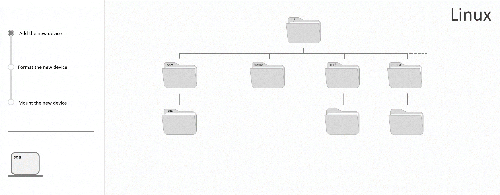

## Introduction
In this tutorial you will learn how to format and mount a storage device in Linux and how to add it to the `fstab` file. Formatting the device will include creating a new partition and adding a file system.

__Storage device__

Storage devices are basically extra storage that can be used as an addition to the storage of a server. A Hetzner Cloud volume is one example. The storage device has to be mounted on an empty directory in the directory tree of the server. All data saved in this directory, also referred to as the mount point of the storage device, is saved and stored on the device. This means that a storage device is a separate storage that can be accessed from the directory tree of the server.

The storage device needs to be formatted before it can be mounted in the directory tree. This includes creating a file system to enable saving and deleting data on the device. In fact, it is actually this file system that is later mounted in the directory tree of the server.

In general, mounting a new device can be summarized as follows:

1. Every new device gets a name (by alphabet) and a device file in `/dev`.
2. Every device needs a file system. It is not possible to save or delete data on a device without a file system.
3. The file system of the device has to be mounted on an existing directory in the directory tree of the server. All data within this directory is saved on the storage device. It is recommended to use `/mnt` for a manual mount by the user and `/media` for an automatic mount by the system.



Hetzner Cloud offers a solution to skip these steps and to access the storage device directly. For this, you will need a cloud server with an operating system that is supported by Hetzner and a cloud volume. The cloud volume comes with the option to be formatted and mounted automatically when it gets attached to the server.

**Prerequisites**

* Basic knowledge about servers
* Access to the root user or a user with sudo permissions
* CLI tool
* This tutorial uses Ubuntu 18.04/20.04, however this should also work on other Linux systems.

> Warning: The commands below in steps 1, 2 and 3 may destroy existing data on the device.

**Example terminology**

* Mount point: /mnt/device-mountpoint
* Device name: sdb
* Partition name: sdb1
* Label: mylabel

Please replace `/mnt/device-mountpoint` with an own mount point, `sdb`/`sdb1` with the name of your device/partition and `mylabel` with your own label in all example commands.

## Step 1 - Identifying the new device

To use the storage of your device, you first have to mount it on an empty directory in the directory tree of the server. In order to format the device accordingly, you will need its name and a root user or a user with sudo permissions. Connect to your server and use the `lsblk` command to list all devices.

> Note that the device name is not fixed and that it can change, for example if you remove and readd the device. Before making changes to a device, you should always check if the name has changed. If you simply use the name it had in the session before, you'll might accidentally make changes to another device.

```
# lsblk
```

Output:

```
NAME   MAJ:MIN RM  SIZE RO TYPE MOUNTPOINT
sda      8:0    0   55G  0 disk
└─sda1   8:1    0   55G  0 part /
sdb      8:16   0   10G  0 disk
sr0     11:0    1 1024M  0 rom
```

- `NAME`: In Linux, all block storage devices begin with `sd`, which is short for `SCSI disk`. And this is short for Small Computer System Interface disk. The third letter is used to name all devices following the alphabet. The name can change, for example if you remove and readd the device. If your storage device is the last device you attached to your server, it is very likely that it will also be last in this table.

- `SIZE`: This is the total storage of a device. If you know the storage capacity of your device, you can use this information to identify it.

- `TYPE`: One disk is one device. Each device can be divided into several units, called partitions. Partitions have the same name as the device they are on, plus an additional digit. A new Hetzner cloud volume, for example, is a disk and does not have any partitions.

- `MOUNTPOINT`: This is the directory on which the device has been mounted. In this directory, you can access your device and store data on it. Devices that have not been formatted and mounted yet, do not have a `MOUNTPOINT`.

Use this information to identify your device and to get its name.

In all commands that follow, `sdb` will be used as an example name for the device. Please replace this name with the actual name of your device.

Now that you know the name of your device, you can format it.

## Step 2 - Creating a partition

Generally, it would be enough to create a file system on the device before mounting it. However, some operating systems expect there to be a partition table, even if it only lists a single partition. Partitioning the disk now, also makes it easier to create more partitions in the future. In most cases, the device can also be used without a partition, so this step is optional and can be skipped.

One device equals to one disk. You can either create one file system for the entire disk to store data on the device in general, or you can split the disk into several units, called partitions. Then, each partition gets its own file system, its own mount point and can be used for a different purpose. This means that a partition is basically a fraction of the disk that is treated like a separate device.

Details on the partitions are given in a specific format in the partition table. Two common partition table formats are __MBR__ (Master Boot Record) and __GPT__ (GUID Partition Table). MBR has been available for over 30 years, which is why this format imposes some limitations. But it is also supported by older operating systems. GPT is newer than MBR and offers some improvements in comparison to the other format.

The format of the partition table needs to be set in order to create a partition. You can use the `fdisk` command to check if and which table format is used on your device:

```
fdisk -l /dev/sdb
```
> Please note that this is not -1 but -L in lower case, which stands for --list.

Output:
```
Disk /dev/sdb: 10 GiB, 10737418240 bytes, 20971520 sectors
Disk model: Volume
Units: sectors of 1 * 512 = 512 bytes
Sector size (logical/physical): 512 bytes / 512 bytes
I/O size (minimum/optimal): 512 bytes / 512 bytes
Disklabel type: gpt
```

The line `Disklabel type` indicates the format used. If this line is missing, it means that no partition table format has yet been set for your device.

To create a partition, you can use `parted`. On most servers, you should be able to use this command.

- If you do not have `parted`, you can install it with these commands:

  Ubuntu and Debian:
  ```
  sudo apt-get update
  ```  
  ```
  sudo apt-get install parted
  ```
  CentOS and Fedora:
  ```
  sudo yum install parted
  ```

Use this command to set the partition table format to GPT:
```
sudo parted /dev/sdb mklabel gpt
```
> Please replace sdb in `/dev/sdb` with the actual name of your device. If you prefer MBR, you can replace `gpt` with `msdos`.

Once the partition table format is set, you can create the first partition. Use the following command to create a single partition that spans the entire storage of the device:
```
sudo parted -a opt /dev/sdb mkpart primary ext4 0% 100%
```
> Please replace sdb in `/dev/sdb` with the actual name of your device.

Now check if the command worked:

```
# lsblk
```

Output:

```
NAME   MAJ:MIN RM  SIZE RO TYPE MOUNTPOINT
sda      8:0    0   55G  0 disk
└─sda1   8:1    0   55G  0 part /
sdb      8:16   0   10G  0 disk
└─sdb1   8:17   0   10G  0 part
sr0     11:0    1 1024M  0 rom
```

In this example, the partition `sdb1` has been created on disk `sdb`.

## Step 3 - Creating the file system

Next, you can create the file system. It organizes the way files are stored. It is not possible to store, edit or delete files without a file system. Known file systems are ext4 and xfs, for example. 

When creating a file system, you can use the option `-L` to add a label to your partition. This helps to distinguish several partitions.
```
sudo mkfs.ext4 -L mylabel /dev/sdb1
```

> Please replace `mylabel` with an own label and sdb1 in `/dev/sdb1` with the actual name of your device or partition. The name of a partition ends with a digit, the name of a disk does not.

Now, list all block devices and partitions along with their file system and label to see if the command above worked properly:
```
sudo lsblk -o NAME,FSTYPE,LABEL
```

To get more information about the file system itself, such as the file system UUID, you can use `dume2fs`:

```
sudo dumpe2fs -h /dev/sdb1
```

> Please replace sdb1 in `/dev/sdb1` with the actual name of your device or partition.


## Step 4 - Mounting the device

Mounting means to assign the file system of the storage device or partition to a specific directory in the directory tree of the server. All data within this directory is saved on the device/partition. In step 3 it was explained how to create this file system. Before mounting, you should know the following directories/files:

- `/media`
- `/mnt`
- `/dev` 
- `/etc/fstab`


The `media` directory is recommended for mounting removable media (e.g. USB drives). Basically, this directory is used __by the system to automatically mount__ removable devices.

The `mnt` directory is recommended for mounting storage devices (e.g. Hetzner cloud volume). Basically, this directory is used __by the user to manually mount__ storage devices.

The `dev` directory contains device files. In Linux, everything is seen as a file, even devices. The device file itself is not an ordinary file but an interface to the device. This directory cannot be used to save data on the storage device.

The `fstab` file contains a list of storage devices and partitions that have to be mounted. This list also includes additional information that is needed for mounting, such as the file system, the mount point, the file system type and mounting options. The system uses the information in this file at a reboot to automatically mount all file systems in the table. Storage devices that are not in this file, need to be mounted manually after every reboot. New devices are not automatically included in this list. But it is possible to add the device manually. 

#### Step 4.1 - Creating a new directory

As already mentioned, the `/media` directory can be used by the system to automatically mount removable devices and the `mnt` directory can be used by the user to manually mount storage devices. This is only a recommendation, and you can always choose an own directory. However, you should mount the file system of your device or partition on an empty directory. If you did mount your file system on a directory with data, it would not be possible to access this data until the file system is unmounted again. Also, if you mount file system 2 on a directory on which file system 1 is already mounted on, you will no longer be able to access the data from file system 1 until file system 2 is unmounted again. The best way is to create a new directory in `/mnt` and to use this as the new mount point. In the next example command and in all the following commands, the file system of the device/partition will be mounted on the new directory `device-mountpoint` in `/mnt`.

Open the directory to your mount point:
```
cd /mnt
```
> Please replace `/mnt` with the directory you want to use.

Create a new directory as the mount point for your device/partition:

```
sudo mkdir device-mountpoint
```
> Please replace `/mnt/device-mountpoint` with an own directory name. Choose a name that describes your device/partition. This will help to distinguish your devices/partitions later on.

#### Step 4.2 - Mounting the device
For this session, you will have to mount the file system of your device or partition manually. If you add the file system and its mount point to the `fstab` file, the system will automatically mount your device or partition at every reboot. This step is optional and will be explained later in the tutorial.

Use the following command to mount the file system on the directory you just created:

```
mount -o discard,defaults /dev/sdb1 /mnt/device-mountpoint
```

> Please replace `/mnt/device-mountpoint` with your own mount point.

After the command has been executed, you can check if the device/partition has been mounted properly to the directory tree of the server. You can list all mounted file systems or search for a specific file system with `findmnt`. Use this command to get the file system that has been mounted on your new directory:

```
findmnt /mnt/device-mountpoint
```
> Please replace `/mnt/device-mountpoint` with your own mount point.

If everything worked properly, it should now indicate the name of your device/partition as `SOURCE`:

```
TARGET                 SOURCE    FSTYPE OPTIONS
/mnt/device-mountpoint /dev/sdb1 ext4   rw,relatime,discard
```

Alternatively, you can also use `lsblk` from __step 1__ to list all storage devices. This time, your device/partition should also have a `MOUNTPOINT`.

```
NAME   MAJ:MIN RM  SIZE RO TYPE MOUNTPOINT
sda      8:0    0   55G  0 disk
└─sda1   8:1    0   55G  0 part /
sdb      8:16   0   10G  0 disk
└─sdb1   8:17   0   10G  0 part /mnt/device-mountpoint
sr0     11:0    1 1024M  0 rom
```

Your device/partition is now mounted to the existing directory tree of the server and the new directory can now be used to store data on the additional storage device.


The command to manually mount the file system of the device/partition has to include all the information needed for mounting. This information can be dropped if it is permanently added to the `fstab` file. Storage devices that are listed in the `fstab` file with the mounting option `noauto` are skipped at a reboot and not mounted automatically. Storage devices or partitions with an entry like this can be mounted with a simple command while the system gets all the other information from the `fstab` file.

- Command to manually mount a storage device __without__ an `fstab` entry:
  ```
  mount -o discard,defaults /dev/<name> /mnt/<mountpoint>
  ```

- Command to manually mount a storage device __with__ an `fstab` entry:
  ```
  mount /mnt/<mountpoint>
  ```

#### Step 4.3 - Creating an `fstab` entry

The `fstab` file contains file systems and all related mounting options. Each partition on a device has its own file system. Storage devices that do not have any partitions only have one file system. All file systems of any device or partition that are listed in `/etc/fstab` are automatically mounted at a reboot. File systems with the option `noauto` are an exception. These are skipped and not mounted. This option can be added for file systems you want to mount manually. For a manual mount, any information needed for mounting is taken from the table in the `fstab` file and does not need to be included in the command itself. New file systems are not added automatically to this file. The following step will therefore explain how to do it manually. But first, it helps to understand the structure of the `fstab` file.

Entries to a storage device or a partition have this format:

```
<file system> <mount point> <type> <options> <dump> <pass>
```

First, is the `file system` that will be mounted. A device without partitions only has one file system. A device with partitions has one file system for each partition.

The `mountpoint` is the directory that will be used to access the device or partition. For this, we created a new directory in __step 2__. 

`Type` gives the type of the file system created on the device or partition. Well known file systems are ext4 and xfs, for example.

`Options` set the rules for mounting a file system on a directory in the existing directory tree. Following options are used in this tutorial:

- `default`: The file system will be mounted with the options `rw`, `suid`, `dev`, `exec`, `auto`, `nouser` and `async`. These settings include that data on the device or partition can not only be read but also be written. And it includes that only root can mount and unmount the file system.
- `discard`: Activates TRIM, which discards unused or invalid storage blocks and gives them free to be rewritten. This is mainly useful for SSD devices.
- `nofail`: If the system cannot mount one of the file systems, it will skip this particular device/partition once and the reboot will continue.
- `noauto`: These file systems are skipped at every reboot and they are never mounted by the system.

`Dump` enables backups. If it is set to 0, there will be no backups of the device/partition. If it is set to 1, there will be backups of the device/partition. Often, `dump` is not automatically installed and should be set to 0.

`Pass` specifies the order in which the devices/partitions are checked at reboot by `fsck`. If it is set to 0, the file system will not be checked, if it is set to 2, the file system will be checked. If it is set to 1, the file system will be checked first and has the highest priority. The file system of root should be set to 1. All other file systems that you would like to be checked can be set to 2.

Up until now, it was enough to use the directory of the device file to specify the device or partition that we would like to mount. This works fine for mounting a file system once, but the name is not fixed and can be different after a reboot. To ensure that the mounting options in the `fstab` file are applied to the correct file system, it is best to identify the file system by something that does not change. 
You can use the UUID, a unique and fixed ID that every file system gets assigned at creation.

There is also a unique and fixed ID of the storage device or partition itself. The ID of the device/partition can be used alternatively to the UUID.

ID and UUID are in`/dev/disk/by-id` and `/dev/disk/by-uuid` and link directly to the corresponding device file. The path of the ID (`/dev/disk/by-id/<id>`) or UUID (`/dev/disk/by-uuid/<UUID>`) is used as the identifier in the `fstab` file.

- Option 1: <br>
  You can use `lsblk` to list all file systems with their name, mount point and UUID. __Step 1__ explained how to get the name of the device or partition. You can use this information now to determine which line refers to yours.
  ```
  sudo lsblk -o NAME,LABEL,UUID,MOUNTPOINT
  ```
- Option 2:
  You can use `blkid` to list all devices and partitions with their `/dev` entry, their UUID and their label, if they have any.
  ```
  sudo blkid
  ```
  Output:
  ```
  /dev/sdb1: LABEL="datapartition" UUID="a12b3cde-a12b-3cde-a12b-3cdea12b3cde" TYPE="ext4" PARTLABEL="primary" PARTUUID="df20f337-9640-43cc-9b6c-bda0c8538863"
  ```
- Option 3: <br>
  An ID belongs to a storage device or a partition. You can find the ID under `/dev/disk`.
  ```
  ls -al /dev/disk/by-id
  ```
  At the end of the line, the output will include the name of the device or partition.

Once you know the ID of your device/partition or the UUID of your file system, you can add your device/partition to the `fstab` file. The example below will create a new entry for a file system that will be mounted automatically at every reboot. If you would prefer to mount it manually, you will have to add the option `noauto` to the options in the command below (`discard,nofail,defaults,noauto`).

```
sudo echo "/dev/disk/by-uuid/a12b3cde-a12b-3cde-a12b-3cdea12b3cde /mnt/device-mountpoint ext4 discard,nofail,defaults 0 0" >> /etc/fstab
```

> Please replace `/dev/disk/by-uuid/a12b3cde-a12b-3cde-a12b-3cdea12b3cde` with your own ID or UUI and `/mnt/device-mountpoint` with your own mount point. The text in quotes will be added as a new line to the `fstab` file.

Open the `fstab` file to see if the command was executed properly and if the mount point has been added to the list.

```
cat /etc/fstab
```

If the final line is now your device/partition, it means that the command was executed properly.

If you added your device/partition __without__ the option `noauto` to the `fstab` file, your file system will now automatically be mounted at every reboot.

If you added your device/partition __with__ the option `noauto` to the `fstab` file, you will have to mount your file system manually after every reboot. Now that the mounting information is saved in the `fstab` file, it is enough to use the command `mount <mountpoint>`. The command for the example used in this tutorial would look like this: `mount /mnt/device-mountpoint`.

## Step 5 - Unmounting the device and editing the fstab file

The storage device can only be unmounted by the user who also mounted it unless the owner has been changed. You can use `umount` to unmount the storage device from the directory. Please note that this command does not begin with `un`.

You can specify the device by either using its name or the mount point. There should be no running actions on the device or partition before unmounting it, so there should not be any open files or anything similar.

```
umount /dev/sdb1
```
or
```
umount /mnt/device-mountpoint
```
> Please replace `sdb1` or `/mnt/device-mountpoint` with your own name or directory.

Entries in the `fstab` file are not deleted automatically. To delete or edit an entry in the `fstab` file, you can use `nano`. Before making any changes, you should create a backup of the file. 

```
sudo cp -v /etc/fstab /etc/fstab.backup
```
```
sudo nano /etc/fstab
```

## Conclusion

In the previous steps you learned how to get the name of your device, create a partition, create a file system, mount the device/partition and add the file system to the `fstab` file.
