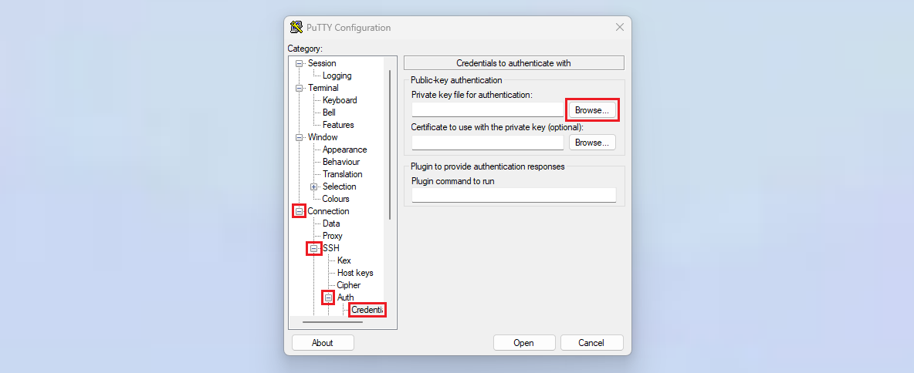
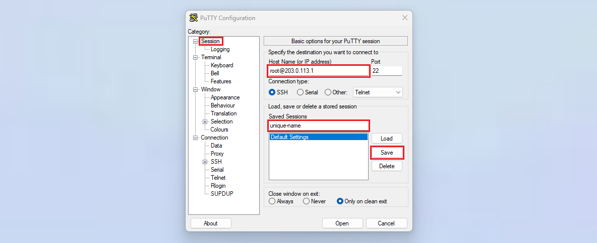

## Einführung

In diesem Tutorial wird erklärt, wie man sich von einem Windows-Gerät aus über SSH mit einem externen Server verbindet. Es wird gezeigt, wie man eine SSH-Verbindung aufbaut, wie man einen SSH-Key verwaltet und wie man sich über den SSH-Key mit dem Server verbindet.

**Voraussetzungen**
* Lokales Gerät mit Windows 10/11
* Externen Server mit öffentlicher IP-Adresse

**Beispiel-Benennungen**
* **Lokales Gerät**
  * Benutzername: holu
* **Externer Server**
  * Benutzername: root
  * IPv4: `<203.0.113.1>`

## Schritt 1 - SSH unter Windows nutzen

Um eine SSH-Verbindung herstellen zu können, muss das lokale Gerät SSH unterstützen. Je nach Windows-Version (siehe "[List of Microsoft Windows versions](https://en.wikipedia.org/wiki/List_of_Microsoft_Windows_versions)"), kann eine der untenstehenden Optionen genutzt werden. Um zu prüfen welche Windows-Version dein Gerät hat, öffne Windows PowerShell und führe folgenden Befehl aus:

```bash
Get-ComputerInfo | select OsName, OSDisplayVersion, OsBuildNumber
```

---------
---------

* [Option 1 - Windows PowerShell verwenden](#option-1---windows-powershell-verwenden)<br>
  Mit PowerShell kannst du einfach einen SSH-Befehl ausführen, ohne vorher etwas installieren zu müssen.<br>
  **Funktioniert mit Windows 10 Version 1709 und höher**.


* [Option 2 - Linux-Subsystem installieren](#option-2---linux-subsystem-installieren)<br>
  Du kannst eine WSL Linux-Distribution installieren. Damit ist es möglich auf einem Windows-Gerät Linux-Befehle auszuführen.<br>
  **Funktioniert mit Windows 10 Version 1607 und höher**.


* [Option 3 - PuTTY installieren](#option-3---putty-installieren)<br>
  Du kannst PuTTY installieren und durch diese Software eine SSH-Verbindung aufbauen. Im Gegensatz zu PowerShell und dem Linux-Subsystem besitzt diese Option eine graphische Benutzeroberfläche (GUI).

---------
---------

### Option 1 - Windows PowerShell verwenden

Du brauchst:<br>

* **PowerShell 5.1 oder höher**<br>
  Um zu prüfen welche PowerShell-Version du verwendest, kannst du in PowerShell diesen Befehl ausführen:
  ```bash
  $PSVersionTable.PSVersion
  ```
* **OpenSSH-Client installiert**<br>
  Es gibt zwei verschiedene OpenSSH-Features:
  
  | Feature        | Hinweis | Feature erklärt  |
  | -------------- | ------- | ---------------- |
  | OpenSSH-Client | **Auf Windows 10 Version 1809 und höher**:<br>» Standardmäßig installiert<br><br>**Auf Windows 10 Version 1709**<br>» Muss man selbst installieren | Benötigt man auf dem lokalem Gerät, um sich mit einem externem System zu verbinden. |
  | OpenSSH-Server | Muss man selbst installieren | Benötigt man auf dem externem Gerät, mit dem man sich verbinden möchte. |
  
  > Für dieses Tutorial wird nur *OpenSSH-Client* benötigt.
  
  Wenn du **Windows 10 Version 1709** hast, ist *OpenSSH-Client* nicht automatisch installiert und du musst es selbst hinzufügen.
  
  **OpenSSH-Client installieren:**
  
  * Gebe in der Windows-Suchleiste "Optionale Features" ein und wähle es aus. Das sollte die Einstellungen öffnen. 
  * Suche unter "Installierte Features" nach "OpenSSH-Client".
  * Wenn "OpenSSH-Client" nicht verfügbar ist, wähle `Optionales Feature hinzufügen` aus. Suche nach "OpenSSH-Client" und installiere es.

Wenn du die richtige PowerShell-Version hast und *OpenSSH-Client* installiert ist, öffne PowerShell und nutze diesen Befehl, um dich mit deinem Server zu verbinden:

```bash
ssh root@<203.0.113.1>
```
> Ersetze `<203.0.113.1>` mit deiner eigenen IP-Adresse.

Sollte eine Warnung bezüglich der "Host-Authenticity" erscheinen, kann "yes" angegeben werden.

### Option 2 - Linux-Subsystem installieren

1. **Windows-Subsystem für Linux (WSL) aktivieren**<br>
   Gebe in der Windows-Suchleiste "Windows-Features aktivieren oder deaktivieren" ein und wähle es aus. Das sollte ein neues Fenster öffnen. Scrolle nach ganz unten und aktiviere:
   * "VM-Plattform"
   * "Windows-Subsystem für Linux"

   Wenn beide Optionen ein Häkchen haben, klicke auf `OK` und starte das Gerät neu.

2. **Linux-Distribution installieren**<br>
   
   Die Linux-Distribution kann entweder über den Microsoft Store oder über PowerShell installiert werden. Wähle eine dieser beiden Optionen:
   
   **Über den Microsoft Store:**
   * Suche im Microsoft Store nach einer beliebigen Linux-Distribution, wie "Ubuntu", und lade diese herunter. Prüfe vorher nochmal, ob in der Beschreibung auch "Windows Subsystem for Linux" (WSL) erwähnt wird.
     
     Du kannst jetzt das Linux-Terminal öffnen, wie im folgenden Zwischenschritt 3 beschrieben. Wenn du das Terminal das erste mal öffnest, wirst du aufgefordert einen Benutzer einzurichten. Das wird der Standardbenutzer der Linux-Distribution, die du gerade heruntergeladen hast. Der Benutzer besitzt sudo-Rechte und kann damit administrative Befehle ausführen.
   
   **Über PowerShell:** 
   * Liste alle verfügbaren Linux-Distributionen, wähle eine Linux-Distribution aus (z.B. "Ubuntu") und installiere diese.
     ```bash
     wsl --list --online            # Alle verfügbaren Linux-Distributionen listen
     wsl --install <distribution>   # Eine Linux-Distribution installieren, z.B. "wsl --install Ubuntu"
     ```
     Du wirst vermutlich aufgefordert einen Benutzer einzurichten. Das wird der Standardbenutzer der Linux-Distribution, die du gerade installiert hast. Der Benutzer besitzt sudo-Rechte und kann damit administrative Befehle ausführen. Mit dem Befehl `wsl --list` kannst du prüfen ob die Installation erfolgreich war. Damit werden ausschließlich installierte Linux-Distributionen gelistet. Mit `wsl --list --verbose` kannst du prüfen welche WSL-Version verwendet wird und dir den aktuellen Status ansehen.

3. **Linux-Terminal öffnen**<br>
   Gebe in der Windows-Suchleiste deine Linux-Distribution ein und wähle diese aus um das Terminal zu öffnen. In diesem Terminal solltest du jetzt die Linux-Befehle der Distribution ausführen können, die du ausgewählt hast.
   

4. **Mit dem Server verbinden**<br>
   Gebe im Linux-Terminal folgenden Befehl ein, um dich über SSH mit dem externen Server zu verbinden:
   ```bash
   ssh root@<203.0.113.1>
   ```
   > Ersetze `<203.0.113.1>` mit deiner eigenen IP-Adresse.

   Sollte eine Warnung bezüglich der "Host-Authenticity" erscheinen, kann "yes" angegeben werden.

### Option 3 - PuTTY installieren

Die Paket-Datei für PuTTY kann hier heruntergeladen werden: [List of PuTTY packages](https://www.chiark.greenend.org.uk/~sgtatham/putty/latest.html)

Wenn du dir bei der Architektur nicht sicher bist, kannst du wie in [diesem FAQ-Eintrag](https://www.chiark.greenend.org.uk/~sgtatham/putty/faq.html#faq-32bit-64bit) erklärt die 32-Bit-Version installieren oder diesen Befehl in PowerShell ausführen und dich danach richten:

```bash
Get-ComputerInfo | select OSArchitecture, CsSystemType
```
> * `x64-based PC` » 64-Bit-Prozessor
> * `ARM-based PC` » Arm-basierter Prozessor

Lade die `.msi`-Datei herunter und wähle diese mit einem Doppelklick aus, um die Datei zu öffnen. Das sollte den Einrichtungsassistenten starten. Du kannst den Speicherort lassen und die Installation starten. Sobald die Installation beendet ist, kannst du `Finish` auswählen.

Gebe in der Windows-Suchleiste "PuTTY" ein und wähle es aus. Dadurch sollte sich das PuTTY-Fenster öffnen. Gebe in dem Textfeld oben links deinen Benutzernamen auf dem Server an und die IP-Adresse, getrennt durch das At-Zeichen (`<username>@<IP-address`) und lasse Port 22 wie er ist:


* Klicke auf "Open", um eine Verbindung herzustellen
* Es kann eine Warnung wie diese angezeigt werden:
  ```
  The host key is not cached for this server:
  203.0.113.1 (port 22)
  You have no guarantee that the server is the computer you think it is.
  The server's ssh-ed25519 key fingerprint is:
  <fingerprint>
  ```
  Diese Warnung wird angezeigt, wenn man sich das erste mal mit einem Server verbindet. Hier kann "Accept" ausgewählt werden. PuTTY wird dann diesen Fingerprint speichern.
* Im dem Terminal, das sich geöffnet hat, kannst du jetzt dein Passwort angeben. Beachte, dass das Passwort im Terminal nicht angezeigt wird, wenn du es eingibst.
  ```bash
  Using username "root".
  root@203.0.113.1's password:
  ```

Du solltest jetzt auf deinem externen Server eingeloggt sein.

## Schritt 2 - SSH-Key erstellen

Jetzt da du weißt, wie du eine Verbindung zu deinem Server herstellen kannst, kannst du ein SSH-Key-Paar erstellen und den öffentlichen Key in der `authorized_keys`-Datei auf deinem Server hinterlegen. Wenn man einen SSH-Key nutzt, muss man kein Passwort mehr angeben, um sich mit dem Server zu verbinden. Zusätzlich ist der SSH-Key sicherer als ein Passwort.

| Datei             | Erklärung    |
| ----------------- | ------------ |
| `id_<type>`       | Der private Key. Du solltest diese Datei nie mit anderen teilen. |
| `id_<type>.pub`   | Der öffentliche Key. Dieser Key muss in der `authorized_keys`-Datei auf dem Server hinterlegt werden. |
| `authorized_keys` | Diese Datei beinhaltet die öffentlichen Keys von allen Geräten, die per SSH-Key auf den Server zugreifen dürfen. |

> Eine genauere Erklärung von SSH-Keys gibt es in der Einleitung von diesem Tutorial: [SSH-Key einrichten](https://community.hetzner.com/tutorials/howto-ssh-key/de)

Wie du ein SSH-Key-Paar erstellen kannst, hängt davon ab welche Option du in Schritt 1 gewählt hast:

* **Linux-Terminal oder PowerShell**<br>
  Folge den Anweisungen in dem Schritt "SSH-Key erstellen" des Tutorials "[SSH-Key einrichten](/tutorials/howto-ssh-key/de#schritt-1---ssh-key-erstellen)", um ein SSH-Key-Paar zu erstellen.

<br>

* **PuttY**<br>
  Die Installation von PuTTY beinhaltet automatisch auch den "PuTTY Key Generator". Um diesen zu öffnen, gebe in der Windows-Suchleiste einfach "PuTTYgen" ein. Um ein Key-Paar zu erstellen, folge den Schritten in dem Tutorial "[SSH-Key mit PuTTYgen erstellen](/tutorials/how-to-generate-ssh-key-putty/de)".

Auf dem lokalen Windows-Gerät sollte der SSH-Key hier gespeichert worden sein:
* Mit PowerShell und dem Linux-Terminal unter `~/.ssh`.
* Mit PuTTY solltest du dir den Speicherort selbst ausgesucht haben.

Der öffentliche Key muss auf dem externen Server hinterlegt werden. Eine Möglichkeit das zu tun ist:

* **Öffentlichen Key kopieren**<br>
  Öffne auf deinem lokalen Windows-Gerät den öffentlichen SSH-Key und kopiere den Inhalt.
  * PowerShell:
    ```bash
    Get-Content ~/.ssh/id_<type>.pub
    ```
  * Linux-Terminal:
    ```bash
    cat ~/.ssh/id_<type>.pub
    ```

* **Mit dem Server verbinden**<br>
  Nutze `ssh root@203.0.113.1` oder PuTTY, um dich mit deinem Server zu verbinden.
  
* **Den Key auf dem Server speichern**<br>
  Wenn dein Server Ubuntu als OS besitzt, kannst du die `authorized_keys`-Datei mit "nano" bearbeiten:
  ```bash
  nano ~/.ssh/authorized_keys
  ```
  Füge deinen Key ein und nutze `CTRL`+`X` zum Speichern, `Y` zum Bestätigen und `ENTER` zum Schließen der Datei.

## Schritt 3 - SSH-Key verwalten

* **PowerShell**<br>
  Alle SSH-Dateien werden im `~/.ssh`-Ordner gespeichert:
  ```bash
  cd ~/.ssh; dir
  ```
  In diesem Ordner kannst du deine SSH-Dateien, wie `config` und `known_hosts`, nach Bedarf bearbeiten.
  Um einen Key zu entfernen, müssen nur die entsprechenden Key-Dateien gelöscht werden.
  ```bash
  Remove-Item ~/.ssh/id_<type>, ~/.ssh/id_<type>.pub
  ```
  > Aus Sicherheitsgründen sollte der öffentliche Key auch aus der `authorized_keys`-Datei auf dem Server entfernt werden.

* **Linux-Terminal**<br>
  Alle SSH-Dateien werden im `~/.ssh`-Ordner gespeichert:
  ```bash
  cd ~/.ssh && ls -al
  ```
  In diesem Ordner kannst du deine SSH-Dateien, wie `config` und `known_hosts`, nach Bedarf bearbeiten.
  Um einen Key zu entfernen, müssen nur die entsprechenden Key-Dateien gelöscht werden.
  ```bash
  rm -rf ~/.ssh/id_<type> ~/.ssh/id_<type>.pub
  ```
  > Aus Sicherheitsgründen sollte der öffentliche Key auch aus der `authorized_keys`-Datei auf dem Server entfernt werden.

* **PuTTY**<br>
  Dateien wie `config` und `known_hosts` müssen nicht selbst verwaltet werden. Das übernimmt PuTTY automatisch.

  Wenn du einen bestehenden SSH-Key bearbeiten möchtest, kannst du diesen mit der Option "Load" in PuTTYgen einfügen und bearbeiten. Wähle anschließend "Save private key" aus, um die Änderungen zu speichern.

  Wenn du einen SSH-Key löschen möchtest, kannst du schlicht die entsprechenden Key-Dateien auf deinem Windows-Gerät löschen. Aus Sicherheitsgründen sollte der öffentliche Key auch aus der `authorized_keys`-Datei auf dem Server entfernt werden.

## Schritt 4 - Automatische Authentifizierung einrichten

Jetzt da du weißt, wie man sich mit einem Server verbindet, kannst du eine automatische Authentifizierung einrichten. Auf diese Weise musst du künftig nicht mehr den Benutzernamen und das Passwort / SSH-Key oder die IP-Adresse angeben, wenn du dich mit deinem externen Server verbinden möchtest.

* **PowerShell und Linux-Terminal**<br>
  In der config-Datei innerhalb des SSH-Ordners kannst du Einträge mit Standardverbindungen ergänzen. Mit einem solchen Eintrag kann man sich schlicht mit `ssh <unique-name>` anstelle von `ssh <username>@<IP-address>` mit seinem Server verbinden.

  Bearbeite die config-Datei auf deinem lokalen Gerät:
  * PowerShell
    ```bash
    notepad ~/.ssh/config
    ```
    > Wenn es die Datei bisher noch nicht gibt, kannst du diese unter `C:\Users\<username>\.ssh` mit deinen restlichen SSH-Dateien abspeichern.
  * Linux-Subsystem
    ```bash
    nano ~/.ssh/config
    ```
    > Sobald du mit deinen Änderungen fertig bist, nutze `CTRL`+`X` zum Speichern, `Y` zum Bestätigen und `ENTER` zum Schließen der Datei.
  
  Füge in der config-Datei einen neuen Eintrag im folgenden Format hinzu:
  
  ```bash
  Host <unique-name>
          HostName <IP-address>
          User <username>
          PreferredAuthentications publickey
  ```
  
  Ersetze `<unique-name>` mit einem beliebigen Namen, `<IP-address>` mit der IP-Adresse von deinem Server und `<username>` mit deinem Benutzernamen auf dem Server. Wenn du auf deinem Server noch keinen SSH-Key hinzugefügt hast, ändere "PreferredAuthentications" von "publickey" zu "password".

  <blockquote>
  <details>

  <summary>Klicke hier für einen Beispiel-Eintrag</summary>

  ```bash
  Host unique-name
          HostName 203.0.113.1
          User root
          PreferredAuthentications publickey
  ```

  </details>
  </blockquote>

  Mit dem neuen Eintrag kannst du dich jetzt mit `ssh <unique-name>` anstelle von `ssh root@<203.0.113.1>` mit deinem Server verbinden.
  
  Mit dem Server verbinden:
  
  ```bash
  ssh <unique-name>
  ```

* **PuTTY**<br>
  * Gebe in der Windows-Suchleiste "PuTTY" ein und öffne das PuTTY-Fenster.
  * Gehe zu `Connection` » `SSH` » `Auth` » `Credentials`
    * Klicke auf `Browse...` und wähle die Datei von deinem **privaten** SSH-Key aus. Die Datei endet vermutlich auf PPK (z.B. `<your-key>.ppk`).
    
    
  * Nachdem der Key hinzugefügt wurde, gehe zurück zu `Session`
    * Gebe in dem Textfeld oben links deinen Benutzernamen auf dem Server an und die IP-Adresse
    * Gebe in dem Textfeld unter `Saved Sessions` einen einzigartigen Namen für die Konfiguration an
    * Wähle `Save` aus
    
    
  
  Der Name sollte jetzt direkt unter `Default Settings` angezeigt werden. Wenn du deine Session mit einem Doppelklick auswählst (in diesem Beispiel heißt die Session `unique-name`), baut PuTTY automatisch eine Verbindung mit dem Benutzernamen, der IP-Adresse und dem SSH-Key auf, die du beim Speichern der Session angegeben hast. Die Session bleibt auch verfügbar, wenn du PuTTY schließt und neu öffnest. Wenn du die Session wieder mit einem Doppelklick auswählst, baut PuTTY wieder automatisch eine Verbindung zu deinem Server auf, ohne dass du irgendwelche Angaben machen musst.

## Ergebnis

Du solltest jetzt wissen, wie man sich über SSH mit einem Server verbindet. Bevor du mit deinem externen Server loslegst, solltest du auf diesem zumindest ein paar Basiseinstellungen vornehmen, wie es beispielsweise in dem Tutorial "[Ersteinrichtung eines Servers mit Ubuntu](/tutorials/howto-initial-setup-ubuntu/de)" erklärt wird.

##### License: MIT

<!--

Contributor's Certificate of Origin

By making a contribution to this project, I certify that:

(a) The contribution was created in whole or in part by me and I have
    the right to submit it under the license indicated in the file; or

(b) The contribution is based upon previous work that, to the best of my
    knowledge, is covered under an appropriate license and I have the
    right under that license to submit that work with modifications,
    whether created in whole or in part by me, under the same license
    (unless I am permitted to submit under a different license), as
    indicated in the file; or

(c) The contribution was provided directly to me by some other person
    who certified (a), (b) or (c) and I have not modified it.

(d) I understand and agree that this project and the contribution are
    public and that a record of the contribution (including all personal
    information I submit with it, including my sign-off) is maintained
    indefinitely and may be redistributed consistent with this project
    or the license(s) involved.

Signed-off-by: Svenja Michal

-->
