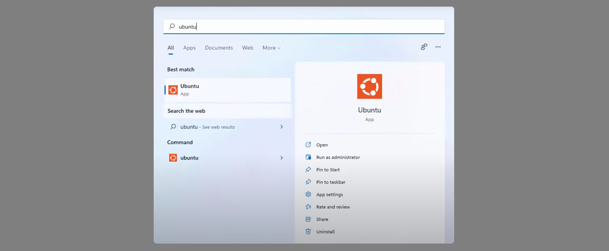
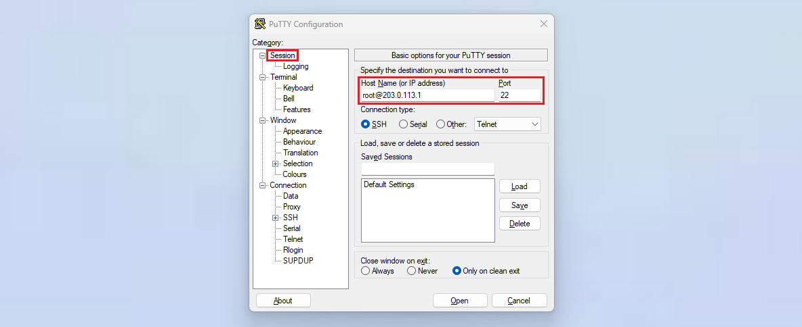
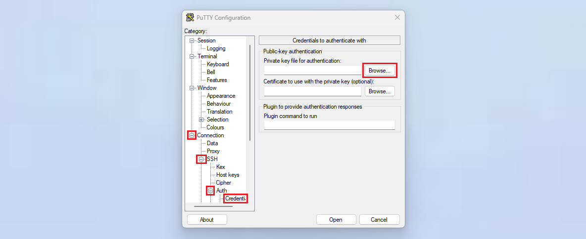
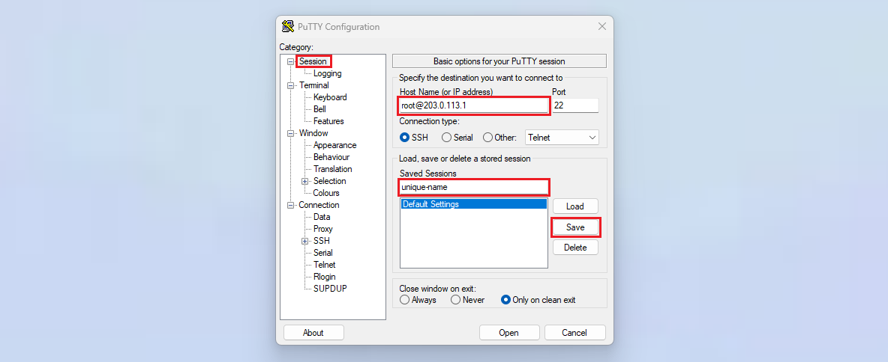

## Introduction

In this tutorial you will learn how to build an SSH connection from a Windows machine to a remote server. The instructions start from scratch and include how to build a connection with basic password authentication, how to manage an SSH key pair and how to connect to the server with the new SSH key.

**Prerequisites**
* Local machine with Windows 10/11
* Remote server with public IP

**Example terminology**
* **Local machine**
  * Username: holu
* **Remote server**
  * Username: root
  * IPv4: `<203.0.113.1>`

## Step 1 - Getting SSH support on Windows

To establish an SSH connection, you first need to make sure your local machine supports SSH. Depending on your Windows version (see [List of Microsoft Windows versions](https://en.wikipedia.org/wiki/List_of_Microsoft_Windows_versions)), you can choose one of the options below. To check your Windows version, open Windows PowerShell and run:

```bash
Get-ComputerInfo | select OsName, OSDisplayVersion, OsBuildNumber
```

---------
---------

* [Option 1 - Use Windows PowerShell](#option-1---use-windows-powershell)<br>
  You can use a basic SSH command in your PowerShell and you don't need to install anything.<br>
  **Works on Windows 10 version 1709 and later**.


* [Option 2 - Install Linux Subsystem](#option-2---install-linux-subsystem)<br>
  You can install a WSL Linux distribution. This allows you to run Linux commands on your Windows machine.<br>
  **Works on Windows 10 version 1607 and later**.


* [Option 3 - Install PuTTY](#option-3---install-putty)<br>
  You can install PuTTY and use that software to establish an SSH connection. As opposed to PowerShell and the Linux subsystem, this option comes with a graphical user interface (GUI).

---------
---------

### Option 1 - Use Windows PowerShell

You need:<br>

* **PowerShell 5.1 or later**<br>
  To check your PowerShell version, open PowerShell and run:
  ```bash
  $PSVersionTable.PSVersion
  ```
* **OpenSSH Client installed**<br>
  There are two different OpenSSH features:
  
  | Feature        | Note | Feature explained  |
  | -------------- | ---- | ------------------ |
  | OpenSSH Client | **On Windows 10 version 1809 and later**:<br>» Installed by default<br><br>**On Windows 10 version 1709**<br>» Needs to be installed manually | Is needed on the local system to connect to a remote system. |
  | OpenSSH Server | Needs to be installed manually. | Is needed on the remote system to which you want to establish a connection. |
  
  > For this tutorial, we only need *OpenSSH Client*.
  
  If you have **Windows 10 version 1709**, the *OpenSSH Client* is not installed by default and you need to do it yourself.  
  
  **Install OpenSSH Client:**
  
  * In the Windows search bar, enter and select "Optional features". This will open a "Settings" window. 
  * In the section "Installed features", search for "OpenSSH Client".
  * If "OpenSSH Client" is not available, select `+ Add a feature`. Search for "OpenSSH Client" and click `Install`.

If you have the correct PowerShell version and *OpenSSH Client* is installed, open PowerShell and use the SSH command to connect to your server:

```bash
ssh root@<203.0.113.1>
```
> Replace `<203.0.113.1>` with your IP address.

If there is a warning about host authenticity, you can enter yes.

### Option 2 - Install Linux Subsystem

1. **Enable Windows Subsystem for Linux (WSL)**<br>
   In your Windows search bar, enter and select "Turn Windows features on or off". In the window that pops up, scroll down and enable:
   * "Virtual Machine Platform"
   * "Windows Subsystem for Linux"
   
   Once these are enabled, click `OK` and reboot.

2. **Install a Linux distribution**<br>
   
   You can install a Linux distribution via the Microsoft Store or via PowerShell. Pick one of those two options.
   
   **Via the Microsoft Store:**
   * In the Microsoft Store, search for your favorite Linux distribution, such as "Ubuntu", and select `Get`. Make sure the description of the terminal environment mentions "Windows Subsystem for Linux" (WSL).
     
     You can now open the Linux terminal as explained in substep 3 below. The first time you open the terminal, you will be asked to setup a user. This will be the default user for the Linux distribution you've just installed. The user will be an administrator with sudo permissions.
   
   **Via PowerShell:** 
   * List all available Linux distributions, pick a Linux distribution (e.g. "Ubuntu"), and install it.
     ```bash
     wsl --list --online            # List available Linux distributions
     wsl --install <distribution>   # Install a Linux distribution, e.g. "wsl --install Ubuntu"
     ```
     You will be asked to setup a user. This will be the default user for the Linux distribution you've just installed. The user will be an administrator with sudo permissions. To check if the installation was successful, you can use the command `wsl --list`. This only lists installed Linux distributions. With `wsl --list --verbose`, you can check the WSL version used and the current state.

3. **Open the Linux terminal**<br>
   In your Windows search bar, search and select your Linux distribution. This will open the terminal. In this terminal, you should now be able to execute the Linux commands of the distribution you picked.
   

4. **Connect to your server**<br>
   In your Linux terminal, run the command below to connect to your remote server via SSH.
   ```bash
   ssh root@<203.0.113.1>
   ```
   > Replace `<203.0.113.1>` with your IP address.
   
   If there is a warning about host authenticity, you can enter yes.

### Option 3 - Install PuTTY

You can download the PuTTY package file from here: [List of PuTTY packages](https://www.chiark.greenend.org.uk/~sgtatham/putty/latest.html)

If you're not sure about your architecture, you can install the 32-bit version as explained in [this FAQ entry](https://www.chiark.greenend.org.uk/~sgtatham/putty/faq.html#faq-32bit-64bit), or run this command in PowerShell and decide from that:

```bash
Get-ComputerInfo | select OSArchitecture, CsSystemType
```
> * `x64-based PC` » 64-bit processor
> * `ARM-based PC` » Arm-based processor

Download the `.msi` file and double-click on the downloaded file to open it. This will start the setup wizard. You can keep the default location and start the installation. Once the installation is complete, you can select `Finish`.

In the Windows search bar, enter and select "PuTTY". This should open the PuTTY window. In the text box in the top left, enter your username and IP address separated by the 'at sign' (`<username>@<IP-address`), and keep port 22:



* To build a connection, click on "Open"
* You might get a warning like this:
  ```
  The host key is not cached for this server:
  203.0.113.1 (port 22)
  You have no guarantee that the server is the computer you think it is.
  The server's ssh-ed25519 key fingerprint is:
  <fingerprint>
  ```
  You get this warning the first time you connect to a server. You can select "Accept" and PuTTY will save the fingerprint.
* You can now enter your password in the terminal that opened. Note that the password is not shown in the terminal when you enter it.
  ```bash
  Using username "root".
  root@203.0.113.1's password:
  ```

You should now be logged in on your remote server.

## Step 2 - Generating an SSH key

Now that you know how to connect to your server, you can generate an SSH key pair and save the public key in the `authorized_keys` file on your server. With an SSH key, you do not need a password to connect to your server. In addition, SSH keys are more secure than passwords.

| File              | Explanation  |
| ----------------- | ------------ |
| `id_<type>`       | The private key. You should never share this file with anyone else. |
| `id_<type>.pub`   | The public key. You have to save this key in the `authorized_keys` file on your server. |
| `authorized_keys` | This file contains the public key of all key pairs that are used for authentication on the server. |

> For more information about SSH keys, check out the introduction of this tutorial: [Setting up an SSH key](/tutorials/howto-ssh-key)

The way you can generate your own SSH key pair depends on the SSH method you chose:

* **Linux terminal or PowerShell**<br>
  Follow the step "Generating an SSH key" explained in "[Setting up an SSH key](/tutorials/howto-ssh-key#step-1---generating-an-ssh-key)" to create an SSH key pair.

<br>

* **PuttY**<br>
  The installation of PuTTY automatically comes with the "PuTTY Key Generator". To open it, simply search and select "PuTTYgen" in the Windows search bar. To create a key pair, follow the steps explained in the tutorial "[Generate SSH key using PuTTYgen](/tutorials/how-to-generate-ssh-key-putty)".

On your local Windows machine, the SSH key should be saved in:
* With PowerShell and the Linux terminal in `~/.ssh`.
* With PuTTY, the key should be in a location of your choice.

You need to save the public key on the remote server. One way to do it is:

* **Copy your public key**<br>
  On your local Windows machine, go to the directory with your SSH key pair and copy the contents of the public key file.
  * PowerShell:
    ```bash
    Get-Content ~/.ssh/id_<type>.pub
    ```
  * Linux terminal:
    ```bash
    cat ~/.ssh/id_<type>.pub
    ```

* **Connect to your server**<br>
  Use `ssh root@203.0.113.1` or PuTTY to connect to your server.
  
* **Save the key on the server**<br>
  If you have Ubuntu on your remote server, you can edit the `authorized_keys` file with "nano":
  ```bash
  nano ~/.ssh/authorized_keys
  ```
  Paste your key into the file and use `CTRL`+`X` to save the file, `Y` to confirm and `ENTER` to close the file.

## Step 3 - Managing the SSH key

* **PowerShell**<br>
  All SSH files are saved in the `~/.ssh` directory:
  ```bash
  cd ~/.ssh; dir
  ```
  In this directory, you can update your SSH files as needed, such as `config` and `known_hosts`.
  To remove a key, you can simply delete the key files.
  ```bash
  Remove-Item ~/.ssh/id_<type>, ~/.ssh/id_<type>.pub
  ```
  > For security reasons, you should remove the public key from the `authorized_keys` file on the remote server too.

* **Linux terminal**<br>
  All SSH files are saved in the `~/.ssh` directory:
  ```bash
  cd ~/.ssh && ls -al
  ```
  In this directory, you can update your SSH files as needed, such as `config` and `known_hosts`.
  To remove a key, you can simply delete the key files.
  ```bash
  rm -rf ~/.ssh/id_<type> ~/.ssh/id_<type>.pub
  ```
  > For security reasons, you should remove the public key from the `authorized_keys` file on the remote server too.

* **PuTTY**<br>
  You do not need to manage SSH files such as `config` and `known_hosts` yourself. PuTTY manages this for you.

  If you want to edit an existing SSH key, you can use the "Load" option in PuTTYgen. Select your key, make your changes and select "Save private key" to save your changes.
  
  If you want to delete an SSH key, you can simply delete the key files from your Windows machine. For security reasons, you should remove the public key from the `authorized_keys` file on the remote server too.

## Step 4 - Setting up automatic authentication

Now that you know how to connect to the server, you can set up automatic authentication. This way, you don't need to specify the username and password / SSH key, or remember the IP address every time you want to connect to your remote server.

* **PowerShell and Linux terminal**<br>
  In the config file within the SSH directory you can add entries for default connections. With an entry like this, you can simply use `ssh <unique-name>` instead of `ssh <username>@<IP-address>` to connect to the server.

  Edit the config file on your local device:
  * PowerShell
    ```bash
    notepad ~/.ssh/config
    ```
    > If the file doesn't exist yet, you can save it in `C:\Users\<username>\.ssh` with all other SSH files.
  * Linux subsystem
    ```bash
    nano ~/.ssh/config
    ```
    > Once you are done, you can use `CTRL` + `X` to save the file, `Y` to confirm and `ENTER` to close the file.
  
  Add a new entry to the config file in the following format:
  
  ```bash
  Host <unique-name>
          HostName <IP-address>
          User <username>
          PreferredAuthentications publickey
  ```
  
  Replace `<unique-name>` with any name of your preference, `<IP-address>` with the actual IP address of your server, and `<username>` with your own username on the server. If you haven't added an SSH key to your server, change your "PreferredAuthentications" from "publickey" to "password".

  <blockquote>
  <details>

  <summary>Click here for an example entry</summary>

  ```bash
  Host unique-name
          HostName 203.0.113.1
          User root
          PreferredAuthentications publickey
  ```

  </details>
  </blockquote>

  With the new entry, you can now use `ssh <unique-name>` instead of `ssh root@<203.0.113.1>` to connect to your server.
  
  Connect to your server:
  
  ```bash
  ssh <unique-name>
  ```

* **PuTTY**<br>
  * In the Windows search bar, enter and select "PuTTY" to open the PuTTY window.
  * Go to `Connection` » `SSH` » `Auth` » `Credentials`
    * Click on `Browse...` and open your **private** SSH key file. The file probably ends with PPK (e.g. `<your-key>.ppk`).
    
    
  * After the key is added, go back to `Session`
    * In the text box in the top left, enter your username and the IP address of the remote server
    * In the text box under `Saved Sessions`, enter a unique name for this configuration
    * Click on `Save`
    
    
  
  The name should now show up right below the session `Default Settings`. When you double-click on your session (in this example the session is named `unique-name`), PuTTY will automatically connect to the username and IP address you specified and use the key you selected before you saved the session. When you close and reopen PuTTY, this session will still be available and you can double-click on it again to build a connection to your server.

## Conclusion

You should now know how to connect to your server via SSH. Before you start working with the remote server, you should complete at least some basic configuration as explained in the tutorial "[Initial Server Setup with Ubuntu](/tutorials/howto-initial-setup-ubuntu)" for example.

##### License: MIT

<!--

Contributor's Certificate of Origin

By making a contribution to this project, I certify that:

(a) The contribution was created in whole or in part by me and I have
    the right to submit it under the license indicated in the file; or

(b) The contribution is based upon previous work that, to the best of my
    knowledge, is covered under an appropriate license and I have the
    right under that license to submit that work with modifications,
    whether created in whole or in part by me, under the same license
    (unless I am permitted to submit under a different license), as
    indicated in the file; or

(c) The contribution was provided directly to me by some other person
    who certified (a), (b) or (c) and I have not modified it.

(d) I understand and agree that this project and the contribution are
    public and that a record of the contribution (including all personal
    information I submit with it, including my sign-off) is maintained
    indefinitely and may be redistributed consistent with this project
    or the license(s) involved.

Signed-off-by: Svenja Michal

-->
