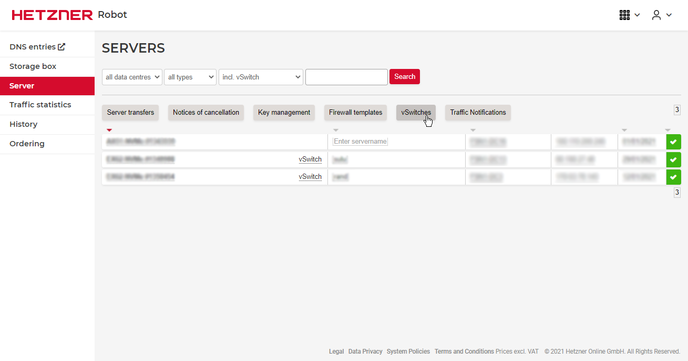
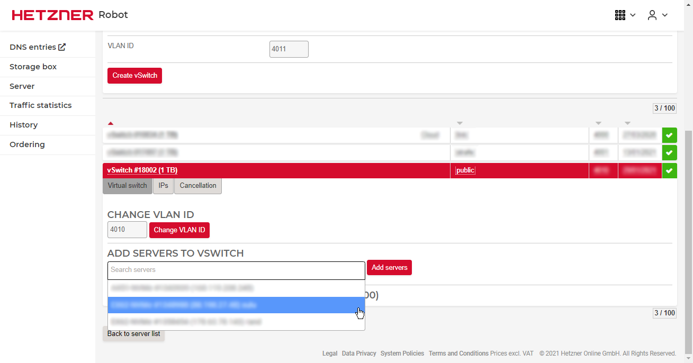
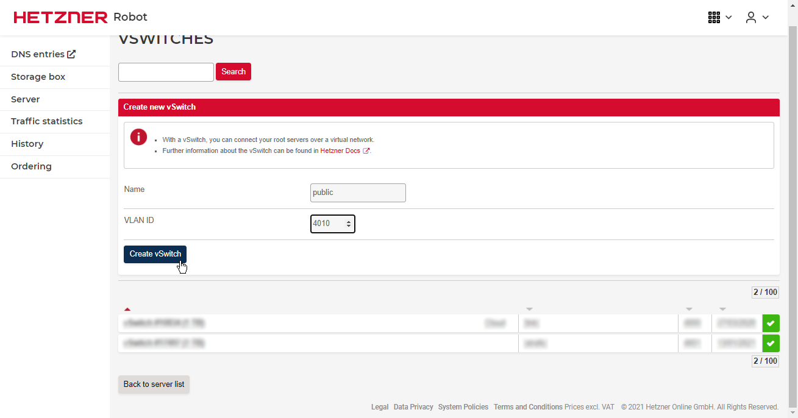
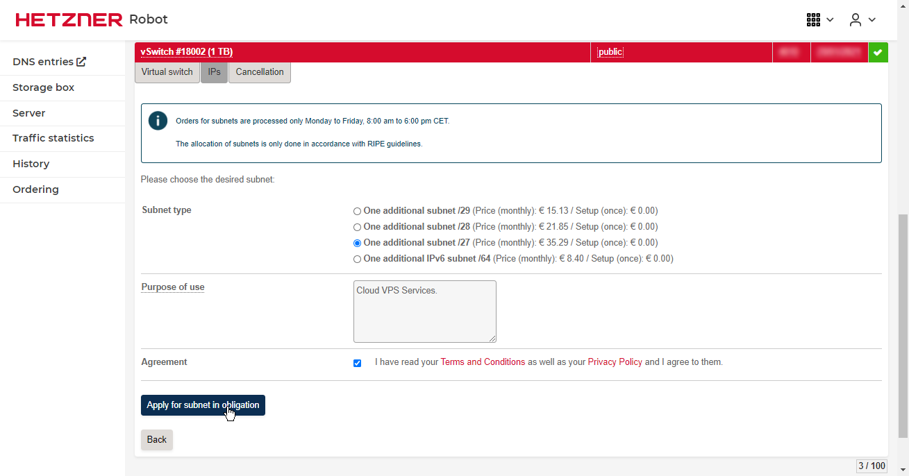
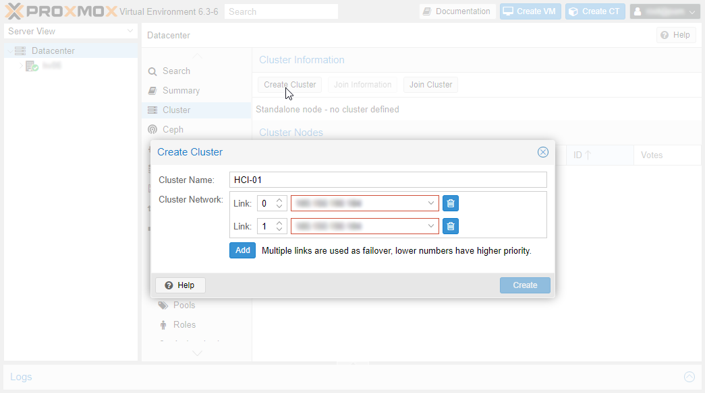
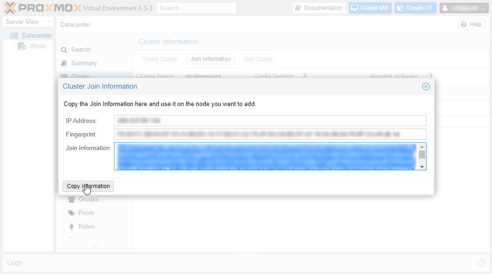
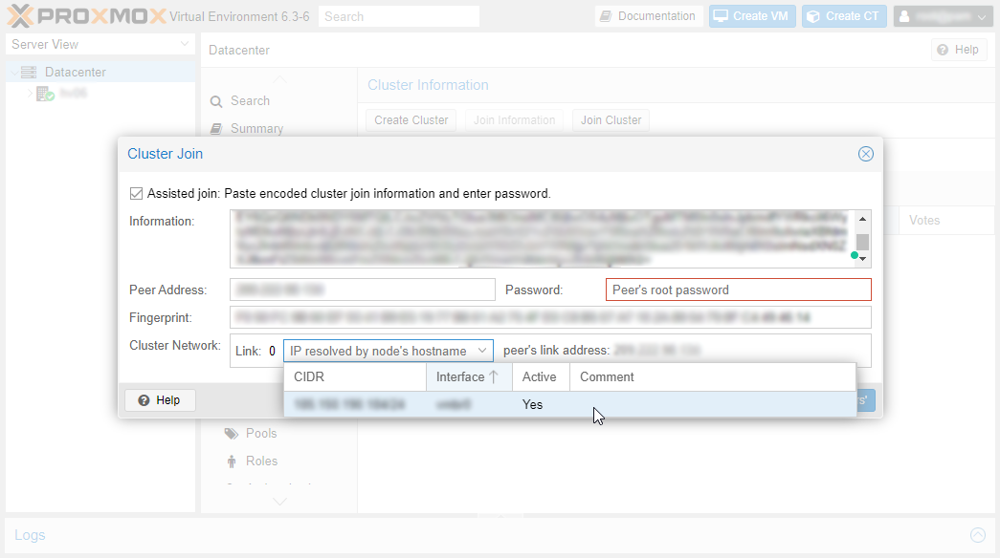
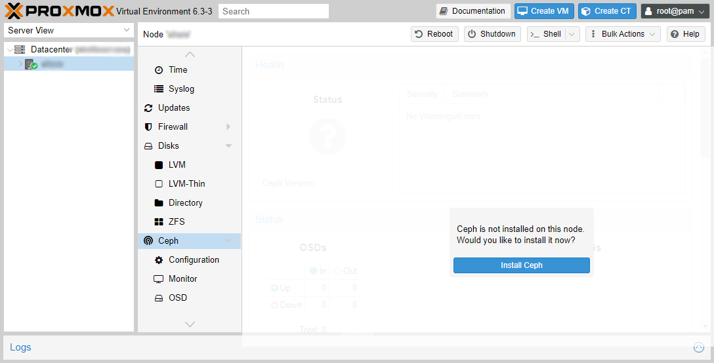
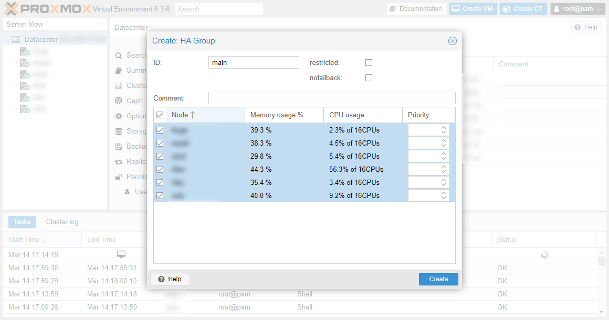
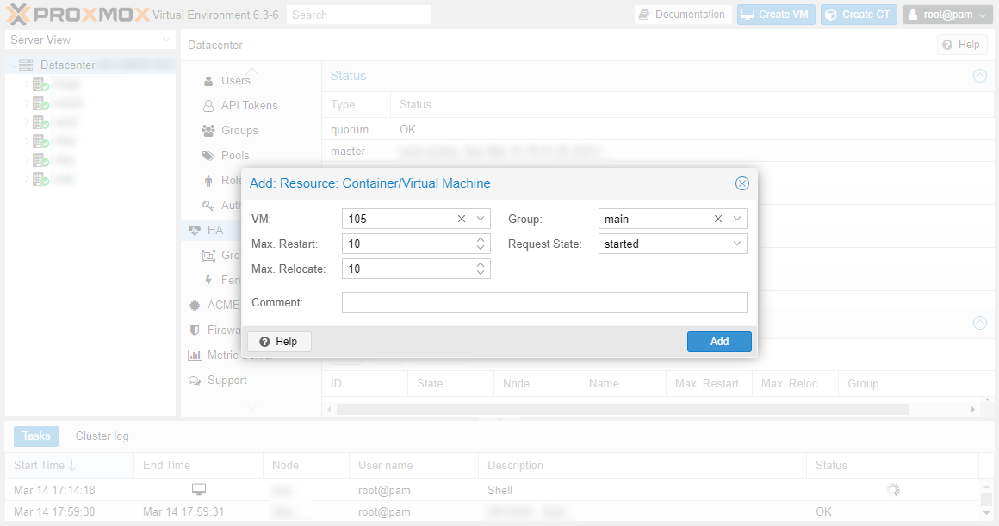

## Introduction

The concept of having hyperconverged infrastructure is that both your storage and compute resources reside on the same servers. Instead of having dedicated storage boxes, and then dedicated compute boxes, everything is stacked together on each server. Primarily, this greatly reduces cost, as you may only need half the number of servers, but it also increases performance, especially where you don't have high performance RDMA 100G network switches, as your virtual machines and other appliances can often look locally for storage instead of over the network.

In this tutorial, we will be setting up the three-node cluster, each with high performance NVMe storage drives, and Intel i9 9900k CPUs to ensure virtual machines are snappy and your applications are running as fast as they can. We will be comparing this to a well known competitor. We will see how much money we can save for a comparable setup, and what the advantages are of your own servers.

## Step 1 - Ordering the hardware

For your three servers to communicate properly, there will be additional network hardware we will have to order from Hetzner with our servers. This includes 10 Gigabit network cards for storage, and the onboard NIC for Proxmox's administrative communication. Below is the configuration I will use for one node in the cluster:

| Name                          | Quantity | Cost (EUR) | Subtotal (EUR) |
| ----------------------------- | -------- | ---------- | -------------- |
| Base 9900k 128GB Server       | 1        | 69         | 69             |
| Dual 10G NIC (Intel X520-DA2) | 1        | 12         | 12             |
| 240G Sata SSD                 | 2        | 4          | 8              |
| Lan Connection 10G            | 1        | 2.50       | 2.50           |
| Lan Connection 1G             | 1        | 1          | 1              |
| 10G Uplink                    | 1        | 39         | 39             |
|                               |          | Total:     | €131.50        |

This is the cost for one node in the cluster. At a minimum, we will need three of these, bring the total for the servers to €394.50. This may seem like a lot, especially when other beefier servers can be had for less, but compared to other highly available services, this very affordable.

In addition to these servers, some network switches will be needed. For an optimal setup, the following is recommended:

| Name               | Quantity | Cost (EUR) | Subtotal (EUR) |
| ------------------ | -------- | ---------- | -------------- |
| 12 port 10G switch | 1        | 43         | 43             |
| 8 port 1G switch   | 1        | 2          | 2              |
|                    |          | Total:     | €45            |

For allowing servers to start with the same IP on any server, we will also need to purchase vSwitch IPs. These IPs can be used by any server at any time thats connected to the switch, as opposed to having IPs only usable on one server. This means your virtual machine can run on any node from the outside it would look the same. For 29 IPs, this will cost €35.29, which is probably the amount you'll need for a setup of this size. You can buy less if you know you are going to be using fewer, larger VMs instead of many smaller ones. Alternatively, if this is a private cloud, and you are using a meshed VPN like ZeroTier or Tinc, you won't need these external IPs.

In addition to this, unless you are ordering the maximum number of servers the network switches you have bought will accommodate, you will want to purchase reserved rackspace slots. This will allow you to add servers to your cluster later if you do not have the money or do not require the servers now. They are €8.32 per slot per month, and you can request these in your custom order message.

Ordering this custom setup is a bit more difficult that normal server ordering. First, when picking the EX-62 server, or comparable server that you are using for this setup, you must order the two extra 240gb SATA SSDs. Then, in the additional instructions, write that you would like all of the servers in the same rack, with space for two network switches. This means the setup will be done manually, but they have to setup the hardware anyway.

Then, to order the network hardware and switches, you will need to email Hetzner support. Write that you would like to order a 8 port 1 Gigabit switch and a 12 port 10 Gigabit switch with your recently purchased dedicated servers. You will also need to specify that you would like an Intel X520-DA2 with each server installed as well. Please write that you would like a port from the 10G NIC connected to the 10G switch, and the onboard NIC connected to the 1G switch. This means that we will have one private gigabit network for Proxmox communication, and a 20 gigabit connection for storage communication.

## Step 2 - Installing Proxmox

The preferred way of installing Proxmox is by using the installation ISO. You can follow the tutorial [here](https://community.hetzner.com/tutorials/proxmox-docker-zfs) to install Proxmox without using a KVM switch. If you follow this guide, please install Proxmox onto the additional SSDs, and not the NVMe drives. You won't need to install docker either. If you are using the EX-62 servers without the 10G uplink, please note that the main NIC is called eno1 and doesn't use the predictable naming system for some reason with Proxmox.

## Step 3 - Configuring the Network

For everything to work smoothly, there are multiple network adapters we have to setup now. Please make sure that all the additional NICs have been ordered prior to starting this step.

### Step 3.1 - Creating vSwitch

To use shared IPs, we will need to setup a vSwitch. Fortunately, this is easily setup in the Robot panel. First, navigate to the vSwitch panel:



Then, create a vSwitch for your servers:



Next, we need to add our servers to the vSwitch:



Finally, we can order some external IP addresses for the vSwitch:



### Step 3.2 - Configuring Storage Network

The first network we will configure is the 10 Gigabit connection for storage communications. This will give us a high speed connection for Ceph to replicate data between the nodes. It's essential that this connection is at least 10 Gigabit, otherwise performance will suffer greatly. Having a separate network from other traffic also helps latency.

```bash
auto enp1s0f1
iface enp1s0f1 inet static
      address  10.254.253.10
      netmask  255.255.255.0
```

### Step 3.3 - Configuring Corosync Network

Corosync is the Proxmox service that keeps things running in a cluster. Having services restart after failure in a timely manner is dependent on the latency between Corosync instances, so a private network dedicated to this traffic is ideal.

```bash
auto eno1
iface eno1 inet static
      address 10.254.254.10
      netmask 255.255.255.0
```

### Step 3.4 - Configuring vSwitch Network

To utilise the vSwitch IPs, we will need to create a network for the VLAN. Below is an example configuration:

```bash
iface enp1s0f0.4010 inet manual

auto vmbr1
iface vmbr1 inet manual
        bridge-ports enp1s0f0.4010
        bridge-stp off
        bridge-fd 0
```

Replace 4010 with the ID you chose when creating the vSwitch.

### Step 3.5 - Example completed configuration

```bash
auto lo inet loopback

auto enp1s0f0

auto vmbr0
iface vmbr0 inet static
	address 1.1.1.20/24
	gateway 1.1.1.1
	pointopoint 1.1.1.1
	bridge_ports enp1s0f0
	bridge_stp off
	bridge_fd 0
	
iface eno1.4010 inet manual
	
auto eno1
iface eno1 inet static
      address 10.254.254.10
      netmask 255.255.255.0
	
auto enp1s0f1
iface enp1s0f1 inet static
      address  10.254.253.10
      netmask  255.255.255.0


auto vmbr1
iface vmbr1 inet manual
        bridge-ports eno1.4010
        bridge-stp off
        bridge-fd 0

auto vmbr2
iface vmbr2 inet static
    address 192.168.1.1/24
    bridge-ports none
    bridge-stp off
    bridge-fd 0

    post-up echo "1" > /proc/sys/net/ipv4/ip_forward
    post-up iptables -t nat -A POSTROUTING -s '192.168.1.0/24' -o eno1 -j MASQUERADE
    post-down iptables -t nat -D POSTROUTING -s '192.168.1.0/24' -o eno1 -j MASQUERADE
```

In this configuration, I have an extra bridge for VMs that aren't highly available. They can use `vmbr2` to use NAT and an internal IP to access the internet.

## Step 4 - Creating Proxmox Cluster

Now, we have to connect all the servers together into a cluster.  Navigate to the Datacenter tab in the left pane on any server, and then the Cluster tab. Press on Create Cluster to show the creation interface. For link 0, you will need to select the private network we created, which will be the IP 10.254.254.10 if you are looking at the configuration we made earlier. For link 1, you can select the server's external IP address.



Next, press on Join Information. This will show you some text with all the cluster information encoded into it. Press Copy Information to copy this data, and then log onto one of the other servers you want to join to the cluster.



After copying the information into another server, you'll have to put the first server's password in, and match the internet links up. Make sure link 0 is always the internal network we made, and link 1 is the external network.



Repeat this for all the servers you have to add to the cluster. Once all the servers are in the cluster, you can continue with setting up the software.

## Step 5 - Setting up Ceph storage

### Step 5.1 - Installing Ceph

Installing Ceph on Proxmox is simple thanks to the extensive GUI Proxmox provides. You can access the GUI online by visiting https://server-ip:8006. Sign in with the root user, navigate to the server in the left hand pane, scroll down to Ceph, and you will be able to install it. When asked, select enps0f1 as the public and private network.



### Step 5.2 - Creating Ceph Monitors, Masters and OSDs

Now that Ceph is installed, we need to setup the Ceph services on each node. Firstly, we will need to install Monitors and Managers for the cluster. Navigating to to the same Ceph tab, you will see the Monitor submenu below it. Here you can create these services easily. I recommend 2-3 of each on different nodes for good reliability.

In the OSD submenu, you can add your drives to Ceph. In the menu, press Create: OSD at the top left. Check advanced options, pick the NVMe storage class, and make sure that the DB/WAL is selected as the drive itself and not elsewhere. OSD encryption is optional and up to you.

### Step 5.3 - Adding Ceph to available Proxmox storages

Now that all the drives are added to Ceph, we can create a pool. In the Pools submenu, press create. The defaults are already set and are suitable for this setup. Just name the pool - I named mine KVM-NVMe since this is for fully virtualised guests - and changed PG Autoscale to On. After pressing create, the pool will be made and automatically added to available VM storage.

## Step 6 - Configuring High Availability

### Step 6.1 - Creating a HA group

Now we can create a group that will enable high availability for our virtual machines. Navigate to the Datacentre tab at the top of the left hand pane, then  go to the Groups submenu under HA. Create a new group and select all of your servers. Name this group anything you want.



### Step 6.2 - Creating a HA enabled virtual machine

Now that we have have a HA group, we can enable HA for a virtual machine. In the HA tab under Datacentre, we can add an existing VM to a HA group. This will enable HA for that VM instantly.



## Comparison to similar solutions

### Benchmarking DO

Lets compare some of the offerings to this home-made setup. For these tests, I chose a 32Gb 8 core general purpose droplet. It also comes with 100GB of SSD storage. This will set you back $240 a month.

My first test is a 7zip CPU benchmark. On these servers, they appear to use Xeon Gold 6150 CPUs. My results are as follows:

```bash
root@debian-g-8vcpu-32gb-fra1-01:~# 7z b

7-Zip [64] 16.02 : Copyright (c) 1999-2016 Igor Pavlov : 2016-05-21
p7zip Version 16.02 (locale=en_US.UTF-8,Utf16=on,HugeFiles=on,64 bits,8 CPUs Intel(R) Xeon(R) Gold 6140 CPU @ 2.30GHz (50654),ASM,AES-NI)

Intel(R) Xeon(R) Gold 6140 CPU @ 2.30GHz (50654)
CPU Freq:  3372  3375  3384  3377  3381  3355  3373  3382  3380

RAM size:   32172 MB,  # CPU hardware threads:   8
RAM usage:   1765 MB,  # Benchmark threads:      8

                       Compressing  |                  Decompressing
Dict     Speed Usage    R/U Rating  |      Speed Usage    R/U Rating
         KiB/s     %   MIPS   MIPS  |      KiB/s     %   MIPS   MIPS

22:      23458   695   3284  22821  |     226726   798   2424  19339
23:      22864   713   3266  23296  |     219667   786   2418  19009
24:      19390   606   3441  20849  |     222143   799   2440  19497
25:      22457   727   3525  25641  |     219881   799   2450  19569
----------------------------------  | ------------------------------
Avr:             685   3379  23152  |              795   2433  19353
Tot:             740   2906  21253
```

As you can see, we score 23000 in compression and 19000 in decompression. A respectable score for a CPU with a base clock of only 2.30Ghz. In our next test, we will benchmark the disk.

Using Fio, I gathered the following results:

```
Sequential READ speed with big blocks:
	READ: bw=1347MiB/s (1412MB/s), 1347MiB/s-1347MiB/s (1412MB/s-1412MB/s), io=10.0GiB (10.7GB), run=7604-7604msec
	
Sequential WRITE speed with big blocks:
	READ: bw=802MiB/s (841MB/s), 802MiB/s-802MiB/s (841MB/s-841MB/s), io=10.0GiB (10.7GB), run=12406-12406msec
	
Random 4K read QD1:
	READ: bw=19.1MiB/s (20.0MB/s), 19.1MiB/s-19.1MiB/s (20.0MB/s-20.0MB/s), io=1145MiB (1201MB), run=60001-60001msec

Mixed random 4K read and write QD1 with sync:
	READ: bw=7798KiB/s (7985kB/s), 7798KiB/s-7798KiB/s (7985kB/s-7985kB/s), io=457MiB (479MB), run=60001-60001msec
  	WRITE: bw=7762KiB/s (7948kB/s), 7762KiB/s-7762KiB/s (7948kB/s-7948kB/s), io=455MiB (477MB), run=60001-60001msec

```

For an SSD based droplet, these scores are impressive. The random speeds are also acceptable, but not quite in the realm of NVMe storage.

Next, we will test the internet connection.

```
To Hetzner speedtest servers:
	/dev/null                     100%[=================================================>]  10.00G   547MB/s    in 19s
	
To DO speedtest servers:
	/dev/null                     100%[=================================================>]   4.88G   185MB/s    in 27s
	
Speedtest-cli
	Hosted by Gemnet LLC (Frankfurt) [0.89 km]: 1.166 ms
    Testing download speed.......................................................................
    Download: 2956.12 Mbit/s
    Testing upload speed.........................................................................
    Upload: 2240.96 Mbit/s
```

Also an impressive result, almost 6gbps testing to the Hetzner server, but weirdly way less to their own testing server located in Germany.

### Benchmarking our Proxmox setup

Time to compare this to our own setup. For this, I created a VM with the same specs, 100gb disk, Debian 10, 32gb Ram, and 8 cores. The 7zip benchmark results are as follows:

```bash
root@debian:~# 7z b

7-Zip [64] 16.02 : Copyright (c) 1999-2016 Igor Pavlov : 2016-05-21
p7zip Version 16.02 (locale=en_US.UTF-8,Utf16=on,HugeFiles=on,64 bits,16 CPUs Intel(R) Core(TM) i9-9900K CPU @ 3.60GHz (906ED),ASM,AES-NI)

Intel(R) Core(TM) i9-9900K CPU @ 3.60GHz (906ED)
CPU Freq:  3825  3852  3797  3838  3852  3832  3925  4073  3961

RAM size:  32745 MB,  # CPU hardware threads:  8
RAM usage:   389 MB,  # Benchmark threads:     8

                       Compressing  |                  Decompressing
Dict     Speed Usage    R/U Rating  |      Speed Usage    R/U Rating
         KiB/s     %   MIPS   MIPS  |      KiB/s     %   MIPS   MIPS

22:      24223   937   2514  23565  |     361366  1049   2938  30821
23:      20888   876   2429  21283  |     347620  1034   2908  30077
24:      21646   968   2404  23274  |     347307  1053   2894  30485
25:      18241   878   2372  20827  |     320229  1002   2845  28499
----------------------------------  | ------------------------------
Avr:             915   2430  22237  |             1035   2896  29970
Tot:             975   2663  26104
```

Definitely an increase over the droplet, but not by a huge margin. Next is the disk:

```
Sequential READ speed with big blocks:
	READ: bw=1273MiB/s (1335MB/s), 1273MiB/s-1273MiB/s (1335MB/s-1335MB/s), io=10.0GiB (10.7GB), run=8041-8041msec
	
Sequential WRITE speed with big blocks:
	WRITE: bw=716MiB/s (751MB/s), 716MiB/s-716MiB/s (751MB/s-751MB/s), io=10.0GiB (10.7GB), run=14305-14305msec
	
Random 4K read QD1:
	READ: bw=8555KiB/s (8760kB/s), 8555KiB/s-8555KiB/s (8760kB/s-8760kB/s), io=501MiB (526MB), run=60001-60001msec

Mixed random 4K read and write QD1 with sync:
	READ: bw=7576KiB/s (7758kB/s), 7576KiB/s-7576KiB/s (7758kB/s-7758kB/s), io=444MiB (466MB), run=60004-60004msec
    WRITE: bw=7533KiB/s (7714kB/s), 7533KiB/s-7533KiB/s (7714kB/s-7714kB/s), io=441MiB (463MB), run=60004-60004msec
```

Slightly slower, and lacking in the random and sync writes department. Still a respectable performance against the droplet. I would expect more performance if we had used datacentre edition NVMe drives in our cluster, but that would add a lot to the per server cost. The network performance is below:

```
To Hetzner speedtest servers:
	/dev/null                     100%[=================================================>]  10.00G   864MB/s    in 12s
	
To DO speedtest servers:
	/dev/null                     100%[=================================================>]   4.88G   230MB/s    in 23s
	
Speedtest-cli
	Hosted by fdcservers.net (Frankfurt) [143.90 km]: 8.653 ms
    Testing download speed........................................................................
    Download: 1244.17 Mbit/s
    Testing upload speed..........................................................................
    Upload: 1530.79 Mbit/s
```

A better network performance for Hetzner here, with the exception of speedtest.net. Not sure why this is, but we can see from even DO's own server that this is faster. However, this would be shared between any running VMs on a host.

## Conclusion

As we can see, our homebrew cluster is more than capable of trading blows with a similar droplet from a competitor. A better test may have been against the 32Gb 4Core droplets, since we can comfortably deploy four of those on a host without overcommitting on CPU or memory. Accounting for 1 hosts' worth of redundancy in our cluster, we could deploy eight 4Core 32GB ram virtual machines, each with about 200GiB of storage. Eight memory droplets with the same configuration would total to $1280 a month. However, with our system, we can get the same for only €400 if you are willing to put the time into making this setup work.

##### License: MIT

<!--

Contributor's Certificate of Origin

By making a contribution to this project, I certify that:

(a) The contribution was created in whole or in part by me and I have
    the right to submit it under the license indicated in the file; or

(b) The contribution is based upon previous work that, to the best of my
    knowledge, is covered under an appropriate license and I have the
    right under that license to submit that work with modifications,
    whether created in whole or in part by me, under the same license
    (unless I am permitted to submit under a different license), as
    indicated in the file; or

(c) The contribution was provided directly to me by some other person
    who certified (a), (b) or (c) and I have not modified it.

(d) I understand and agree that this project and the contribution are
    public and that a record of the contribution (including all personal
    information I submit with it, including my sign-off) is maintained
    indefinitely and may be redistributed consistent with this project
    or the license(s) involved.

Signed-off-by: Kenzi Marcel - kenzi@kenzim.co.uk

-->
