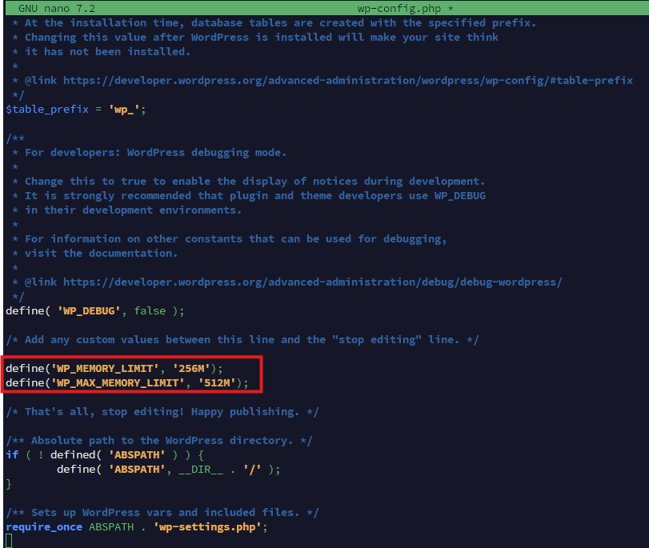
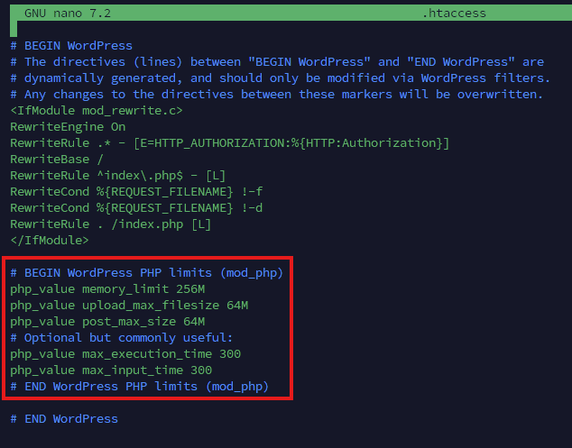
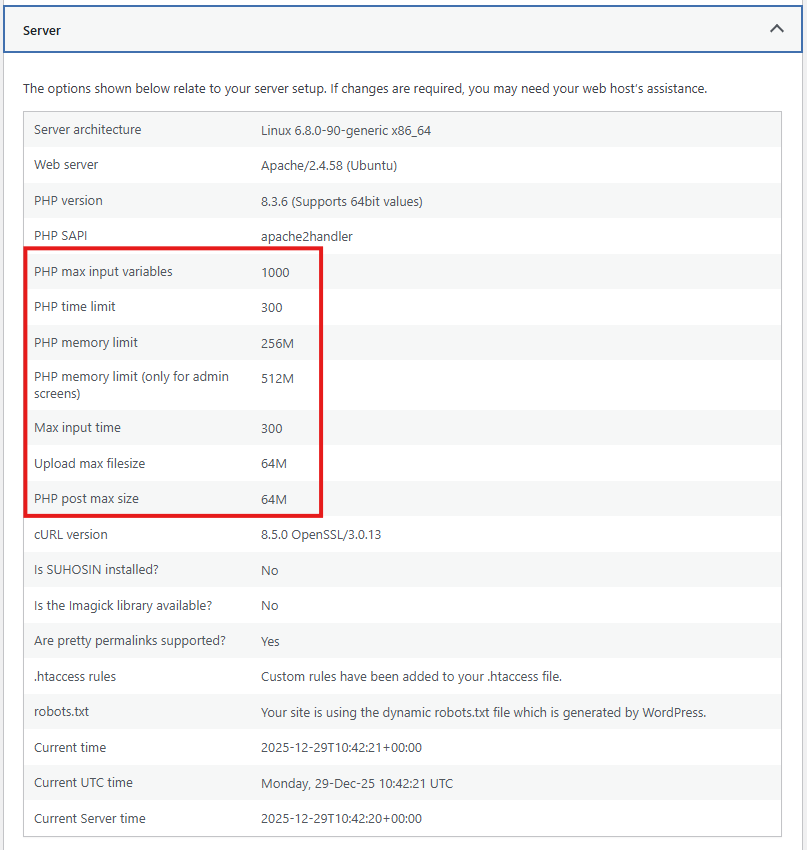

## Introduction

If your WordPress site fails during plugin installs, media uploads, imports, or bulk updates, you are often hitting resource ceilings rather than a WordPress bug.

This tutorial shows how to increase the most common limits on an Ubuntu server running Apache:

- WordPress memory constants (`WP_MEMORY_LIMIT`, `WP_MAX_MEMORY_LIMIT`)
- PHP `memory_limit`
- PHP `upload_max_filesize`
- PHP `post_max_size`

For background on how WordPress relates to these PHP directives, see the WordPress Developer Handbook page "[PHP Optimization](https://developer.wordpress.org/advanced-administration/performance/php/)".

## Prerequisites

- A server running Ubuntu with SSH access (for example, a Hetzner cloud server)
- A working WordPress installation
- Admin access to the server (root or a sudo-capable user)
- A text editor available on the server (`nano` or `vim`)

## Example terminology

This tutorial uses placeholders like:

- Username: `holu`
- IP address: `YOUR_SERVER_IP`
- Domain: `YOUR_DOMAIN`
- WordPress root: `/var/www/html`

Replace them with your own values.

## Step 1 - Connect via SSH and locate your WordPress root

SSH to the server:

```bash
ssh holu@YOUR_SERVER_IP
```

A common WordPress root on Apache installs is:

```bash
cd /var/www/html
ls -la
```

You should see `wp-config.php` and directories such as `wp-content/`, `wp-admin/`, and `wp-includes/`.

If you do not see `wp-config.php`, search for it:

```bash
sudo find /var/www -type f -name wp-config.php 2>/dev/null
```

Then `cd` into the directory that contains it.

```shell
holu@example:~$ cd /var/www/html
holu@example:/var/www/html$ ls -la
total 248
drwxr-xr-x  5 www-data www-data   4096 Dec 29 10:01 .
drwxr-xr-x  3 www-data www-data   4096 Dec 28 16:25 ..
-rw-r--r--  1 www-data www-data    704 Dec 29 10:00 .htaccess
-rw-r--r--  1 www-data www-data    405 Feb 6   2020 index.php
-rw-r--r--  1 www-data www-data  19903 Dec 28 16:38 license.txt
-rw-r--r--  1 www-data www-data   7425 Dec 28 16:38 readme.html
drwxr-xr-x  9 www-data www-data   4096 Nov 21  2024 wp-admin
-rw-r--r--  1 www-data www-data    351 Feb 6   2020 wp-blog-header.php
-rw-r--r--  1 www-data www-data   3323 Jun 14  2023 wp-comments-post.php
-rw-r--r--  1 www-data www-data   3652 Dec 29 09:58 wp-config.php
-rw-r--r--  1 www-data www-data   3339 Dec 28 16:38 wp-config-sample.php
drwxr-xr-x  7 www-data www-data   4096 Dec 28 16:38 wp-content
drwxr-xr-x 31 www-data www-data  12288 Dec 28 16:38 wp-includes
-rw-r--r--  1 www-data www-data   2493 Dec 28 16:38 wp-links-opml.php
-rw-r--r--  1 www-data www-data   3937 Mar 11  2024 wp-load.php
-rw-r--r--  1 www-data www-data  51437 Dec 28 16:38 wp-login.php
-rw-r--r--  1 www-data www-data   8727 Dec 28 16:38 wp-mail.php
-rw-r--r--  1 www-data www-data  31055 Dec 28 16:38 wp-settings.php
-rw-r--r--  1 www-data www-data  34516 Dec 28 16:38 wp-signup.php
-rw-r--r--  1 www-data www-data   5214 Dec 28 16:38 wp-trackback.php
-rw-r--r--  1 www-data www-data   3205 Dec 28 16:38 xmlrpc.php
holu@example:/var/www/html$
```

## Step 2 - Back up configuration files

From the WordPress root directory, back up `wp-config.php`:

```bash
sudo cp -a wp-config.php wp-config.php.bak.$(date +%F)
```

Back up `.htaccess` if it exists:

```bash
test -f .htaccess && sudo cp -a .htaccess .htaccess.bak.$(date +%F)
```

## Step 3 - Increase WordPress memory limits in wp-config.php

WordPress has its own memory configuration constants that you can set in `wp-config.php`. The WordPress Developer Handbook documents these constants and explains how they interact with PHP's `memory_limit`.

Edit `wp-config.php`:

```bash
sudo nano wp-config.php
# or: sudo vim wp-config.php
```

Add the following lines above the line that says "That's all, stop editing":

```php
define('WP_MEMORY_LIMIT', '256M');
define('WP_MAX_MEMORY_LIMIT', '512M');
```

Save and exit.

Notes:

- `WP_MEMORY_LIMIT` applies to frontend rendering.
- `WP_MAX_MEMORY_LIMIT` applies to admin and logged-in contexts, and is commonly relevant for media operations.
- WordPress cannot exceed the PHP memory limit if PHP is capped lower than these values.



## Step 4 - Check how PHP is connected to Apache

Whether you can set PHP directives in `.htaccess` depends on how PHP runs behind Apache.

Run:

```bash
apache2ctl -M | grep -E 'php|proxy_fcgi|mpm'
```

Interpretation:

- If you see `php_module`, Apache is using mod_php and `.htaccess` directives like `php_value` typically work.
- If you see `proxy_fcgi_module`, the site is often using PHP-FPM, and `php_value` in `.htaccess` may cause a 500 error.


## Step 5 - Increase PHP limits (recommended approach for mod_php)

The WordPress Cloud App image from Hetzner installs Apache2 and WordPress along with PHP extensions.

### Option A - Use .htaccess (recommended when apache2ctl shows php_module)

If Step 4 shows `php_module`, add PHP limits to the WordPress `.htaccess` file.

Edit `.htaccess` in the WordPress root:

```bash
sudo nano .htaccess
# or: sudo vim .htaccess
```

Add this block near the top (or near the existing WordPress section):

```apacheconf
# BEGIN WordPress PHP limits (mod_php)
php_value memory_limit 256M
php_value upload_max_filesize 64M
php_value post_max_size 64M
php_value max_execution_time 300
php_value max_input_time 300
# END WordPress PHP limits (mod_php)
```

The WordPress Developer Handbook notes that upload sizes are controlled by PHP `upload_max_filesize` and `post_max_size`, and that `post_max_size` must be greater than or equal to `upload_max_filesize`.



### Option B - If .htaccess is not supported (PHP-FPM), use .user.ini

If adding `php_value` triggers a 500 error, you are likely not running mod_php. In that case, use `.user.ini` instead.

Create or edit `.user.ini` in your WordPress root:

```bash
sudo nano .user.ini
```

Add:

```ini
memory_limit=256M
upload_max_filesize=64M
post_max_size=64M
max_execution_time=300
max_input_time=300
```

Save and exit.

## Step 6 - Restart services and verify the new limits

Restart Apache:

```bash
sudo systemctl restart apache2
```

If you are using PHP-FPM, restart it too (replace `VERSION`):

```bash
sudo systemctl restart phpVERSION-fpm
```

Examples:

```bash
sudo systemctl restart php8.2-fpm
sudo systemctl restart php8.3-fpm
```

### Verify in WordPress Site Health

1. In WordPress admin at `YOUR_DOMAIN/wp-admin`, go to **Tools** -> **Site Health**
2. Open the **Info** tab
3. Check values such as memory limits and maximum upload size

```http
https://YOUR_DOMAIN/wp-admin/site-health.php
```



### Verify with phpinfo (temporary)

Create a temporary file:

```bash
echo "<?php phpinfo();" | sudo tee /var/www/html/phpinfo.php >/dev/null
```

Open `http://YOUR_DOMAIN/phpinfo.php` and verify:

- `memory_limit`
- `upload_max_filesize`
- `post_max_size`

Then remove the file immediately:

```bash
sudo rm -f /var/www/html/phpinfo.php
```


## Step 7 - Troubleshooting and rollback

### 500 Internal Server Error after editing .htaccess

Likely causes:

- The server uses PHP-FPM (FastCGI), so `php_value` directives are not allowed in `.htaccess`.
- A directive was mistyped.
- `.htaccess` overrides are disabled.

Fix:

1. Restore your `.htaccess` backup (if you made one in Step 2):

   ```bash
   sudo cp -a .htaccess.bak.$(date +%F) .htaccess
   ```

   If you do not have a backup, remove only the block you added.

2. Restart Apache:

   ```bash
   sudo systemctl restart apache2
   ```

3. Use Step 5 Option B (`.user.ini`) or set the values in `php.ini` / PHP-FPM pool configuration.

### Upload size does not increase

Double-check these points:

- `post_max_size` is greater than or equal to `upload_max_filesize`.
- A reverse proxy, WAF, or CDN is not enforcing its own request size limits.
- WordPress is not constrained by an application-level restriction in a plugin.

## Conclusion

You have now:

- Increased WordPress memory limits via `wp-config.php`
- Increased PHP memory and upload limits using the approach that matches your PHP runtime
- Verified the result and captured rollback steps

##### License: MIT

<!--

Contributor's Certificate of Origin

By making a contribution to this project, I certify that:

(a) The contribution was created in whole or in part by me and I have
    the right to submit it under the license indicated in the file; or

(b) The contribution is based upon previous work that, to the best of my
    knowledge, is covered under an appropriate license and I have the
    right to submit it with modifications, whether created in whole or in
    part by me, under the same license (unless I am permitted to submit
    under a different license), as indicated in the file; or

(c) The contribution was provided directly to me by some other person
    who certified (a), (b) or (c) and I have not modified it.

(d) I understand and agree that this project and the contribution are
    public and that a record of the contribution (including all personal
    information I submit with it, including my sign-off) is maintained
    indefinitely and may be redistributed consistent with this project
    or the license(s) involved.

Signed-off-by: DeclanE47 <code@emery.tools>

-->
