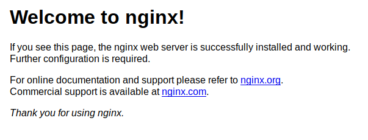
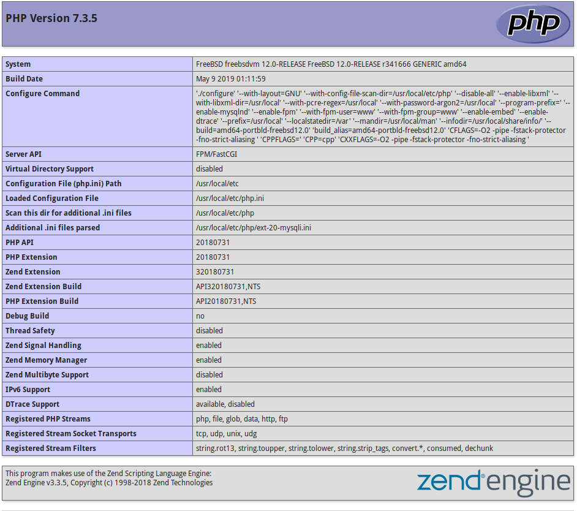

## Introduction

A FEMP Stack (FreeBSD, Nginx, MySQL, PHP) is a combination of FOSS software that can be used together in order to host dynamic websites and Content Management Systems such as Wordpress or Joomla.

This guide will help with the installation and configuration of a FEMP stack on FreeBSD 12.

* It is assumed that you are running as the `root` user during this guide. Use `su` to change to `root` if you are not running as `root` already.

**Prerequisites**

* A FreeBSD 12 server with root access.

## Step 1 - Updating FreeBSD

*By default, FreeBSD does not come with the `pkg` package manager, but comes with a tool to bootstrap it. If FreeBSD asks to install it, answer 'Yes'.*

It is best to update the system beforehand to ensure you are getting the latest packages when installing the FEMP stack. You can do this by running the following command:

```
pkg update ; pkg upgrade
```

This will update the repositories of `pkg`, and then upgrade any installed packages that you may have.

## Step 2 - Installing Nginx

To install Nginx, the web server we are using for this tutorial, use the following command:

```
pkg install nginx
```

Before we can start nginx to test that it is working, we need to enable it to start on boot.

You can do this by appending `nginx_enable="YES"` to the end of `/etc/rc.conf`.

```
echo 'nginx_enable="YES"' >> /etc/rc.conf
service nginx start
```

Test that it is working by going to your IP address in a web browser. You can check your server's IP address by running `fetch -qo- http://ifconfig.co`, or by checking your control panel.

```
http://10.0.0.1/
```

You should see something like this:



## Step 3 - Installing PHP

Next, we need to install and configure PHP, which we'll be using to process PHP requests from nginx.

```
pkg install php74 php74-mysqli
```

Like before, we need to enable it to start on boot before we can start the service.

```
echo 'php_fpm_enable="YES"' >> /etc/rc.conf
```

However, before we can start it, we need to make a few changes to the configuration file `/usr/local/etc/php-fpm.d/www.conf`

```
cd /usr/local/etc/
vi php-fpm/www.conf
```

Look for the line:

```
listen = 127.0.0.1:9000
```

Replace it with the following, so that PHP listens under an unix socket:

```
listen = /var/run/php-fpm.sock
```

Later in the file, look for these lines:

```
;listen.owner = www
;listen.group = www
;listen.mode = 0660
```

Uncomment them so it looks like this, to change the unix socket owner to be the same as the nginx user:

```
listen.owner = www
listen.group = www
listen.mode = 0660
```

After you have completed that, save and close the file.

A `php.ini` file needs to be created. The example file `php.ini-production` can be used with a slight modification for security:

* Assuming you are still in `/usr/local/etc/`

```
cp php.ini-production php.ini
sed -i -E 's/;cgi.fix_pathinfo=1/cgi.fix_pathinfo=0/g' php.ini
```

Then finally, start the PHP service.

```
service php-fpm start
```

### Step 3.1 - Configuring Nginx to use PHP

Nginx and PHP are both enabled now, however we need to configure Nginx to be aware of PHP, and to use it to process `.php` pages.

Open the file `/usr/local/etc/nginx/nginx.conf` in a text editor:

```
vi /usr/local/etc/nginx/nginx.conf
```

Find the following in the file (commented out parts are removed):

```
server {
        listen       80;
        server_name  localhost;

        location / {
            root   /usr/local/www/nginx;
            index  index.html index.htm;
        }

        error_page   500 502 503 504  /50x.html;
        location = /50x.html {
            root   /usr/local/www/nginx-dist;
        }

    }
```

The following changes need to be made to the `nginx.conf` file:

* Replace `localhost` under `server_name` with your server's domain or IP address.
* Remove the `location /` block.
* Add `index.php` under `index`.
* Edit nginx root directory to `/var/www/html/`.
* Configure nginx for PHP processing.

Your `nginx.conf` file should look something like this:

```
server {
        listen       80;
        server_name  example.com;

        root   /var/www/html;
        index  index.php index.html index.htm;

        error_page   500 502 503 504  /50x.html;
        location = /50x.html {
            root   /usr/local/www/nginx-dist;
        }

        location ~ [^/]\.php(/|$) {
        fastcgi_split_path_info ^(.+?\.php)(/.*)$;
        try_files $uri $document_root$fastcgi_script_name =404;
        fastcgi_pass unix:/var/run/php-fpm.sock;
        fastcgi_index index.php;
        fastcgi_param SCRIPT_FILENAME $document_root$fastcgi_script_name;
        include fastcgi_params;
        }

    }
```

* If using IPv6 on your server, add the following line under `listen       80;`

```
listen       [::]:80;
```

Then finally, create the nginx root directory, symlink the default nginx `index.html` page, and restart nginx.

```
mkdir -p /var/www/html/
ln -s /usr/local/www/nginx-dist/index.html /var/www/html/
service nginx restart
```

*If nginx fails to restart, run `nginx -t` to check any configuration errors in your config file and resolve them, then try restarting nginx again.*

Going to your server's domain or IP address should still return the `Welcome to nginx!` page from before.

To test that PHP is working, create a file under `/var/www/html/phpinfo.php` with the following content:

```
<?php phpinfo(); ?>
```

Then, visit the test page you created at your server's IP address/domain.

```
http://example.com/phpinfo.php
```

It should return a page like this:



It is best to delete the file afterwards for security, as it can expose information about your PHP install to anyone.

```
rm /var/www/html/phpinfo.php
```

## Step 4 - Installing MySQL (MariaDB)

Now that we have Nginx and PHP setup and working together, the only thing left that we need to install and configure is MySQL.

However, we'll be using a community maintained drop-in replacement to MySQL, MariaDB; which is fully compatible with applications targeting MySQL.

```
pkg install mariadb104-server mariadb104-client
```

Like earlier, we need to enable the service to start on boot before we can start it using service.

```
echo 'mysql_enable="YES"' >> /etc/rc.conf
service mysql-server start
```

Next, we need to secure the MariaDB installation.

```
mysql_secure_installation
```

```
Enter current password for root (enter for none):
```

Since we are setting up MariaDB for the first time, the root account does not have a password, so just press the "ENTER" key here.

```
Switch to unix_socket authentication [Y/n]
```

Like before, press the "ENTER" key to answer yes to use unix_socket authentication.

```
Set root password? [Y/n]
```

Press the "ENTER" key here to answer yes, and then enter a secure password for your MariaDB root user.

```
Remove anonymous users? [Y/n]
Disallow root login remotely? [Y/n]
Remove test database and access to it? [Y/n]
Reload privilege tables now? [Y/n]
```

The last few questions you can just use the defaults by pressing the "ENTER" key, as they are sane defaults that the installer uses.

MariaDB already uses the changes we made, so there is no need to restart it.

## Conclusion

Congrats! You should now have a fully working FEMP stack on your FreeBSD server, using Nginx to host webpages, PHP to process dynamic web pages, and using MySQL (MariaDB) to store data. These together are the basis for many different web apps, some examples include: Wordpress, Gitea, Joomla, and many more.

##### License: MIT

<!---

Contributors's Certificate of Origin

By making a contribution to this project, I certify that:

(a) The contribution was created in whole or in part by me and I have
    the right to submit it under the license indicated in the file; or

(b) The contribution is based upon previous work that, to the best of my
    knowledge, is covered under an appropriate license and I have the
    right under that license to submit that work with modifications,
    whether created in whole or in part by me, under the same license
    (unless I am permitted to submit under a different license), as
    indicated in the file; or

(c) The contribution was provided directly to me by some other person
    who certified (a), (b) or (c) and I have not modified it.

(d) I understand and agree that this project and the contribution are
    public and that a record of the contribution (including all personal
    information I submit with it, including my sign-off) is maintained
    indefinitely and may be redistributed consistent with this project
    or the license(s) involved.

Signed-off-by: youiopmop <rosethorn@riseup.net>

-->
