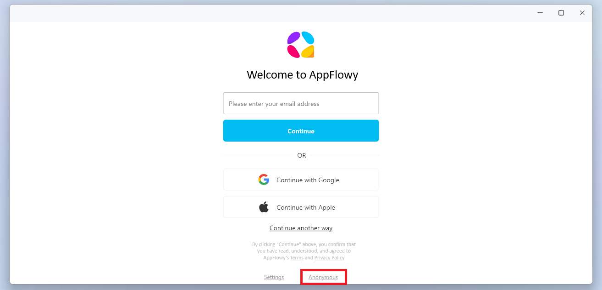
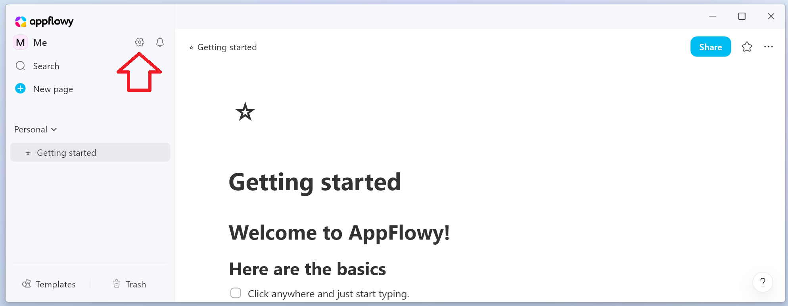
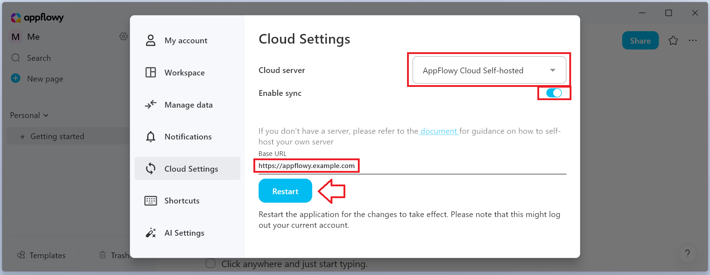

## Introduction

[AppFlowy](https://appflowy.io/) is an open-source alternative to Notion. In this tutorial we are going to setup our own [AppFlowy Cloud](https://docs.appflowy.io/docs/appflowy/product/appflowy-cloud) server using the official documentation by AppFlowy. We will connect AppFlowy to the [Hetzner Object Storage](https://docs.hetzner.com/storage/object-storage). When you add images or videos to a document, AppFlowy will save them in your Object Storage Bucket and access them from there. This tutorial won't cover how you create a new project called "AppFlowy" or a new server. We will purely focus on setting up AppFlowy, setting up a Bucket and connecting it to our AppFlowy Cloud server.

### Prerequisites

* Server
  * [git](https://git-scm.com/downloads/linux), [Docker and docker-compose](https://docs.docker.com/engine/install/#supported-platforms) already installed<br>
    Verify with `git -v`, `docker -v`, `docker compose version`
  * Access via SSH

* DNS entry for your desired (sub-)domain to your server
* Optional: Dedicated Hetzner Cloud project called "AppFlowy" to pool your resources together

## Step 1 - Create a Bucket

First, create a new Bucket in the Hetzner [Cloud Console](https://console.hetzner.cloud/).
For a step-by-step guide, see "[Creating a Bucket](https://docs.hetzner.com/storage/object-storage/getting-started/creating-a-bucket)".

As the name of the Bucket, we choose `appflowy` and add a UUID after it to make it unique. We can create the Bucket with private visibility, as the access will happen via the server.

Example:

> **LOCATION**<br>
> Falkenstein
> 
> **NAME/URL**<br>
> `appflowy-<random_uuid>.fsn1.your-objectstorage.com`
> 
> **VISIBILITY**<br>
> ⊙ Private

After successfully creating the Bucket, open it and copy the URL of the Bucket, by clicking on it.  
Paste the URL into a file for later.


Next, click on "Manage credentials" on the same screen to access the page for S3 credential creation.
For a step-by-step guide, see "[Generating S3 keys](https://docs.hetzner.com/storage/object-storage/getting-started/generating-s3-keys)".  

Choose a description for your new credentials, for example "AppFlowy".
Copy and store your access key and secret key for later usage.

## Step 2 - Set up your AppFlowy Cloud server

SSH into your server or use the Hetzner Cloud Console terminal to access your server via the web frontend.

### Step 2.1 - Clone the AppFlowy Cloud repository

Clone the AppFlowy Cloud repository to your desired location and `cd` into the cloned repository:

```bash
git clone https://github.com/AppFlowy-IO/AppFlowy-Cloud
cd AppFlowy-Cloud
```

### Step 2.2 - Setup the nginx proxy of AppFlowy Cloud to use your SSL certificate
The `AppFlowy-Cloud` directory should include the following files:

```yml
AppFlowy-Cloud
├─ docker-compose.yml
└─ nginx/ssl/
   ├─ certificate.crt
   └─ private_key.key
```

`docker-compose.yml` points to the SSL certificate like this:

```yaml
    volumes:
      - ./nginx/nginx.conf:/etc/nginx/nginx.conf
      - ./nginx/ssl/certificate.crt :/etc/nginx/ssl/certificate.crt
      - ./nginx/ssl/private_key.key :/etc/nginx/ssl/private_key.key
```

Put your SSL certificate and private key into the files in `AppFlowy-Cloud/nginx/ssl/` or adjust the location in the `docker-compose.yml` to point to your own certificates.

---------

Alternatively you can create a Let's Encrypt SSL certificate via DNS challenge on the Hetzner DNS service by using lego:

* Create SSL certificate
  ```bash
  go install github.com/go-acme/lego/v4/cmd/lego@latest
  sudo ~/go/bin/lego --domains="appflowy.example.com" --email="admin@example.com" --http run
  ```
  You should now have the following files:
  ```yml
  AppFlowy-Cloud
  ├─ docker-compose.yml
  └─ .lego/certificates/
     ├─ appflowy.example.com.crt
     └─ appflowy.example.com.key
  ```

* Adjust the `docker-compose.yml` to point to the output folder of lego:
  ```yml
    nginx:
      restart: on-failure
      image: nginx
      ports:
        - ${NGINX_PORT:-80}:80   # Disable this if you are using TLS
        - ${NGINX_TLS_PORT:-443}:443
      volumes:
        - ./nginx/nginx.conf:/etc/nginx/nginx.conf
        - ./.lego/certificates/appflowy.example.com.crt:/etc/nginx/ssl/certificate.crt
        - ./.lego/certificates/appflowy.example.com.key:/etc/nginx/ssl/private_key.key
  ```

## Step 3 - Edit `docker-compose.yml`

Open `docker-compose.yml` with you favourite text editor and make the following changes:

* Remove the minio service
  
  Remove the minio service by deleting the following lines:
  
  ```yml
    # You do not need this if you have configured to use your own s3 file storage
    minio:
      restart: on-failure
      image: minio/minio
      environment:
        - MINIO_BROWSER_REDIRECT_URL=http://localhost/minio
        - MINIO_ROOT_USER=${APPFLOWY_S3_ACCESS_KEY:-minioadmin}
        - MINIO_ROOT_PASSWORD=${APPFLOWY_S3_SECRET_KEY:-minioadmin}
      command: server /data --console-address ":9001"
      volumes:
        - minio_data:/data
  ```

* Remove the minio_data volume
  
  Don't forget to remove the `minio_data` volume from the volumes at the end of the `docker-compose.yml`. Only the `postgres_data `volume should remain:
  
  ```yml
  volumes:
    postgres_data:
  ```


* Edit or remove the ai service
  
  If you have an openai api key, add it in the ai service.  
  If you don't have an openai api key, comment out the ai service.
  
  ```yml
    ai:
      restart: on-failure
      image: appflowyinc/appflowy_ai:${APPFLOWY_AI_VERSION:-latest}
      environment:
        - OPENAI_API_KEY=${APPFLOWY_AI_OPENAI_API_KEY}
        - APPFLOWY_AI_SERVER_PORT=${APPFLOWY_AI_SERVER_PORT}
        - APPFLOWY_AI_DATABASE_URL=${APPFLOWY_AI_DATABASE_URL}
  ```

## Step 4 - Edit `deploy.env`

Now we need to adjust the `deploy.env` file to use our own passwords and point to the Hetzner Object Storage. I recommend to keep the order of values identical, as we are going to commit our changes locally. This makes rebasing easier.

* At the time of creation of this tutorial you should adjust the following values with your own password and SMTP configuration:
  
  ```env
  # replace the value of ${POSTGRES_PASSWORD} with a secure password
  # change the secret
  # change your database name if needed
  POSTGRES_PASSWORD="securepassword"
  GOTRUE_JWT_SECRET=hello456
  
  # replace with your own SMTP configuration
  # you will need this to send out magic links for login
  GOTRUE_SMTP_HOST=smtp.gmail.com
  GOTRUE_SMTP_PORT=465
  GOTRUE_SMTP_USER=email_sender@some_company.com
  GOTRUE_SMTP_PASS=email_sender_password
  GOTRUE_SMTP_ADMIN_EMAIL=comp_admin@some_company.com
  APPFLOWY_MAILER_SMTP_HOST=smtp.gmail.com
  APPFLOWY_MAILER_SMTP_PORT=465
  APPFLOWY_MAILER_SMTP_USERNAME=email_sender@some_company.com
  APPFLOWY_MAILER_SMTP_PASSWORD=email_sender_password
  
  # configure your admin account
  GOTRUE_ADMIN_EMAIL=admin@example.com
  GOTRUE_ADMIN_PASSWORD=password
  
  # input your (sub-)domain, which you configured in the Hetzner DNS service
  API_EXTERNAL_URL=https://appflowy.example.com
  ```

* Remove the following lines, as we won't use those services:
  
  ```env  
  # PgAdmin
  # Optional module to manage the postgres database
  # You can access the pgadmin at http://your-host/pgadmin
  # Refer to the APPFLOWY_DATABASE_URL for password when connecting to the database
  PGADMIN_DEFAULT_EMAIL=admin@example.com
  PGADMIN_DEFAULT_PASSWORD=password
  
  # Portainer (username: admin)
  PORTAINER_PASSWORD=password1234
  
  # Cloudflare tunnel token
  CLOUDFLARE_TUNNEL_TOKEN=
  ```

* And finally configure your Object Storage:
  
  ```conf
  APPFLOWY_S3_USE_MINIO=true
  APPFLOWY_S3_MINIO_URL=https://appflowy-5d3f1744a2494fb5b49c983e3eff3e17.fsn1.your-objectstorage.com # this is where the previously copied Object Storage URL is pasted
  APPFLOWY_S3_ACCESS_KEY=<your access key> # paste your previously generated access key from the S3 credentials
  APPFLOWY_S3_SECRET_KEY=<your secret key> # paste your previously generated secret key from the S3 credentials
  APPFLOWY_S3_BUCKET=appflowy # this isn't really the name of your Bucket, but the root folder in your Bucket
  #APPFLOWY_S3_REGION=us-east-1
  ```

## Step 5 - Start AppFlowy Cloud

Now that `docker-compose.yml` and `deploy.env` are ready, you can commit your changes and start the Docker containers.

* Add and commit your changes <sup><small>`optional`</small></sup>
  
  We use git to store our changes in the git log and make it easier to pull updates from upstream. By using this method every change of defaults in the `deploy.env` and `docker-compose.yml` will result in merge conflicts when pulling an update, which you need to resolve before restarting/updating your server.
  
  ```bash
  git add deploy.env docker-compose.yml
  git commit -m "my own AppFlowy deployment on Hetzner Cloud"
  ```

* Start the AppFlowy Cloud server
  
  Start your AppFlowy Cloud server via `docker compose` (or `docker-compose`, depending on your installation method):
  
  ```bash
  docker compose --env-file deploy.env up -d
  ```

You should now be able to access the web UI via your domain:
  
```https
https://appflowy.example.com
```

Use `docker ps` to check the status of the Docker containers. If you run into any issues, run `docker compose logs`.

## Step 6 - Install and configure AppFlowy Application

Go to [appflowy.io](https://appflowy.io/) and download the AppFlowy Application on your local device.

After the AppFlowy Application is installed on your local device, open the application and log in as "Anonymous".



Now click on the gear icon to open the settings.



In the settings:

* Navigate to "Cloud Settings"
* Change the value of Cloud server to "AppFlowy Cloud Self-hosted"
* Enable the sync
* Enter the URL of your cloud server as "Base URL"
* Restart AppFlowy.



After the restart, you might not be able to login again. To login again, you will need the magic link as explained in the next step.

## Step 7 - User creation and login

Open a browser and navigate to the URL of your server. The admin frontend will open up and you can login with the admin credentials you previously defined in `deploy.env`. Via the invite page, you can now create/invite new users:


When you invite a new user, they will receive a magic link for login. If they didn't receive a mail, you can manually create a magic link by clicking "Admin" in the top right and navigating to "List Users". Click "More Info" next to the user you just invited and select "Generate Invite Link".

When you follow the magic link, it will automatically log into the local AppFlowy Application. Your AppFlowy Application should now save images and videos in your Hetzner Object Storage Bucket.

In the web frontend, you also have the option to directly open AppFlowy with the account you logged into the web frontend with.


## Step 8 - Check if Object Storage works

AppFlowy should use the Object Storage for storing your images and videos. Open up the AppFlowy Application on your local device and add an image in a random page.


You can now check in your Hetzner Cloud Console if the file got created in the Bucket.


## Conclusion

We have setup our own AppFlowy Cloud server using the Hetzner Object Storage.

##### License: MIT

<!--

Contributor's Certificate of Origin

By making a contribution to this project, I certify that:

(a) The contribution was created in whole or in part by me and I have
    the right to submit it under the license indicated in the file; or

(b) The contribution is based upon previous work that, to the best of my
    knowledge, is covered under an appropriate license and I have the
    right under that license to submit that work with modifications,
    whether created in whole or in part by me, under the same license
    (unless I am permitted to submit under a different license), as
    indicated in the file; or

(c) The contribution was provided directly to me by some other person
    who certified (a), (b) or (c) and I have not modified it.

(d) I understand and agree that this project and the contribution are
    public and that a record of the contribution (including all personal
    information I submit with it, including my sign-off) is maintained
    indefinitely and may be redistributed consistent with this project
    or the license(s) involved.

Signed-off-by: Stefan Weiberg

-->
