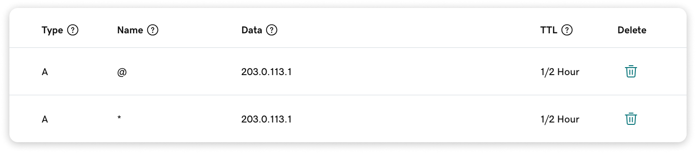
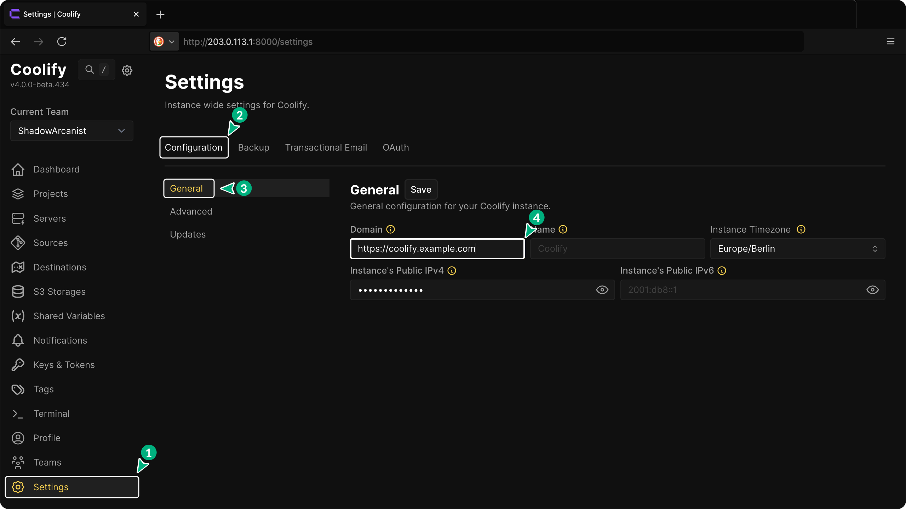
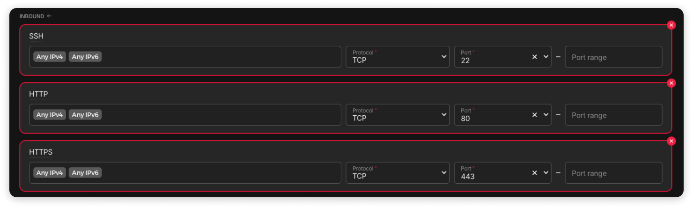

## Introduction

Coolify is a free and open-source tool that lets you easily host your own applications, databases, or services (like WordPress, Formbricks, and Grafana) without needing to manage servers yourself.

In this tutorial, you’ll learn how to install and set up Coolify on a Linux server.

We’ll use Debian 12 (Bookworm) in this tutorial, but these steps should also work on other Linux distributions supported by Coolify.

**Prerequisites**

This tutorial has been tested on a Hetzner Cloud Server but should work with any cloud server.

* A Cloud server (A fresh new server is recommended)
  * An operating system supported by Coolify. You can find the list of supported operating systems in the [Official Coolify Documentation](https://coolify.io/docs/installation#supported-operating-systems)
  * Server architecture (either AMD64 or Arm64)
  * Minimum specifications for Coolify: 2 vCPUs, 2GB RAM, and 20+ GB storage. These are the minimum requirements for Coolify, so consider choosing a server with higher specifications based on your needs.
  * Access to the root user
  * An SSH key for authentication (recommended)
* If you need assistance setting up your new cloud server, you can follow the [official Hetzner Cloud Server Setup Guide](https://docs.hetzner.com/cloud/servers/getting-started/creating-a-server). Please skip any steps related to firewall configuration.

**Example terminology**

* **Server**
  * Public IPv4: `203.0.113.1`
  
* **Domains**
  * Domain: `example.com` 
  * Subdomain: `sub.example.com`
  
* **Credentials**
  * Username: `holu` 
  * Email: `holu@example.com`
  * Password: `changeme`

These examples are for tutorial purposes only, make sure to replace them with your own information.

## Step 1 - Configure Your Server
  
First, connect to your server using SSH. If you’re not logged in as the root user, use the following command to access a root shell:
  
```bash
sudo -i
```

> Note: The Coolify installation will fail if it's not run as root.

### Step 1.1 - Update Your Server and Install Required Packages

Start by updating your server:

```bash
apt update && apt dist-upgrade -y
```

Then, install `curl`, which is needed for the Coolify installation script:

```bash
apt install curl -y
```
  
## Step 2 - Prepare Your Admin User Credentials for Coolify

Create your root user credentials according to the validation requirements below:

* **Username**
  * Minimum length: 3 characters
  * Maximum length: 255 characters
  * Can only contain letters, numbers, spaces, underscores, and hyphens
* **Email**
  * Must be a valid email address
  * Must have a valid DNS record
  * Maximum length: 255 characters
* **Password**
  * Minimum length: 8 characters
  * Must contain both uppercase and lowercase letters
  * Must contain at least one number
  * Must contain at least one special symbol
  * Must not be a commonly used or compromised password

### Step 2.1 - Run the Coolify installation script with Credentials

```bash
ROOT_USERNAME=holu ROOT_USER_EMAIL=holu@example.com ROOT_USER_PASSWORD=changeme bash -c 'curl -fsSL https://cdn.coollabs.io/coolify/install.sh | bash'
```

> You can view the source code for the installation script in the [Official Coolify Repository](https://github.com/coollabsio/coolify/blob/v4.x/scripts/install.sh)

Once the installation is complete, you’ll see the following message:

```bash
Congratulations, Your Coolify instance is ready to use.

Please visit http://203.0.113.1:8000 to get started.
```

## Step 3 - Login to Coolify dashboard

Visit the link provided in the terminal after installing Coolify.

You’ll be redirected to the login page. Enter your credentials to login to your account.

## Step 4 - Configure the Domain for Coolify dashboard

After logging into your account on Coolify dashboard, the first thing you need to do is set up a domain. Accessing Coolify via `http://203.0.113.1:8000` (your server IP and port) is insecure because it uses `HTTP`.

Once you connect a domain, Coolify will automatically setup the reverse proxy and generate SSL certificates.

Go to the DNS management page on your domain provider’s dashboard (like GoDaddy, Namecheap, etc.) and add two new A records as shown below:



> `@` allows Coolify to use the root of your domain.

> `*` allows Coolify to create and use any subdomain.

Note: If you don’t see the option for `Auto` under TTL, select the lowest value available.

Next, go to the settings page in Coolify and add the domain you want to use for accessing the dashboard in the "Domain" field:



> Make sure to add `https://` at the beginning of the URL, or the SSL certificate for the domain will fail to generate.

Finally, visit your Coolify dashboard domain in your browser. You should be able to access Coolify with HTTPS (it may take a minute or two for the website to be accessible for the first time).

## Step 5 - Set Up the Firewall

On the Hetzner dashboard, navigate to the Firewalls section and create three new inbound rules as shown below:



> Port `22` is for SSH connections.

> Port `80` and `443` are for the reverse proxy.

Once you enable the Firewall, you won’t be able to access Coolify via `http://203.0.113.1:8000` (your server IP and port). You can only access Coolify through the dashboard domain you set up in the previous step (`Step 4`). 

All applications deployed on Coolify will use `HTTPS`, as Coolify automatically handles the reverse proxy and SSL certificates.

## Conclusion

We installed Coolify and set up a custom domain for it on our server. Additionally, we configured the firewall rules to restrict access to our server and Coolify dashboard from the server IP address with port number, allowing access only via our custom domain.

I highly recommend checking out the [Official Coolify Documentation](https://coolify.io/docs/) for more information.

This tutorial will help you get started with Coolify, and you can learn more about setting up services, databases, and much more from their documentation.

##### License: MIT

<!--
Contributor's Certificate of Origin
By making a contribution to this project, I certify that:
(a) The contribution was created in whole or in part by me and I have
    the right to submit it under the license indicated in the file; or
(b) The contribution is based upon previous work that, to the best of my
    knowledge, is covered under an appropriate license and I have the
    right under that license to submit that work with modifications,
    whether created in whole or in part by me, under the same license
    (unless I am permitted to submit under a different license), as
    indicated in the file; or
(c) The contribution was provided directly to me by some other person
    who certified (a), (b) or (c) and I have not modified it.
(d) I understand and agree that this project and the contribution are
    public and that a record of the contribution (including all personal
    information I submit with it, including my sign-off) is maintained
    indefinitely and may be redistributed consistent with this project
    or the license(s) involved.
Signed-off-by: ShadowArcanist contact@shadowarcanist.com
-->