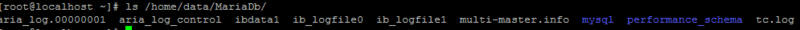
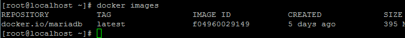
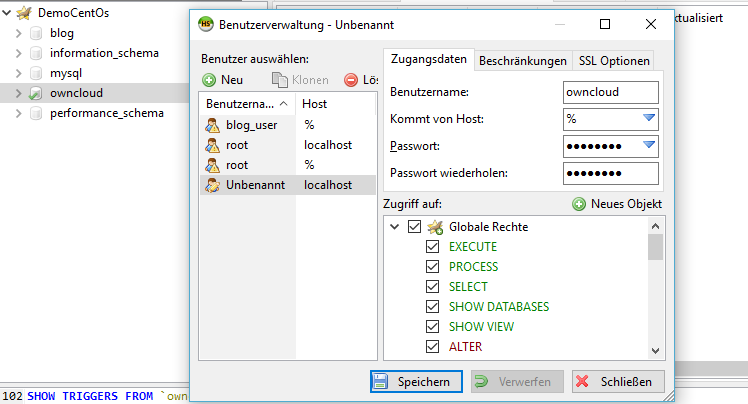
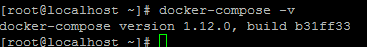
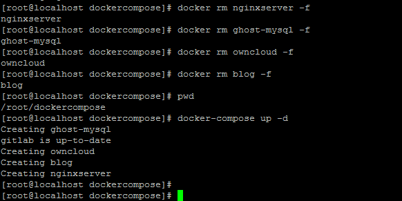
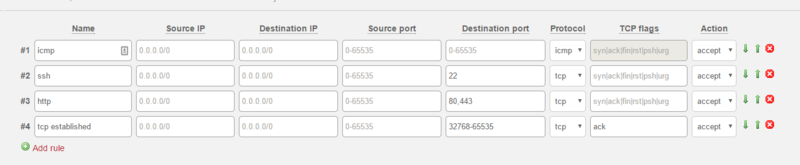

## Einführung

In dieser Anleitung soll die Installation und Konfiguration von Docker auf einem Server erläutert werden. Auf Basis von CentOS sollen folgende Komponenten zum Laufen gebracht werden:

* [Ghost](https://github.com/TryGhost/Ghost) als Blog-Service
* [ownCloud](https://owncloud.org/) als Dateispeicher, vor allem um mit Partnern und Kunden Dateien auszutauschen
* [GITLab](https://about.gitlab.com/) als Anwendung zur Softwareentwicklung im Team
* [Shipyard](https://shipyard-project.com/) als Tool zur Remote-Verwaltung der Docker Container

Unter Windows sind [Putty](http://www.putty.org/) als Kommandozeilentool und [WinScp](https://winscp.net/eng/index.php) für die Dateiübertragung nötig. Linux bietet diese Funktionen nativ an.

## Schritt 1 - Basiskonfiguration von CentOS und Installation von Docker

Nach der Installation von CentOS sollte zunächst ein Update durchgeführt werden:

`yum -y update`

Anschließend kommt die Installation von Docker

`yum -y install docker docker-registry`

Damit Docker auch automatisch beim Neustart läuft, muss der Docker Service noch eingerichtet werden:

```console
systemctl enable docker.service
systemctl start docker.service
```

Ob alles korrekt installiert wurde lässt sich überprüfen mit:
`root@CentOS-73-64-minimal ~]# systemctl status docker.service`
Die Ausgabe sollte `Active: active(running) since...` enthalten

## Schritt 2 - Konfiguration der MariaDB und Einführung in Grundlegende Docker Befehle

Damit Ghost und die ownCloud auf eine zentrale Datenbank zugreifen können, muss diese als erster Container installiert werden. In dieser Anleitung wurde entschieden, dass die Daten im Homeverzeichnis abgelegt werden sollen und der Standard Port 3306 verwendet wird.

Die Daten werden in Home abgelegt. Ein entsprechendes Data Verzeichnis wurde erzeugt:

`mkdir /home/data`
`mkdir /home/data/MariaDb`

Folgende Konfiguration soll verwendet werden:

* Name: `ghost-mysql`
* Datenverzeichnis nach: `/home/data/MariaDb/` mappen
* SQL Password: XXXXXXX
* Docker Image das zu verwenden ist: `mariadb`

Mit diesem Befehl legen wir die Datenbank an:

`docker run --name ghost-mysql -v /home/data/MariaDb/:/var/lib/mysql:z -e MYSQL_ROOT_PASSWORD=XXXXXXX -d -p 3306:3306 mariadb`

Mit `docker ps` ist ersichtlich, ob die Datenbank korrekt läuft:

```console
[root@CentOS-73-64-minimal ~]# docker ps
CONTAINER ID   IMAGE     COMMAND                  CREATED       STATUS       PORTS                    NAMES
d952d2b55a4e   mariadb   "docker-entrypoint.sh"   3 weeks ago   Up 3 weeks   0.0.0.0:3306->3306/tcp   ghost-mysql
```

Das Verzeichnis hat auch die entsprechenden Daten der MariaDB:



Möchten Sie einen laufende Container löschen, dann können Sie das mit `docker rm` durchführen. Sollte der Container noch laufen, kann man mit `-f` das löschen erzwingen:


Mit den Kommando `docker start` kann man einen stehenden Container wieder neu starten. Mit `docker restart` beenden und neu starten und mit `docker stop` natürlich den Container beenden:


Sollte das Docker-Image nicht starten, kann man ggf. ohne die Detach Option `-d`den Fehler erkennen:


In diesem Fall „chown“ error, hat die Option `:z` gefehlt, damit das Verzeichnis auch korrekt gemounted wird, so wäre es korrekt:


Die installierten Images (also die Basisplattform für jeden Container) kann man mit `docker images` angezeigt bekommen:



Mit dieser Konfiguration ist es anschließend möglich auch mit bspw. [HeidiSQL](https://www.heidisql.com/download.php) auf die Datenbank zugreifen zu können.

Allerdings muss man in diesem Fall die Firewall des Servers um eine Regel bei Hetzner erweitern und die IP auf die eigene einschränken:


Anschließend sollte es möglich sein, sich mit der mySQL/MariaDb Datenbank zu verbinden:


Mit dem Kommando `docker logs ghost-mysql` ist es möglich das Log des Container anzusehen:


## Schritt 3 - Konfiguration von Ghost als Blog

Als nächstes ist Ghost auf der Maschine zu installieren.

Folgende Konfiguration soll verwendet werden:

* Standard Port 2368 (nicht vom Internet erreichbar)
* Name: `blog`
* Datenverzeichnis nach: `/home/data/Ghost`
* Die Datenbank wird zu `ghost-mysql` gemapped

Der Start von Docker beläuft sich hier dann auf:

```console
mkdir /home/data/Ghost
docker run --name blog -p 2368:2368 -v /home/data/Ghost/:/var/lib/ghost:z -d --link ghost-mysql:mysql ghost
```

Die gesamte Konfiguration übersteigt den Rahmen dieser Anleitung. Der nächste Schritt hier ist, Ghost intern auf die SQL Datenbank umzustellen.
Hierfür muss die config.js mit WinSCP angepasst werden.


Hier ist die Datenbankkonfiguration entsprechend einzutragen. Als Hostnamen verwendet man `mysql` da dies auch so im Docker definiert wurde. Als User wird hier `blog_user` verwendet und ein password vergeben: (ACHTUNG: Die Konfiguration muss in "development" gemacht werden)


Jetzt muss noch in der MariaDb die Datenbank angelegt und der User eingerichtet werden.

Zunächst wird die Datenbank erstellt über HeidiSQL:


Und in diesem Dialog Folgendes eingeben:


Anschließend ist der User noch zu berechtigen auf der Datenbank:


Und für diesen das Passwort vergeben und alle notwendigen Rechte:


Anschließend muss der Blog neu gestartet werden, damit die neuen Konfigurationen aus der config.js gezogen werden:


Hat alles geklappt, dann ist der Blog wieder über „http“ verfügbar und in der MariaDb sind jetzt zahlreiche Tabellen verfügbar: (Neu laden mit F5, damit dies auch in der HeidiSQL sichtbar wird!)


## Schritt 4 - ownCloud und GitLab einrichten

Prinzipiell ist für diese beiden Dienste ähnlich vorzugehen, wie bereits für Ghost beschrieben.

Für ownCloud muss auch ein Nutzer in MariaDB angelegt werden.



Dann folgenden Befehl eingeben:

`docker run --name owncloud -v /home/data/owncloud:/var/www/html:z -p 8082:80 --link ghost-mysql:mysql -d owncloud:8.1`

Die entsprechenden Konfigurationen für die ownCloud MariaDB einstellen:


Anschließend findet man in der MariaDB auch die entsprechenden Tabellen:


Zum Einrichten von Gitlab kann folgender Befehl verwendet werden:

`docker run --detach --name gitlab --hostname git.vr-worlds.de --sysctl net.core.somaxconn=1024 --ulimit sigpending=62793 --ulimit nproc=131072 --ulimit nofile=60000 --ulimit core=0 --publish 8443:443 --publish 8083:80 --publish 8022:22 --publish 8060:8060 --restart always --volume /home/data/gitlab/config:/etc/gitlab:z --volume /home/data/gitlab/logs:/var/log/gitlab:z --volume /home/data/gitlab/data:/var/opt/gitlab:z --volume /etc/localtime:/etc/localtime gitlab/gitlab-ce`

## Schritt 5 - NGINX Einrichten

Die NGINX soll so konfiguriert werden, dass Anfragen an den Port 80 an die entsprechenden Docker-Container durchgereicht werden. Erfolgen soll dies aufgrund der angegebenen Sub-Domain:

* www.vr-worlds.de -> Weiterleitung zum Blog
* cloud.vr-worlds.de -> Weiterleitung an die ownCloud
* git.vr-worlds.de -> Weiterleitung an GitLab

Hierzu müssen zunächst alle diese Sub-Domains zur gleichen IP Adresse des Servers eingerichtet werden:


Es kann einige Zeit dauern, bis die neuen Adressen entsprechend über DNS verfügbar sind. Man kann dies vom eigenen PC regelmäßig mit `nslookup`prüfen:


Vorüberlegungen für NGINX:

* Port 80 (HTTP) und Port 443 (HTTPS) sollen nach außen gegeben werden
* Links zu den anderen Docker Containern blog, gitlab, owncloud werden benötigt
* Name `nginxserver`
* Datenablage für sites-enabled, certs, logs soll in `/home/data/Nginx/`erfolgen

Entsprechend könnte man folgendes Kommando verwenden (hier nicht empfohlen!):

`docker run -v /home/data/Nginx/sites-enabled/:/etc/nginx/conf.d/ -v /home/data/Nginx/certs/:/etc/nginx/certs -v /home/data/Nginx/logs/:/var/log/nginx --name nginxserver -p 80:80 -p 443:443 -d --link blog:blog --link gitlab:gitlab --link owncloud:owncloud`

Da man diese Konfiguration öfters ändern muss, bspw. wenn neue Hosts hinzukommen empfiehlt es sich die Konfiguration des Docker-Containers in einer Datei abzulegen und `docker-compose` zu verwenden. (https://docs.docker.com/compose/install/)

Die Installation erfolgt so direkt über `curl`:

``curl -L https://github.com/docker/compose/releases/download/1.12.0/docker-compose-`uname -s`-`uname -m` > /usr/local/bin/docker-compose``

Docker Compose hat anschließend noch keine Ausführungsberechtigung, diese müssen mit `chmod` noch hinzugefügt werden:


Nun können wir testen, ob `docker-compose` korrekt funktioniert:



Hierzu legen wir ein Verzeichnis im Root Homeverzeichnis an und dort ein `docker-compose.yml`:


Die Datei sollte wie folgt aussehen:

```text
version: '2'
services:
 nginxserver:
   container_name: nginxserver
   image: nginx
   network_mode: bridge
   external_links:
      - blog:blog
      - gitlab:gitlab
      - owncloud:owncloud
   ports:
      - "80:80"
      - "443:443"
   volumes:
      - /home/data/Nginx/sites-enabled/:/etc/nginx/conf.d:z
      - /home/data/Nginx/certs/:/etc/nginx/certs:z
      - /home/data/Nginx/logs/:/var/log/nginx:z
```

Anschließend kann man mit `docker-compose` die `nginx` starten:


Nachdem Nginx gestartet ist muss die Konfiguration erstellt werden. Für jede Subdomain ist das durchreichen zum entsprechenden gemappten Docker Container einzutragen:


Nachdem die Konfiguration durchgeführt wurde, kann die `nginx` neu gestartet werden:


Sollte es nicht funktionieren, kann `docker logs hier weiterhelfen:


## Schritt 6 - Konfiguration von Shipyard

Zuletzt wird Shipyard für die Remote Steuerung der Container hinzugefügt:

Als DNS soll `ship.vr-worlds.de`verwendet werden (Nginx Configuration ist hierfür anzupassen)

Das Deployment erfolgt hier nicht über `docker run`sondern über `curl`:

`curl -sSL https://shipyard-project.com/deploy | bash -s`

Anschließend ist shipyard über Port 8080 verfügbar und es wurden einige Container installiert:

```console
[root@CentOS-73-64-minimal ~]# docker ps
CONTAINER ID        IMAGE                          COMMAND                  CREATED       STATUS       PORTS                                            NAMES
48f5cd2ce123        shipyard/shipyard:latest       "/bin/controller --de"   2 weeks ago   Up 2 weeks   0.0.0.0:8080->8080/tcp                           shipyard-controller
ec4955037d0f        swarm:latest                   "/swarm j --addr 176."   2 weeks ago   Up 2 weeks   2375/tcp                                         shipyard-swarm-agent
48487fb7223c        swarm:latest                   "/swarm m --replicati"   2 weeks ago   Up 2 weeks   2375/tcp                                         shipyard-swarm-manager
fee6b7fcc71e        shipyard/docker-proxy:latest   "/usr/local/bin/run"     2 weeks ago   Up 2 weeks   0.0.0.0:2375->2375/tcp                           shipyard-proxy
2058c074314b        alpine                         "sh"                     2 weeks ago   Up 2 weeks                                                    shipyard-certs
d710310dae40        microbox/etcd:latest           "/bin/etcd -addr 176."   2 weeks ago   Up 2 weeks   0.0.0.0:4001->4001/tcp, 0.0.0.0:7001->7001/tcp   shipyard-discovery
0fe8eb95b8fb        rethinkdb                      "rethinkdb --bind all"   2 weeks ago   Up 2 weeks   8080/tcp, 28015/tcp, 29015/tcp                   shipyard-rethinkdb
```

Nun muss Shipyard nur noch in die nginx eingebunden und konfiguriert werden. In der nginx Konfiguration ist Folgendes zu ergänzen:

(`/home/data/Nginx/sites_enabled`)


Jetzt zahlt es sich erstmals aus über `docker-compose` die Konfiguration für Nginx gemacht zu haben, dann diese ist nun einfach zu erweitern:


Anschließend kann der Container neu gebaut werden mittels `docker-compose up -d`:


## Schritt 7 - Konfiguration über Docker-Compose zentral steuern

Damit die Automatisierung von Docker wirklich zum tragen kommt, werde ich nun die komplette Konfiguration in einem neuen Docker-Compose File zusammen führen:


Die Datei hat folgendes Aussehen:

```text
version: '2.1'
services:
 ghost-mysql:
   container_name: ghost-mysql
   image: mariadb
   network_mode: bridge
   ports:
      - "3306:3306"
   volumes:
      - /home/data/MariaDb/:/var/lib/mysql:z
   environment:
      - MYSQL_ROOT_PASSWORD=rosi2511
 blog:
   container_name: blog
   image: ghost
   network_mode: bridge
   links:
      - ghost-mysql:mysql
   ports:
      - "2368:2368"
   volumes:
      - /home/data/Ghost/:/var/lib/ghost:z
 owncloud:
   container_name: owncloud
   image: owncloud:8.1
   network_mode: bridge
   links:
      - ghost-mysql:mysql
   ports:
      - "8082:80"
   volumes:
      - /home/data/owncloud:/var/www/html:z
 gitlab:
   container_name: gitlab
   image: gitlab/gitlab-ce
   network_mode: bridge
   ports:
      - "8443:443"
      - "8083:80"
      - "8022:22"
      - "8060:8060"
   volumes:
      - /home/data/gitlab/config:/etc/gitlab:z
      - /home/data/gitlab/logs:/var/log/gitlab:z
      - /home/data/gitlab/data:/var/opt/gitlab:z
      - /etc/localtime:/etc/localtime
   sysctls:
      - net.core.somaxconn=1024
   ulimits:
      sigpending: 62793
      nproc: 131072
      nofile: 60000
      core: 0
 nginxserver:
   container_name: nginxserver
   image: nginx
   network_mode: bridge
   links:
      - blog:blog
      - gitlab:gitlab
      - owncloud:owncloud
   external_links:
      - shipyard-controller:shipyard-controller
   ports:
      - "80:80"
      - "443:443"
   volumes:
      - /home/data/Nginx/sites-enabled/:/etc/nginx/conf.d:z
      - /home/data/Nginx/certs/:/etc/nginx/certs:z
```

Nun können wir alle Container wieder löschen und dann mit „docker-compose“ neu anlegen:



## Schritt 8 - Konfiguration der Firewall bei Hetzner

Eine beispielhafte Konfiguration sieht wie folgt aus:



Die Regel #1 ermöglicht es, dass ICMP Pakete, bspw. Ping aber auch Requests bezüglich ermitteln der Netzwerkbandbreite (MTU-Size etc.) ermittelt werden können. Es empfiehlt sich daher dies auf „accept“ stehen zu lassen.

Die Regel #2 ermöglicht es, sich auf dem Server mit ssh zu verbinden. Man muss diesen Port nicht immer auf lassen und kann diesen, wenn keine Wartung ansteht auf „discard“ stellen. Anschließend ist eine Verbindung mittels „ssh“ nicht mehr möglich und daher können „putty“ und „winscp“ sich nicht mehr verbinden:


Die Regel #3 ist dafür zuständige damit mittels „http“ (port 80) und „https“ (Port 443) auf das System zugegriffen werden kann.

Die Regel #4 ist notwendig, damit der Linux Host auch antworten kann. Selbstverständlich kann man die Regeln noch weiter optimieren.

## Fazit

In diesem Artikel wurde gezeigt, welche Schritte notwendig sind, um eine Konfiguration mit NGINX Proxy und ein paar anderen Containern zum funktionieren zu bringen.
