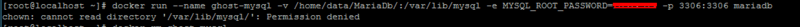

## Introduction

This Guide covers the installation and configuration of Docker. CentOS is used as the OS.

When using Windows, a command-line interface tool (e.g. [Putty](http://www.putty.org/)) and a File Transfer Protocol tool (e.g. [WinScp](https://winscp.net/eng/index.php)) are required. Linux offers these functionalities natively.

## Step 1 - Base configuration for CentOS and Docker installation

After installing CentOS, you should first perform an update:

`yum -y update`

Then comes the Docker installation

`yum -y install docker docker-registry`

To make Docker run automatically when you boot, you need to enable Docker Service

```console
systemctl enable docker.service
systemctl start docker.service
```

To check wether docker is running type in:

`root@CentOS-73-64-minimal ~]# systemctl status docker.service`

The output should contain: `Active: active(running) since...`

## Step 2 - Configuring MariaDB and learning basic Docker commands

Since you want Ghost and ownCloud to have access to a central database, you first need to set this database up as the first container.
You could decide, for example, to store data in Home.

You can create a data directory for this by entering:

```console
mkdir /home/data
mkdir /home/data/MariaDB
```

This Guide uses the following configuration:

* Name: `ghost-mysql`
* data directory set to: `/home/data/MariaDb/`
* SQL Password: XXXXXXX
* Docker Image to use: `mariadb`

This specific database will be created using the following command:

`docker run --name ghost-mysql -v /home/data/MariaDb/:/var/lib/mysql:z -e MYSQL_ROOT_PASSWORD=XXXXXXX -d -p 3306:3306 mariadb`

Run `docker ps` to check wether the Database is running properly:

```console
[root@CentOS-73-64-minimal ~]# docker ps
CONTAINER ID   IMAGE     COMMAND                  CREATED       STATUS       PORTS                    NAMES
d952d2b55a4e   mariadb   "docker-entrypoint.sh"   3 weeks ago   Up 3 weeks   0.0.0.0:3306->3306/tcp   ghost-mysql
```

The directory has the relevant data for MariaDB:


If you want to remove a container that is running, you can do that by executing `docker rm`. If the container continues to run, you can do a force delete with `-f`:


The command `docker start` allows you to start an existing container. Use `docker restart` to close and restart a container. And, naturally, use `docker stop` to close a container.


If the Docker image does not start, you may be able to see the mistake by not using the detach option `-d`:



In this case, the error is a `chown` error. The option `:z` was missing. To mount the directory correctly, it should instead look like this:


You can see a list of installed images (meaning the basis for each container) by entering `docker images`:


Using this configuration, it is then possible to use [HeidiSQL](https://www.heidisql.com/download.php) to access the database.

However, in this case (and I would recommend only doing this temporarily), make sure to add one firewall rule to the server using Hetzner's firewall tool; the rule should limit access to only your IP address.


Then, it should be possible to connect to the mySQL/MariaDB database:


You can use the command `docker logs ghost-mysql` to view the container log:


## Step 3 - Configuring Ghost as a blog service

The next step is to install Ghost.

The following configuration shall be used:

* Standard Port 2368 (not accessible from the internet)
* Name: `blog`
* Storage location: `/home/data/Ghost`
* mySQL database should be mapped to `ghost-mysql`

Starting Docker should look like this:

```console
mkdir /home/data/Ghost
docker run --name blog -p 2368:2368 -v /home/data/Ghost/:/var/lib/ghost:z -d --link ghost-mysql:mysql ghost
```

Overall configuration would be too much for this guide. Therefore it concentrates on the bare minimum, meaning that Ghost must be adapted to use MariaDB instead of the internal SQLite database.
For this, the `config.js` setting needs to be changed using WinSCP.


This is where you then need to enter the database configuration. For the hostname, use `mysql` since this is also defined this way in Docker. We use `blog_user` for User and assigned a password: (WARNING: The configuration must be done in `development`.)


You still need to put the database in MariaDB and set up the User.

Then you can create the database via HeidiSQL:


And then enter the following in this dialog:


Then you can authorize the User to access the database:


Assign a password for this user and all necessary authorizations:


Then you must restart the blog so that the new configurations are implemented by config.js:


If everything has worked so far, then you should be able to access the blog via "http" and there should be several tables that are available to you in MariaDB: (Use F5 to refresh, so that everything is also viewable in HeidiSQL!)


## Step 4 - Setting up ownCloud and GitLab

In theory, the setup for both of these services is similar to Ghost.

For ownCloud, a user must be created in MariaDB, while GitLab being simpler to configure.

Create a relevant database in MariaDB:


Use the following command:

`docker run --name owncloud -v /home/data/owncloud:/var/www/html:z -p 8082:80 --link ghost-mysql:mysql -d owncloud:8.1`

Use the same configuration for ownCloud as in MariaDB:


Then you should be able to also see the relevant tables in MariaDB:


To install GitLab one can use the following command:

`docker run --detach --name gitlab --hostname git.vr-worlds.de --sysctl net.core.somaxconn=1024 --ulimit sigpending=62793 --ulimit nproc=131072 --ulimit nofile=60000 --ulimit core=0 --publish 8443:443 --publish 8083:80 --publish 8022:22 --publish 8060:8060 --restart always --volume /home/data/gitlab/config:/etc/gitlab:z --volume /home/data/gitlab/logs:/var/log/gitlab:z --volume /home/data/gitlab/data:/var/opt/gitlab:z --volume /etc/localtime:/etc/localtime gitlab/gitlab-ce`

## Step 5 - Setting up NGINX

Your NGINX should be configured in such a way that requests to port 80 are forwarded to the relevant Docker container.

The specified sub-domain will enable this to happen:

* www.vr-worlds.de -> forwarded to Blog
* cloud.vr-worlds.de -> forwarded to ownCloud
* git.vr-worlds.de -> forwarded to GitLab

To do this, you will need to point all sub-domains to the same IP address on the server:


It can take some time before the new addresses are available via DNS. You can occasionally check to see if they're ready by using `nslookup` from your own PC:


Considerations for NGINX:

* Port 80 (HTTP) and Port 443 (HTTPS) shall be outbound ports
* links to the other Docker Containers blog, gitlab, owncloud are required
* Name `nginxserver`
* storage for sites-enabled, certs, logs should be done in `/home/data/Nginx/`

We could use the following command (but we will not use it):

`docker run -v /home/data/Nginx/sites-enabled/:/etc/nginx/conf.d/ -v /home/data/Nginx/certs/:/etc/nginx/certs -v /home/data/Nginx/logs/:/var/log/nginx --name nginxserver -p 80:80 -p 443:443 -d --link blog:blog --link gitlab:gitlab --link owncloud:owncloud`

Since you may need to change this configuration frequently, for example, when there are new hosts, I recommend saving the configuration for the Docker container in a file and using `docker-compose`. (https://docs.docker.com/compose/install/)

You can use `curl` to then run the installation:

``curl -L https://github.com/docker/compose/releases/download/1.12.0/docker-compose-`uname -s`-`uname -m` > /usr/local/bin/docker-compose``

Docker Compose still does not have any execute permissions; you need to use `chmod` to add these:


Now we can see whether or not "docker-compose" is working properly:


To do this, we create a directory in the root home directory and then enter `docker-compose.yml`:


The file should look like this:

```text
version: '2'
services:
   nginxserver:
      container_name: nginxserver
      image: nginx
      network_mode: bridge
      external_links:
         - blog:blog
         - gitlab:gitlab
         - owncloud:owncloud
      ports:
         - 80:80
         - 443:443
      volumes:
         - /home/data/Nginx/sites-enabled/:/etc/nginx/conf.d:z
         - /home/data/Nginx/certs/:/etc/nginx/certs:z
         - /home/data/Nginx/logs/:/var/log/nginx:z
```

Then you can start the `nginx` using `docker-compose`:


Once Nginx has started, you will need to create the configuration. For each sub-domain, you will need to specify the transfer path to the relevant mapped Docker container:


Once the configuration has been applied, you can restart the nginx:


If that does not work, it may be useful to use `docker logs` to look for a mistake:


## Step 6 - Configuring Shipyard

The last service to add is Shipyard. It enables us to manage Docker containers remotely.

The installation is pretty straightforward.

The DNS should be ship.vr-worlds.de. (nginx configuration needs to to be adapted)

Use `curl` for deployment:

`curl -sSL https://shipyard-project.com/deploy | bash -s`

Now you can access Shipyard via port 8080 and several containers have been installed:

```console
[root@CentOS-73-64-minimal ~]# docker ps
CONTAINER ID        IMAGE                          COMMAND                  CREATED       STATUS       PORTS                                            NAMES
48f5cd2ce123        shipyard/shipyard:latest       "/bin/controller --de"   2 weeks ago   Up 2 weeks   0.0.0.0:8080->8080/tcp                           shipyard-controller
ec4955037d0f        swarm:latest                   "/swarm j --addr 176."   2 weeks ago   Up 2 weeks   2375/tcp                                         shipyard-swarm-agent
48487fb7223c        swarm:latest                   "/swarm m --replicati"   2 weeks ago   Up 2 weeks   2375/tcp                                         shipyard-swarm-manager
fee6b7fcc71e        shipyard/docker-proxy:latest   "/usr/local/bin/run"     2 weeks ago   Up 2 weeks   0.0.0.0:2375->2375/tcp                           shipyard-proxy
2058c074314b        alpine                         "sh"                     2 weeks ago   Up 2 weeks                                                    shipyard-certs
d710310dae40        microbox/etcd:latest           "/bin/etcd -addr 176."   2 weeks ago   Up 2 weeks   0.0.0.0:4001->4001/tcp, 0.0.0.0:7001->7001/tcp   shipyard-discovery
0fe8eb95b8fb        rethinkdb                      "rethinkdb --bind all"   2 weeks ago   Up 2 weeks   8080/tcp, 28015/tcp, 29015/tcp                   shipyard-rethinkdb
```

Now you just need to integrate Shipyard into the nginx and configure it. You need to add the following to the nginx configuration: (`/home/data/Nginx/sites_enabled`)


Now it really makes sense to have used `docker-compose` for the configuration of Nginx; it's really easy to add to it now:


Then you can rebuild the container using `docker-compose up -d`:


## Step 7 - Centrally managing the configuration via Docker-Compose

To make sure that the automation from Docker is as effective as possible, we will now bring together the complete configuration in one new Docker-Compose file.


The file should look like this:

```text
version: '2.1'
services:
 ghost-mysql:
   container_name: ghost-mysql
   image: mariadb
   network_mode: bridge
   ports:
      - "3306:3306"
   volumes:
      - /home/data/MariaDb/:/var/lib/mysql:z
   environment:
      - MYSQL_ROOT_PASSWORD=rosi2511
 blog:
   container_name: blog
   image: ghost
   network_mode: bridge
   links:
      - ghost-mysql:mysql
   ports:
      - "2368:2368"
   volumes:
      - /home/data/Ghost/:/var/lib/ghost:z
 owncloud:
   container_name: owncloud
   image: owncloud:8.1
   network_mode: bridge
   links:
      - ghost-mysql:mysql
   ports:
      - "8082:80"
   volumes:
      - /home/data/owncloud:/var/www/html:z
 gitlab:
   container_name: gitlab
   image: gitlab/gitlab-ce
   network_mode: bridge
   ports:
      - "8443:443"
      - "8083:80"
      - "8022:22"
      - "8060:8060"
   volumes:
      - /home/data/gitlab/config:/etc/gitlab:z
      - /home/data/gitlab/logs:/var/log/gitlab:z
      - /home/data/gitlab/data:/var/opt/gitlab:z
      - /etc/localtime:/etc/localtime
   sysctls:
      - net.core.somaxconn=1024
   ulimits:
      sigpending: 62793
      nproc: 131072
      nofile: 60000
      core: 0
 nginxserver:
   container_name: nginxserver
   image: nginx
   network_mode: bridge
   links:
      - blog:blog
      - gitlab:gitlab
      - owncloud:owncloud
   external_links:
      - shipyard-controller:shipyard-controller
   ports:
      - "80:80"
      - "443:443"
   volumes:
      - /home/data/Nginx/sites-enabled/:/etc/nginx/conf.d:z
      - /home/data/Nginx/certs/:/etc/nginx/certs:z
```

Now we can delete all of the containers and create new ones with `docker-compose`:


## Step 8 - Configuring the firewall with Hetzner's firewall tool

An exemplary configuration at Hetzner Online could look like this:


Rule #1 lets ICMP packets pass, for example pings and requests that let you determine the network bandwidth (MTU size etc.). For this reason, we recommend keeping the setting here on "accept".

Rule #2 allows you to connect with the server via SSH. You do not need to always leave this port open. When you aren't doing any maintenance, you can change the firewall action here to "discard". Then it is no longer possible to connect via SSH; therefore, it is not possible for a "putty" or a "winscp" to connect to the server:


Rule #3 allows you to access the system via "http" (port 80) and "https" (port 443).

Rule #4 is really necessary to allow the Linux host to also respond.

## Conclusion

This article shows the necessary steps for getting a NGINX proxy and a few other containers to run together in a docker environment.
