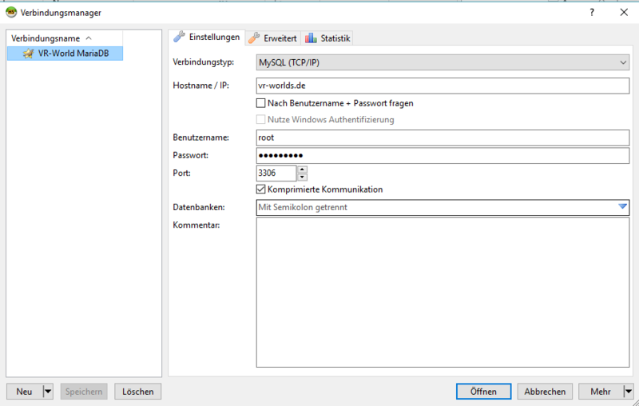
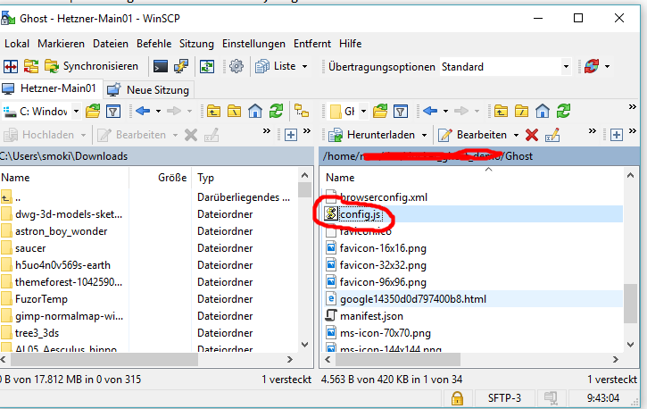
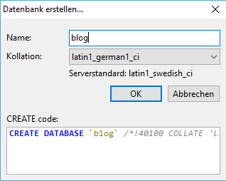
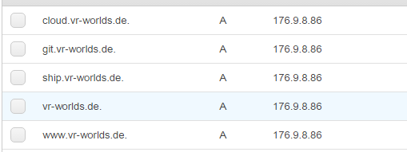
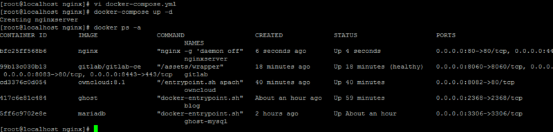
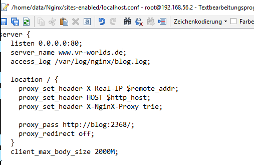
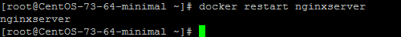
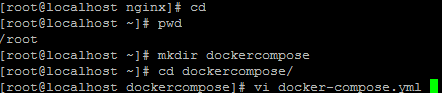

## Введение

Это руководство охватывает установку и настройку Docker. В качестве ОС используется CentOS.

При использовании Windows потребуются инструмент командной строки (например, [Putty](http://www.putty.org/)) и инструмент передачи файлов (например, [WinScp](https://winscp.net/eng/index.php)). В Linux необходимые инструменты уже есть.

## Шаг 1 — базовая настройка CentOS и установка Docker

После установки CentOS необходимо сначала выполнить обновление:

`yum -y update`

Затем идет установка Docker

`yum -y install docker docker-registry`

Для того чтобы Docker запускался автоматически при загрузке системы, необходимо включить службу Docker

```console
systemctl enable docker.service
systemctl start docker.service
```

Чтобы проверить, работает ли docker, введите:

`root@CentOS-73-64-minimal ~]# systemctl status docker.service`

Вывод должен содержать: `Active: active(running) since...`

## Шаг 2 — Настройка MariaDB и изучение основных команд Docker

Поскольку мы хотим, чтобы Ghost и ownCloud имели доступ к центральной базе данных, сначала нужно настроить эту базу данных в качестве первого контейнера.
В нашем примере будем хранить данные в домашней директории.

Для этого можно создать каталог данных, введя:

```console
mkdir /home/data
mkdir /home/data/MariaDB
```

В этом руководстве используется следующая конфигурация:

* Имя: `ghost-mysql`
* директория для данных: `/home/data/MariaDb/`
* Пароль SQL: XXXXXXX
* Образ Docker для использования: `mariadb`

Эта конкретная база данных будет создана с помощью следующей команды:

`docker run --name ghost-mysql -v /home/data/MariaDb/:/var/lib/mysql:z -e MYSQL_ROOT_PASSWORD=XXXXXXX -d -p 3306:3306 mariadb`

Запустите `docker ps`, чтобы проверить правильность работы базы данных:

```console
[root@CentOS-73-64-minimal ~]# docker ps
CONTAINER ID   IMAGE     COMMAND                  CREATED       STATUS       PORTS                    NAMES
d952d2b55a4e   mariadb   "docker-entrypoint.sh"   3 weeks ago   Up 3 weeks   0.0.0.0:3306->3306/tcp   ghost-mysql
```

В каталоге есть соответствующие данные для MariaDB:


Для удаления  работающего контейнера, выполните `docker rm`. Если контейнер продолжает работать, его можно принудительно удалить с помощью `-f`:


Команда `docker start` позволяет запустить существующий контейнер. Используйте `docker restart`, чтобы закрыть и перезапустить контейнер. И, естественно, используйте `docker stop`, чтобы закрыть контейнер.


Если образ Docker не запускается, увидеть ошибку можно убрав опцию отсоединения `-d`:


В этом случае ошибка является ошибкой `chown`. Опция `:z` отсутствовала. Правильное монтирование каталога должно выглядеть следующим образом:


Увидеть список установленных образов (основу для каждого контейнера), введя `docker images`:


Используя эту конфигурацию, можно использовать [HeidiSQL](https://www.heidisql.com/download.php) для доступа к базе данных.

Однако в этом случае (и я бы рекомендовал сделать это только временно) обязательно добавьте одно правило межсетевого экрана в панели Hetzner; правило должно ограничивать доступ только вашим IP-адресом.


Затем должно быть возможно подключиться к базе данных mySQL/MariaDB:



Для просмотра журнала контейнера можно использовать команду `docker logs ghost-mysql`:


## Шаг 3 — Настройка Ghost в качестве сервиса блога

Следующий шаг — установить Ghost.

Должна использоваться следующая конфигурация:

* Стандартный порт 2368 (не доступен из интернета)
* Имя: `blog`
* Место хранения: `/home/data/Ghost`
* база данных mySQL должна быть сопоставлена с `ghost-mysql`

Запуск Docker должен выглядеть так:

```console
mkdir /home/data/Ghost
docker run --name blog -p 2368:2368 -v /home/data/Ghost/:/var/lib/ghost:z -d --link ghost-mysql:mysql ghost
```

Полная настройка была бы слишком большой для этого руководства. Поэтому данное руководство концентрируется на минимальных изменениях, позволяющих использовать Ghost с MariaDB вместо внутренней базы данных SQLite.
Для этого файл настроек `config.js` должна быть изменен с помощью WinSCP.



Здесь необходимо ввести конфигурацию базы данных. Для имени хоста используйте `mysql`, так это имя определено в Docker. Мы используем `blog_user` для пользователя и назначили пароль: (ПРЕДУПРЕЖДЕНИЕ: конфигурация должна быть выполнена в `development`.)


Теперь нужно создать базу данных в MariaDB и настроить пользователя.

Создать базу данных можно через HeidiSQL:


А затем введите следующее в этом диалоговом окне:



Затем авторизуйте пользователя для доступа к базе данных:


Назначьте пароль и все необходимые разрешения:


Для применения настроек из config.js необходимо перезапустить blog:


Если все хорошо, то вы должны иметь доступ к блогу через «http», а в MariaDB должно быть множество таблиц: (используйте F5 для обновления, чтобы все также можно было просмотреть в HeidiSQL!)


## Шаг 4 — Настройка ownCloud и GitLab

Теоретически настройка для этих служб аналогична настройки для Ghost.

Для ownCloud потребуется создать пользователя в MariaDB, а GitLab настроить будет проще.

Создайте базу данных в MariaDB:


Используйте следующую команду:

`docker run --name owncloud -v /home/data/owncloud:/var/www/html:z -p 8082:80 --link ghost-mysql:mysql -d owncloud:8.1`

Используйте ту же конфигурацию для ownCloud, что и в MariaDB:


Соответствующие таблицы появятся в MariaDB:


Для установки GitLab можно использовать следующую команду:

`docker run --detach --name gitlab --hostname git.vr-worlds.de --sysctl net.core.somaxconn=1024 --ulimit sigpending=62793 --ulimit nproc=131072 --ulimit nofile=60000 --ulimit core=0 --publish 8443:443 --publish 8083:80 --publish 8022:22 --publish 8060:8060 --restart always --volume /home/data/gitlab/config:/etc/gitlab:z --volume /home/data/gitlab/logs:/var/log/gitlab:z --volume /home/data/gitlab/data:/var/opt/gitlab:z --volume /etc/localtime:/etc/localtime gitlab/gitlab-ce`

## Шаг 5 — настройка NGINX

NGINX должен быть настроен таким образом, чтобы запросы к порту 80 перенаправлялись в соответствующий контейнер Docker.

Этого можно добиться при помощи поддоменов:

* www.vr-worlds.de -> перенаправлено в blog
* cloud.vr-worlds.de -> перенаправлено в ownCloud
* git.vr-worlds.de -> перенаправлено в GitLab

Для этого нужно, чтобы все поддомены указывали на один и тот же IP-адрес на сервере:



Может пройти какое-то время, прежде чем новые адреса будут доступны через DNS. Можете периодически проверять, готовы ли они, используя `nslookup` с вашего собственного ПК:


План для NGINX:

* Порты 80 (HTTP) и 443 (HTTPS) должны быть доступны извне
* Требуются связи с контейнерами blog, gitlab и owncloud
* Имя `nginxserver`
* Данные из sites-enabled, сертификаты и журналы должны храниться в `/home/data/Nginx/`

Мы могли бы использовать следующую команду (но мы не будем это делать):

`docker run -v /home/data/Nginx/sites-enabled/:/etc/nginx/conf.d/ -v /home/data/Nginx/certs/:/etc/nginx/certs -v /home/data/Nginx/logs/:/var/log/nginx --name nginxserver -p 80:80 -p 443:443 -d --link blog:blog --link gitlab:gitlab --link owncloud:owncloud`

Поскольку вам может потребоваться изменять эту конфигурацию, например, при добавлении новых хостов, я рекомендую сохранить конфигурацию настройки Docker контейнеров в файле и использовать `docker-compose`. (https://docs.docker.com/compose/install/)

Используйте `curl` для запуска установки:

``curl -L https://github.com/docker/compose/releases/download/1.12.0/docker-compose-`uname -s`-`uname -m` > /usr/local/bin/docker-compose``

Docker Compose не имеет разрешений на выполнение; для их добавления необходимо использовать `chmod`:


Теперь мы можем видеть, работает ли "docker-compose" правильно:


Для этого в домашнем каталоге мы создадим новый каталог и в нем создадим файл `docker-compose.yml`:


Файл должен выглядеть следующим образом:

```text
version: '2'
services:
   nginxserver:
      container_name: nginxserver
      image: nginx
      network_mode: bridge
      external_links:
         - blog:blog
         - gitlab:gitlab
         - owncloud:owncloud
      ports:
         - 80:80
         - 443:443
      volumes:
         - /home/data/Nginx/sites-enabled/:/etc/nginx/conf.d:z
         - /home/data/Nginx/certs/:/etc/nginx/certs:z
         - /home/data/Nginx/logs/:/var/log/nginx:z
```

Затем запустим `nginx` с помощью `docker-compose`:



После запуска Nginx нужно будет создать конфигурацию. Для каждого поддомена, нужно указать, какой Docker контейнер будет отвечать на запросы:



После того, как конфигурация была обновлена,  перезапустите nginx:



Если это не сработает, может быть полезно использовать `docker logs` для поиска ошибки:


## Шаг 6 — Настройка Shipyard

Последний сервис для добавления — Shipyard. Он позволяет нам управлять Docker контейнерами удаленно.

Установка довольно проста.

Имя в DNS должно быть ship.vr-worlds.de (конфигурация nginx должна быть адаптирована)

Используем `curl` для развертывания:

`curl -sSL https://shipyard-project.com/deploy | bash -s`

Теперь можно получить доступ к Shipyard через порт 8080 и несколько контейнеров были установлены:

```console
[root@CentOS-73-64-minimal ~]# docker ps
CONTAINER ID        IMAGE                          COMMAND                  CREATED       STATUS       PORTS                                            NAMES
48f5cd2ce123        shipyard/shipyard:latest       "/bin/controller --de"   2 weeks ago   Up 2 weeks   0.0.0.0:8080->8080/tcp                           shipyard-controller
ec4955037d0f        swarm:latest                   "/swarm j --addr 176."   2 weeks ago   Up 2 weeks   2375/tcp                                         shipyard-swarm-agent
48487fb7223c        swarm:latest                   "/swarm m --replicati"   2 weeks ago   Up 2 weeks   2375/tcp                                         shipyard-swarm-manager
fee6b7fcc71e        shipyard/docker-proxy:latest   "/usr/local/bin/run"     2 weeks ago   Up 2 weeks   0.0.0.0:2375->2375/tcp                           shipyard-proxy
2058c074314b        alpine                         "sh"                     2 weeks ago   Up 2 weeks                                                    shipyard-certs
d710310dae40        microbox/etcd:latest           "/bin/etcd -addr 176."   2 weeks ago   Up 2 weeks   0.0.0.0:4001->4001/tcp, 0.0.0.0:7001->7001/tcp   shipyard-discovery
0fe8eb95b8fb        rethinkdb                      "rethinkdb --bind all"   2 weeks ago   Up 2 weeks   8080/tcp, 28015/tcp, 29015/tcp                   shipyard-rethinkdb
```

Теперь Shipyard нужно интегрировать в Nginx и настроить. В конфигурацию nginx необходимо добавить следующее: (`/home/data/Nginx/sites_enabled`)


Теперь видно как легко настраивать Nginx через `docker-compose`:


Затем можно перестроить контейнер с помощью `docker-compose up -d`:


## Шаг 7 — централизованное управление конфигурацией через Docker-Compose

Чтобы убедиться, что автоматизация Docker максимально эффективна, мы соберем полную конфигурацию в одном новом файле Docker-Compose.



Файл должен выглядеть следующим образом:

```text
version: '2.1'
services:
 ghost-mysql:
   container_name: ghost-mysql
   image: mariadb
   network_mode: bridge
   ports:
      - "3306:3306"
   volumes:
      - /home/data/MariaDb/:/var/lib/mysql:z
   environment:
      - MYSQL_ROOT_PASSWORD=rosi2511
 blog:
   container_name: blog
   image: ghost
   network_mode: bridge
   links:
      - ghost-mysql:mysql
   ports:
      - "2368:2368"
   volumes:
      - /home/data/Ghost/:/var/lib/ghost:z
 owncloud:
   container_name: owncloud
   image: owncloud:8.1
   network_mode: bridge
   links:
      - ghost-mysql:mysql
   ports:
      - "8082:80"
   volumes:
      - /home/data/owncloud:/var/www/html:z
 gitlab:
   container_name: gitlab
   image: gitlab/gitlab-ce
   network_mode: bridge
   ports:
      - "8443:443"
      - "8083:80"
      - "8022:22"
      - "8060:8060"
   volumes:
      - /home/data/gitlab/config:/etc/gitlab:z
      - /home/data/gitlab/logs:/var/log/gitlab:z
      - /home/data/gitlab/data:/var/opt/gitlab:z
      - /etc/localtime:/etc/localtime
   sysctls:
      - net.core.somaxconn=1024
   ulimits:
      sigpending: 62793
      nproc: 131072
      nofile: 60000
      core: 0
 nginxserver:
   container_name: nginxserver
   image: nginx
   network_mode: bridge
   links:
      - blog:blog
      - gitlab:gitlab
      - owncloud:owncloud
   external_links:
      - shipyard-controller:shipyard-controller
   ports:
      - "80:80"
      - "443:443"
   volumes:
      - /home/data/Nginx/sites-enabled/:/etc/nginx/conf.d:z
      - /home/data/Nginx/certs/:/etc/nginx/certs:z
```

Теперь можно удалить все контейнеры и создать новые с помощью `docker-compose`:


## Шаг 8 — настройка межсетевого экрана в Hetzner

Примерная конфигурация в Hetzner Online может выглядеть так:


Правило №1 разрешает прохождение ICMP-пакетов, например, это могут быть пинги и запросы, которые позволяют определить пропускную способность сети (размер MTU и т.д.). По этой причине мы рекомендуем оставить здесь "accept".

Правило №2 позволяет подключаться к серверу через SSH. Не обязательно всегда оставлять этот порт открытым. На время, когда не нужно проводить обслуживание сервера можно изменить действие в межсетевом экране не "discard". В этом случае подключение по SSH будет недоступно ни для "putty", ни для "winscp":


Правило №3 позволяет получить доступ к системе через " http" (порт 80) и "https" (порт 443).

Правило №4 необходимо для прохождения ответов от вашего сервера.

## Вывод

В этой статье показаны необходимые шаги для настройки совместной работы прокси-сервера NGINX и нескольких других контейнеров в среде docker.
