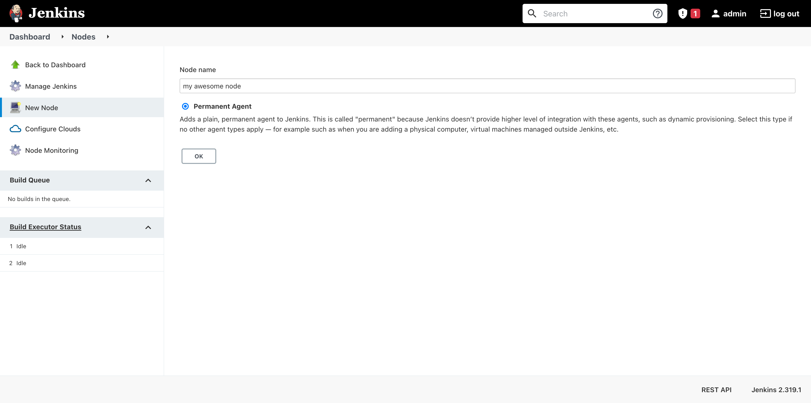

## Introduction

[Jenkins](https://www.jenkins.io/) is a free and open source automation server.

In this tutorial, we'll be setting up an extra build executor for an already set up Jenkins installation. If you don't have a Jenkins installation set up yet, we recommend following our tutorial on [how to install and configure Jenkins](/tutorials/install-and-configure-jenkins-on-ubuntu).

There can be many reasons for setting up an extra executor, for example for security (not wanting the builds to be ran on the same machine that also handles jenkins authentication), or simply to add more capacity.

**Prerequisites**

- a cloud server
- a Jenkins installation, set up on a different machine

## Step 1 - Installing the Java Runtime Environment

Just like Jenkins itself, Jenkins executors also require a Java Runtime Environment, JRE for short, to run. The latest version of Jenkins requires either Java 8 or 11.
First, we'll update the local package lists.

```bash
sudo apt update
```

Now, we can install OpenJDK. In this tutorial we'll use Java 11. If you want to, you can use Java 8 instead. When using Java 8, simply replace `openjdk-11-jre` with `openjdk-8-jre` in the command below.

> Note: If you're planning on building Java applications on this executor, you should install the JDK (`openjdk-11-jdk`), rather than the JRE.

```bash
sudo apt install openjdk-11-jre
```

## Step 2 - Creating the executor

Now that we've installed a Java Runtime Environment, it's time to create our executor in Jenkins.

In your Jenkins installation, go to the *Manage Jenkins* section and click on *Manage Nodes and Clouds*.


Then, click on the *New Node* button in the sidebar and give your node a name. Select the type *Permanent Agent*.



Now, you'll have to decide on a remote root directory. This is the directory Jenkins will use to cache workspaces and other tools. In this tutorial we'll use */var/jenkins*.

If you want to be able to run more than one build simultaneously, you can increase the *Number of executors* value to a higher number.

If you don't want to open an additional port on your Jenkins master node, or are behind a service like Cloudflare, check the *Use websocket* checkmark.


Now, scroll down and hit *Save*.

You'll now see a list of your nodes. As you can see, the node we just created is offline. Click the node to see the agent launch command.

> Note: If instead of a launch command you see the error message "JNLP agent port is disabled and agents cannot connect this way.", you will have to click the link to the security settings and set either a fixed or random TCP port for inbound agents (in the Agents section).


Keep this page open, since we'll need it in the next step.

## Step 3 - Setting up the executor

Now that we've installed a JRE and created the executor in Jenkins, it's finally time to actually set up the executor machine. In this tutorial, we'll create a systemd service for our executor.

First, we'll create a user account for our executor to run on.

```bash
sudo useradd jenkinsexecutor
```

Now, we'll create the working directory we chose earlier. We'll also make our jenkinsexecutor user own it.

```bash
sudo mkdir /var/jenkins
sudo chown jenkinsexecutor:jenkinsexecutor /var/jenkins
```

After we've created our directory, we can download the JNLP agent. To copy the download URL, right click *agent.jar* (highlighted in blue) on the page with the agent launch command, and hit copy link. You should get a link like this:

```
https://jenkins.example.com/jnlpJars/agent.jar
```

We'll now save this agent to */var/jenkins/agent.jar*

```
curl https://jenkins.example.com/jnlpJars/agent.jar -o /var/jenkins/agent.jar
```

Now, we can create a systemd service for the Jenkins executor.

```bash
sudo nano /etc/systemd/system/jenkins-executor.service
```

Copy and paste the following service config into the file you just created. Replace `/var/jenkins` with your working directory (if using a different one). You'll also **need** to replace the command in ExecStart with the command shown in the page with the agent launch command (at the end of step two).

```
[Unit]
Description=Jenkins Executor service
After=network.target

[Service]
Type=simple
User=jenkinsexecutor
WorkingDirectory=/var/jenkins
ExecStart=java -jar agent.jar -jnlpUrl https://jenkins.example.com/computer/my%20awesome%20node/jenkins-agent.jnlp -secret c036798c544c3b24afc50de20768f1113d5f5b44bbceda029c9383cf871118ab -workDir "/var/jenkins"
Restart=always
RestartSec=30s

[Install]
WantedBy=multi-user.target
```

Now, we can start the systemd service we just created.

```bash
sudo systemctl enable --now jenkins-executor
```

If you did everything correctly, the executor page should no longer show the launch command after refreshing.


## Step 3 - Disabling job execution on the built-in node (optional)

For security reasons, Jenkins recommends disabling job execution for the built-in executor on the master node.

To do this, go to the *Manage Jenkins* section and click on *Manage Nodes and Clouds*.


Then, click the cog icon next to *Built-In Node*. Set *Number of executors* to zero and save.

## Conclusion

Congratulations, you have now set up an additional Jenkins build executor!

You can repeat the steps in this guide for as many times as you want, if you want to add even more executors.

If you haven't already, try creating a new job using the *New Item* button.

##### License: MIT

<!--

Contributor's Certificate of Origin

By making a contribution to this project, I certify that:

(a) The contribution was created in whole or in part by me and I have
    the right to submit it under the license indicated in the file; or

(b) The contribution is based upon previous work that, to the best of my
    knowledge, is covered under an appropriate license and I have the
    right under that license to submit that work with modifications,
    whether created in whole or in part by me, under the same license
    (unless I am permitted to submit under a different license), as
    indicated in the file; or

(c) The contribution was provided directly to me by some other person
    who certified (a), (b) or (c) and I have not modified it.

(d) I understand and agree that this project and the contribution are
    public and that a record of the contribution (including all personal
    information I submit with it, including my sign-off) is maintained
    indefinitely and may be redistributed consistent with this project
    or the license(s) involved.

Signed-off-by: Noah van der Aa <ndvdaa@gmail.com>

-->
