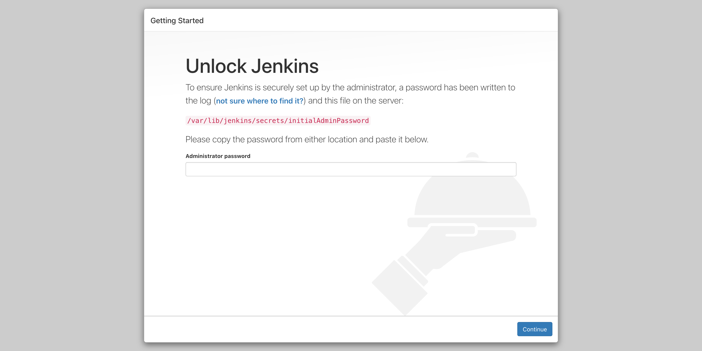
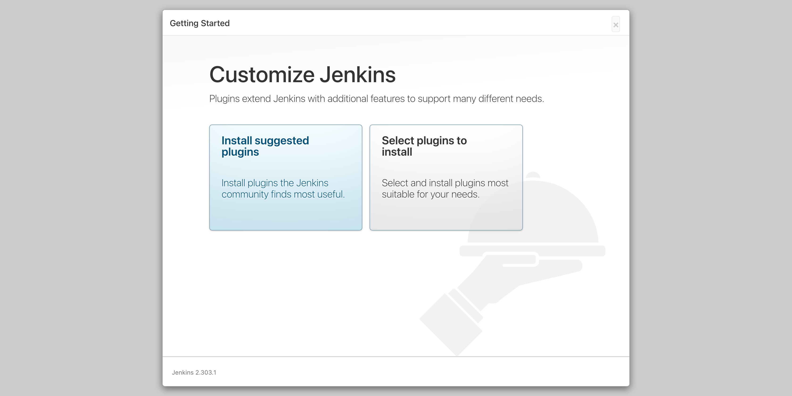
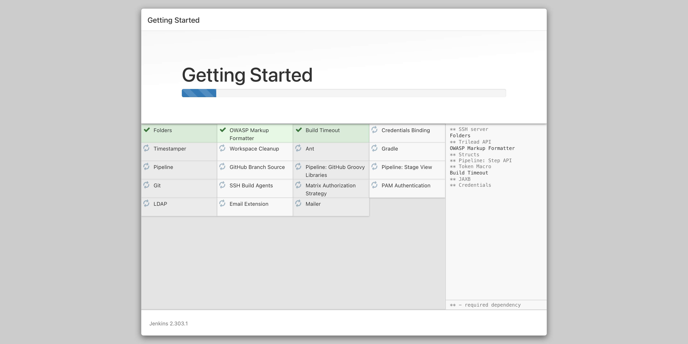
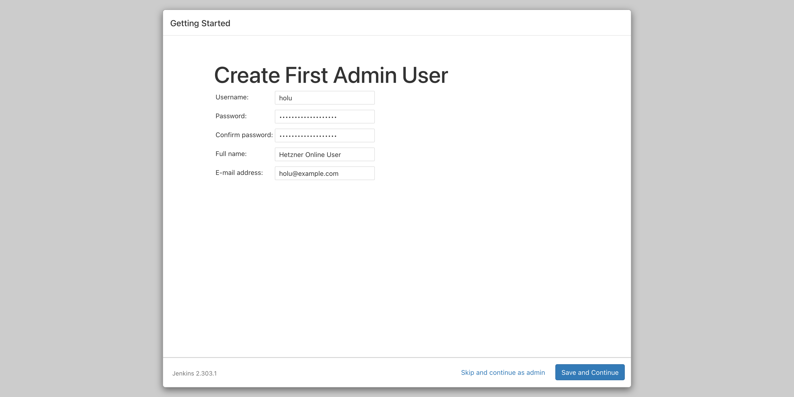
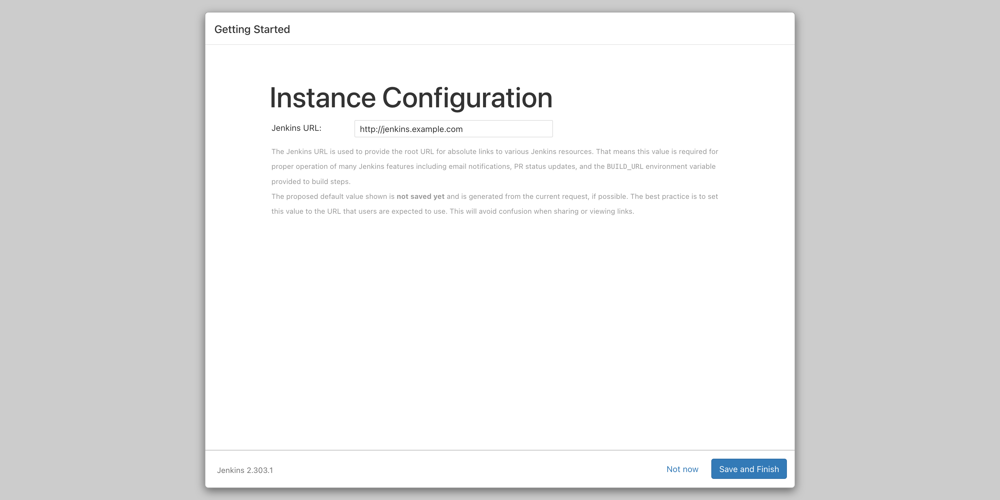

## Introduction

[Jenkins](https://www.jenkins.io/) is a free and open source automation server.

In this tutorial, we'll be installing Jenkins and optionally set up a reverse proxy with NGINX.

**Prerequisites**

- a cloud server
- a domain (optional)
  - When using a domain, create an A record, such as `jenkins.example.com` pointing to your server's IP.

## Step 1 - Installing the Java Runtime Environment

Jenkins requires a Java Runtime Environment, JRE for short, to run. The latest version of Jenkins requires either Java 8 or 11.

First, we'll update the local package lists.

```bash
sudo apt update
```

Now, we can install OpenJDK. In this tutorial we'll use Java 11. If you want to, you can use Java 8 instead. When using Java 8, simply replace `openjdk-11-jre` with `openjdk-8-jre` in the command below.

```bash
sudo apt install openjdk-11-jre
```

## Step 2 - Installing Jenkins

Now that we've installed a Java Runtime Environment, it's time to install Jenkins.

### Step 2.1 - Adding the Jenkins package repository

Jenkins can be installed as an apt package for easy installation and updating. To use this repository, we have to add the key first.

```bash
wget -q -O - https://pkg.jenkins.io/debian-stable/jenkins.io.key | sudo apt-key add -
```

Now that we've added the key, we can add a repository entry:

```bash
sudo sh -c 'echo deb https://pkg.jenkins.io/debian-stable binary/ > /etc/apt/sources.list.d/jenkins.list'
```

### Step 2.2 - Installing the Jenkins package

After adding the repository, we'll have to update our local package lists.

```bash
sudo apt update
```

Now we can install Jenkins.

```bash
sudo apt install jenkins
```

## Step 3 - Setting up a reverse proxy (Optional)

If you intend on directly accessing Jenkins (e.g. 10.0.0.1:8080) without a reverse proxy, you can skip to step 4.

### Step 3.1 - Restricting external access

First, we'll make sure Jenkins cannot be accessed from the outside, like you would without a reverse proxy. To do this, we'll tell Jenkins to only listen on localhost (127.0.0.1).

Edit the config file at `/etc/defaults/jenkins`.

```bash
sudo nano /etc/default/jenkins
```

Scroll all the way down to where `JENKINS_ARGS` is defined. It should look something like this:

```shell
JENKINS_ARGS="--webroot=/var/cache/$NAME/war --httpPort=$HTTP_PORT"
```

Now, add `--httpListenAddress=127.0.0.1` to the end of the definition.

```shell
JENKINS_ARGS="--webroot=/var/cache/$NAME/war --httpPort=$HTTP_PORT --httpListenAddress=127.0.0.1"
```

We can now save the config file and restart Jenkins.

```bash
sudo systemctl restart jenkins
```

### Step 3.2 - Installing the reverse proxy

It's time to install the reverse proxy. We'll be using NGINX for this.

```bash
sudo apt install nginx
```

If you use a firewall, make sure to allow external access to port 80.

We can now create our NGINX config for Jenkins.

```bash
sudo nano /etc/nginx/sites-available/jenkins
```

Copy and paste the following config file into the file you just created and replace `jenkins.example.com` with the (sub)domain you want to use.

```nginx
upstream jenkins {
  keepalive 32; # keepalive connections
  server 127.0.0.1:8080; # jenkins ip and port
}

# Required for Jenkins websocket agents
map $http_upgrade $connection_upgrade {
  default upgrade;
  '' close;
}

server {
  listen          80;       # Listen on port 80 for IPv4 requests

  server_name     jenkins.example.com;  # replace 'jenkins.example.com' with your server domain name

  # this is the jenkins web root directory
  # (mentioned in the /etc/default/jenkins file)
  root            /var/run/jenkins/war/;

  access_log      /var/log/nginx/jenkins/access.log;
  error_log       /var/log/nginx/jenkins/error.log;

  # pass through headers from Jenkins that Nginx considers invalid
  ignore_invalid_headers off;

  location ~ "^/static/[0-9a-fA-F]{8}\/(.*)$" {
    # rewrite all static files into requests to the root
    # E.g /static/12345678/css/something.css will become /css/something.css
    rewrite "^/static/[0-9a-fA-F]{8}\/(.*)" /$1 last;
  }

  location /userContent {
    # have nginx handle all the static requests to userContent folder
    # note : This is the $JENKINS_HOME dir
    root /var/lib/jenkins/;
    if (!-f $request_filename){
      # this file does not exist, might be a directory or a /**view** url
      rewrite (.*) /$1 last;
      break;
    }
    sendfile on;
  }

  location / {
      sendfile off;
      proxy_pass         http://jenkins;
      proxy_redirect     default;
      proxy_http_version 1.1;

      # Required for Jenkins websocket agents
      proxy_set_header   Connection        $connection_upgrade;
      proxy_set_header   Upgrade           $http_upgrade;

      proxy_set_header   Host              $host;
      proxy_set_header   X-Real-IP         $remote_addr;
      proxy_set_header   X-Forwarded-For   $proxy_add_x_forwarded_for;
      proxy_set_header   X-Forwarded-Proto $scheme;
      proxy_max_temp_file_size 0;

      #this is the maximum upload size
      client_max_body_size       10m;
      client_body_buffer_size    128k;

      proxy_connect_timeout      90;
      proxy_send_timeout         90;
      proxy_read_timeout         90;
      proxy_buffering            off;
      proxy_request_buffering    off; # Required for HTTP CLI commands
      proxy_set_header Connection ""; # Clear for keepalive
  }

}
```

By default, `/var/log/nginx/jenkins` won't exist. We'll have to make it and give NGINX write access to it.

```bash
sudo mkdir -p /var/log/nginx/jenkins
sudo chown www-data:www-data /var/log/nginx/jenkins
```

Now, we'll create a symlink to enable our config.

```bash
sudo ln -s /etc/nginx/sites-available/jenkins /etc/nginx/sites-enabled/jenkins
```

Finally, we'll restart NGINX to make our changes take effect.

```bash
sudo systemctl restart nginx
```

## Step 4 - Following the installation wizard

You should now be able to access your Jenkins instance. If you're using a reverse proxy, you can go to your (sub)domain in your browser. If you're not using a reverse proxy, go to http://your-ip:8080 in your browser (e.g http://10.0.0.1:8080).

After accessing your Jenkins installation, you should now see a page like this:



To prevent unauthorized installations, Jenkins will ask you to enter the contents of the file `/var/lib/jenkins/secrets/initialAdminPassword`. You can get the contents of the file like this:

```bash
sudo cat /var/lib/jenkins/secrets/initialAdminPassword
```

Jenkins will now ask you if you want to install the recommended selection of plugins, or choose which plugins you want to use yourself. For this tutorial, we'll use the recommended plugins.



Jenkins will now install the plugins.



Now, Jenkins will ask you to create the first admin user. Choose a username and password and enter your full name and email.



For the final step, Jenkins will ask you your root URL. This should be the URL you are currently using to access Jenkins. This will be set by default.



## Conclusion

Congratulations, you have now set up Jenkins!

You can now create other user accounts in the *Manage Jenkins* section or set up your first job using the *New Item* button.

##### License: MIT

<!--

Contributor's Certificate of Origin

By making a contribution to this project, I certify that:

(a) The contribution was created in whole or in part by me and I have
    the right to submit it under the license indicated in the file; or

(b) The contribution is based upon previous work that, to the best of my
    knowledge, is covered under an appropriate license and I have the
    right under that license to submit that work with modifications,
    whether created in whole or in part by me, under the same license
    (unless I am permitted to submit under a different license), as
    indicated in the file; or

(c) The contribution was provided directly to me by some other person
    who certified (a), (b) or (c) and I have not modified it.

(d) I understand and agree that this project and the contribution are
    public and that a record of the contribution (including all personal
    information I submit with it, including my sign-off) is maintained
    indefinitely and may be redistributed consistent with this project
    or the license(s) involved.

Signed-off-by: Noah van der Aa <ndvdaa@gmail.com>

-->
