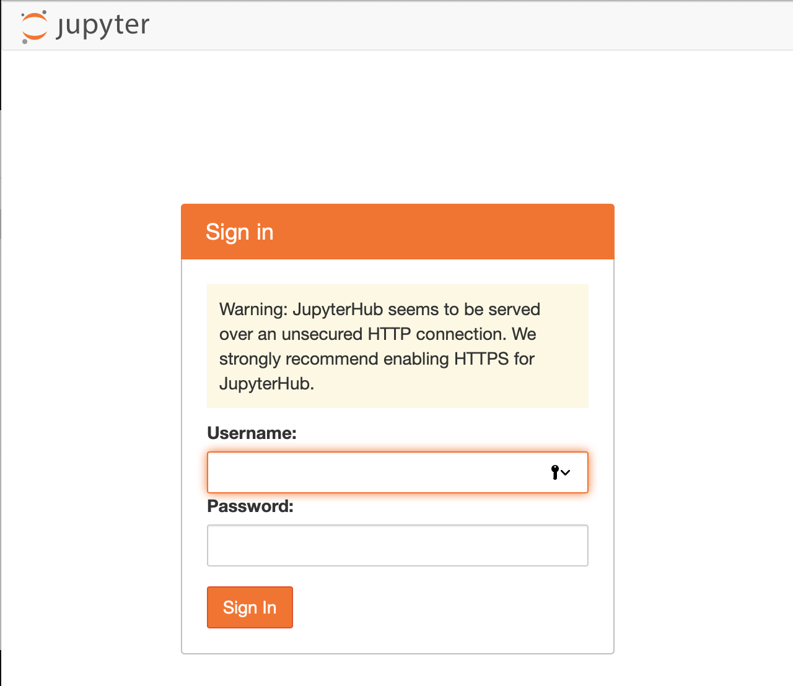
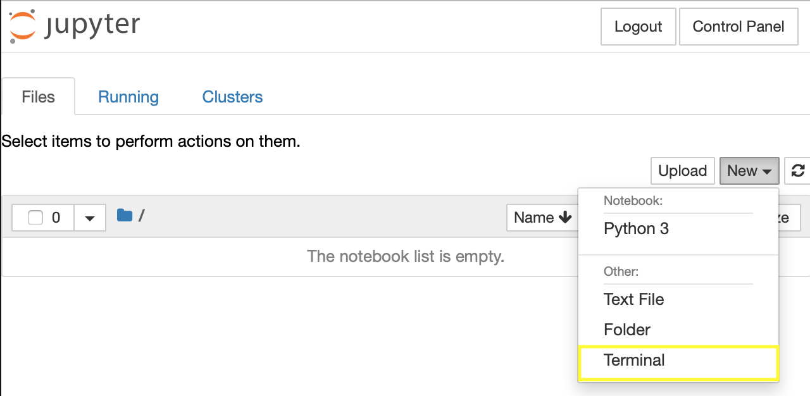
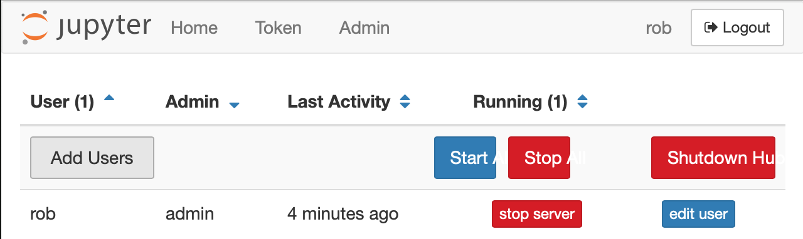
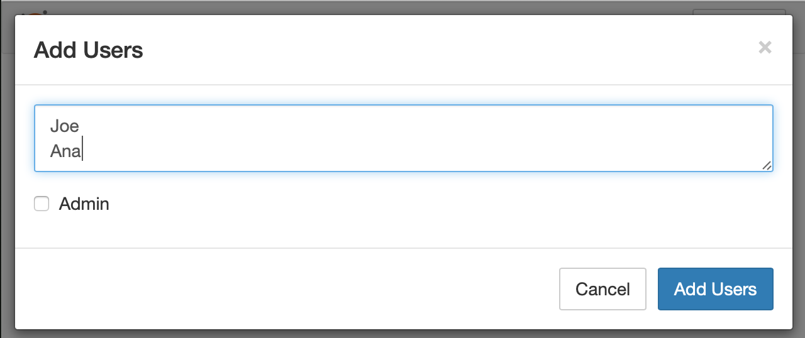

## Introduction

[JupyterHub](https://jupyterhub.readthedocs.io/en/stable/) is a multi-user system for publishing Jupyter notebooks. It can be used in collaborative settings like a classroom, a corporate data analysis group or a scientific research group. JupyterHub manages muliple instances of the Jupyter notebook server and provides a single point of management.

There are two flavors for JupyterHub. One is based on a distributed set of servers managed by Kubernetes for scalability to a large number of users and machines. The simpler version is called [The Littlest JupyterHub (TLJH)](https://the-littlest-jupyterhub.readthedocs.io/en/latest/index.html) and can support up to 100 users on a single machine. This tutorial will cover the installation of the TLJH.

**Prerequisites**

To follow the steps in this tutorial, you will need the following:
* A server running Ubuntu 18.04 with at least 768MB of RAM
* Ability to access the server via SSH with sudo permissions
* A public IP address where the server can be reached by the JupyterHub users

This tutorial was tested using a Ubuntu 18.04 install on a CX11 server on Hetzner Cloud.

## Step 1 - Install the prerequisites

Start by using the terminal program of your choice to SSH into the server. Ensure that you have the installation prerequisites on the server by running:

```
sudo apt install python3 git curl gcc python3-dev
```

## Step 2 - Run the JupyterHub installer

Copy the text below and paste it into the terminal. Replace the \<admin-user-name> with the name of your admin user for JupyterHub. The admin user can be used after installation to configure the server and set up additional users.

```
curl https://raw.githubusercontent.com/jupyterhub/the-littlest-jupyterhub/master/bootstrap/bootstrap.py | sudo -E python3 - --admin \<admin-user-name>
```

After you have copied the text and set the <admin-user-name>, press Enter to begin the install. The install will download files for the installation and then run scripts to perform the setup. This will typically take about 5-10 minutes and will return 'Done!' when the installation process is complete.

## Step 3 - Access the server

Using the IP address for the server, try to access JupyterHub using http://\<public-ip> from your web browser. You should see the JupyterHub login page.



Login using the \<admin-user-name> you set in step 2 using any password. The password you set here will be used for this account in the future so make sure you use a strong password and note it down (or better yet, store it in your password manager).

At this point, you have a working JupyterHub.

## Step 4 - Install packages

The basic JupyterHub install only contains core Python libraries. To do real work, you will need to install additional packages. This is done with the `sudo -E pip install` command.

As an example, we will install the pandas library. Starting with your logged in admin user, open a terminal in JupyterHub in your browser using the following menu:



This terminal allows you to run commands in the JupyterHub environment. To install pandas, type the following into this terminal.

```
sudo -E pip install pandas
```

This will load the pandas package into JupyterHub where it can be used in any notebook. If you already have a Python notebook running, you will need to restart the notebook kernel to see the new package.

## Step 5 - Add users

Once you have a running install of JupyterHub, you can add additional users. This is done in the web browser using the <admin-user-name> login. To do this, open the control panel in JupyterHub:


From the Control Panel, select the Admin link.



In the Admin Page, click the Add Users button and create additional users. If the users should have administrative priviliges, select the Admin checkbox.



After you click the Add Users button, the users are added to the JupyterHub. The first time they login, they will need to set their password for future access.

## Conclusion

By following this tutorial you have installed JupyterHub, added some Python libraries and users so they can get started using Jupyter Notebooks. At this point, you should consider [enabling HTTPS](https://the-littlest-jupyterhub.readthedocs.io/en/latest/howto/admin/https.html#howto-admin-https).

A nice feature of running JupyterHub on Hetzer Cloud is that you can upgrade your server to a larger instance to get more power when you need it. If you need even more performance, you can install JupyterHub on Kubernetes in Hetzer Cloud.

##### License: MIT

<!--

Contributor's Certificate of Origin

By making a contribution to this project, I certify that:

(a) The contribution was created in whole or in part by me and I have
    the right to submit it under the license indicated in the file; or

(b) The contribution is based upon previous work that, to the best of my
    knowledge, is covered under an appropriate license and I have the
    right under that license to submit that work with modifications,
    whether created in whole or in part by me, under the same license
    (unless I am permitted to submit under a different license), as
    indicated in the file; or

(c) The contribution was provided directly to me by some other person
    who certified (a), (b) or (c) and I have not modified it.

(d) I understand and agree that this project and the contribution are
    public and that a record of the contribution (including all personal
    information I submit with it, including my sign-off) is maintained
    indefinitely and may be redistributed consistent with this project
    or the license(s) involved.

Signed-off-by: Rob Ericsson rob@l10systems.com
