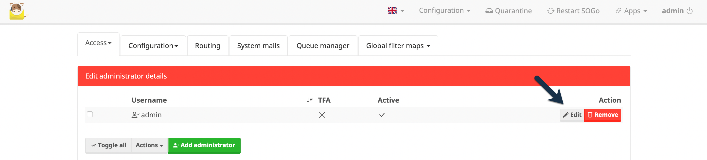
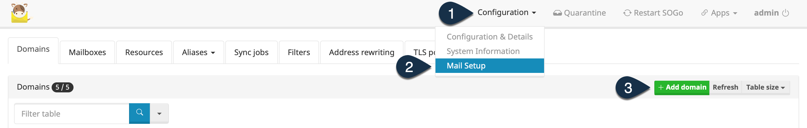
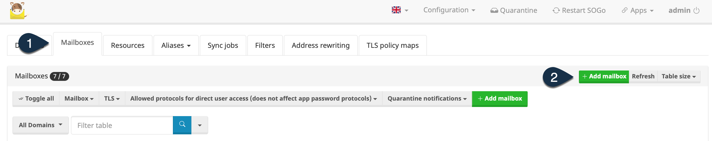
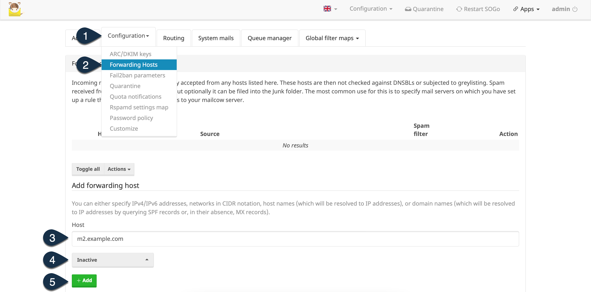
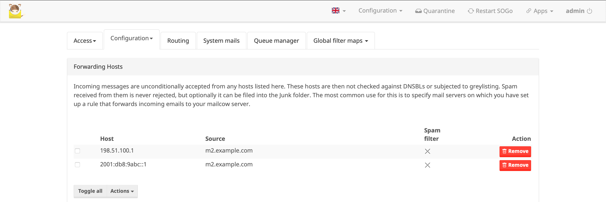
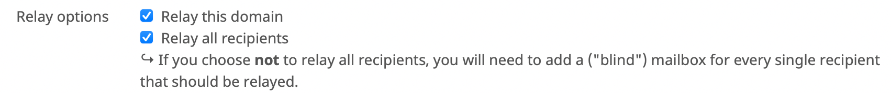
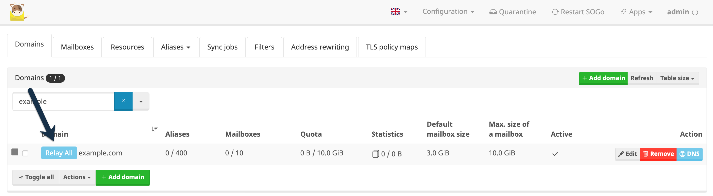
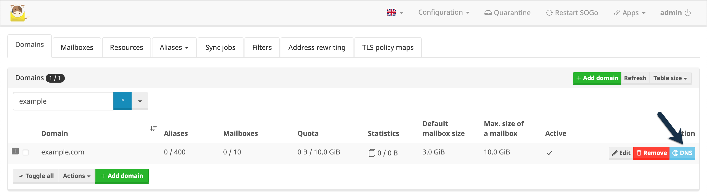
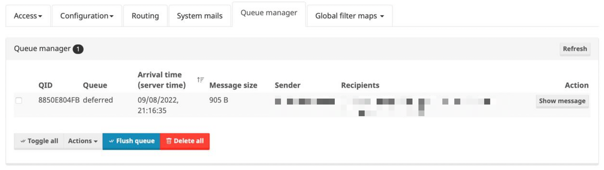

## Introduction

This tutorial describes the installation and configuration of the mailserver suite [Mailcow](https://mailcow.email). Mailcow is a fully featured groupware solution based on Docker. You can setup it easily on a single Hetzner Cloud Server. If you want a high availability solution for recieving mails, you can make use of a second instance acting as a backup MX on another Hetzner Cloud Server in a different location. This tutorial describes the full process with high availability, but you can also setup only one instance. It's your choice.

### Backup MX
Backup MX relies on the fact that every domain that has an email server has more than one MX record in its DNS server zone. The MX (Mail Exchange) record specifies which mailserver is responsible for handling messages in that domain. Each MX record is assigned with a priority. This priority entry in the MX record determines the order in which the mail servers will be chosen. The mailserver with the lowest priority is winning. It is irrelevant which number is used as priority. For example, 1 can be used for the primary server and 2 for the secondary server. However, 10 and 20 can also be used, or 5 and 50, and so on, you get it.

If the server with the lowest priority is not reachable by the opposite mailserver, the next server with a higher priority will be choosen. As long as the primary mail server is offline, all messages are cached on the secondary mail server. When the primary server is online again, the messages are transferred to it and delivered to the individual mailboxes.

### Prerequisites

For the installation of Mailcow, you will need at least one server. If you want high avaliabilty for recieving mails (Backup MX), you have to deploy a secondary server as well. It is recommendes to deploy the two server in different locations.

**Primary Server**

* Operating System: Ubuntu 22.04
* Location: Your favourite location, e.g. Nürnberg
* System Ressoures: CX21 with disabled AntiVirus and Solr, CX31 or above with enabled AntiVirus and Solr
* Hostname: `<m1.example.com>`
* Public reachable IPv4 and IPv6 address

**Secondary Server**

* Operating System: Ubuntu 22.04
* Location: Another one as the location of the primary server, e.g. Falkenstein
* System Ressoures: CX21 with disabled AntiVirus and Solr, CX31 or above with enabled AntiVirus and Solr
* Hostname: `<m2.example.com>`
* Public reachable IPv4 and IPv6 address

**DNS Records**

Prior to the installation of Mailcow, you need to configure the following DNS records. The values must be replaced with the values from your setup. 

For each server you need to create an A for the corresponding IPv4 address and an AAAA record for the IPv6 address:
* A record: `m1.example.com` -> `<198.51.100.1>`
* AAAA record `m1.example.com` ->  `<2001:db8:9abc::1>`
* A record: `m2.example.com` -> `<198.51.100.2>`
* AAAA record `m2.example.com` ->  `<2001:db8:9abc::2>`

On the level of the domain, create the following two MX records: 
* Priotity: 10  /  Server: `m1.example.com`
* Priority: 20  /  Server: `m2.example.com`

Note that the creaton of DNS records can take up to multiple hours.

## Step 1 - Docker Installation

Mailcow is fully build with Docker Containers, therefore we need to install the Docker Engine first to get everything up and running. These steps need to be performed on every server.

First, we update all packages on the server. This step should be performed on every new server. 
```shell
sudo apt update && sudo apt upgrade -y
```

The following packages are required to allow apt to use a repository over HTTPS. To ensure that all requirements are met, the following packages should be installed.
```shell
sudo apt-get install ca-certificates curl gnupg lsb-release
```

Now we add Docker’s official GPG key:
```shell
sudo mkdir -p /etc/apt/keyrings && curl -fsSL https://download.docker.com/linux/ubuntu/gpg | sudo gpg --dearmor -o /etc/apt/keyrings/docker.gpg
```

Use the following command to set up the official Docker repository:
```shell
echo "deb [arch=$(dpkg --print-architecture) signed-by=/etc/apt/keyrings/docker.gpg] https://download.docker.com/linux/ubuntu \
  $(lsb_release -cs) stable" | sudo tee /etc/apt/sources.list.d/docker.list > /dev/null
```

Now update the package index and install the latest version of Docker Engine, containerd, and Docker Compose.

```shell
sudo apt-get update && sudo apt-get install docker-ce docker-ce-cli containerd.io docker-compose-plugin
```

Verify that Docker Engine is installed correctly by running the hello-world image. This command downloads a test image and runs it in a container. When the container runs, it prints a message.
```shell
sudo docker run hello-world
```

If you see the message, the Docker Engine is installed and running. By default, Docker commands can only be executed as root. If you want to manage Docker as a non-root user, you need to add the users to the docker group. 
This command adds the current user to the docker group, if you want to add another user, replace $USER with the desired username.
```shell
sudo usermod -aG docker $USER
```

Re-Login with the user and try to create a new container with the hello-world image without sudo. You should now be able to see the message without the use of sudo or running as root user. 
```shell
docker run hello-world
```

Since Mailcow need Docker-Compose in Version 2.X, we have to install the specific Version of the docker-compose binary. 
```shell
curl -SL https://github.com/docker/compose/releases/download/v2.7.0/docker-compose-linux-x86_64 -o /usr/local/bin/docker-compose && chmod +x /usr/local/bin/docker-compose
```

Congratulations, you successfully installed the Docker Engine and all required prerequisites for Mailcow. 

## Step 2 - Mailcow Installation

Referring to the official documentation, the following steps have to be performed as root. 

As the first step, make sure your umask equals 0022. umask (user file-creation mode) is a Linux command that lets you set up default permissions for newly created files and folders. The output of the following command must be 0022. 
```shell
umask
```

Clone the master branch of the Mailcow repository and navigate into the new created folder.
```shell
git clone https://github.com/mailcow/mailcow-dockerized && cd mailcow-dockerized
```

Generate the Mailcow configuration file with the corresponding script. Use a FQDN as hostname when asked. For the primary server, the FQDN will be `m1.example.com`, for the secondary server use `m2.example.com`.
Follow all further steps in the script. If you want to change a value after running the script, just modify the corresponding file `mailcow.conf`
```shell
./generate_config.sh
```

Now we are ready to download all container images and fire up the whole Mailcow stack.
```shell
docker-compose pull && docker-compose up -d
```

After a few minutes you should be able to open the Mailcow Administration with the URL `https://m1.example.com` / `https://m2.example.com`. The default username is `admin` with the password `moohoo`.

Congratulations, you successfully installed Mailcow.

## Step 3 - Mailcow Configuration

First of all, change the default password of the admin user. Login into the Mailcow Administration and click the edit button near the admin user. Enter a new secure administration password and save the changes.



### Primary Node

On the primary server you need to configure the domain and all mailboxes.

**Add Domain**

To add a domain, navigate to "Configuration -> Mail Setup". Add the domain by clicking the button "Add domain".



Fill out the form with all informations and save the changes with a click on the button "Add domain and restart SoGo". Repeat this step for all domains that you want to make available on the mailserver.

**Add mailboxes**

To add a mailbox to a configured domain, navigate to the tab "Mailboxes" and click the button "Add mailbox"



Fill out the form with all informations and save the changes with a click on the button "Add". Repeat this step for all mailboxes that you want to make available on the mailserver.

**Add secondary Server as forwarding host**

If you build the high availability solution with a second server, add the secondary server as a forwarding host into the configuration of the primary server. Navigate in the header navigation to "Configuration -> Mail Setup". Next open the configuration of the forwarding hosts which you will find in the section "Forwarding Hosts" in the Tab "Configuration".

Add the hostname of the secondary server, disable the spam filter and confirm it with a click on the button "Add".



You should now see the secondary server in the list of the forwarding hosts.



Congratulations, you successfully configured a domain and mailboxes on the primary server.

If you plan is to setup only one instance of Mailcow without high availability you can end here. If you setup high availability with a backup MX, continue with the next step.

### Secondary Node

On the secondary server you will only configure the domain without any mailboxes. 

**Add domain**

To add a domain, navigate to "Configuration -> Mail Setup". Add the domain by clicking the button "Add domain".


Fill out the form with all informations and make shure to check the checkboxes at "Relay this domain" and "Relay all recipientes".



Save the domain with a click on the button "Add domain and restart SoGo". Unlike the domain on the primary server, this one has a "Relay All" marker in the domain list.



Repeat this step for all domains that you want to make available on the mailserver.

Congratulations, you successfully configured a relay domain on the secondary server.

### Additional DNS records

To ensure that the sent messages reach the recipient and are not classified as spam, additional DNS records must be created. SPF and DKIM represent two essential points in spam checking. Many large providers automatically classify a message as spam if these entries are not properly configured. 

To view the entries that need to be configured, open the domain list on the primary server and click the button "DNS" near the corresponding domain. 



Create the records as shown in the list and check them. Note that the creaton of DNS records can take up to multiple hours.

## Test of the entire setup

Once everything is configured, the entire setup can be tested. For the test you need at least one domain and one mailbox configured.

### Test primary server

To test the primary mailserver, you can simply send a mail to a configured mailbox. If the message arrives everything works like a charm.

### Test secondary server

To test the secondary server and the backup MX, power off the primary server. After powering off the primary server, just send a mail to a configured mailbow. Since the first mail server is unreachable, the sender's mail server selects the secondary server based on the priority on the MX record. 

On the secondary server open the queue manager. You will find the sent mail in the list. 



Now power on the primary server. After a couple of minutes, the secondary server will recognize that the primary server is online again and will deliver the mails to them. If you won't wait, you can force the delivery by clicking the button "Flush queue"

Now you will find the mail in the corresponding mailbox on the primary server.

## Conclusion

You have installed and configured a full groupware solution with Mailcow and high availability for recieving mails.

##### License: MIT

<!--123

Contributor's Certificate of Origin

By making a contribution to this project, I certify that:

(a) The contribution was created in whole or in part by me and I have
    the right to submit it under the license indicated in the file; or

(b) The contribution is based upon previous work that, to the best of my
    knowledge, is covered under an appropriate license and I have the
    right under that license to submit that work with modifications,
    whether created in whole or in part by me, under the same license
    (unless I am permitted to submit under a different license), as
    indicated in the file; or

(c) The contribution was provided directly to me by some other person
    who certified (a), (b) or (c) and I have not modified it.

(d) I understand and agree that this project and the contribution are
    public and that a record of the contribution (including all personal
    information I submit with it, including my sign-off) is maintained
    indefinitely and may be redistributed consistent with this project
    or the license(s) involved.

Signed-off-by: [submitter's name and email address here]

-->
