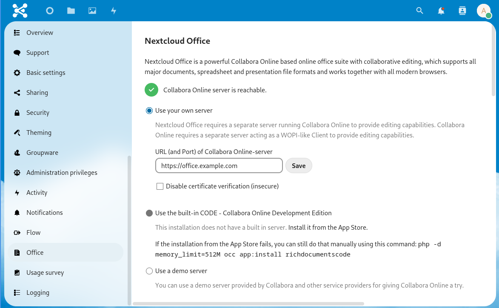

## Einleitung

Collabora kann genutzt werden um Office Dokumente direkt in der Nextcloud Weboberfläche anzuzeigen und zu bearbeiten.

Dieses Tutorial beschreibt die Einrichtung eines externen Collabora Online Server und die Einrichtung in einer Nextcloud. Der Collabora Online Server wird mit SSL Zertifikate von Let's Encrypt konfiguriert um eine vertrauenswürdige SSL Verbindung bereitzustellen.

**Vorraussetzungen**

Du benötigst die folgenden Dinge

* ein Server mit Ubuntu 20.04 (andere Ubuntu Versionen sollten aber auch funktionieren)
* eigene Domain wie z.b. `example.com`
* eigene Subdomain die auf deinen geplanten Collabora Server zeigt (z.b. auf `office.example.com`)
* eine Nextcloud (in diesem Tutorial `nextcloud.example.com`)

## Schritt 1 - Docker Repositories einrichten

Docker wird benötigt um den Collabora Docker Container auszuführen. Um Docker installieren zu können müssen zuerst die Repositories eingerichtet werden:

```shell=
apt update
apt install apt-transport-https ca-certificates curl gnupg lsb-release
curl -fsSL https://download.docker.com/linux/ubuntu/gpg | gpg --dearmor -o /usr/share/keyrings/docker-archive-keyring.gpg
echo \
  "deb [arch=amd64 signed-by=/usr/share/keyrings/docker-archive-keyring.gpg] https://download.docker.com/linux/ubuntu \
  $(lsb_release -cs) stable" | sudo tee /etc/apt/sources.list.d/docker.list > /dev/null
```

## Schritt 2 - Docker installieren

Nun kann Docker installiert werden:

```shell=
apt update
apt install docker-ce docker-ce-cli containerd.io
```

## Schritt 3 - Collabora Container starten

Mit installieren Docker kann nun der Collabora Container gestartet werden. Setze die `domain` Variable auf die Adresse deiner Nextcloud (hierbei müssen `.` mit `\\.` ersetzt werden da sie sonst von der Shell falsch ersetzt werden)

```shell=
docker run -t -d -p 127.0.0.1:9980:9980 -e "domain=nextcloud\\.example\\.com" --restart always collabora/code
```

Nun wird der neueste Container heruntergeladen und gestartet. Den Status des laufenden Containers kann mittels `docker ps` geprüft werden.

Optional kann auch Docker Compose genutzt werden. Hierfür kann [hier](docker-compose-as-systemd-service) eine allgemeine Anleitung gefunden werden.

## Schritt 4 - Nginx installieren

Damit der Collabora Container über das Internet erreicht werden kann wird ein SSL Reverse Proxy eingesetzt. Dieses Tutorial nutzt hierfür Nginx.

Installiere Nginx über die Kommandozeile mit:

```shell=
apt install nginx
```

## Schritt 5 - Installiere Let's Encrypt Certbot via Snap

Für die Netzwerkverbindung wird ein vertrauenswürdiges SSL Zertifikat benötigt. Dieses kann mit Let's Encrypt's Certbot generiert werden. Installiere diesen via Snap:

```shell=
apt install snapd
snap install --classic certbot
ln -s /snap/bin/certbot /usr/bin/certbot
```

## Schritt 6 - SSL Zertifikate erstellen

Nun können die SSL Zertifikate erstellt werden. Passe dabei die Domain auf die Domain deines Collabora Servers an:

```shell=
certbot certonly --nginx -d office.example.com
[...]
IMPORTANT NOTES:
 - Congratulations! Your certificate and chain have been saved at:
   /etc/letsencrypt/live/office.example.com/fullchain.pem
   Your key file has been saved at:
   /etc/letsencrypt/live/office.example.com/privkey.pem
```

Hinweiß: Merke dir kurz die Pfade der SSL Zertifikate da diese im nächsten Schritt für die Nginx Konfiguration benötigt werden.

## Schritt 7 - Nginx als Reverse Proxy konfigurieren

Füge mit einem Texteditor deiner Wahl (z.b. `nano` oder `vim`) die folgende Konfiguration in die neue Datei `/etc/nginx/sites-enabled/collabora` ein. Editiere die Variablen `server_name`, `ssl_certificate` und `ssl_certificate_key` so, dass sie auf deine Adressen passen:

```nginx=
server {
    listen       443 ssl;

    # modify this three lines with your own domain:
    server_name  office.example.com;
    ssl_certificate /etc/letsencrypt/live/office.example.com/fullchain.pem;
    ssl_certificate_key /etc/letsencrypt/live/office.example.com/privkey.pem;

    # static files
    location ^~ /loleaflet {
        proxy_pass https://localhost:9980;
        proxy_set_header Host $http_host;
    }

    # WOPI discovery URL
    location ^~ /hosting/discovery {
        proxy_pass https://localhost:9980;
        proxy_set_header Host $http_host;
    }

    # Capabilities
    location ^~ /hosting/capabilities {
        proxy_pass https://localhost:9980;
        proxy_set_header Host $http_host;
    }

    # main websocket
    location ~ ^/lool/(.*)/ws$ {
        proxy_pass https://localhost:9980;
        proxy_set_header Upgrade $http_upgrade;
        proxy_set_header Connection "Upgrade";
        proxy_set_header Host $http_host;
        proxy_read_timeout 36000s;
    }

    # download, presentation and image upload
    location ~ ^/lool {
        proxy_pass https://localhost:9980;
        proxy_set_header Host $http_host;
    }

    # Admin Console websocket
    location ^~ /lool/adminws {
        proxy_pass https://localhost:9980;
        proxy_set_header Upgrade $http_upgrade;
        proxy_set_header Connection "Upgrade";
        proxy_set_header Host $http_host;
        proxy_read_timeout 36000s;
    }
}
```

Nun muss der Nginx neugestartet werden um die neue Konfiguration zu nutzen:

```shell
systemctl restart nginx
```

## Schritt 8 - Aktiviere die Collabora Online App in Nextcloud

Der Collabora Server selbst ist nun fertig eingerichtet und nutzbar. Nun muss nur noch der Collabora Server in der Nextcloud konfiguriert werden.

In Nextcloud muss die App `Collabora Online` aktiviert werden. Gehe dafür im Web Interface deiner Nextcloud in den App Store (obere rechte Ecke -> `Apps`) und Suche nach `Collabora Online`. Es muss nur die App `Collabora Online` aktiviert werden und keine andere.

## Schritt 9 - Collabora Online App konfigurieren

Nach der Installation muss der Collabora App noch die Adresse des Collabora Servers mitgeteilt werden. Für dies gehen in die Einstellungen deiner Nextcloud (obere rechte Ecke  -> `Einstellungen`) und wähle im linken Menü `Collabora Online` aus. Wähle hier `Verwende Deinen eigenen Server` aus und füge die Adresse deines Collabora Servers ein (z.b. `https://office.example.com`):



Wenn alles funktioniert wird eine erfolgreiche Verbindung angezeigt. Drücke auf `Save` um die Einstellungen dauerhaft zu speichern.

## Schritt 10 - SSL Zertifikate erneuern

Let's Encrypt SSL Zertifikate sind nur für ein paar Monate gültig und müssen dann neu ausgestellt werden. Hierfür kann allerdings ein systemd Timer aktiviert werden der dies automatisch durchführt:

```shell=
systemctl enable --now snap.certbot.renew.timer
```

Die SSL Zertifikate werden damit automatisch neuausgestellt wenn sie sich der Ablaufzeit nähern.

## Fazit

Es wurde ein eigener Collabora Server installiert und in einer Nextcloud eingerichtet. Beim öffnen von Dokumenten im Nextcloud Webinterface wird nun automatisch Collabora geladen um das Dokument bearbeiten zu können.

##### License: MIT

<!--

Contributor's Certificate of Origin

By making a contribution to this project, I certify that:

(a) The contribution was created in whole or in part by me and I have
    the right to submit it under the license indicated in the file; or

(b) The contribution is based upon previous work that, to the best of my
    knowledge, is covered under an appropriate license and I have the
    right under that license to submit that work with modifications,
    whether created in whole or in part by me, under the same license
    (unless I am permitted to submit under a different license), as
    indicated in the file; or

(c) The contribution was provided directly to me by some other person
    who certified (a), (b) or (c) and I have not modified it.

(d) I understand and agree that this project and the contribution are
    public and that a record of the contribution (including all personal
    information I submit with it, including my sign-off) is maintained
    indefinitely and may be redistributed consistent with this project
    or the license(s) involved.

Signed-off-by: [Alexander Pücker alexander.puecker@hetzner.com]

-->
