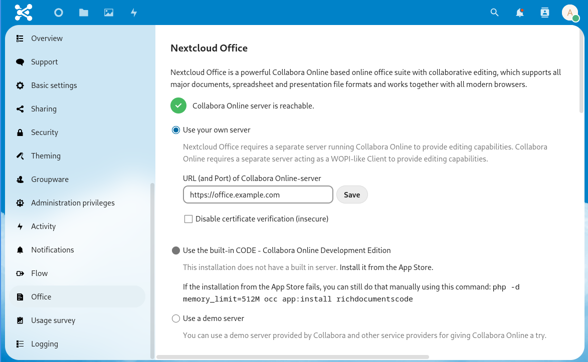

## Introduction

Collabora can be used to view and edit office documents direct inside the Nextcloud webinterface.

This tutorial will describe how to install a own Collabora Online server that can be used with a Nextcloud instance. The Collabora Online server will be configured with Let's Encrypt to provide access via a valid SSL connection.

**Prerequisites**

You need the following things:

* a server with Ubuntu 20.04 (but other Ubuntu's should work too)
* a own domain like `example.com`
* a subdomain of your domain points to your planned Collabora server (e.g. using `office.example.com`)
* a Nextcloud (for this tutorial they has the domain `nextcloud.example.com`)

## Step 1 - Configure Docker Repository

Docker is needed to run the Collabora Docker container. You have to configure the Docker repository in order to be able to install Docker:

```shell=
apt update
apt install apt-transport-https ca-certificates curl gnupg lsb-release
curl -fsSL https://download.docker.com/linux/ubuntu/gpg | gpg --dearmor -o /usr/share/keyrings/docker-archive-keyring.gpg
echo \
  "deb [arch=amd64 signed-by=/usr/share/keyrings/docker-archive-keyring.gpg] https://download.docker.com/linux/ubuntu \
  $(lsb_release -cs) stable" | sudo tee /etc/apt/sources.list.d/docker.list > /dev/null
```

## Step 2 - Install Docker

Now install Docker itself:

```shell=
apt update
apt install docker-ce docker-ce-cli containerd.io
```

## Step 3 - Start Collabora Container

With Docker installed, the Collabora Docker Container now can be started. Set the domain variable to the address of your Nextcloud instance (`.` must be replaced with `\\.` due to shell escaping):

```shell=
docker run -t -d -p 127.0.0.1:9980:9980 -e "domain=nextcloud\\.example\\.com" --restart always collabora/code
```

The newest container is pulled and started. You can check if it is running via `docker ps`.

Optional also Docker Compose can be used. You can find [here](docker-compose-as-systemd-service) a general guide for it.

## Step 4 - Install Nginx

To make the Collabora container available over the internet a SSL reverse proxy is used. This tutorial will use Nginx for it.

Install Nginx via command line:

```shell=
apt install nginx
```

## Step 5 - Install Let's Encrypt Certbot via Snap

For the network connection a valid SSL certificate is needed. To generate it, the Let's Encrypt's Certbot used. Install the Certbot via Snap:

```shell=
apt install snapd
snap install --classic certbot
ln -s /snap/bin/certbot /usr/bin/certbot
```

## Step 6 - Create SSL Certs

Now request the SSL certificates via Certbot and your servers domain:

```shell=
certbot certonly --nginx -d office.example.com
[...]
IMPORTANT NOTES:
 - Congratulations! Your certificate and chain have been saved at:
   /etc/letsencrypt/live/office.example.com/fullchain.pem
   Your key file has been saved at:
   /etc/letsencrypt/live/office.example.com/privkey.pem
```

Note: Store the paths to the SSL cert and key file as you need they in the next step.

## Step 7 - Configure Nginx as Reverse Proxy

Add the following configuration with a text editor of your choice (e.g. `nano` or `vim`) to the file `/etc/nginx/sites-enabled/collabora` and modify the line `server_name office.example.com` and both SSL certificate config lines at the top with your own domain:

```nginx=
server {
    listen       443 ssl;

    # modify this three lines with your own domain:
    server_name  office.example.com;
    ssl_certificate /etc/letsencrypt/live/office.example.com/fullchain.pem;
    ssl_certificate_key /etc/letsencrypt/live/office.example.com/privkey.pem;

    # static files
    location ^~ /loleaflet {
        proxy_pass https://localhost:9980;
        proxy_set_header Host $http_host;
    }

    # WOPI discovery URL
    location ^~ /hosting/discovery {
        proxy_pass https://localhost:9980;
        proxy_set_header Host $http_host;
    }

    # Capabilities
    location ^~ /hosting/capabilities {
        proxy_pass https://localhost:9980;
        proxy_set_header Host $http_host;
    }

    # main websocket
    location ~ ^/lool/(.*)/ws$ {
        proxy_pass https://localhost:9980;
        proxy_set_header Upgrade $http_upgrade;
        proxy_set_header Connection "Upgrade";
        proxy_set_header Host $http_host;
        proxy_read_timeout 36000s;
    }

    # download, presentation and image upload
    location ~ ^/lool {
        proxy_pass https://localhost:9980;
        proxy_set_header Host $http_host;
    }

    # Admin Console websocket
    location ^~ /lool/adminws {
        proxy_pass https://localhost:9980;
        proxy_set_header Upgrade $http_upgrade;
        proxy_set_header Connection "Upgrade";
        proxy_set_header Host $http_host;
        proxy_read_timeout 36000s;
    }
}
```

Now restart the Nginx to load the new configuration via the following command:

```shell
systemctl restart nginx
```

## Step 8 - Activate Collabora Online App in Nextcloud

The Collabora server itself is now fully configured and usable. You now have to configure Collabora within your Nextcloud.

In your Nextcloud, activate the app `Collabora Online`. For that, go to the web interface of your Nextcloud and open the app store (top right corner -> `Apps`). Search for `Collabora Online` and activate only the app `Collabora Online`.

## Step 9 - Configure Collabora Online App

After the installation of the app you have to configure it and tell it where your Collabora Online Server is. For that, go to the settings of your Nextcloud (top right corner -> `Settings`) and select `Collabora Online` on the left menu. There select `Use your own server` (German: `Verwende Deinen eigenen Server`) and add the address of your server (e.g. `https://office.example.com`):



If everything works correct then the settings dialog should show a working connection to your Collabora server. Click on the `Save` button in order to store the configuration.

## Step 10 - Renew SSL Cert

Let's Encrypt certs are only valid for a few months and then must be renewed. Certbot has already a systemd timer for this which must only be activated:

```shell=
systemctl enable --now snap.certbot.renew.timer
```

After that your SSL certs will get automatically renewed when needed.

## Conclusion

You now have configured a own Collabora server and configured your Nextcloud to use it. Each office document should now be opened editable in the webinterface.

##### License: MIT

<!--

Contributor's Certificate of Origin

By making a contribution to this project, I certify that:

(a) The contribution was created in whole or in part by me and I have
    the right to submit it under the license indicated in the file; or

(b) The contribution is based upon previous work that, to the best of my
    knowledge, is covered under an appropriate license and I have the
    right under that license to submit that work with modifications,
    whether created in whole or in part by me, under the same license
    (unless I am permitted to submit under a different license), as
    indicated in the file; or

(c) The contribution was provided directly to me by some other person
    who certified (a), (b) or (c) and I have not modified it.

(d) I understand and agree that this project and the contribution are
    public and that a record of the contribution (including all personal
    information I submit with it, including my sign-off) is maintained
    indefinitely and may be redistributed consistent with this project
    or the license(s) involved.

Signed-off-by: [Alexander Pücker alexander.puecker@hetzner.com]

-->
