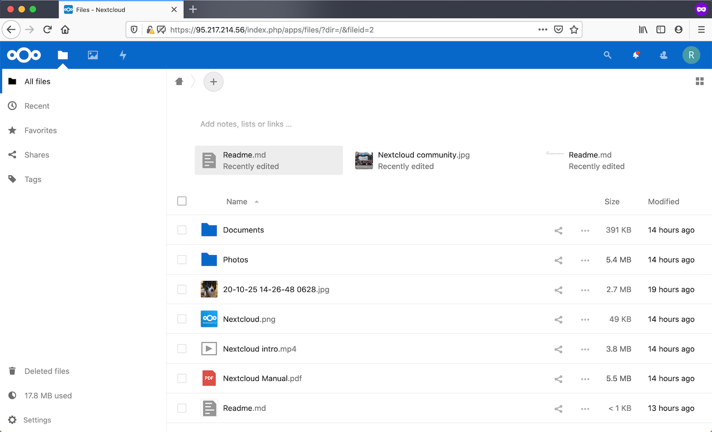

## Introduction

[Nextcloud](https://nextcloud.com/) is a suite of software for creating and using file hosting services. Nextcloud is free and open-source, so anyone can install and operate their own private file hosting service. I use my Nextcloud on Hetzner Cloud to share notes and documents with friends and family.

Core Nextcloud functionality is similar to [Dropbox](https://www.dropbox.com/) and there are [app plugins](https://apps.nextcloud.com/) to extend functionality in many ways such as calendar sharing, streaming media and analytics.

Following this tutorial, you can have a private file sharing service on the Hetzner Cloud that you control. If you have all of the prerequisites in place, it should take less than an hour to complete.

**Prerequisites**

To follow the steps in this tutorial, you will need:

* A [Hetzner Cloud](https://www.hetzner.com/cloud) account
* A Hetzner Cloud project for your installation
* A configured SSH key for your Hetzner Cloud project
* An API token for your Hetzner Cloud project
* A local [hcloud](https://github.com/hetznercloud/cli) CLI install
* Optionally, a registered domain with a record pointing your domain name (e.g. example.com) to your server IP address.
* Basic Linux command line skills (e.g. ssh, sudo, etc.)

The tutorial uses the following conventions to represent variables used in the code below:

* <ssh_key_id> is the name of an SSH key in your Hetzner cloud project
* <your_server_name> is the name of your server
* <your_server_ip> is the IP address of the server created below
* <your_domain_name> is your registered domain name (optional)
* <your_user_name> is the name for your user
* <your_password> is the password for your user

## Step 1 - Create an Ubuntu 20.04 server

For this step, you will use the hcloud CLI tool on your local workstation to create the server in your Hetzner Cloud project. To use the hcloud CLI tool, we need to first install it and initialize a context. For information on how to do that, consult the [How-to: Hetzner Cloud CLI](https://community.hetzner.com/tutorials/howto-hcloud-cli) tutorial.

From your local command line, run

```
local$ hcloud server create --type cx11 --name <your_server_name> --image ubuntu-20.04 --ssh-key <ssh_key_id>
```

This should only take a minute. After the system is created you will get back the server identifier and <your_ip_address> for the created server. Note this IP address down because we will be using it in later steps.

## Step 2 - Perform initial server config

The server isn't quite ready for use as created from the Ubuntu 20.04 image and we need to do some server configuration. Login to the server from your local system using ssh:

```
local$ ssh root@<your_ip_address>
```

This logs you into the server as root using the ssh key you defined when creating the server.

Once you are logged in as root, create a non-root user for the rest of the steps. On the server:

```
# adduser <your_user_name>
```

You will need to create a password for this user. Answer the prompts appropriately or hit enter to accept the defaults.

To be able to run administrative tasks, you need to add this user to the `sudo` group with the following:

```
# usermod -aG sudo <your_user_name>
```

Finally, to be able to login using your ssh key, you copy the public key to the user's ~/.ssh directory:

```
# rsync --archive --chown=<your_user_name>:<your_user_name> ~/.ssh /home/<your_user_name>
```

Make sure you can login using this user by opening another local terminal and logging in:

```
local$ ssh <your_user_name>@<your_ip_address>
```

If that works, you are ready to continue the server configuration with your new user account.

Since this server is available on the general Internet, let's setup a basic firewall to provide some protection. The easiest way to maintain a firewall in Ubuntu 20.04 is with [UFW](https://wiki.ubuntu.com/UncomplicatedFirewall).

Using UFW, we will enable access to the server via ssh but protect all of the other ports. Do the following:

```
$ sudo ufw allow OpenSSH
$ sudo ufw enable
$ sudo ufw status
```

Accept the warning that will appear when you enable the firewall and you should now see that the firewall is active and that ssh traffic is allowed.

Now, let's update the server to make sure all of the most recent patches and security fixes are installed. Run:

```
$ sudo apt update && sudo apt upgrade
```

This will take a few minutes and update the server with all of the latest available code. After it is done, run:

```
$ cat /var/run/reboot-required
```

If you see a message indicating that a reboot is required, reboot and continue from here. Otherwise, keep going to the next step.

### Step 3 - Install Nextcloud

[Snap](https://snapcraft.io/) makes installation of software simple by bundling all of the dependencies and configuration together. On the Hetzner Ubuntu 20.04 image snapd isn't included by default, so we install snap with:

```
$ sudo apt install snapd
```

After you have Snap installed, run:

```
$ sudo snap install nextcloud
```

This will take a few minutes to collect and install all of the various components. After it is complete, you are ready to start the configuration.

### Step 4 - Configure Nextcloud

To be able to login to Nextcloud, you need to have an administrative account. This account can be created using the command:

```
sudo nextcloud.manual-install <your_user_name> <your_password>
```

After the account is set up, you will see a message that Nextcloud was successfully installed.

We will do a few more configuration steps using the Nextcloud command line interface called `occ` ("owncloud console").

By default, Nextcloud is configured to only allow access from the localhost interface. That isn't very interesting for us, so we need to add another address to the access list. You can see the existing allowed list with:

```
$ sudo nextcloud.occ config:system:get trusted_domains
```

Add your server address to the allowed list with:

```
$ sudo nextcloud.occ config:system:set trusted_domains 1 --value=<your_ip_address>
```

If you have a registered domain name, substitute your domain name for the IP address in the value argument. In that case, the command would look like:

```
$ sudo nextcloud.occ config:system:set trusted_domains 1 --value=<your_domain_name>
```

The list number starts at 0 so the 1 indicates that it will be the next one in the list. If you rerun the `config:sytem:get` command above it will now show that you have two trusted domains.

To keep this simple, we can use a self-signed certificate to enable encryption on our server. This type of certificate will show warnings in our browser when we access our Nextcloud site but that is fine for our private use and doesn't affect the functionality available to us.

To create a self-signed certificate, run:

```
$ sudo nextcloud.enable-https self-signed
```

You will get a message indicating that the certificate has been generated and that the service is restarting.

If you want to use a [Let's Encrypt](https://letsencrypt.org/) certificate, that can be done simply buy using the command:

```
sudo nextcloud.enable-https lets-encrypt
```

To use a Let's Encrypt certificate you will need to have configured a valid domain name per the instructions above.

The last part of the configuration is to configure our UFW firewall to allow access to ports 80 and 443 with the following command:

```
sudo ufw allow 80,443/tcp
```

Check the firewall status with `sudo ufw status` to be sure that the ports are open. You are now ready to login to your Nextcloud site.

## Step 4 - Login to your Nextcloud site

Open your local web browser to https:<your_server_ip>. Click through the warnings about an untrusted certificate to get to the login screen. Enter the username and password you set earlier in the login page:


Read through the welcome screen which gives you information about Nextcloud and the clients that are available. Once you get through the intro screen, you can explore the interface and begin using Nextcloud.



## Conclusion

If you went all the way through this tutorial, you now have a working Nextcloud running on Hetzner Cloud that you can use for privately sharing your files. There are many more things we can with Nextcloud so feel free to explore. A nice feature of running Nextcloud on Hetzner Cloud is that you can upgrade your server to a larger instance or add shared volumes to get more capacity when you need it.

##### License: MIT

<!--

Contributor's Certificate of Origin

By making a contribution to this project, I certify that:

(a) The contribution was created in whole or in part by me and I have
    the right to submit it under the license indicated in the file; or

(b) The contribution is based upon previous work that, to the best of my
    knowledge, is covered under an appropriate license and I have the
    right under that license to submit that work with modifications,
    whether created in whole or in part by me, under the same license
    (unless I am permitted to submit under a different license), as
    indicated in the file; or

(c) The contribution was provided directly to me by some other person
    who certified (a), (b) or (c) and I have not modified it.

(d) I understand and agree that this project and the contribution are
    public and that a record of the contribution (including all personal
    information I submit with it, including my sign-off) is maintained
    indefinitely and may be redistributed consistent with this project
    or the license(s) involved.

Signed-off-by:  Rob Ericsson rob@l10systems.com

-->
