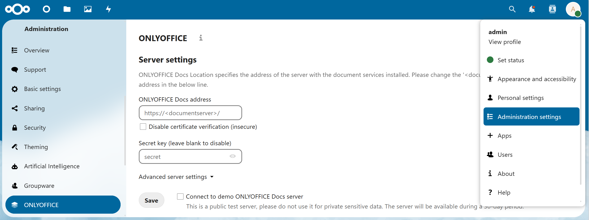
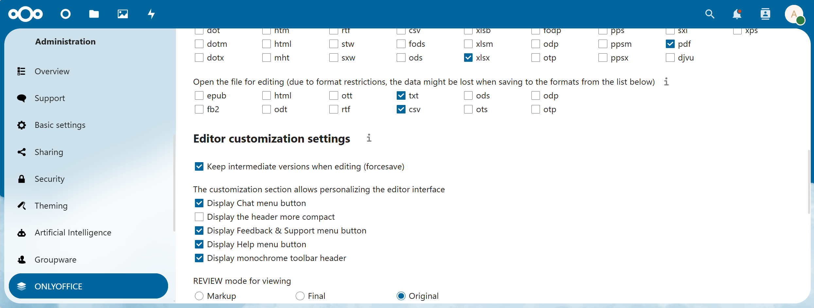
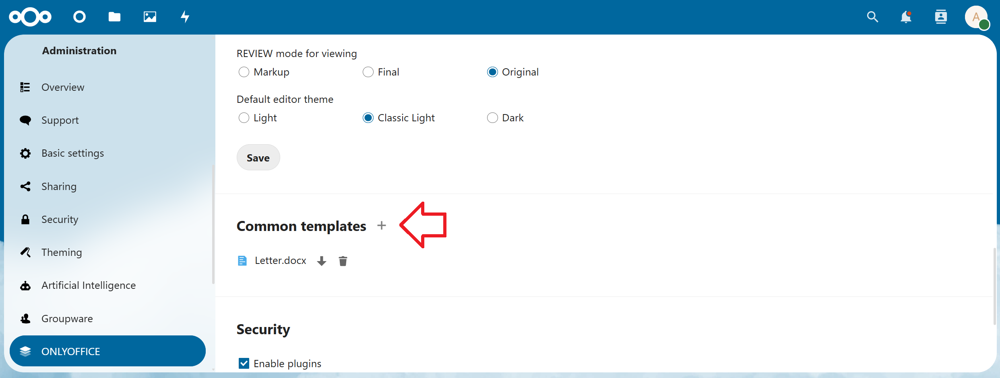
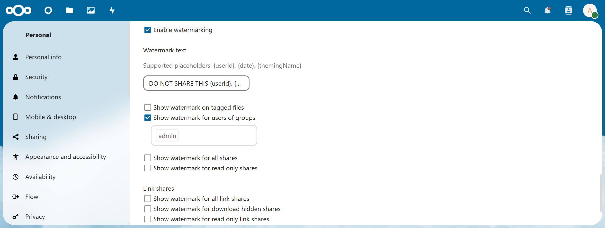

## Introduction

ONLYOFFICE Docs (ONLYOFFICE Document Server) is an open-source web-based office suite that provides you with online editors for text documents, spreadsheets, and presentations highly compatible with OOXML formats (`.docx`, `.xlsx`, `.pptx`).

You can connect the suite with your Nextcloud instance, bringing you the ability to edit and co-author office documents right from the Nextcloud frontend.

This tutorial will describe how to install ONLYOFFICE Document Server and connect it to your Nextcloud instance via the `integration app`.

**Prerequisites**

* Ubuntu 24.04 server
* A domain for the ONLYOFFICE Document Server (e.g. example.com)
* Nextcloud installed on a different machine

## Step 1 - Set up Docker repository

The easiest way to start an instance of ONLYOFFICE Document Server is to use Docker. Before you install Docker on a new host machine, you need to set up the Docker repository:

```shell
curl -fsSL https://get.docker.com -o get-docker.sh
sh ./get-docker.sh --dry-run     # Check which steps this script will run
sh ./get-docker.sh
```

## Step 2 - Install ONLYOFFICE Document Server

Run Docker and execute the following command to install `ONLYOFFICE Document Server` and all the dependencies:

```shell
sudo docker run -i -t -d -p 80:80 --restart=always onlyoffice/documentserver
```

For a persistent installation use a `docker-compose.yml` file and manage the container with compose. This enables users to version config files and easily restore them on different machines. [Link to the YAML file](https://github.com/ONLYOFFICE/Docker-DocumentServer/blob/master/docker-compose.yml).

Now your ONLYOFFICE Docs should be available at `http://server_ip`.

## Step 3 - Switch to HTTPS using certbot

The easiest way to switch ONLYOFFICE Docs to HTTPS is to automatically get Let's Encrypt SSL Certificates using certbot.
Run the ONLYOFFICE Docs Docker container specifying ports 80 and 443 and setting your own values for the variables:

```shell
sudo docker run -i -t -d -p 80:80 -p 443:443 --restart=always \
    -e LETS_ENCRYPT_DOMAIN=example.com -e LETS_ENCRYPT_MAIL=email@example.com onlyoffice/documentserver
```

Where:

* `LETS_ENCRYPT_DOMAIN` - a domain name to use for the certificate.
* `LETS_ENCRYPT_MAIL` - an email used for registration and recovery contact.

The letsencrypt.org CA-signed certificate will be automatically generated and installed to your server. Now your ONLYOFFICE Docs should be available at the https://example.com address.

## Step 4 - Get ONLYOFFICE connector for Nextcloud

Access you Nextcloud and login as admin.

* Click your user icon in the upper right corner
* Switch to `+ Apps`
* Go to "Office & text"
* Search for `ONLYOFFICE` and click the "Download and enable" button.

## Step 5 - Configure ONLYOFFICE within Nextcloud

* Click your user icon in the upper right corner
* Switch to `Admninistration settings` and go to the `ONLYOFFICE` page



| Field                   | Description |
| ----------------------- | ----------- |
| ONLYOFFICE Docs address | Enter the address of the server that has ONLYOFFICE Docs installed. For it to work, make sure the server that has ONLYOFFICE installed can successfully build a connection to the server that has Nextcloud installed. (e.g. double-check firewall rules) |
| Secret key (leave blank to disable) | Enter a secret key. The key you specify in Nextcloud has to be identical to the key specified in the config file on the server that has ONLYOFFICE Docs installed. For more information about the secret key, see [api.onlyoffice.com/editors/signature](https://api.onlyoffice.com/editors/signature/) and "ONLYOFFICE Docs config file" below this table. |
| Advanced server settings | Sometimes your network configuration might not allow using public addresses for requests between Nextcloud and the ONLYOFFICE Document Server. The Advanced server settings section allows you to set the ONLYOFFICE Document Server address for internal requests from the Nextcloud server and the returning Nextcloud address for internal requests from the ONLYOFFICE Document Server. |

<br>

> **ONLYOFFICE Docs config file:**
> 
> This tutorial used Docker to install the ONLYOFFICE Documentation Server. For this reason, you have to access the ONLYOFFICE Docs Docker container to view the config file:
> 
> ```bash
> docker container ls
> docker exec -it <container-id> /bin/bash
> cat /etc/onlyoffice/documentserver/local.json
> ```

<br>

Once done, save the server settings.

## Step 6 - Configure additional settings

Once you’re done with the server settings, you can adjust additional ones which are not mandatory but will make your user experience more comfortable.

Restrict access to the editors to user groups within your instance, enable or disable the Open file in the same tab option, select file formats that will be opened with `ONLYOFFICE` by default, etc.

`docx`, `xlsx` and `pptx` files are opened directly for editing, all other formats will require a preliminary conversion. The `Open the file for editing` setting allows you to select `csv`, `odp`, `ods`, `rtf` and `txt` formats to be auto-converted and opened directly for editing as well.

The `Editor customization settings` section allows you to adjust the editor interface and change the presence or absence of the additional buttons.

What’s more, you can activate "Force Save" and select one of the review modes for viewing. It allows users to see the changes made in a reviewed document when it’s shared for viewing: With `Final` mode, you will see the document with all the proposed changes accepted. With `Markup` mode, the proposed changes are highlighted. With `Original` mode, you’ll see the initial version of a document with no changes.
Once you are ready, don’t forget to save the changes.



**Document templates**

You can add your own templates and use them for creating new documents. Upload a new template by clicking on the plus icon next to the Common templates section:



**Watermarks**

ONLYOFFICE integrated in your Nextcloud allows you to insert watermarks into your docs to protect any confidential or sensitive information they might contain. To activate watermarking, check the `Enable watermarking` box in the `Secure view` settings section:

You are able to replace the default watermark text with your own using the supported placeholders {userId} and {date}. These placeholders will be displayed individually for each user when opening a file.

You can also define groups to differentiate users for whom the watermark will be displayed as well as select types of shares where the watermark has to be shown.



## Conclusion

You have installed ONLYOFFICE Docs (Document Server) and connected it to your Nextcloud instance. Now you’re able to edit and co-author your documents, spreadsheets, and presentations right within Nextcloud.

##### License: MIT

<!--

Contributor's Certificate of Origin

By making a contribution to this project, I certify that:

(a) The contribution was created in whole or in part by me and I have
    the right to submit it under the license indicated in the file; or

(b) The contribution is based upon previous work that, to the best of my
    knowledge, is covered under an appropriate license and I have the
    right under that license to submit that work with modifications,
    whether created in whole or in part by me, under the same license
    (unless I am permitted to submit under a different license), as
    indicated in the file; or

(c) The contribution was provided directly to me by some other person
    who certified (a), (b) or (c) and I have not modified it.

(d) I understand and agree that this project and the contribution are
    public and that a record of the contribution (including all personal
    information I submit with it, including my sign-off) is maintained
    indefinitely and may be redistributed consistent with this project
    or the license(s) involved.

Signed-off-by: Ksenia Fedoruk kseniya.fedoruk@onlyoffice.com

-->
