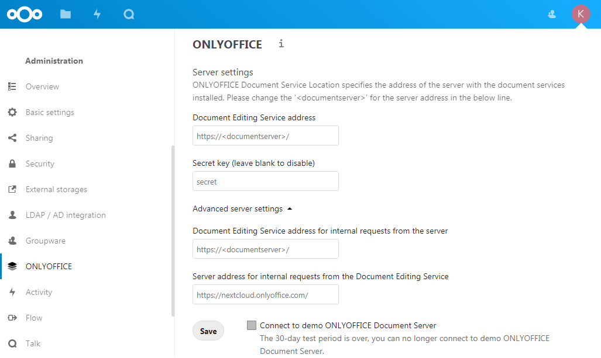
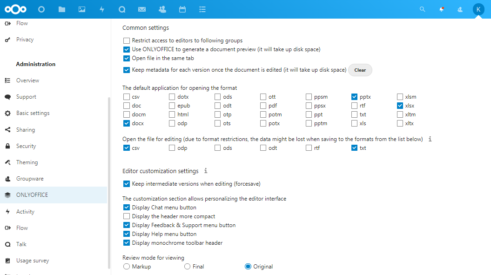
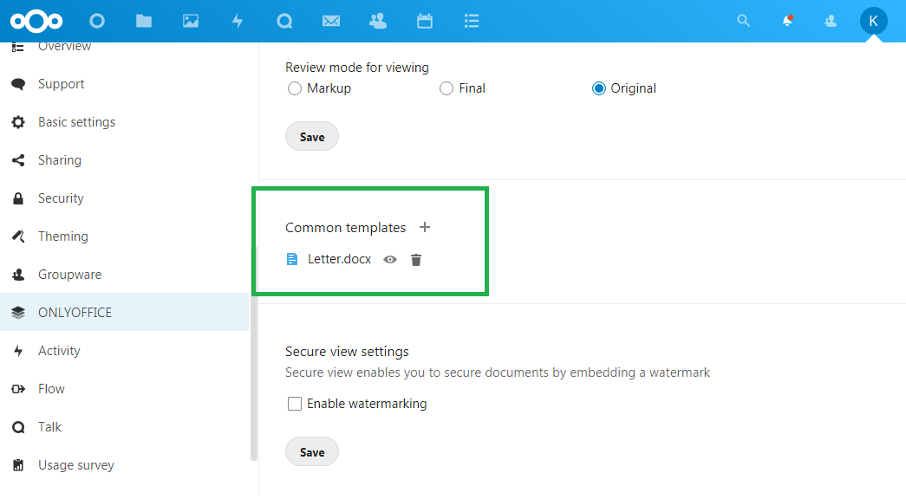
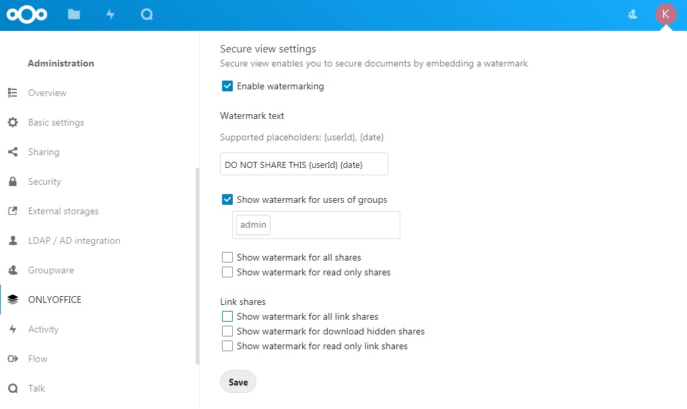

## Introduction

`ONLYOFFICE Docs` (ONLYOFFICE Document Server) is an open-source web-based office suite that provides you with online editors for text documents, spreadsheets, and presentations highly compatible with OOXML formats (.docx, .xlsx, .pptx). 

The suite can be connected with your `Nextcloud` instance bringing you the ability to edit and co-author office documents right from the `Nextcloud` frontend. 

This tutorial will describe how to install `ONLYOFFICE Document Server` and connect it to your Nextcloud instance via the `integration app`.

**Prerequisites**

*	Ubuntu 20.04 server 
*	A domain for ONLYOFFICE Document Server (e.g. yourdomain.com)
*	Your Nextcloud installed on a different machine


## Step 1 - Set up Docker repository

The easiest way to start an instance of `ONLYOFFICE Document Server` is to use Docker. Before you install Docker on a new host machine, you need to set up the Docker repository:

```shell=
$ curl -fsSL https://get.docker.com -o get-docker.sh
$ sh get-docker.sh
```

## Step 2 - Install ONLYOFFICE Document Server

Run Docker and execute the following command to install `ONLYOFFICE Document Server` and all the dependencies:

```shell=
sudo docker run -i -t -d -p 80:80 --restart=always onlyoffice/documentserver
```
For a persistent installation use a docker-compose.yml file and manage the container with compose. This enables users to version config files and easily restore them on different machines.
Here's the link to the yml https://github.com/ONLYOFFICE/Docker-DocumentServer/blob/master/docker-compose.yml 

## Step 3 - Switch to HTTPS using certbot

The easiest way to switch `ONLYOFFICE Docs` to HTTPS is to automatically get Let's Encrypt SSL Certificates using certbot.
Run the `ONLYOFFICE Docs` Docker container specifying ports 80 and 443 and setting your own values for the variables:

```shell=
sudo docker run -i -t -d -p 80:80 -p 443:443 \
    -e LETS_ENCRYPT_DOMAIN=yourdomain.com -e LETS_ENCRYPT_MAIL=email@example.com  onlyoffice/documentserver
```

Where:
*	LETS_ENCRYPT_DOMAIN - a domain name to use for the certificate.
*	LETS_ENCRYPT_MAIL - an email used for registration and recovery contact.
The letsencrypt.org CA-signed certificate will be automatically generated and installed to your server. Now your ONLYOFFICE Docs should be available at the https://yourdomain.com address.


## Step 4 - Get ONLYOFFICE connector for Nextcloud


Launch `Nextcloud` as an admin, click your user icon in the upper right corner, switch to + Apps, find `ONLYOFFICE` in the list of available applications (section ‘Office & text’), and click the Download and enable button. 


## Step 5 - Configure ONLYOFFICE within Nextcloud

Click your user icon in the upper right corner, go to Settings and find the `ONLYOFFICE` settings page in the Administration section. 

Specify the address of the machine with `ONLYOFFICE` installed. Make sure the `Nextcloud` server address is accessible from `ONLYOFFICE Document Server` for correct work.

Enter the Secret key in the corresponding filed. Specify the same secret key in the `ONLYOFFICE Document Server` config file https://api.onlyoffice.com/editors/signature/ to enable the validation.

Sometimes your network configuration might not allow the requests between installed `Nextcloud` and `ONLYOFFICE Document Server` using the public addresses. The Advanced server settings section allows you to set the `ONLYOFFICE Document Server` address for internal requests from `Nextcloud` server and the returning `Nextcloud` address for internal requests from `ONLYOFFICE Document Server`. 

Once done, save the server settings.

 


## Step 6 - Configure additional settings 

Once you’ve done with the server settings, you can adjust additional ones which are not mandatory but will make your user experience more comfortable.

Restrict access to the editors to user groups within your instance, enable or disable the Open file in the same tab option, select file formats that will be opened with `ONLYOFFICE` by default, etc.

`docx`, `xlsx` and `pptx` files are opened directly for editing, all other formats will require a preliminary conversion. The Open the file for editing setting allows you to select `csv`, `odp`, `ods`, `odt`, `rtf` and `txt` formats to be to auto-converted and opened directly for editing as well.

The Editor customization settings section allows you to adjust the editor interface and change the presence or absence of the additional buttons.

What’s more, you can activate Force Save and select one of the Review modes for viewing. It allows users to see the changes made in a reviewed document when it’s shared for viewing: with Final mode you will see the document with all the proposed changes accepted, with Markup – the proposed changes are highlighted, with Original – you’ll see the initial version of a document with no changes.
Once you are ready, don’t forget to save the changes.

 


**Document templates**

You can add your own templates and use them for creating new documents. Upload a new template by clicking on the plus icon next to the Common templates section:




**Watermarks**

`ONLYOFFICE` integrated in your `Nextcloud` allows you to insert watermarks into your docs to protect any confidential or sensitive information they might contain. To activate watermarking, check the Enable watermarking box in the Secure view settings section:

You are able to replace the default watermark text with your own using the supported placeholders {userId} and {date}. These placeholders will be displayed individually for each user when opening a file.

You can also define groups to differentiate users for whom the watermark will be displayed as well as select types of shares where the watermark has to be shown. 



## Conclusion

You have installed `ONLYOFFICE Docs` (Document Server) and connected it to your `Nextcloud` instance. Now you’re able to edit and co-author your documents, spreadsheets, and presentations right within `Nextcloud`. 

##### License: MIT

<!--

Contributor's Certificate of Origin

By making a contribution to this project, I certify that:

(a) The contribution was created in whole or in part by me and I have
    the right to submit it under the license indicated in the file; or

(b) The contribution is based upon previous work that, to the best of my
    knowledge, is covered under an appropriate license and I have the
    right under that license to submit that work with modifications,
    whether created in whole or in part by me, under the same license
    (unless I am permitted to submit under a different license), as
    indicated in the file; or

(c) The contribution was provided directly to me by some other person
    who certified (a), (b) or (c) and I have not modified it.

(d) I understand and agree that this project and the contribution are
    public and that a record of the contribution (including all personal
    information I submit with it, including my sign-off) is maintained
    indefinitely and may be redistributed consistent with this project
    or the license(s) involved.

Signed-off-by: Ksenia Fedoruk kseniya.fedoruk@onlyoffice.com

-->
