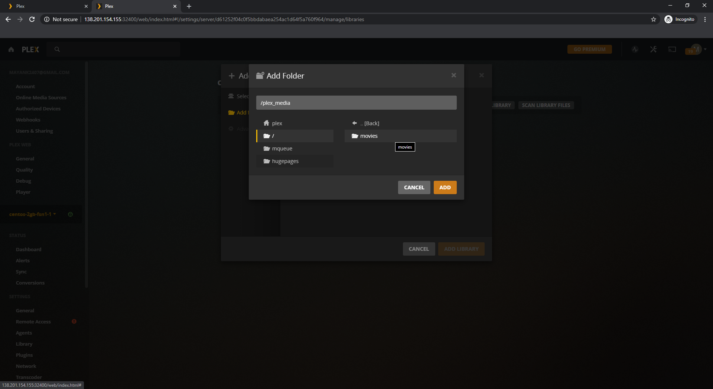

## Introduction

Plex Media Server makes your media files such as images, videos, audio files, etc. available to all your devices via the Plex Client. It is a very powerful & useful piece of software to organize, manage & share your media collection.

This tutorial shows how to install and configure the Plex Media Server on CentOS 8. You can perform the same steps on both Hetzner Cloud & Hetzner Dedicated Servers or any CentOS 8 server.

## Step 1 - <Plex Media Server Installation>

To make things less complicated I've broken the installation in few steps: 

### Step 1.1 - <Add the Plex official repository>

To add the Plex official repository create a new file named `plex.repo` in `/etc/yum.repos.d/` directory with following content:

```
[PlexRepo]
name=PlexRepo
baseurl=https://downloads.plex.tv/repo/rpm/$basearch/
enabled=1
gpgkey=https://downloads.plex.tv/plex-keys/PlexSign.key
gpgcheck=1
```

### Step 1.2 - <Install Plex Media Server>

Install Plex Media Server with:

```bash
sudo yum install plexmediaserver -y
```

Start and Enable the `plexmediaserver` service with:

```bash
sudo systemctl start plexmediaserver.service
sudo systemctl enable plexmediaserver.service
```

### Step 1.3 - <Verifying the Installation>

Check if the service is running properly with:

```bash
sudo systemctl status plexmediaserver.service
```

The output of the above command should look like this:

```
● plexmediaserver.service - Plex Media Server
   Loaded: loaded (/usr/lib/systemd/system/plexmediaserver.service; enabled; vendor preset: disabled)
   Active: active (running) since Thu 2020-01-09 19:01:03 CET; 28s ago
```

## Step 2 - <Firewall configuration> (Optional)

To be able to access the Plesk Media Server over the Internet we need to configure our server to allow connections on some ports.

> These steps only need to be performed if firewalld is enabled on your server.

To make things less complicated I've broken the firewall configuration in few steps: 

### Step 2.1 - <Add the Service>

To add the Plex official repository create a new file named `plexmediaserver.xml` in `/etc/firewalld/services/` directory (if it doesn't exist just make a new directory) with following content:

```xml
<?xml version="1.0" encoding="utf-8"?>
<service version="1.0">
<short>plexmediaserver</short>
<description>Firewall Rules for Plex Media Server</description>
<!-- Port(s) for Plex Media Server -->
<port port="32400" protocol="tcp"/>
<!-- Port(s) for network discovery -->
<port port="5353" protocol="udp"/>
<port port="32410" protocol="udp"/>
<port port="32412" protocol="udp"/>
<port port="32413" protocol="udp"/>
<port port="32414" protocol="udp"/>
<!-- Port(s) for Plex DLNA Server -->
<port port="1900" protocol="udp"/>
<port port="32469" protocol="tcp"/>
<!-- Port(s) for Plex Companion -->
<port port="3005" protocol="tcp"/>
<!-- Port(s) for Roku via Plex Companion -->
<port port="8324" protocol="tcp"/>
</service>
```
### Step 2.2 - <Enable the Service>

After adding the service, run the following commands to enable the service:

```bash
sudo firewall-cmd --add-service=plexmediaserver --permanent
sudo firewall-cmd --reload
```

### Step 2.3 - <Verify the configuration>

Check if the rules are applied with:

```bash
sudo firewall-cmd --list-all
```

The output of the above command should look like this:

```
public (active)
  target: default
  icmp-block-inversion: no
  interfaces: eth0
  sources:
  services: ssh dhcpv6-client plexmediaserver
  ports:
  protocols:ssss
  masquerade: no
  forward-ports:
  source-ports:
  icmp-blocks:
  rich rules:
```

## Step 3 - <Plex Media Server configuration>

After successfully installing Plex Media Server on your server, we can proceed further to configuration of Plex Media Server.

To get the Plex Media Server setup page we need to have access to localhost of our server such that when we open `http://127.0.0.1:32400/web` it should open from the server instead of our own localhost.

> If you already have a local Plex Media Server installed, You need to stop it & then verify by opening `http://127.0.0.1:32400/web` it should not give any output before doing any of the steps mentioned below.

### Step 3.1 - <SSH Tunnel>

To access server's localhost on our localhost we need to setup SSH tunneling by running one simple command.
If you're on windows run it on CMD or if you're on linux then use your bash shell.

```bash
ssh -L 127.0.0.1:32400:127.0.0.1:32400 root@<server_public_ip_here>
```

Now when you try to open `http://127.0.0.1:32400/web` on your web browser it should give some output.

As soon as you close the CMD/Bash instance the SSH tunneling will be gone so make sure you keep the terminal open in the background.

### Step 3.2 - <Configuration of Plex Media Server>

After successfully connecting to the SSH Tunnel, You are all set to configure everything else via GUI. 
To access the GUI, Open `http://127.0.0.1:32400/web` on your web browser.

#### Step 3.2.1 - <Login in Plex.tv>

The first prompt will ask you to login. Login with your existing account or sign up via email, or login via Google.


#### Step 3.2.2 - <Configure Plex Media Server>

After you login, It will show you "How Plex Works" page:


Simply click on "Got it!" button and then it shows you this screen asking friendly name (Just change it whatever you want to call it.):


> Make sure the "Allow me access my media outside my home" option remains enabled.

For the remaining 2 tabs, Just hit "Next" because those can be configured later on.

#### Step 3.2.3 - <Accessing Plex Media Server over Internet>

Now that you've completed the setup prompt, You can open the Plex Media Server page by opening `http://<server_public_ip_here>/web`.
On the left sidebar, You will see an option "More" just click on it, You'll now be able to find your Plex Media Server's friendly name on the top just click on it.


> Once you can access the Plex Media Server properly from your server's public ip, You can stop the tunneling and keep using the Plex Media Server via your server's public ip.

#### Step 3.2.4 - <Adding your libraries>

Create a directory on your server or do the following on your existing media files.

```bash
sudo mkdir -p /plex_media/movies
```

Plex Media Server needs ownership of your files in order to access them from it's user (`plex`) on your server.

```bash
sudo chown -R plex: /plex_media/movies
```

> Keep in mind, You donot have to use `/plex_media` to add library, You can use any folder you like to store your media files.

Now come back to our web browser, Click on "Manage Libraries" it should open this page:


Now click on "Add Library", select the type of Library you want to create & click next:


Now just add you directory & Go Back to home, You'll be able to find the added media files. 




## Conclusion

Congratulations, You learned installation Plex Media Server on your CentOS 8 server and configure it properly. You can refer to Plex guides to do more than just making libraries.


##### License: MIT

<!--

Contributor's Certificate of Origin

By making a contribution to this project, I certify that:

(a) The contribution was created in whole or in part by me and I have
    the right to submit it under the license indicated in the file; or

(b) The contribution is based upon previous work that, to the best of my
    knowledge, is covered under an appropriate license and I have the
    right under that license to submit that work with modifications,
    whether created in whole or in part by me, under the same license
    (unless I am permitted to submit under a different license), as
    indicated in the file; or

(c) The contribution was provided directly to me by some other person
    who certified (a), (b) or (c) and I have not modified it.

(d) I understand and agree that this project and the contribution are
    public and that a record of the contribution (including all personal
    information I submit with it, including my sign-off) is maintained
    indefinitely and may be redistributed consistent with this project
    or the license(s) involved.

Signed-off-by: [mayank2407@gmail.com]

-->