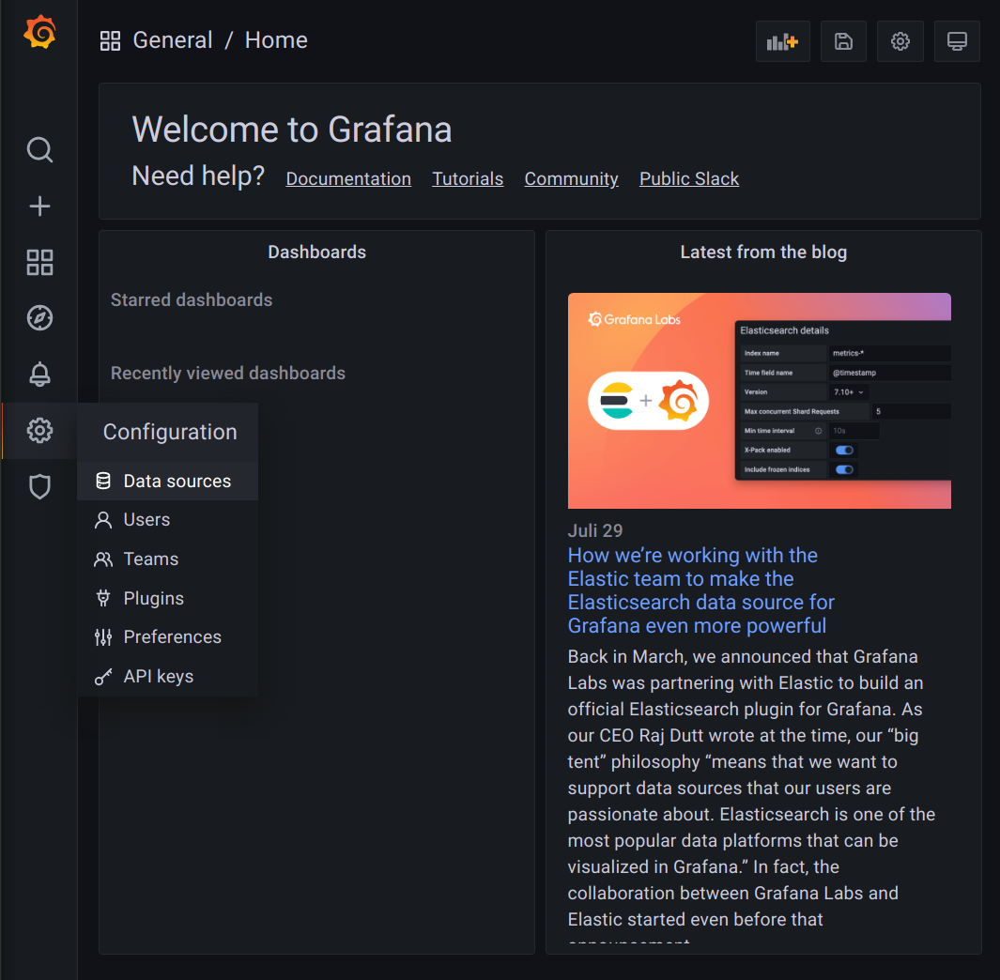
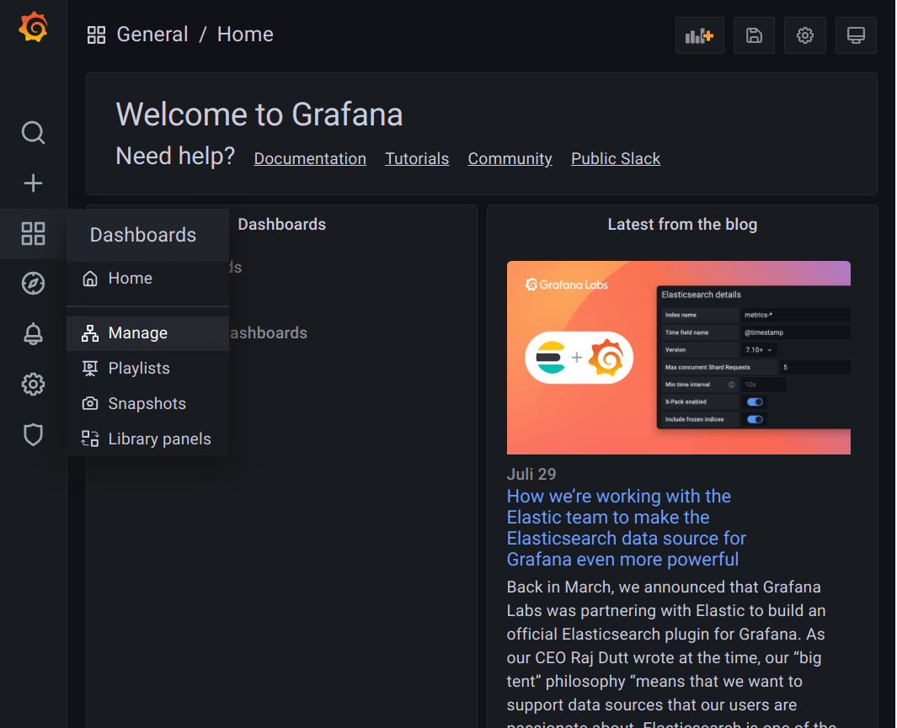
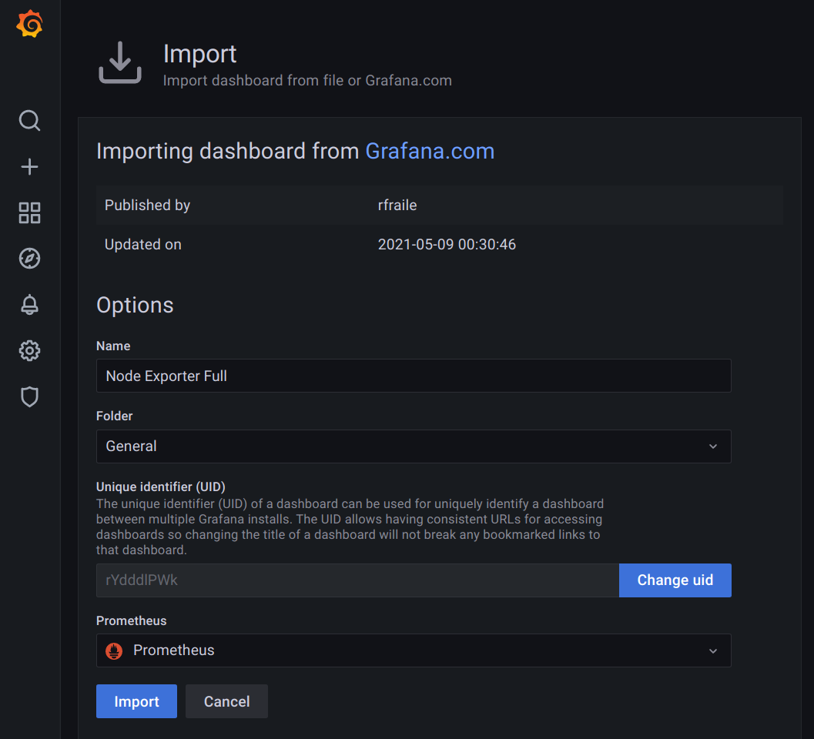

## Introduction

[Prometheus](https://prometheus.io) ist eine Software, welche es erlaubt, die Metriken von vielen verschiedenen Quellen wie Webservern, Systemauslastung oder auch Netzwerkhardware abzurufen und zu speichern.


Dieses Tutorial beschreibt beispielsweise, wie die Performance-Daten eines Servers mit Prometheus abgefragt und mit Grafana ausgewertet werden können.

**Vorraussetzungen**

* 2 Server mit Debian 10
* Freigabe des TCP-Ports 9100 in der [IPTables-](https://community.hetzner.com/tutorials/iptables) oder Cloud Firewall für den zu überwachenden Server
* Freigabe des TCP-Ports 3000 in der [IPTables-](https://community.hetzner.com/tutorials/iptables) oder Cloud Firewall für den überwachenden Server

**Aufbau des Systems**

```conf
2001:db8::1 node1.example.com
2001:db8::2 prometheus.example.com
```

## Schritt 1 - Installation von Node Exporter auf dem zu überwachenden Server

Der Prometheus-Stack besteht aus mehreren Komponenten. Prometheus stellt hierbei den Speicher sowie das sammeln der Metriken von diversen Endpunkten bereit. Diese Endpunkte können von jeder software angeboten werden. Eine Liste der Exporter und integrierten Schnittstellen kann [hier](https://prometheus.io/docs/instrumenting/exporters/) eingesehen werden.

Für dieses Tutorial wird die Software `node_exporter` benutzt, welche Metriken über System-Ressourcen wie Prozessorauslastung, Netzwerknutzung oder Festplattenaktivität ausliest.
Auf dem zu überwachenden Server müss für die Installation folgendes ausgeführt werden:

```shell
apt update
apt install prometheus-node-exporter
```

Mit den nachfolgenden Befehlen wird der `node_exporer`-Dienst gestartet und für den erneuten Start bei Hochfahren des Servers eingetragen.

```shell
systemctl enable prometheus-node-exporter.service
systemctl start prometheus-node-exporter.service
```

Die Metriken-Schnittstelle des Exporters sollte nun auf dem TCP-Port 9100 antworten. Dies kann mit dem folgenden Befehl geprüft werden:

```shell
root@node1.example.com:~# curl [2001:db8::1]:9100/metrics

# HELP apt_upgrades_pending Apt package pending updates by origin.
# TYPE apt_upgrades_pending gauge
apt_upgrades_pending{arch="amd64",origin="Debian-Security:10/stable"} 8
# HELP node_filesystem_size_bytes Filesystem size in bytes.
# TYPE node_filesystem_size_bytes gauge
node_filesystem_size_bytes{device="/dev/sda1",fstype="ext4",mountpoint="/"} 1.9970912256e+10
node_filesystem_size_bytes{device="/dev/sda15",fstype="vfat",mountpoint="/boot/efi"} 1.2594176e+08
# HELP node_forks_total Total number of forks.
# TYPE node_forks_total counter
node_forks_total 90780
# HELP node_intr_total Total number of interrupts serviced.
# TYPE node_intr_total counter
node_intr_total 1.6144664e+07
# HELP node_load1 1m load average.
# TYPE node_load1 gauge
node_load1 0.09
# HELP node_arp_entries ARP entries by device
# TYPE node_arp_entries gauge
node_arp_entries{device="eth0"} 3
```

## Schritt 2 - Installation des Prometheus Servers

In diesem Beispiel wird der Prometheus server dazu genutzt, die vom `node_exporter` bereitgestellten Metriken in die integrierte Datenbank OpenTSDB abzulegen. Die Installation des Servers läuft wie folgt ab:

```shell
apt update
apt install prometheus jq
```

Prometheus bezieht seine Konfiguration aus einer im Format Yaml abgelegten Datei. Darin sind unter anderem die Adresse der zu überwachenden Endpunkte sowie das Intervall angegeben, nach dem die Werte periodisch abgerufen werden.

```# vim /etc/prometheus/prometheus.yml```

```yaml
---
global:
  scrape_interval: 10s

scrape_configs:
  - job_name: 'node_exporter'
    metrics_path: "/metrics"
    static_configs:
      - targets:
        - 'node1.example.com:9100'
```

Abschließend wird Prometheus gestartet und für den automatischen Start nach neustart des Servers eingetragen.

```shell
systemctl start prometheus.service
systemctl enable prometheus.service
```

Mit ```systemctl status prometheus ``` kann geprüft werden, ob der Dienst ordnungsgemäß gestartet wurde.

Um den Status der zu überwachenden Server anzuzeigen, kann der folgende Befehl ausgeführt werden. Bei erfolgreicher Durchführung erscheint die dargestellte Ausgabe.

```shell
root@prometheus.example.com:~# curl [::1]:9090/api/v1/targets 2>/dev/null| jq -r '.data.activeTargets[]|.scrapeUrl,.health,.lastError'
http://node1.example.com:9100/metrics
up
```

## Schritt 3 - Installation des Grafana-Servers

Da die Metriken der zu überwachenden Knoten regelmäßig vom Prometheus Server abgerufen und für 15 Tage gespeichert werden, können die Daten über mehrere Wege angezeigt/ausgewertet werden.
In diesem Tutorial benutzen wir Grafana, welches Dashboards für viele verschiedene Datenquellen über ein Webinterface bereit stellt.

Die Aktivierung des Grafana-Repositories sowie die nachfolgende Installation wird wie folgt durchgeführt:
```shell
apt-get install -y apt-transport-https
apt-get install -y software-properties-common wget
wget -q -O - https://packages.grafana.com/gpg.key | sudo apt-key add -
echo "deb https://packages.grafana.com/oss/deb stable main" | tee -a /etc/apt/sources.list.d/grafana.list

apt update
apt install grafana
```

Nachfolgend wird der Dienst gestartet und mit einem Autostart-Eintrag versehen.

```shell
systemctl start grafana-server.service
systemctl enable grafana-server.service
```


## Schritt 4 - Konfiguration des Grafana-Servers

Der Grafana-Server stellt ein webinterface bereit. Bitte sehen Sie davon ab, in den in diesem Tutorial verwendeten Zugang sicherheitskritische Zugrangsdaten anzugeben.
Bei dem installierten Server werde die Daten unverschlüsselt übertragen.

Auf das Webinterface kann über die URL:

```url
http://prometheus.example.com:3000/
```
zugegriffen werden. Die Standard-Zugangsdaten sind:
<br>Nutzername: **admin**
<br>Passwort: **admin**

Nach erstmaligem Loginvorgang kann das Passwort geändert werden.
Zu diesem Zeitpunkt sind keine Datenquellen oder Dashboards konfiguriert. Der Prometheus-Server kann wie folgt als Datenquelle angelegt werden:



Als Typ muss ```Prometheus``` angegeben werden. Die URL ```http://localhost:9090``` muss als URL für die Datenquelle angegeben werden. Die Eingabe wird mit dem Klick auf ```Save & test``` bestätigt.

In Grafana sind mehrere Wege vorgesehen, wie Dashboards erstellt werden können.
* Erstellung individueller Panels und Dashboards
* Import bereits von der Community angelegter Vorlagen

Um die gespeicherten Metriken des node_exporters anzuzeigen, wird hier auf ein bereits [vordefiniertes Dashboard](https://grafana.com/grafana/dashboards/1860) zurück gegriffen.


Im Menü muss auf die Dashboard-Übersicht geklickt werden.



Nach drücken des Import-Knopfes muss die ID des Dashboards eingefügt werden. Nach einem Klick auf **load** ist das Dashboard importiert.
Die Prometheus-Datenquelle muss für das Dashboard ausgewählt werden:



Nun ist das Dashboard importiert und zeigt die bisher gespeicherten Datein des zu überwachenden Servers.


## Fazit

In diesem Tutorial wurde ein Prometheus-Stack aufgesetzt, um die Performance-Daten eines Servers auszulesen, abzufragen und darzustellen. Mit diesem Setup besteht die Basis für die Überwachung zahlreicher Dienste und Knoten.
Bitte ziehen Sie in betracht, einen Reverse-Proxy zur Absicherung des Dashboards einzusetzen. Dies ist grundlegend [hier beschrieben](https://community.hetzner.com/tutorials/install-and-secure-nginx-lets-encrypt-debian-10).


##### License: MIT

<!--

Contributor's Certificate of Origin

By making a contribution to this project, I certify that:

(a) The contribution was created in whole or in part by me and I have
    the right to submit it under the license indicated in the file; or

(b) The contribution is based upon previous work that, to the best of my
    knowledge, is covered under an appropriate license and I have the
    right under that license to submit that work with modifications,
    whether created in whole or in part by me, under the same license
    (unless I am permitted to submit under a different license), as
    indicated in the file; or

(c) The contribution was provided directly to me by some other person
    who certified (a), (b) or (c) and I have not modified it.

(d) I understand and agree that this project and the contribution are
    public and that a record of the contribution (including all personal
    information I submit with it, including my sign-off) is maintained
    indefinitely and may be redistributed consistent with this project
    or the license(s) involved.

Signed-off-by: Florian Bauer
